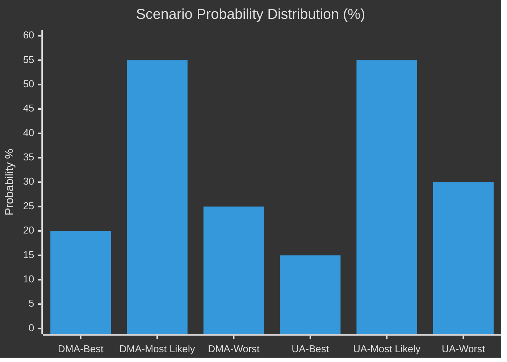

# Scenario Forecast — EP Breaking News 2026-05-15
**Article Type:** Breaking | **Analysis Date:** 2026-05-15
**Primary Scenario Domain:** DMA Enforcement + Ukraine Accountability trajectory

---

## 🔭 Scenario Methodology

Scenarios are constructed using the Cone of Plausibility method applied to the two highest-significance items from the April 30, 2026 plenary:
1. DMA Enforcement (TA-10-2026-0160) — digital governance trajectory
2. Ukraine Accountability (TA-10-2026-0161) — security/rule of law trajectory

For each domain, three scenarios are defined: **Best Case (B)**, **Most Likely (M)**, and **Worst Case (W)**.

---

## 🌐 Scenario Domain 1: DMA Enforcement Trajectory

### Baseline Conditions (as of 2026-05-15)
- Commission has opened formal DMA investigations against Alphabet, Apple, Meta
- Preliminary findings issued but no interim measures imposed
- US government has verbally linked DMA enforcement to tariff negotiations
- EP adopted TA-10-2026-0160 demanding immediate enforcement action on April 30
- Commission President has publicly stated "DMA enforcement is non-negotiable"

### Scenario DMA-B: Maximum Enforcement (Probability: 20%)

**Trigger:** Commission issues interim measures against at least two gatekeepers by July 2026; publishes quarterly DMA compliance scores as EP requested; DG COMP issues first formal non-compliance decision with substantial fine.

**Pathway:**
1. Commission DG COMP presents President with political upside of enforcement (pro-EU digital sovereignty narrative strengthens ahead of 2027 elections cycle)
2. US retaliatory measures limited (trade war costs too high for both sides)
3. EP's resolution provides political cover for Commission to act against US pressure
4. First fine imposed on Apple (App Store) by August 2026

**Consequences:**
- EU digital sovereignty narrative significantly strengthened
- US-EU trade tension increased short-term, likely manageable
- European tech SMEs gain tangible market access benefits
- Precedent set for AI Act enforcement credibility
- 🟢 Positive for: EP, EU digital economy, small platforms, consumers
- 🔴 Negative for: US tech companies, US government trade negotiators

**Indicators to watch:**
- Commission DG COMP press statements (interim measures terminology)
- US USTR escalation/de-escalation rhetoric
- CJEU preliminary ruling schedule for pending DMA cases

---

### Scenario DMA-M: Partial Enforcement / Negotiated Compliance (Probability: 55%)

**Trigger:** Commission maintains enforcement rhetoric but accepts "compliance roadmaps" from gatekeepers in lieu of immediate fines; delivers one formal decision by year end but at lower-than-maximum fine level.

**Pathway:**
1. Commission negotiates "compliance commitments" with Apple and Alphabet (similar to Google Shopping precedent under GDPR-era settlements)
2. Formal proceedings continue but without interim measures
3. EP presses for more but has limited tools beyond political resolutions
4. First formal fine of ~€2–5 billion (vs. potential €30+ billion at maximum) issued in Q4 2026

**Consequences:**
- DMA enforcement proceeds but at pace that civil society criticises as inadequate
- US-EU trade negotiations include informal "enforcement corridor" understanding
- EU digital sovereignty narrative: "partial victory" framing
- 🟡 Mixed for: EP (partial win), Commission (manages both US pressure and EP accountability), tech companies (compliance costs real but manageable)

**Indicators to watch:**
- "Compliance commitment" language in Commission DG COMP communications
- Apple/Alphabet announcement of platform interoperability changes
- MEPs' floor statements in September 2026 plenary

---

### Scenario DMA-W: Enforcement Pause / Diplomatic Override (Probability: 25%)

**Trigger:** US-EU tariff de-escalation deal includes informal understanding that DMA enforcement against US companies is "paused" during trade negotiations; Commission frames it as "procedural delay" rather than political decision.

**Pathway:**
1. US trade negotiators present "package deal": tariff reduction + DMA enforcement moratorium
2. Commission President accepts, framing as "responsible statecraft"
3. Formal DMA investigations continue on paper but without real enforcement actions
4. EP's TA-10-2026-0160 becomes politically significant but practically unimplemented

**Consequences:**
- EU digital sovereignty severely damaged
- Rule of law credibility of EU regulation globally undermined
- EP faces credibility gap: passed resolution that was ignored
- Precedent that US trade pressure can override EU regulatory enforcement
- 🔴 Very negative for: EU digital governance, EP's institutional role, European tech ecosystem
- 🟢 Short-term positive for: US-EU trade relations, gatekeeper quarterly earnings

**Indicators to watch:**
- Silence from Commission DG COMP on enforcement timelines
- "Regulatory dialogue" language replacing "enforcement" in Commission communications
- Civil society organisations raising formal complaints to European Ombudsman

---

## 🌍 Scenario Domain 2: Ukraine Accountability Trajectory

### Baseline Conditions
- TA-10-2026-0161 adopted April 30, demanding EU support for special tribunal and accountability mechanisms
- ICC has issued arrest warrants for Putin and others; enforcement constrained by Russia's non-participation
- EU has frozen €300+ billion in Russian state assets; debate on using interest proceeds for Ukraine ongoing
- US under new administration has reduced direct military aid; EU has stepped up via EDIP and bilateral instruments

### Scenario UA-B: Full Accountability Mechanism (Probability: 15%)

**Trigger:** Reinforced Enhanced Cooperation among 15+ EU member states + Ukraine + Canada + Australia establishes special tribunal for crime of aggression within EU legal framework; EUAA takes operational form by end 2026.

**Pathway:**
1. Belgium/Netherlands/Luxembourg judicial cooperation creates model tribunal framework
2. EP resolution provides political mandate; EEAS drafts implementing decision
3. G7 endorses tribunal framework at June 2026 summit
4. Special tribunal formally established with EU co-secretariat by December 2026

**Consequences:**
- Historic precedent for European accountability architecture
- Russia faces systematic legal jeopardy for leadership
- Deterrence effect on future aggression (contested but plausible)
- 🟢 Positive for: International rule of law, Ukraine, EP institutional credibility

---

### Scenario UA-M: Partial Progress (Probability: 55%)

**Trigger:** EU adopts declaration of political support for special tribunal but establishment delayed to 2027; frozen asset proceeds released for Ukraine reconstruction begins; military support via EDIP continues.

**Pathway:**
1. EEAS Legal Service produces feasibility opinion (by July 2026)
2. Council supports "enhanced international mechanism" without agreeing on tribunal architecture
3. First €10 billion tranche of frozen asset proceeds released for Ukraine reconstruction
4. Military support: EU-owned equipment deployment framework strengthened

**Consequences:**
- Ukraine receives material support (financial and military) even without tribunal
- Accountability mechanisms progress slowly — war criminals not yet prosecuted
- EP maintains pressure through subsequent resolutions
- 🟡 Mixed: progress on financial support; accountability mechanisms lagging

---

### Scenario UA-W: Frozen Conflict + Support Erosion (Probability: 30%)

**Trigger:** Negotiated ceasefire under US-Russia pressure excludes accountability mechanism; some EU member states (Hungary, Slovakia) begin normalising relations with Russia as economic pressures mount; EP's accountability demands become politically isolated.

**Pathway:**
1. US brokers ceasefire agreement that prioritises territorial status quo over accountability
2. Hungary lifts veto on new Ukraine support only in exchange for accountability mechanism being dropped
3. EP maintains maximalist position but finds itself politically isolated from Council
4. Frozen asset proceeds remain frozen amid legal challenges from Russian entities in CJEU

**Consequences:**
- Accountability gap: no prosecution of Russian war crimes at EU-backed tribunal
- Precedent that aggression can be "ceasefire-washed" without consequences
- EP-Council institutional tension at historic high
- 🔴 Negative for: International law credibility, Ukraine, future deterrence

---

## 📊 Scenario Probability Matrix

---

## 🗓️ Timeline to Inflection Points

| Event | Date | Scenario Signal |
|-------|------|-----------------|
| Commission response to EP DMA resolution | By 2026-06-01 | DMA-B vs DMA-M vs DMA-W |
| US-EU tariff negotiation status | By 2026-06-30 | DMA enforcement independence |
| EEAS Ukraine tribunal feasibility opinion | By 2026-07-01 | UA-B vs UA-M |
| G7 Summit statement on Ukraine accountability | 2026-06-13 | UA momentum |
| EP September plenary — DMA follow-up | 2026-09-22 | EP escalation/acceptance |
| First formal DMA non-compliance decision | By 2026-12-31 | DMA-B/M confirmation |

---

## 🎯 Cross-Scenario Interaction Effects

**Interaction 1:** DMA-W (enforcement pause) + UA-W (ceasefire without accountability) = maximum EP credibility crisis. In this compound worst case, the April 2026 plenary resolutions are both ignored within 12 months, severely weakening EP's institutional authority.

**Interaction 2:** DMA-B (strong enforcement) + UA-M (partial progress) = most likely "good enough" outcome from EP's perspective. Digital sovereignty strengthened; Ukraine support continues even without tribunal.

**Interaction 3:** Budget scenario — if Budget 2027 own resources are rejected by Council, this reinforces EP's structural weakness vs. Council, potentially affecting its ability to maintain political pressure on both DMA and Ukraine tracks.

---

*Methodology: Cone of Plausibility / ACH (Analysis of Competing Hypotheses) | Confidence: 🟡 MEDIUM (probabilistic scenarios, not predictions)*

