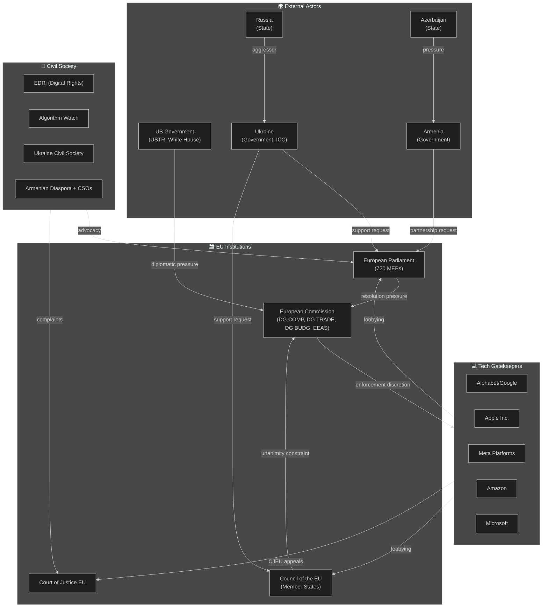
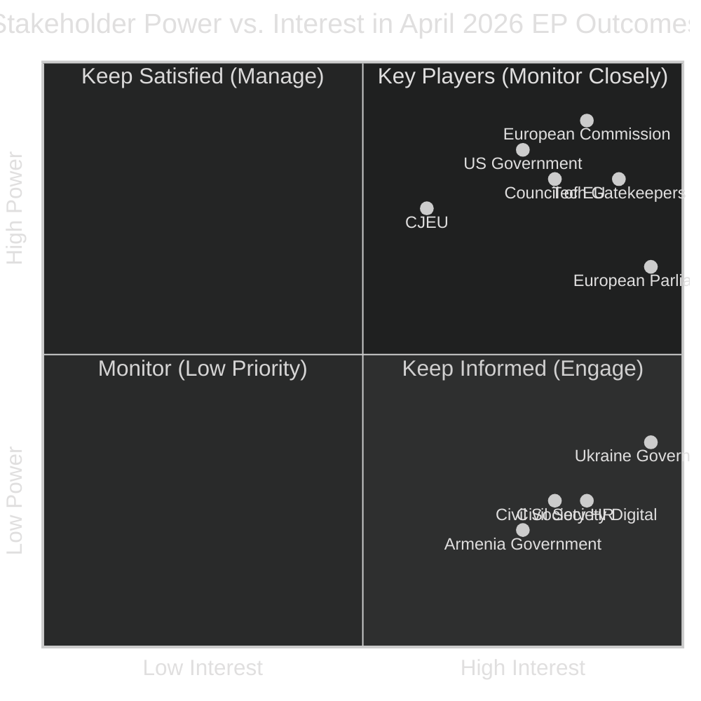

# Stakeholder Map — EP Breaking News 2026-05-15
**Article Type:** Breaking | **Analysis Date:** 2026-05-15

---

## 🗺️ Stakeholder Ecosystem

---

## 🔑 Key Stakeholder Profiles

### Stakeholder 1: European Parliament (720 MEPs)

**Role:** Primary actor. Adopted six resolutions April 28–30; principal author of political pressure on Commission and Council.

**Position:** Assertive enforcement of digital regulation; strong Ukraine support; fiscal federalism; human rights engagement in neighbourhood.

**Power:** Medium — Parliament has no direct enforcement power over Commission or Council; but controls budget, legislative co-decision, institutional legitimacy, and public accountability platforms.

**Interests:**
- Strengthen EP's role as digital governance guardian
- Maintain cross-party consensus on Ukraine (validates EP's foreign policy credibility)
- Secure "own resources" to increase EU fiscal autonomy and EP's budgetary influence
- Demonstrate that EP resolutions produce real-world effects (institutional credibility)

**Constraints:**
- Non-binding resolutions on enforcement are limited tools
- Coalition management complex (EPP internal splits, PfE opposition)
- Cannot directly negotiate with US government or Russian state

**Confidence:** 🟢 HIGH

---

### Stakeholder 2: European Commission (DG COMP + DG TRADE + DG BUDG + EEAS)

**Role:** Key responding actor. Must operationalise (or not) Parliament's DMA enforcement and Ukraine accountability demands.

**Position:** Publicly committed to DMA enforcement but facing diplomatic cross-pressures; manages delicate US-EU trade relationship.

**Power:** HIGH — monopoly on formal legislative initiative, enforcement power, and external negotiation authority.

**Internal tensions:**
- **DG COMP vs. DG TRADE:** Enforcement maximalism vs. trade deal optimisation; both report to different Commissioners who must present united College position
- **EEAS vs. Council Presidency:** EEAS wants aggressive Ukraine support; Council Presidency (rotating) varies in enthusiasm
- **DG BUDG:** Own resources politically difficult but Commission has consistently supported the concept

**Key individuals:**
- Commission President: publicly stated DMA enforcement non-negotiable (political commitment on record)
- Competition Commissioner: has enforcement mandate and political incentive to act before tenure ends
- Trade Commissioner: managing US tariff negotiations; incentivised to keep DMA off the table

**Strategic response to EP resolution:** Commission will likely publish a formal response by June 2026, committing to quarterly DMA compliance reports (low-cost concession) while buying time on interim measures (high-cost, high-conflict action).

**Confidence:** 🟢 HIGH (institutional structure); 🟡 MEDIUM (internal decision-making dynamics)

---

### Stakeholder 3: US Government (Trump Administration — USTR, White House)

**Role:** External pressure actor. Applying diplomatic leverage to slow DMA enforcement against US-headquartered tech companies.

**Position:** Opposition to extraterritorial EU regulation; "unfair trade practice" framing of DMA; willingness to escalate tariffs as leverage.

**Power:** HIGH relative to EU — US is largest single trade partner; tariff escalation has real economic costs for EU exporters.

**Strategy:**
- Use tariff de-escalation as carrot: offer to reduce steel/aluminium tariffs in exchange for DMA softening
- Direct bilateral pressure on Commission President via US Ambassador and Presidential communications
- Coordinate with US tech company lobbying in Brussels

**Constraints:**
- US cannot legally challenge DMA at WTO on existing frameworks (DMA is not a traditional trade restriction)
- EU public opinion strongly supportive of tech regulation — US pressure becomes domestically toxic if publicised
- EU is also a major US export market; full-scale trade war hurts both sides

**Confidence:** 🟡 MEDIUM (US strategic intent inferred from public statements and context, not direct access)

---

### Stakeholder 4: Tech Gatekeepers (Alphabet, Apple, Meta, Amazon, Microsoft)

**Role:** Direct targets of DMA enforcement demands in TA-10-2026-0160.

**Position:** Formal commitment to DMA compliance; active lobbying to delay and narrow enforcement.

**Power:** VERY HIGH relative to formal regulatory process — legal resources, judicial appeals, political access, public narrative capacity.

**Interests:**
- Maximise compliance flexibility timelines
- Narrow scope of interoperability obligations
- Avoid precedent-setting fines that validate enforcement credibility
- Leverage US government pressure as external constraint on Commission

**Key tactics:**
- "Compliance roadmap" commitments to avoid interim measures
- CJEU annulment challenges to any formal finding
- Public relations: frame regulation as "harming European consumers and innovation"
- Coalition with European tech companies that benefit from gatekeeper ecosystems (advertising agencies, cloud customers)

**Vulnerability:** Each company has distinct exposure profile. Apple's App Store obligations most concrete and legally constrained; Alphabet's Search interoperability more technically complex; Meta's data combination obligations most significant for GDPR-DMA intersection.

**Confidence:** 🟢 HIGH (publicly available lobbying disclosures and CJEU filings)

---

### Stakeholder 5: Ukraine (Government + Civil Society)

**Role:** Primary beneficiary of TA-10-2026-0161; active participant in EU institutional processes.

**Position:** Maximalist on accountability; pragmatic on financial and military support mechanisms.

**Power:** LIMITED direct institutional power in EU; but significant indirect power through moral/political legitimacy and advocacy with pro-Ukraine EP member states.

**Key interests:**
- Special tribunal for crime of aggression (justice for Zelenskyy administration + families)
- Accelerated release of Russian frozen asset proceeds
- Continued military support via EDIP and bilateral agreements
- EU membership pathway acceleration

**Concerns:**
- Any ceasefire that trades away accountability mechanisms
- Hungary's ongoing blocking in Council
- US policy shift reducing pressure on Russia
- War fatigue in EU public opinion

**Confidence:** 🟢 HIGH

---

### Stakeholder 6: Armenia (Government + Diaspora)

**Role:** Beneficiary of TA-10-2026-0162; seeking enhanced EU partnership.

**Position:** Pro-EU orientation; seeking security guarantees; pursuing closer integration as hedge against Russian pressure and Azerbaijani territorial ambitions.

**Power:** LIMITED — small state with limited leverage; EU partnership is the main card.

**Key interests:**
- Enhanced EU-Armenia partnership framework (similar to EU-Moldova model)
- EU civilian mission (EUMA) continuation and expansion
- Economic association agreement acceleration
- Security sector reform support

**Constraints:**
- EU-Azerbaijan relationship (energy supply) limits how forcefully EU will confront Baku
- Russia-Armenia security treaty (CSTO) creates legal constraints on Armenia's Western integration path
- Some EU member states maintain close ties with Azerbaijan

**Confidence:** 🟢 HIGH

---

### Stakeholder 7: Civil Society (EDRi, Algorithm Watch, Human Rights Watch)

**Role:** Advocacy, technical expertise, watchdog function.

**Position:** Strong enforcement of digital regulation; maximalist on Ukraine accountability; human rights in all neighbourhood policies.

**Influence:** High on EP (many MEPs rely on civil society for technical briefings); low on Commission discretion.

**Key organisations:**
- **EDRi (European Digital Rights):** DMA enforcement, privacy, platform accountability
- **Algorithm Watch:** AI/DMA intersection, transparency
- **Human Rights Watch:** Ukraine, Armenia, Haiti resolutions
- **Access Now:** Digital rights, cyberbullying criminal provisions

**Confidence:** 🟢 HIGH

---

## 📊 Stakeholder Power-Interest Matrix

---

## 🔄 Stakeholder Influence Network

**Most influential actor:** European Commission — simultaneously accountable to EP (politically) and constrained by US pressure (diplomatically). Commission's choices in the next 3 months will determine whether the April 2026 EP resolutions produce real-world effects.

**Swing actor:** EPP (within Parliament) — their internal cohesion on DMA and budget will determine whether future EP resolutions maintain credibility as political pressure instruments.

**Wildcard actor:** US Government — could either escalate tariff pressure to create a genuine dilemma for the Commission, or de-escalate in a way that allows Commission to enforce DMA without diplomatic cost.

---

*Methodology: Actor-network analysis + power-interest mapping | Confidence: 🟢 HIGH for EU institutional actors; 🟡 MEDIUM for US/external actors*
