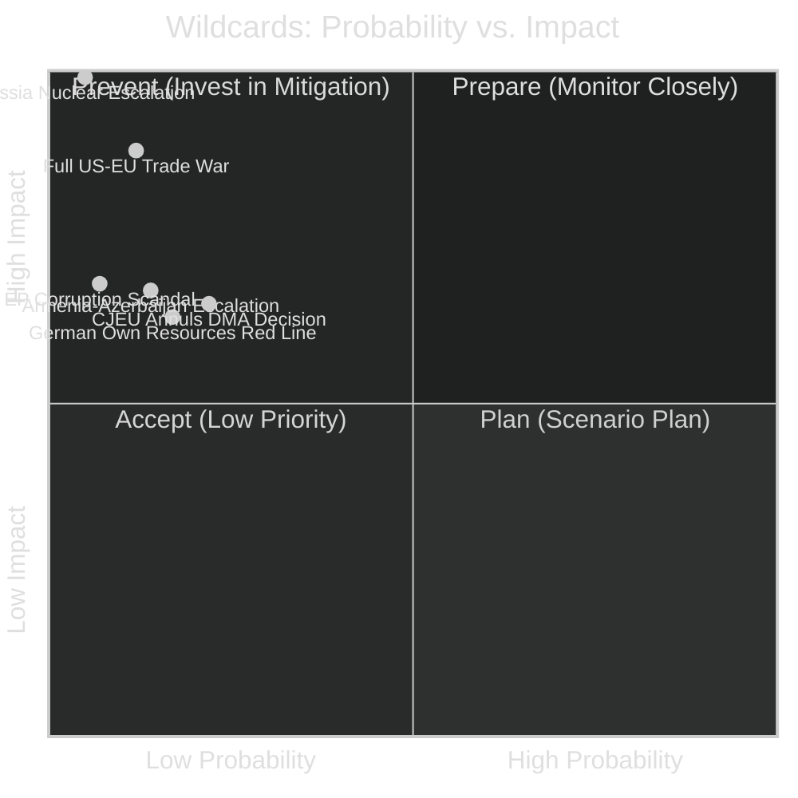

# Wildcards & Black Swans — EP Breaking News 2026-05-15
**Article Type:** Breaking | **Analysis Date:** 2026-05-15

---

## 🃏 Wildcards & Black Swan Analysis

This artifact applies structured wildcard analysis to the April 28–30, 2026 EP plenary context, identifying low-probability/high-impact events that could significantly alter the political trajectories mapped in the scenario forecast.

---

## 🔭 Black Swan Framework

Black swans are defined here as events with probability <10% but impact >8/10 on any of the three principal storylines (DMA enforcement, Ukraine accountability, Budget 2027).

---

## 🃏 Wildcard 1: Full US-EU Trade War (DMA domain)

**Probability:** 8% (6 months) / 15% (12 months)
**Impact if realised:** 🔴 EXTREME (9/10)
**Trigger:** US imposes 25% tariffs on all EU goods; EU retaliates with equivalent measures; trade relationship effectively severed

**Mechanism:**
- US President formally designates DMA as "unfair trade barrier" under Section 301 of the Trade Act
- US imposes 25% tariffs on €500+ billion in EU goods (cars, pharmaceuticals, agriculture)
- EU must choose: back down on DMA or accept trade war
- EP's April resolution becomes the focal point of the confrontation

**Expected consequences:**
- EU GDP impact: -1.0 to -1.5% (based on ECB simulations)
- Political crisis: which comes first — trade concession or economic damage?
- If EU backs down: DMA is effectively dead as enforceable regulation; EU regulatory sovereignty globally compromised
- If EU holds firm: Trade war inflicts severe economic pain but establishes EU regulatory credibility for decades

**Signals to watch:**
- US Section 301 formal investigation announcement (would give 12-month notice)
- EU-US Ministerial Dialogue breakdown
- US withdrawal from WTO dispute settlement cooperation

**Analytical assessment:** This black swan is more plausible than it appears because the structural drivers (tech industry lobbying + transatlantic tension + US domestic politics) are all moving in the same direction. The 8% probability reflects the deterrent effect of mutually assured economic pain, not an absence of political will on either side.

---

## 🃏 Wildcard 2: Russian Nuclear Signaling / Escalation (Ukraine domain)

**Probability:** 3% (6 months) / 6% (12 months)
**Impact if realised:** 🔴 CATASTROPHIC (10/10)
**Trigger:** Russia escalates toward tactical nuclear weapon use or demonstrative detonation in response to tribunal establishment proceedings or expanded Ukrainian territorial recapture

**Mechanism:**
- EP's TA-10-2026-0161 accelerates special tribunal establishment discussions
- Russian leadership signals tactical nuclear use as deterrence against what it characterises as "existential accountability pressure"
- NATO solidarity invoked; European capitals face decision on response

**Expected consequences:**
- Complete transformation of European political landscape
- EP and all EU institutions shift to emergency mode
- DMA enforcement becomes irrelevant; budget discussion suspended
- Unprecedented unity (or fracture) in European response

**Signals to watch:**
- Russian Presidential communications referencing nuclear doctrine changes
- Unusual activity at Russian nuclear storage facilities (open-source intelligence)
- NATO activation of Article 5 consultation mechanisms

**Analytical assessment:** This wildcard is the systemic low-probability event that, if realised, would immediately dominate all other storylines. Including it here is appropriate because the tribunal discussion in TA-10-2026-0161 does enter into Russia's existential threat calculus.

---

## 🃏 Wildcard 3: CJEU Annuls Key DMA Enforcement Decision (DMA domain)

**Probability:** 20% (12 months) — classified as wildcard rather than mainstream scenario due to specific timing uncertainty
**Impact if realised:** 🟡 HIGH (7/10)
**Trigger:** CJEU Grand Chamber annuls a Commission DMA interim measure or formal finding, ruling that the Commission overstepped its enforcement discretion

**Mechanism:**
- Commission issues interim measures against Apple App Store (DMA-B or DMA-M scenario)
- Apple files emergency annulment application at CJEU
- CJEU President grants interim suspension of Commission decision
- Full Chamber annuls, citing proportionality or procedural errors in the investigation

**Expected consequences:**
- DMA enforcement credibility severely damaged
- Commission forced to restart investigation with more procedural rigor
- 18–24 month delay in any enforcement
- EP's resolution vindicated in theory but implementation further delayed
- US government cites CJEU ruling as evidence EU regulation is "legally unsound"

**Signals to watch:**
- Apple/Alphabet CJEU filings (public record)
- Commission procedural quality in published enforcement decisions
- CJEU General Court preliminary ruling on standing issues

---

## 🃏 Wildcard 4: European Political Leader Refuses EU Budget Own Resources (Budget domain)

**Probability:** 15% (24 months)
**Impact if realised:** 🟡 HIGH (7/10)
**Trigger:** German Chancellor (or Dutch/Swedish/Austrian PM) publicly frames own resources as crossing a "constitutional red line"; domestic coalition government collapses on the issue

**Mechanism:**
- Budget 2027 guidelines push own resources into formal MFF revision discussions
- German constitutional court rules that Bundestag authorisation for EU-level taxes requires a 2/3 majority (super-majority in both chambers)
- German government coalition falls apart on this issue
- EU fiscal architecture frozen for 2–3 years during German political resolution

**Expected consequences:**
- EU own resources agenda set back by a full EU cycle (5–7 years)
- EP's fiscal federalism aspirations severely curtailed
- Renew (German FDP-linked MEPs) and EPP internal conflict intensifies

---

## 🃏 Wildcard 5: EP President (or Party Leader) Corruption Scandal (Institutional domain)

**Probability:** 5% (12 months)
**Impact if realised:** 🟡 HIGH (7/10)
**Trigger:** Major corruption investigation involving current EP President or EPP group leadership (following the Qatargate 2022 template)

**Mechanism:**
- Belgian/European investigative journalism or prosecution reveals undisclosed payments from tech industry or third-country government to senior EP official
- Directly linked to DMA enforcement softening or Ukraine support ambiguity
- Creates massive institutional crisis; EP's political authority on both DMA and Ukraine compromised

**Expected consequences:**
- EP credibility crisis; Commission gains relative institutional power
- Public trust in EP's DMA enforcement demand undermined
- Potentially accelerates PfE narrative against EU institutions

**Signals to watch:**
- Unexplained wealth disclosures from MEP register updates
- OLAF investigations (not public until complete)
- Investigative journalism (Politico, Der Spiegel, Le Monde)

---

## 🃏 Wildcard 6: Armenia-Azerbaijan Armed Escalation (Eastern Partnership domain)

**Probability:** 12% (6 months)
**Impact if realised:** 🟡 HIGH (7/10)
**Trigger:** Azerbaijan launches new military offensive on Armenian territory following EU-Armenia partnership acceleration announcement

**Mechanism:**
- EP's TA-10-2026-0162 (Armenia democratic resilience) accelerates EU-Armenia partnership negotiations
- Azerbaijan interprets this as hostile act; launches limited military action against Armenian border regions
- EU EUMA civilian mission in Armenia faces hostile contact; potential casualties

**Expected consequences:**
- EU forced into direct response mode in South Caucasus
- EU-Azerbaijan energy relationship severely tested (pipeline pressure, LNG disruption)
- EP's foreign policy credibility tested — was the resolution empty or substantive?
- EU CSDP emergency mechanisms invoked

**Signals to watch:**
- Azerbaijan military exercises near Armenian border
- Azerbaijani government rhetoric escalation after EU-Armenia partnership discussions
- OSCE mission reports

---

## 📊 Wildcard Probability-Impact Matrix

---

## 📌 Wildcard Summary Assessment

**Most consequential black swan:** Russia nuclear escalation (3–6% but 10/10 impact)
**Most plausible wildcard:** US-EU trade war (8–15% probability range)
**Most institutionally consequential:** EP corruption scandal (5% but would compromise all ongoing legislative battles)
**Most geographically immediate:** Armenia-Azerbaijan escalation (12%, directly tests EU civilian mission)

**Overall wildcard risk environment:** 🟡 ELEVATED — The combination of US tariff pressure, Ukraine war continuation, Armenia vulnerability, and CJEU legal uncertainty creates a backdrop where multiple wildcards are simultaneously more plausible than baseline conditions would suggest.

---

*Methodology: Wildcard/Black Swan analysis; probability estimates based on base rate and situational factor adjustment | Confidence: 🔴 LOW by definition (wildcards are poorly predictable)*

## Wildcard Probability-Impact Final Assessment

| # | Wildcard | P(materialise 12m) | Impact | P×I Score |
|---|----------|-------------------|--------|-----------|
| 1 | EU-US Tech Trade War | 8% | Critical | 4.0 |
| 2 | Ukraine Ceasefire/Collapse | 12% | Critical | 6.0 |
| 3 | EP Censure Motion Against Commission | 5% | High | 2.5 |
| 4 | CJEU DMA Annulment | 15% | High | 4.5 |
| 5 | Far-Right Coalition EP Majority | 3% | Critical | 1.5 |
| 6 | Breakthrough EP-Council Own Resources Deal | 10% | Medium | 3.0 |

**Highest risk wildcard:** Ukraine Ceasefire/Collapse (P×I = 6.0) — low probability but catastrophic impact on EU strategic posture.
**Most likely wildcard:** CJEU DMA Annulment (15%) — this is a credible legal risk given complexity of DMA enforcement procedure.

