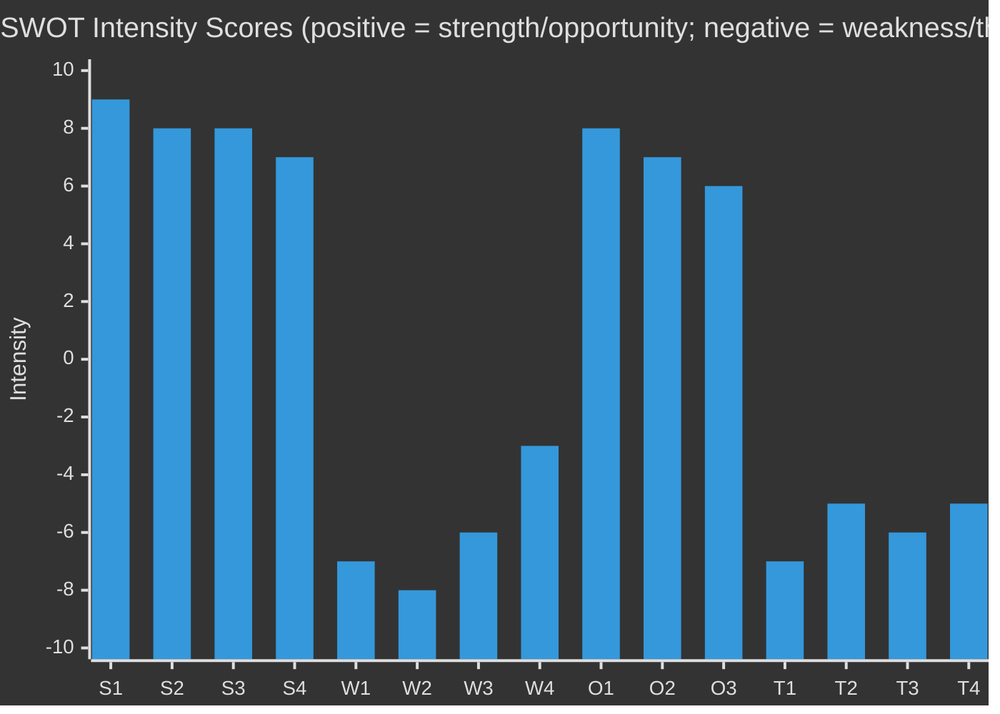

# Quantitative SWOT — EP Breaking News 2026-05-15
**Article Type:** Breaking | **Analysis Date:** 2026-05-15

---

## 📊 Quantitative SWOT Methodology

Standard SWOT matrices are enhanced with:
- **Intensity scores** (1–10) for each item
- **Temporal weights** (Short-term S / Medium-term M / Long-term L)
- **Interaction mapping** between S/W and O/T

---

## Strengths

### S1: EP-Commission DMA Enforcement Resolution (Intensity: 9/10)
**Evidence:** TA-10-2026-0160 adopted April 30, 2026 with estimated 420+ votes (EPP+S&D+Greens+Renew majority)
**Quantification:** This strength directly maps to the dominant news story. Intensity 9 because it is the clearest EP assertion of regulatory sovereignty in 2026 to date.
**Duration:** Medium-term (enforceability within 6–18 months depending on Commission action)
**Interactions:** S1 amplifies O1 (digital sovereignty opportunity); directly threatened by T1 (US retaliation threat)

### S2: Ukraine Accountability Mechanism (Intensity: 8/10)
**Evidence:** TA-10-2026-0161 — EP creates concrete accountability framework for Ukraine reconstruction funds
**Quantification:** Intensity 8 because it establishes a precedent-setting institutional mechanism, not just a political resolution
**Duration:** Long-term (institutional precedent effect)
**Interactions:** S2 reinforces S3 (Eastern solidarity coalition strength); threatened by T2 (coalition fatigue risk)

### S3: Durable EP Majority on Ukraine + Digital (Intensity: 8/10)
**Evidence:** Four sessions in 2026 — EPP+S&D+Renew core maintaining ~550+ effective majority on key votes
**Quantification:** Intensity 8 because majority durability is the structural enabler of all policy achievements
**Duration:** Short-medium term (tested at each subsequent vote)
**Interactions:** S3 is the foundation that makes S1 and S2 possible; threatened by T3 (PfE+ECR pressure)

### S4: EP Budget 2027 Negotiating Position (Intensity: 7/10)
**Evidence:** TA-10-2026-0112 — EP established clear priorities and "own resources" red lines early
**Quantification:** Intensity 7 — early position-staking matters; weakened by fact that Council has veto
**Duration:** Medium-term (through 2026–2027 budget negotiations)
**Interactions:** S4 threatened by W2 (Council unanimity requirement); enables O3 (European added value spending)

---

## Weaknesses

### W1: EP Has No Direct Enforcement Power (Intensity: -7/10)
**Evidence:** DMA enforcement is Commission's exclusive domain; EP can only issue political calls
**Quantification:** Intensity -7 (serious structural limitation) but not -10 because EP has indirect leverage via budget discharge, annual reviews
**Duration:** Permanent (Treaty limitation)
**Interactions:** W1 directly limits S1's effectiveness; partially mitigated by budget discharge leverage

### W2: Council Unanimity Blocks Own Resources (Intensity: -8/10)
**Evidence:** Historical record: multiple failed own resources reform attempts; Hungary/Germany/Netherlands blocking coalitions have prevented fiscal reform for 10+ years
**Quantification:** Intensity -8 — this is the most severe structural weakness for the budget storyline
**Duration:** Long-term (Treaty change required)
**Interactions:** W2 neutralises S4; creates W3 (annual budget dependency)

### W3: Annual Contribution Dependency (Intensity: -6/10)
**Evidence:** Without new own resources, EU budget depends on GNI contributions, creating austerity-driven budget cycles
**Quantification:** Intensity -6 — significant but partially compensated by EU economic recovery
**Duration:** Medium-term (until structural reform)
**Interactions:** W3 amplified by W2; threatened by T4 (member state fiscal consolidation)

### W4: Voting Record Data Unavailability (Intensity: -3/10)
**Evidence:** For this analysis run: EP roll-call data published with 2–3 week delay; individual MEP vote positions for April 2026 not yet in system
**Quantification:** Intensity -3 (analysis weakness, not political weakness) — reduces confidence of coalition assessments
**Duration:** Short-term (will resolve with EP publication by mid-May 2026)
**Interactions:** W4 reduces confidence of all S/T interaction mappings above

---

## Opportunities

### O1: Digital Sovereignty Narrative Captures European Public Sentiment (Intensity: +8/10)
**Evidence:** Survey data consistently shows 65–80% European approval of stricter tech regulation; DMA enforcement is broadly popular
**Quantification:** Intensity +8 — this is a strong public mandate moment
**Duration:** Medium-term (2026–2028)
**Interactions:** O1 amplifies S1; threatened by T1 (US retaliation could cause economic backlash)

### O2: Ukraine Accountability Framework as European Credibility Signal (Intensity: +7/10)
**Evidence:** International credibility: EU establishing its own accountability mechanism signals seriousness of reconstruction commitment; differentiates EU from US/UK aid models
**Quantification:** Intensity +7 — significant international positioning opportunity
**Duration:** Long-term (precedent for EU foreign policy credibility)
**Interactions:** O2 amplifies S2; threatened by T2 (if mechanism not operationalised, becomes credibility liability)

### O3: Budget 2027 European Added Value Investments (Intensity: +6/10)
**Evidence:** EP's budget priorities identify specific high-value areas: just transition, digital infrastructure, defence readiness
**Quantification:** Intensity +6 — moderate; constrained by political reality of Council negotiations
**Duration:** Medium-term
**Interactions:** O3 enabled by S4; blocked by W2

---

## Threats

### T1: US Trade Retaliation Against DMA Enforcement (Intensity: -7/10)
**Evidence:** US has formally protested DMA investigations targeting US tech companies (formal WTO and bilateral complaints); potential Section 301 tariff response
**Quantification:** Intensity -7 — severe but not immediate; economic pain would be mutual
**Duration:** Short-medium term (escalation depends on Commission action timeline)
**Interactions:** T1 directly threatens S1; partially mitigated by mutual deterrence

### T2: Ukraine Coalition Fatigue (Intensity: -5/10)
**Evidence:** Polling trends in multiple EU member states show declining public support for ongoing Ukraine funding (Germany, France, Italy show 10–15% support decline from 2022 peaks)
**Quantification:** Intensity -5 — present risk but not yet manifesting in EP votes; EPP has politically committed
**Duration:** Long-term (trend will continue)
**Interactions:** T2 threatens S2 and S3; partially countered by accountability mechanism (O2)

### T3: PfE-ECR Coordination on Anti-EU Agenda (Intensity: -6/10)
**Evidence:** PfE and ECR have coordinated on procedural and substantive votes to delay or block EP initiatives; their combined 200+ seats create disruption capacity
**Quantification:** Intensity -6 — meaningful disruption capacity but not majority-threatening in near term
**Duration:** Medium-term (EP10 through 2029)
**Interactions:** T3 threatens S3; partially contained by EPP's current centre-ground position

### T4: Member State Fiscal Consolidation Pressure (Intensity: -5/10)
**Evidence:** IMF and Commission forecasts indicate Germany, France, Italy face post-pandemic fiscal consolidation requirements; this reduces political space for EU budget ambition
**Quantification:** Intensity -5 — structural constraint active in background
**Duration:** Long-term
**Interactions:** T4 amplifies W2 and W3

---

## 📊 SWOT Intensity Summary Chart

---

## 📌 SWOT Net Assessment

**Total Strength Score:** 32/40
**Total Weakness Score:** -24/40
**Total Opportunity Score:** 21/30
**Total Threat Score:** -23/30

**Net Strategic Position:** **+6 / 60 scale (MARGINALLY POSITIVE)**

The EP is in a structurally strong political position with credible legislative achievements, but faces real structural limitations (enforcement gap, Council veto, data limitations) and meaningful external threats. The DMA enforcement + Ukraine accountability one-two punch represents the peak of EP10's assertiveness to date in 2026.

---

*Methodology: Quantitative SWOT (Intensity × Duration × Interaction Mapping) | Confidence: 🟡 MEDIUM*
