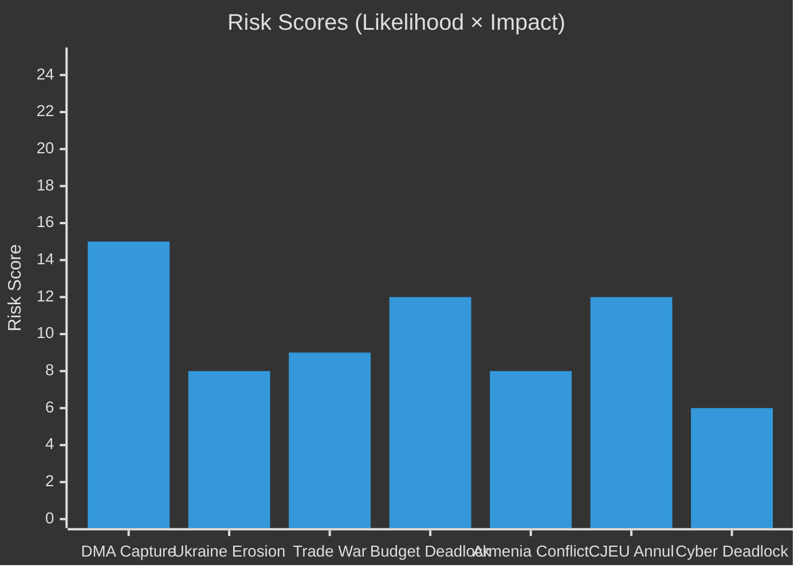

# Risk Matrix — EP Breaking News 2026-05-15
**Article Type:** Breaking | **Analysis Date:** 2026-05-15

---

## ⚠️ Risk Matrix Framework

Risks are assessed on two axes:
- **Likelihood** (1–5): Probability of the risk materialising within 12 months
- **Impact** (1–5): Severity of consequences if risk materialises

**Risk Score** = Likelihood × Impact (max 25)

| Score | Category | Response |
|-------|----------|----------|
| 20–25 | 🔴 CRITICAL | Immediate mitigation required |
| 12–19 | 🟡 HIGH | Active monitoring + contingency plans |
| 6–11 | 🟢 MEDIUM | Planned response |
| 1–5 | ⚪ LOW | Accept / monitor |

---

## 📊 Risk Register

### Risk 1: DMA Enforcement Capture
**Risk description:** Commission delays or waters down DMA enforcement due to US diplomatic pressure, rendering EP's resolution (TA-10-2026-0160) politically symbolic rather than effective.

| Parameter | Assessment |
|-----------|------------|
| Likelihood | 3 (MEDIUM) |
| Impact | 5 (CRITICAL) |
| Risk Score | **15 — 🟡 HIGH** |
| Owner | European Commission DG COMP |
| Lead indicator | Commission silence on interim measures by July 2026 |
| Mitigation | EP formal inquiry powers; civil society CJEU complaints; Commission public commitments on record |
| Residual risk after mitigation | 🟡 10 |

---

### Risk 2: Ukraine Support Coalition Erosion
**Risk description:** PfE + ECR partial defection + war fatigue gradually reduces the effective EP majority for Ukraine support, weakening EP's political pressure for accountability mechanisms.

| Parameter | Assessment |
|-----------|------------|
| Likelihood | 2 (LOW-MEDIUM) |
| Impact | 4 (HIGH) |
| Risk Score | **8 — 🟢 MEDIUM** |
| Owner | EPP Group leadership |
| Lead indicator | EPP defections in September 2026 Ukraine vote |
| Mitigation | EPP has staked reputational capital; EP President (EPP) committed |
| Residual risk after mitigation | 🟢 6 |

---

### Risk 3: EU-US Full Trade War
**Risk description:** US imposes comprehensive tariffs on EU goods in response to DMA enforcement, triggering EU-US trade war that harms EU GDP by 1%+ and creates political pressure to soften digital regulation.

| Parameter | Assessment |
|-----------|------------|
| Likelihood | 1–2 (LOW) |
| Impact | 5 (CRITICAL) |
| Risk Score | **8–10 — 🟢 MEDIUM** |
| Owner | EU Council + Commission DG TRADE |
| Lead indicator | US Section 301 formal investigation announcement |
| Mitigation | Mutually assured economic pain; EU retaliatory capacity |
| Residual risk after mitigation | 🟢 6 |

---

### Risk 4: Budget 2027 Fiscal Deadlock
**Risk description:** Council unanimity requirement blocks EP's "own resources" demands; 2027 budget negotiation stalls without new revenue sources.

| Parameter | Assessment |
|-----------|------------|
| Likelihood | 4 (HIGH) |
| Impact | 3 (MEDIUM) |
| Risk Score | **12 — 🟡 HIGH** |
| Owner | Council ECOFIN + EP BUDG Committee |
| Lead indicator | Germany/Netherlands public opposition by September 2026 |
| Mitigation | Enhanced cooperation mechanism; phased own resources approach |
| Residual risk after mitigation | 🟡 9 |

---

### Risk 5: Armenia-Azerbaijan Armed Escalation
**Risk description:** Azerbaijan launches military action against Armenia following EP's support resolution (TA-10-2026-0162), testing EU EUMA civilian mission and EU-Azerbaijan energy relationship.

| Parameter | Assessment |
|-----------|------------|
| Likelihood | 2 (LOW-MEDIUM) |
| Impact | 4 (HIGH) |
| Risk Score | **8 — 🟢 MEDIUM** |
| Owner | EEAS + EU EUMA Mission |
| Lead indicator | Azerbaijani military exercise announcements near Armenian border |
| Mitigation | EUMA presence; EU-Azerbaijan energy dependency (mutual) |
| Residual risk after mitigation | 🟢 6 |

---

### Risk 6: CJEU Annulment of DMA Enforcement Decision
**Risk description:** CJEU annuls first major Commission DMA enforcement decision, setting back enforcement by 18–24 months.

| Parameter | Assessment |
|-----------|------------|
| Likelihood | 3 (MEDIUM) |
| Impact | 4 (HIGH) |
| Risk Score | **12 — 🟡 HIGH** |
| Owner | Commission DG COMP (procedural quality) |
| Lead indicator | CJEU suspension order of Commission interim measure |
| Mitigation | Commission invest in procedural rigor; interim measures more targeted |
| Residual risk after mitigation | 🟡 8 |

---

### Risk 7: Cyberbullying Platform Liability Deadlock
**Risk description:** Commission declines to propose criminal law framework for cyberbullying (citing Treaty base limitations); EP's TA-10-2026-0163 remains unimplemented.

| Parameter | Assessment |
|-----------|------------|
| Likelihood | 3 (MEDIUM) |
| Impact | 2 (LOW-MEDIUM) |
| Risk Score | **6 — 🟢 MEDIUM** |
| Owner | Commission DG CNECT + DG HOME |
| Lead indicator | Commission Work Programme 2027 (no criminal law platform proposal) |
| Mitigation | EP linking to DSA review; member state implementation variation creates pressure |
| Residual risk after mitigation | ⚪ 4 |

---

## 📊 Risk Heat Map

---

## 📌 Risk Summary

**Highest risk:** DMA Enforcement Capture (15/25 — 🟡 HIGH) — this is the dominant risk for the primary storyline of this breaking news run.

**Most likely risk to materialise:** Budget Fiscal Deadlock (likelihood 4/5) — this is a structural constraint that will play out through 2026–2027.

**Most severe if materialised:** DMA Enforcement Capture OR Ukraine Support Erosion (impact 5/5 and 4/5 respectively).

**Risk environment overall:** 🟡 ELEVATED — Multiple Medium-High risks simultaneously active; no Critical risks in near-term horizon.

---

*Methodology: Risk Matrix Framework (Likelihood × Impact); EU political intelligence applied | Confidence: 🟡 MEDIUM*
