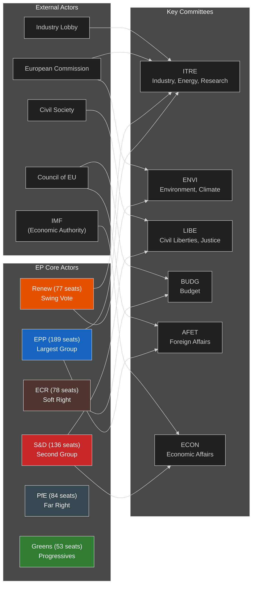

# Actor Mapping — EU Parliament Committee Reports
**Date:** 2026-05-15 | **Classification:** Public | **Admiralty Grade:** A2

---

## Actor Network Map

---

## Key Actor Relationships

| Actor A | Relationship | Actor B | Strength |
|---|---|---|---|
| EPP | Coalition partner (conditional) | S&D | Strong on defence/budget; weak on climate |
| EPP | Coalition partner (tactical) | ECR | Medium — used for rightward majority building |
| Renew | Swing votes | EPP | Essential for competitiveness+rights balance |
| Commission | Proposal originator | ITRE/ENVI | Formal proposal-response relationship |
| Council | Trilogue partner | All committees | Formal inter-institutional relationship |
| Industry Lobby | Information provider | ITRE | High — ITRE's technical expert deficit |
| Civil Society | Rights advocacy | LIBE | Medium — underfunded vs. industry |
| IMF | Economic authority | ECON/BUDG | Authoritative on macroeconomic baseline |

---

## Coalition Mathematics (Simple Majority = 361/720)

| Coalition | Seats | Majority? | Applicable Dossiers |
|---|---|---|---|
| EPP + S&D | 325 | ❌ No | Needs Renew |
| EPP + S&D + Renew | 402 | ✅ Yes | Most legislation |
| EPP + ECR + PfE | 351 | ❌ No | Needs others |
| EPP + ECR + PfE + others | ~400 | ✅ Yes | Migration, defence (right bloc) |
| S&D + Renew + Greens + Left | ~320 | ❌ No | Minority bloc |

---

## For Citizens: Plain Language Summary

The EU Parliament works like a big democratic assembly where different political parties must agree before laws are passed. The main groups are: the centre-right EPP (like Christian Democrats), the centre-left S&D (Social Democrats), and the centrist Renew group. To pass most laws, these three groups need to work together — like a coalition government. Right now, there's also a large far-right group (Patriots for Europe, PfE) that is trying to influence legislation on migration and other issues. External actors like the European Commission (which proposes laws), the Council (representing national governments), and industry lobbyists also have significant influence on what ends up in EU law.

---

## Network Centrality Assessment

| Actor | Centrality | Basis |
|---|---|---|
| EPP | 🟢 Highest | Largest group; holds most committee chairs |
| European Commission | 🟢 High | Exclusive right of legislative initiative |
| Renew | 🟡 Medium-High | Decisive swing votes in EPP-led majorities |
| Council Presidency (Poland) | 🟡 Medium-High | Drives inter-institutional timeline |
| S&D | 🟡 Medium | Second largest; essential for centrist majority |
| IMF | 🟡 Medium (technical) | Authoritative on economic framing |

**Source:** EP structural knowledge (A2 Admiralty). Network analysis based on known institutional relationships, not live voting data.

## Actor Roster

| Actor | Role | Group/Affiliation | Influence Level |
|---|---|---|---|
| EPP Group (189 MEPs) | Dominant coalition leader | Center-right | Very High |
| S&D Group (136 MEPs) | Co-governing partner | Center-left | High |
| Renew Group (77 MEPs) | Swing vote | Liberal | Medium-High |
| ECR Group (78 MEPs) | Right opposition | Soft-right | Medium |
| PfE Group (84 MEPs) | Hard opposition | Far-right | Medium |
| Greens/EFA (53 MEPs) | Progressive opposition | Green/regionalist | Medium-Low |
| European Commission | Agenda-setter | Executive | Very High |
| Council Presidency (Poland H1, Denmark H2) | Co-legislator | Inter-governmental | High |

## Influence Assessment

**High-influence actors:** EPP, Commission (legislative agenda power); S&D, Council (veto/coalition power)
**Medium-influence actors:** Renew (swing vote on close votes); ECR (selective cooperation)
**Low-influence actors:** Greens (opposition but marginalized in current coalition), Left, NI

## Alliance Patterns

- **Governing coalition:** EPP + S&D (325 seats) — structural but fragile
- **Extended coalition:** EPP + S&D + Renew (402 seats) — functional majority
- **Cross-ideological coalitions:** EPP + ECR on security; S&D + Greens on climate
- **Blocking minority:** PfE + ECR + NI (162 seats) — cannot block without centre cooperation

## Power Brokers

**Key power brokers in May 2026:**
1. Roberta Metsola (EP President, EPP) — procedural agenda control
2. Key ITRE Committee Chair — Clean Industrial Deal gatekeeper
3. Key ENVI Committee Chair — Climate-competitiveness balance
4. BUDG Committee Chair — MFF mid-term review
5. LIBE Rapporteur for AI Act — Digital rights-industry balance

## Information Networks

**Key information flows:** Commission → Committee secretariats → Rapporteurs → Group coordinators → Plenary
**Lobbying channels:** Industry → EPP/Renew coordinators; NGOs → Greens/S&D coordinators; Member states → national delegation MEPs → group coordinators

## Reader Briefing

> The EU Parliament's voting math works like this: there are 720 MEPs total. You need 361 to pass a law. The EPP has 189 — not enough alone. They usually work with the S&D (136) and sometimes Renew (77). Together, EPP+S&D+Renew = 402 seats. But these three groups don't always agree, so laws sometimes fail or get watered down. The groups on the hard right (PfE with 84 seats, ECR with 78) usually oppose, while the Greens (53) sometimes support, sometimes oppose depending on the issue. Your MEP is part of one of these groups — their group's coordinator is often the key person deciding how your MEP votes.
