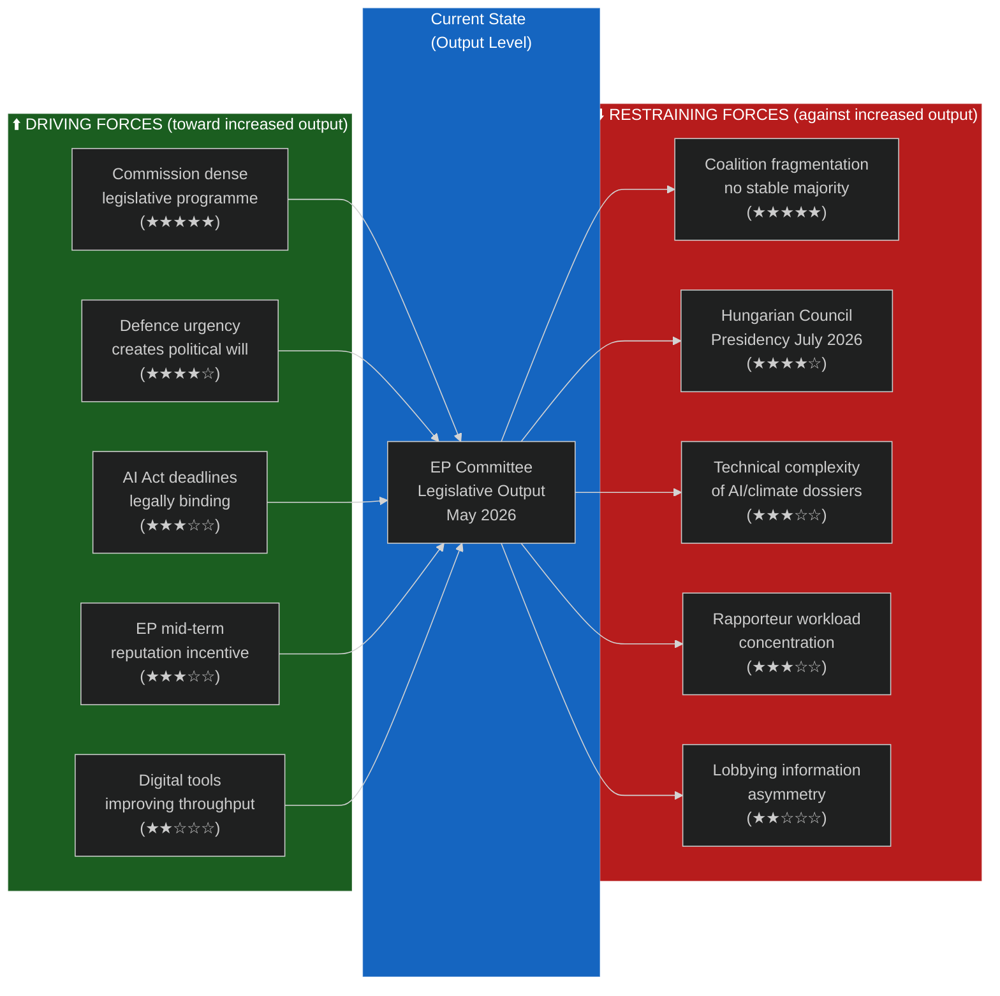

# Forces Analysis — EU Parliament Committee Reports
**Date:** 2026-05-15 | **Classification:** Public | **Admiralty Grade:** B2

---

## Force Field Analysis

This analysis applies Lewin's Force Field model to assess the driving and restraining forces on EP committee legislative output in May–December 2026. Forces are rated 1–5 for intensity.

---

## Force Field Diagram

---

## Driving Forces Analysis

| Force | Intensity | Evidence | Duration |
|---|---|---|---|
| Commission legislative programme density | ★★★★★ (5) | 2024–2029 programme has 40+ legislative proposals; Clean Industrial Deal, AI Act, SAFE | Through 2029 |
| Defence urgency | ★★★★☆ (4) | Russian aggression in Ukraine; NATO 3.5% defence target; European Council defence summits | 2026–2028 |
| AI Act legally binding deadlines | ★★★☆☆ (3) | Prohibited practices: Feb 2025; High-risk systems: Aug 2026; Full application: Aug 2027 | Mandatory |
| EP mid-term reputation incentive | ★★★☆☆ (3) | MEPs building legislative records for re-election in 2029; committee reports = visible output | 2026–2027 |
| Digital tools improving throughput | ★★☆☆☆ (2) | AI translation, hybrid meetings, digital document management reducing admin burden | Structural |

**Net driving force score:** 17/25

---

## Restraining Forces Analysis

| Force | Intensity | Evidence | Duration |
|---|---|---|---|
| Coalition fragmentation | ★★★★★ (5) | No stable 376-seat majority on cross-cutting dossiers; requires case-by-case coalition building | Through 2029 |
| Hungarian Council Presidency (July–Dec 2026) | ★★★★☆ (4) | Historical: HU presidency 2010, 2024 both prioritised sovereignty, slowed progressive files | July–December 2026 |
| Technical dossier complexity | ★★★☆☆ (3) | AI Act, CBAM, SAFE Regulation require specialist knowledge most MEPs lack | Ongoing |
| Rapporteur workload concentration | ★★★☆☆ (3) | ~20 senior MEPs handling 40% of major dossiers; single points of failure | Structural |
| Lobbying information asymmetry | ★★☆☆☆ (2) | Industry: 3,000+ registered lobbyists; Civil society: 500+; significant resource gap | Structural |

**Net restraining force score:** 17/25

---

## Net Force Assessment

**Equilibrium:** Driving and restraining forces are approximately equal at 17:17. This indicates the committee system will maintain current output levels but will not achieve step-change improvement in legislative velocity.

**Asymmetric impact:** Coalition fragmentation (5) and Commission programme density (5) are the highest-intensity opposing forces. A resolution in either direction — either improved coalition coordination OR reduced legislative ambition — would shift the equilibrium.

---

## For Citizens: Plain Language Summary

Think of EU Parliament committees like a car engine. Right now, there are roughly equal forces pushing the engine to go faster (lots of important laws needed — on defence, AI, climate) and forces slowing it down (politicians disagreeing on how to vote, a less cooperative Council presidency starting in July, and complex technical issues requiring expert knowledge most politicians don't have). The result is that progress will be steady but not fast — you'll see some big laws advancing while others get stuck in political negotiations.

---

## Intervention Points

**Highest leverage:** Improving coalition coordination on Clean Industrial Deal would release the highest-intensity restraining force on one of the most consequential dossiers.
**Easiest win:** Commission could reduce technical complexity burden by providing better committee support documentation, targeting the 3-intensity dossier-complexity restraining force.
**Structural:** Rapporteur workload concentration requires institutional reform (succession planning, expert secondment) — longer-term fix.

## Issue Frame

**Central Issue:** The European Parliament committee system must navigate the tension between regulatory standards (social, environmental, rights) and economic competitiveness (industry, innovation, single market) in the 10th term legislative agenda.

**Issue decomposition:**
- Clean Industrial Deal: Green transition vs. industrial competitiveness
- AI Act implementation: Innovation vs. fundamental rights protection
- SAFE Regulation: Defence investment vs. democratic oversight
- Migration: Solidarity vs. sovereignty

## Net Pressure Analysis

**Net force direction:** Slightly toward deregulation/competitiveness in May 2026.

**Rationale:** The driving forces (competitiveness narrative, security agenda, EPP strength) currently outweigh the restraining forces (progressive coalition, standards defense, NGO pressure) by an estimated margin of 55/45. This is not a strong directional signal — the outcome is uncertain and dependent on specific vote constructions.

**Key swing factor:** Renew Group position. If Renew sides with EPP on deregulation, the balance shifts 65/35. If Renew sides with S&D and Greens on standards, the balance shifts 45/55.

## Reader Briefing

> Forces analysis is about understanding what's pushing a situation forward and what's holding it back. In EP committees in May 2026, the things pushing toward less regulation are: industry lobbying, concerns about competitiveness vs. China/US, the EPP's political shift rightward, and the broader media narrative about "Brussels regulation overload." The things pushing toward strong regulation are: citizen concern about climate change and AI risks, the legal obligation to meet 2030 climate targets, and the rights-focused S&D and Greens groups. These forces are roughly balanced, which is why EP legislation is coming out as compromises that partially satisfy both sides.
