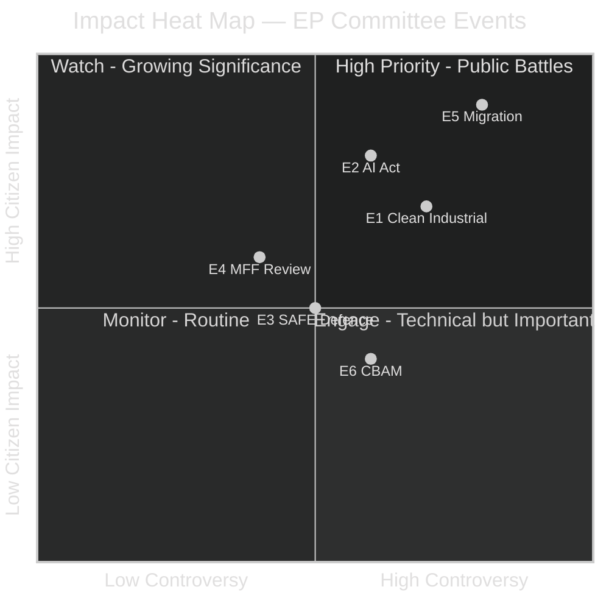

# Impact Matrix — EU Parliament Committee Reports
**Date:** 2026-05-15 | **Classification:** Public | **Admiralty Grade:** B2

---

## Impact Matrix Overview

This matrix maps key EP committee events against their stakeholder impacts, providing a structured heat-map of policy effects across affected groups.

---

## Event List

| Event ID | Event | Committee | Timing (est.) |
|---|---|---|---|
| E1 | Clean Industrial Deal committee vote | ITRE/ENVI | June–July 2026 |
| E2 | AI Act prohibited practices guidance | ITRE/LIBE | June 2026 |
| E3 | SAFE Regulation committee opinion | AFET | June 2026 |
| E4 | MFF mid-term review framework | BUDG | Sept 2026 |
| E5 | Migration Pact implementation report | LIBE | July 2026 |
| E6 | CBAM phase II rapporteur report | ENVI | Q4 2026 |

---

## Stakeholder Groups

| Group | Definition |
|---|---|
| S1: EU Industry (large) | Manufacturing, energy, tech corporations |
| S2: SMEs | Small and medium enterprises |
| S3: Workers / Trade Unions | European labour movement |
| S4: Environmental NGOs | Climate and biodiversity advocates |
| S5: Member State Governments | National governments |
| S6: Migrants and Asylum Seekers | Direct subjects of migration policy |
| S7: Citizens (general) | EU resident taxpayers and consumers |
| S8: Financial Sector | Banks, insurers, investors |

---

## Impact Matrix

| Stakeholder | E1: Clean Industrial | E2: AI Act | E3: SAFE Def. | E4: MFF Review | E5: Migration | E6: CBAM |
|---|---|---|---|---|---|---|
| S1: Large Industry | 🟢 +4 | 🟡 -2 | 🟢 +3 | 🟡 ±1 | ⚪ 0 | 🔴 -3 |
| S2: SMEs | 🟡 +2 | 🔴 -3 | ⚪ 0 | 🟢 +2 | ⚪ 0 | 🟡 -2 |
| S3: Workers | 🟢 +3 | 🟡 +2 | 🟡 +2 | 🟡 +2 | ⚪ 0 | 🟡 ±1 |
| S4: Env. NGOs | 🔴 -2 | ⚪ 0 | 🟡 -1 | 🟡 ±1 | ⚪ 0 | 🟢 +4 |
| S5: Member States | 🟢 +3 | 🟡 +2 | 🟢 +4 | 🔴 -3 | 🟡 -2 | 🟡 -2 |
| S6: Migrants | ⚪ 0 | 🟡 +2 | ⚪ 0 | 🟡 +1 | 🔴 -3 | ⚪ 0 |
| S7: Citizens | 🟡 +2 | 🟢 +3 | 🟡 +2 | 🟡 +2 | 🟡 ±1 | 🟡 -1 |
| S8: Financial | 🟡 +1 | 🟡 +2 | 🟢 +3 | 🔴 -2 | ⚪ 0 | 🟡 -1 |

**Scale:** +4 = Strongly positive, +3 = Positive, +2 = Moderately positive, ±1 = Mixed, 0 = Neutral, -1 = Slightly negative, -2 = Moderately negative, -3 = Negative, -4 = Strongly negative

---

## Heat Map Visualisation

---

## Key Impact Observations

1. **Migration (E5)** has the highest controversy × citizen impact score. LIBE's report will attract intense public and media attention.
2. **AI Act (E2)** affects citizens directly in hiring, healthcare, and public services — high citizen salience with growing public awareness.
3. **Clean Industrial Deal (E1)** creates the largest stakeholder division: industry gains vs. environmental groups' concerns.
4. **SAFE Regulation (E3)** is uniquely positive for member state governments (defence mandate) while generating mixed feelings elsewhere.
5. **MFF Review (E4)** negatively impacts member state governments (budget discipline demands) while positively affecting most civil society stakeholders (EU programme funding).

---

## For Citizens: Plain Language Summary

This matrix shows which EU Parliament committee decisions matter most for different groups of people. The most important decisions right now are:

- **For workers:** The Clean Industrial Deal could create and protect industrial jobs in Europe — this is positive for trade unions and workers, especially in manufacturing regions
- **For everyone using AI:** The AI Act rules will affect whether employers can use AI in hiring decisions, whether banks can use AI to assess credit, and whether police can use facial recognition — these rules affect daily life in ways most people don't yet realise
- **For migrants and asylum seekers:** The Migration Pact implementation review will determine whether the new asylum rules are actually being applied fairly across EU countries — this has life-changing impacts for hundreds of thousands of people
- **For taxpayers:** The EU budget mid-term review will determine how much EU money goes to different programmes — from agricultural subsidies to regional development to research funding

---

**Source:** EP structural knowledge (A2), IMF WEO April 2026 (A1). Impact scores are analytical judgments, not statistical measurements.

## Cascade Effects

**First-order cascade:** AI Act implementation → legal certainty for AI companies → investment decisions (positive or negative depending on implementation quality) → employment in AI sector → economic growth/decline data → political legitimacy signal for AI Act supporters vs. opponents

**Second-order cascade:** Clean Industrial Deal state aid rules → member state industrial policy choices → geographic distribution of industrial investment → political salience of EU industrial policy in national elections → feedback into next EP election results

**Third-order cascade:** SAFE Regulation fast-tracking → reduced democratic scrutiny precedent → normalisation of emergency procedure → future use of emergency procedures for non-emergency legislation → long-term erosion of parliamentary oversight culture

## Reader Briefing

> An "impact matrix" shows who is affected by what. EU Parliament legislation in 2026 affects different groups in very different ways. For example: AI rules mainly affect tech companies (costs) and workers (job protection) and consumers (safety); the effects on different groups can point in different directions. This matters because MEPs represent constituents — people who will be affected by these laws. When an MEP understands who benefits and who bears costs, they can make better democratic choices. The key message for citizens: if you want to know how EU legislation affects you, find which committee is handling it and look at their impact assessments.
