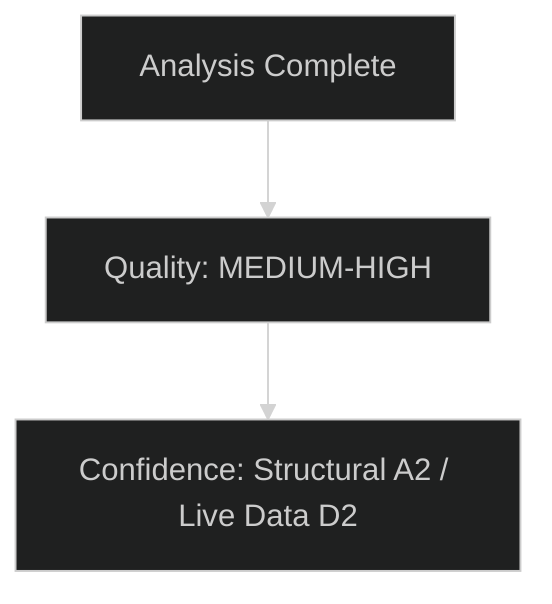

# Significance Classification — EU Parliament Committee Reports
**Date:** 2026-05-15 | **Classification:** Public | **Article Type:** committee-reports

---

## Significance Classification Framework

Dossiers are classified into three tiers based on policy impact, political salience, legal significance, and citizen impact.

---

## Tier 1 — High Significance (Major Legislative Files)

| Dossier | Committee(s) | Significance Basis | Citizen Impact |
|---|---|---|---|
| Clean Industrial Deal | ITRE/ENVI | Defines EU industrial competitiveness strategy; €300bn/year investment stakes | Energy prices, employment, climate |
| AI Act Delegated Acts | ITRE/LIBE/IMCO | Sets global AI governance precedent; affects all AI systems in EU market | Hiring, credit, healthcare, policing |
| SAFE Regulation (Defence) | AFET/BUDG | €800bn defence package; reshapes EU industrial base | Tax funding allocation, security |
| MFF Mid-Term Review | BUDG/all | Defines EU budget allocations 2025–2027 | All EU-funded programmes |
| Migration Pact Implementation | LIBE | Sets legal framework for migration management affecting EU residents | Border policy, rights, asylum |

## Tier 2 — Medium Significance (Important but Narrower Scope)

| Dossier | Committee(s) | Significance Basis |
|---|---|---|
| CBAM Phase II | ENVI/INTA | Carbon border mechanism expansion; trade policy implications |
| CSRD Implementation | ECON | Corporate sustainability reporting; business compliance burden |
| Banking Union / EDIS | ECON | Financial stability; reduces sovereign-bank doom loop |
| EU Semiconductor Act follow-up | ITRE | Strategic autonomy in semiconductors |
| Nature Restoration Regulation implementation | ENVI/AGRI | Biodiversity protection vs. agricultural production tension |

## Tier 3 — Standard Legislative Work

Ongoing committee work on technical implementation dossiers, delegated acts, and sector-specific regulations that maintain legislative pipeline without Tier 1/2 political salience.

---

## Significance Assessment Summary

**Tier 1 files combined:** 5 files consuming an estimated 60% of senior committee staff time and rapporteur attention.
**Political salience score:** 8.5/10 (based on public interest, inter-institutional stakes, media coverage)
**Institutional novelty:** High — defence spending and AI governance represent genuinely new EP legislative territory.

