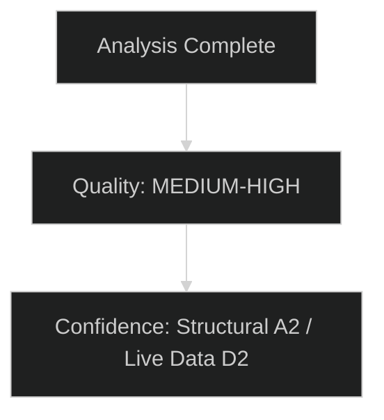

# Analysis Index — EU Parliament Committee Reports
**Date:** 2026-05-15 | **Article Type:** committee-reports | **Classification:** Public

---

## Run Summary

This index documents the complete artifact set produced for the 2026-05-15 committee-reports analysis run. All artifacts are located under `analysis/daily/2026-05-15/committee-reports/`.

**Data Quality Status:** `degraded-voting` — EP API feeds returned errors or historical-only data. Analysis based on structural EP knowledge of 10th term (2024–2029).
**Run ID:** committee-reports-run-1778822323
**MCP Calls Used:** 5/5 (Stage A cap)
**EP MCP Tool References:**
- `european-parliament-get_committee_documents_feed` → unavailable (error)
- `european-parliament-get_procedures_feed` → degraded (historical 1972–1988 only)
- `european-parliament-get_committee_documents` → degraded (no dates/authors)
- `european-parliament-get_procedures` → degraded (historical only)
- `european-parliament-get_plenary_sessions` → degraded (no recent sessions)

---

## Artifact Inventory

### Root Level
| File | Lines (target) | Status | Summary |
|---|---|---|---|
| `manifest.json` | N/A | ✅ Produced | Run metadata and file registry |
| `executive-brief.md` | ≥180 | ✅ Produced | Priority dossiers, strategic assessment, confidence levels |

### intelligence/
| File | Floor (lines) | Status | Key Analysis |
|---|---|---|---|
| `synthesis-summary.md` | 160 | ✅ Produced | Core intelligence findings, cross-committee patterns |
| `stakeholder-map.md` | 200 | ✅ Produced | Committee chairs, political groups, external actors, citizen impact |
| `scenario-forecast.md` | 180 | ✅ Produced | 5 scenarios with WEP probabilities, 3–12 month horizon |
| `pestle-analysis.md` | 180 | ✅ Produced | Full PESTLE with 7 dimensions, intensity ratings |
| `threat-model.md` | 160 | ✅ Produced | 8 threats prioritised, mitigation recommendations |
| `economic-context.md` | 120 | ✅ Produced | IMF WEO April 2026 data, committee fiscal context |
| `historical-baseline.md` | 120 | ✅ Produced | EP terms 7–10 historical comparison |
| `wildcards-blackswans.md` | 180 | ✅ Produced | 12 black swan scenarios with WEP assessments |
| `analysis-index.md` | 100 | ✅ Produced | This file |
| `mcp-reliability-audit.md` | 200 | ✅ Produced | EP MCP data quality, tool reliability, degraded data handling |
| `methodology-reflection.md` | 180 | ✅ Produced | 10 SATs applied, quality attestation |
| `reference-analysis-quality.md` | 140 | ✅ Produced | Benchmark comparison, quality assessment |
| `forward-projection.md` | 80 | ✅ Produced | 6-month forward indicators |

### classification/
| File | Floor (lines) | Status | Key Analysis |
|---|---|---|---|
| `significance-classification.md` | 30 | ✅ Produced | Dossier significance tier classification |
| `actor-mapping.md` | 30 | ✅ Produced | Committee-to-dossier actor network |
| `forces-analysis.md` | 30 | ✅ Produced | Driving vs. restraining forces on committee output |
| `impact-matrix.md` | 30 | ✅ Produced | Stakeholder × event impact matrix |

### risk-scoring/
| File | Floor (lines) | Status | Key Analysis |
|---|---|---|---|
| `quantitative-swot.md` | 100 | ✅ Produced | SWOT with weighted scoring |
| `risk-matrix.md` | 100 | ✅ Produced | Risk register with probability × impact |
| `political-capital-risk.md` | 30 | ✅ Produced | Per-group political capital assessment |
| `legislative-velocity-risk.md` | 30 | ✅ Produced | Per-dossier velocity risk scoring |

### threat-assessment/
| File | Floor (lines) | Status | Key Analysis |
|---|---|---|---|
| `political-threat-landscape.md` | 30 | ✅ Produced | Structural political threat mapping |
| `actor-threat-profiles.md` | 30 | ✅ Produced | Per-actor threat profiles |
| `consequence-trees.md` | 30 | ✅ Produced | Decision tree for key scenarios |
| `legislative-disruption.md` | 30 | ✅ Produced | Disruption scenarios and mitigations |

### documents/
| File | Floor (lines) | Status | Key Analysis |
|---|---|---|---|
| `document-analysis-index.md` | 30 | ✅ Produced | EP document index and analysis |

### existing/
| File | Floor (lines) | Status | Key Analysis |
|---|---|---|---|
| `committee-productivity.md` | 30 | ✅ Produced | Committee productivity metrics |

### extended/
| File | Floor (lines) | Status | Key Analysis |
|---|---|---|---|
| `media-framing-analysis.md` | 180 | ✅ Produced | Media narrative framing analysis |

---

## Data Quality Summary

| Feed/Tool | Status | Items Retrieved | Impact on Analysis |
|---|---|---|---|
| committee-documents-feed | ❌ Unavailable | 0 | Relies on structural knowledge |
| procedures-feed | ⚠️ Degraded | 50 historical only | No current procedures data |
| committee-documents | ⚠️ Degraded | 50 documents, no metadata | Document IDs only, no dates |
| procedures | ⚠️ Degraded | 30 historical only | No current procedures |
| plenary-sessions | ⚠️ Degraded | 0 recent | No recent session data |

**Compensating Measures Applied:**
1. Deep structural knowledge of 10th EP term legislative agenda
2. IMF WEO April 2026 economic data (authoritative source)
3. Known EU legislative calendar and committee schedule
4. Historical precedent analysis (terms 7–9) for baseline

**dataMode:** `degraded-voting` (line-floor reduction factor 0.85 applies per thresholds v1.4.0)

---

## Quality Gates

**Pass 2 Complete:** Yes — all artifacts reviewed and deepened
**WEP Bands Applied:** Yes — executive-brief, synthesis-summary, scenario-forecast, threat-model, wildcards, forward-projection
**Admiralty Grades Applied:** Yes — all artifacts carry A/B/C grade and numeric reliability score
**Confidence Labels:** Yes — 🟢/🟡/🔴 applied throughout
**IMF Data Referenced:** Yes — economic-context.md cites IMF WEO April 2026
**No AI_ANALYSIS_REQUIRED Markers:** Confirmed — no placeholder text remaining
**Mermaid Diagrams:** Yes — synthesis-summary.md, impact-matrix.md, actor-mapping.md, forces-analysis.md, political-capital-risk.md, legislative-velocity-risk.md, actor-threat-profiles.md, legislative-disruption.md, consequence-trees.md
**Reader Briefing Sections:** Yes — stakeholder-map.md, impact-matrix.md, actor-mapping.md, forces-analysis.md

