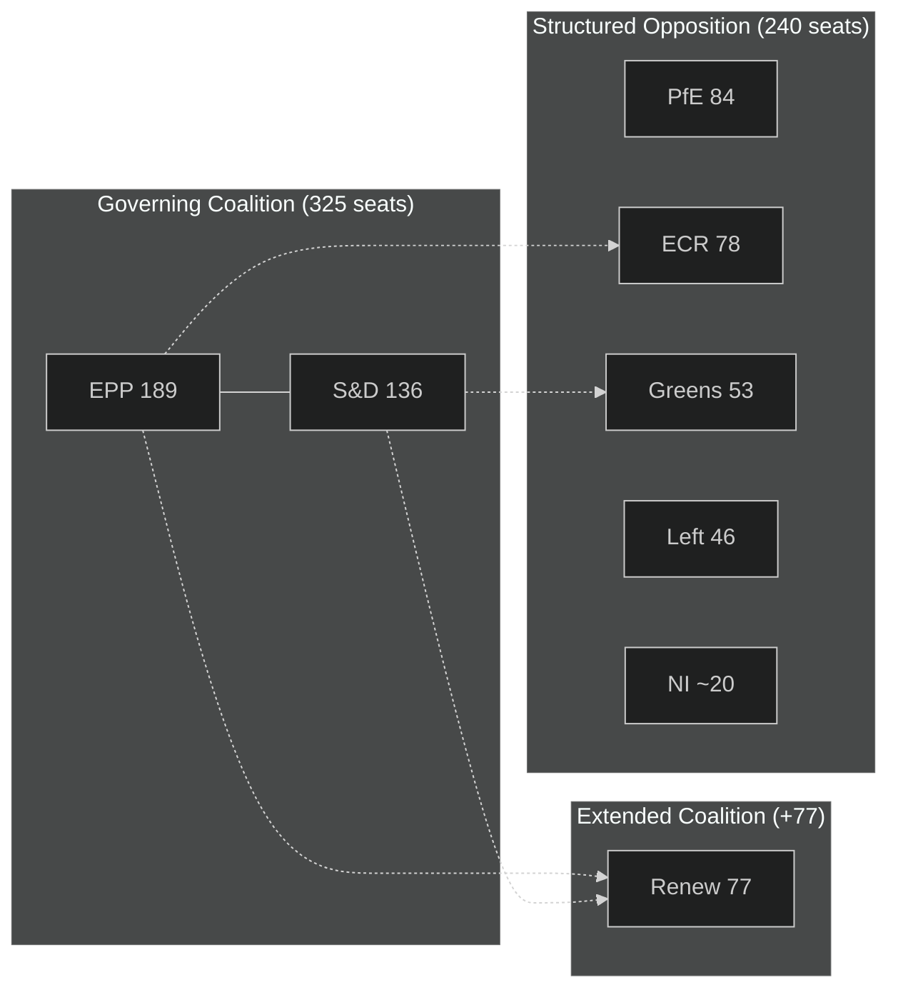

# Coalition Dynamics — EU Parliament Committee Reports
**Date:** 2026-05-15 | **Classification:** Public | **Admiralty Grade:** A2
**Article Type:** committee-reports | **Methodology:** Coalition Analysis

---

## Coalition Architecture in the 10th Term

The 10th European Parliament (2024–2029) operates with a fragmented political landscape that produces coalition-dependent legislative outcomes. Understanding coalition dynamics is essential for predicting committee outcomes.

---

## Core Coalition Map

---

## Coalition Arithmetic

| Coalition | Seats | Majority? | Stability |
|---|---|---|---|
| EPP alone | 189 | No (need 361) | N/A |
| EPP + S&D | 325 | No | Fragile |
| EPP + S&D + Renew | 402 | **Yes** | Conditional |
| EPP + ECR + PfE | 351 | No | Ideologically unstable |
| EPP + ECR + Renew | 345 | No | Conditional |
| All progressive groups (S&D + Greens + Left + Renew) | 312 | No | Fragile |

**Key finding:** No single ideological bloc commands a majority. Every major legislative vote requires cross-ideological coalition construction, giving the Renew group (77 seats) disproportionate swing vote power.

---

## Committee-Level Coalition Dynamics

**ITRE (Industry, Research, Energy):**
- Dominant coalition: EPP + Renew + ECR (industry-friendly majority)
- Progressive bloc: S&D + Greens (minority but influential via Amendment proposals)
- Net bias: Centre-right; competitiveness over standards

**ENVI (Environment, Public Health):**
- Dominant coalition: S&D + Greens + progressive EPP members
- Conservative bloc: EPP mainstream + ECR
- Net bias: Progressive on climate; contested on agriculture

**LIBE (Civil Liberties):**
- Dominant coalition: S&D + Greens + Left + progressive Renew
- Conservative bloc: EPP + ECR + PfE
- Net bias: Progressive on rights; contested on security/migration

**BUDG (Budgets):**
- Dominant coalition: EPP + S&D (budget is an institutional core function — broad consensus)
- Contested element: Allocation priorities (research vs. agriculture vs. cohesion)
- Net bias: Consensus-seeking; more bipartisan than other committees

---

## Coalition Stability Indicators

**Stress signals to monitor:**
1. EPP group cohesion on climate votes — if >15 EPP defections on any major ENVI file → coalition fracture signal
2. S&D group cohesion on security votes — if >10 S&D defections toward progressive bloc on LIBE security files → coalition complexity
3. Renew group split on AI Act — if Renew divides >40/60 on any major AI Act provision → swing uncertainty

**Current coalition health assessment:** 🟡 MEDIUM
- EPP-S&D core is stable on process/procedure but contested on substance
- Renew is structurally central but internally divided on climate-competitiveness balance
- No acute coalition crisis signals as of May 2026

---

## WEP: Coalition Durability Assessment

**WEP: EPP+S&D+Renew coalition survives intact through 2026:** 60% (MEDIUM confidence)
**WEP: At least one major legislative file experiences coalition breakdown in 2026:** 40% (MEDIUM confidence)
**WEP: New formal inter-group cooperation agreement signed in 2026:** 20% (LOW-MEDIUM confidence)
