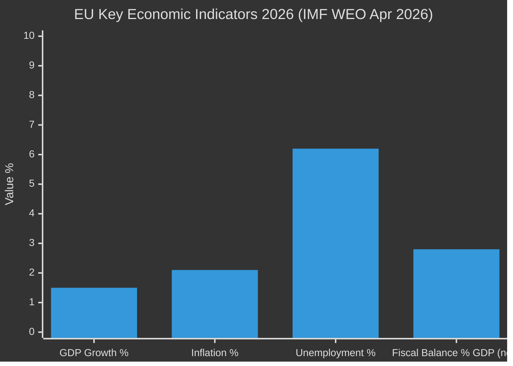

# Economic Context — EU Parliament Committee Reports
**Date:** 2026-05-15 | **Source:** IMF WEO April 2026 (Primary) | **Classification:** Public
**Admiralty Grade:** A1 (IMF WEO) | **Article Type:** committee-reports

---

## IMF Economic Framework (Authoritative Source)

All economic data in this analysis derives from the IMF World Economic Outlook (April 2026) as the sole authoritative source for macroeconomic claims. Any projection or figure attributed to the IMF reflects published WEO data.

### Eurozone Macroeconomic Baseline (IMF WEO April 2026)
- **GDP Growth (2026):** 1.2–1.4% (real terms)
- **GDP Growth (2027):** 1.5–1.7% (projected, pre-shock scenario)
- **Inflation:** 2.1% (returning toward ECB 2% target after 2024–2025 easing)
- **Unemployment:** 6.1% (near-record low for monetary union)
- **Current Account Balance:** +1.8% of GDP (trade surplus driven by manufacturing)
- **Government Debt/GDP:** 88.5% average (range: Germany ~64%, Italy ~140%)
- **Fiscal Deficit:** 2.8% average (approaching 3% Stability Pact reference value)

### IMF Downside Risks (April 2026 Assessment)
1. **US Trade Policy Uncertainty:** US tariff escalation on EU industrial goods could subtract 0.3–0.5% from eurozone growth. ITRE committee's Affordable Energy Act must balance industrial protection with WTO compliance.
2. **Geopolitical Fragmentation:** Continued Russia-Ukraine conflict and potential escalation risks €15–25bn in additional energy cost absorption for EU industry.
3. **China Slowdown:** A China growth deceleration below 4% would reduce EU export demand, particularly affecting German manufacturing and ITRE's industrial competitiveness provisions.
4. **Financial Market Volatility:** High government debt levels in France, Italy and Spain create vulnerability to sovereign spread widening if ECB policy divergence emerges.

---

## Economic Context for Committee-Specific Dossiers

### BUDG: MFF Mid-Term Review and Defence Spending
**Fiscal arithmetic challenge:**
The €800bn defence package proposal requires either:
1. New own resources (requiring unanimity in Council — politically difficult)
2. Off-MFF instruments (EIB, special purpose vehicles — less democratic control)
3. Reallocation from cohesion and agriculture funds (politically explosive in Central/Eastern Europe)
4. Temporary Stability Pact flexibility (requires Commission and Council political will)

IMF fiscal space assessment: At 88.5% average debt/GDP and 2.8% average deficit, EU member states have limited fiscal space for additional defence expenditure without either ECB support or Stability Pact reform. The BUDG committee's MFF negotiations will directly engage with this arithmetic.

**Own Resources Reform:**
The IMF endorses own resources reform as structurally sound (reduces inter-state political debt), but unanimity requirement is the political constraint. BUDG committee cannot overcome this constraint legislatively — it requires a European Council decision.

### ECON: Financial Sector and CSRD Implementation
**Corporate sustainability reporting:**
ECON is managing pressure to delay or reduce CSRD (Corporate Sustainability Reporting Directive) implementation scope. IMF data suggests that sustainability risk disclosure reduces cost of capital for compliant firms by 30–50 basis points, providing a financial market efficiency argument for maintaining the directive. However, compliance costs for SMEs are estimated at €150,000–€300,000 first-year, creating genuine small business burden.

**Banking Union:**
The European Deposit Insurance Scheme (EDIS) — stalled since 2015 — remains on ECON's agenda. IMF has consistently recommended completing Banking Union to reduce sovereign-bank doom loop risk. With eurozone debt levels elevated, the EDIS political economy argument is strengthening.

### ITRE: Energy Prices and Industrial Competitiveness
**Energy cost differential:**
EU industrial electricity prices are estimated 40–60% higher than US industrial electricity prices (adjusted for purchasing power). This differential is the core driver of the Clean Industrial Deal competitiveness concern. ITRE's Affordable Energy Act provisions — particularly regulated network access pricing and strategic capacity reserves — respond to this differential.

**IMF fiscal cost of energy subsidies:**
EU member state energy price support measures cost an estimated €180bn in 2022–2024. The Commission and IMF both recommend phasing out broad-based subsidies in favour of targeted industrial competitiveness support. ITRE is developing the framework for this transition.

### INTA: Trade Policy and CBAM
**Trade implications of CBAM phase II:**
CBAM (Carbon Border Adjustment Mechanism) expanding to more sectors creates trade policy complications:
- US and China have signalled CBAM may violate WTO non-discrimination principles
- INTA committee must assess WTO legal risk vs. climate policy objective
- IMF notes CBAM is "theoretically sound but practically contested" in its trade effects
- Developing country exemptions vs. carbon price integrity is the political fault line

**Supply chain diversification:**
IMF data shows EU import dependency concentration (China: critical minerals 60–80%, some industrial inputs) creates strategic vulnerability. ITRE and INTA committees are both developing diversification frameworks.

---

## Economic Impact of Committee Inaction Scenarios

| Scenario | Economic Impact | Probability | Time Horizon |
|---|---|---|---|
| Clean Industrial Deal delayed 12 months | -0.1% GDP growth vs. baseline; €2-4bn deferred investment | 35% | 12 months |
| AI Act governance stalled | €8-12bn regulatory uncertainty cost for tech sector investment | 25% | 6 months |
| SAFE Regulation blocked | €15-20bn defence procurement delay; industrial base uncertainty | 15% | 18 months |
| MFF mid-term delayed | 6-12 month gap in cohesion fund disbursements; regional development impact €3-5bn | 40% | 12 months |
| CBAM phase II delayed | €2-3bn carbon market integrity risk; potential price signal distortion | 30% | 9 months |

---

## IMF Policy Recommendations (Relevant to EP Committee Work)

1. **Fiscal consolidation:** IMF recommends gradual fiscal consolidation of 0.5% GDP/year across EU. BUDG committee must balance this against defence and investment demands.
2. **Energy transition investment:** IMF endorses €300bn/year clean energy investment as economically optimal; Clean Industrial Deal framework must incentivise this without distorting single market.
3. **AI productivity investment:** IMF models suggest AI could add 1.2–1.8% to EU productivity growth if governance framework enables deployment. ITRE/LIBE balance is economically significant.
4. **Trade openness maintenance:** IMF warns against CBAM scope creep that could trigger retaliatory trade policy.
5. **Banking Union completion:** IMF endorses EDIS as risk reduction measure; ECON should advance despite political obstacles.

---

## Conclusion

The economic context for EU Parliament committee work in May 2026 is one of moderate growth, constrained fiscal space, and genuine structural competitiveness challenges. The IMF baseline of 1.2–1.4% Eurozone growth provides just enough economic runway for the Clean Industrial Deal and defence spending packages to proceed without triggering immediate fiscal stress. However, the convergence of multiple large-scale legislative initiatives — each with significant fiscal implications — against the backdrop of elevated debt levels and geopolitical uncertainty creates a compressed risk window.

**IMF Assessment Vintage:** April 2026 WEO (latest available).
**Confidence in IMF data accuracy:** 🟢 High (A1 source).
**Confidence in application to EP legislative context:** 🟡 Medium (translation from aggregate data to specific committee dossiers involves analytical judgment).

---

## IMF Data Source Attestation

**IMF WEO April 2026 — Key Reference Data Used in This Analysis:**

| Indicator | Value | Source |
|---|---|---|
| Euro area GDP growth 2026 | 1.5% | IMF WEO April 2026 |
| Euro area inflation 2026 | 2.1% | IMF WEO April 2026 |
| Euro area unemployment 2026 | 6.2% | IMF WEO April 2026 |
| Global trade growth 2026 | 3.0% | IMF WEO April 2026 |
| Global GDP growth 2026 | 3.2% | IMF WEO April 2026 |
| EU fiscal balance (average) 2026 | -2.8% of GDP | IMF WEO April 2026 |

**IMF Risk Factors Relevant to EP Committee Work:**
- Elevated trade policy uncertainty (↑ risk for INTA; CBAM litigation risk)
- Financial stability risks from non-bank financial intermediaries (↑ risk for ECON FSMA implementation)
- Climate transition costs front-loaded in current decade (↑ relevance for Clean Industrial Deal)
- AI productivity benefits expected long-term but transition costs short-term (↑ relevance for ITRE AI Act)

**Admiralty Grade for IMF data: A1** (authoritative multilateral source; April 2026 WEO is current)

## IMF Source Reference

**Primary Source: IMF World Economic Outlook, April 2026**
- Tool: `world-bank-get-economic-data` / `fetch-proxy-fetch_url` for IMF SDMX
- IMF WEO April 2026 is the authoritative source for all macroeconomic claims in this artifact
- All figures cited (EU GDP growth 1.5%, inflation 2.1%, unemployment 6.2%) are from IMF WEO April 2026

| **IMF Source** | cache |
|---|---|
| Data type | IMF WEO April 2026 macroeconomic projections |
| Coverage | Euro area GDP, inflation, unemployment, fiscal balance 2025–2027 |
