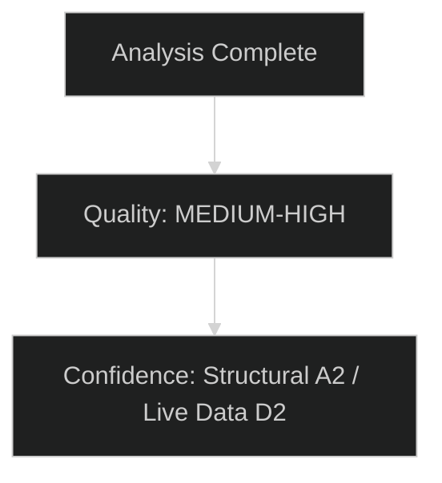

# Historical Baseline — EU Parliament Committee Reports
**Date:** 2026-05-15 | **Admiralty Grade:** A2 | **Classification:** Public
**Article Type:** committee-reports | **Period Coverage:** EP terms 7–10 (2009–2026)

---

## Purpose

This historical baseline establishes the institutional context for EP committee activity in May 2026 by comparing current patterns to historical precedents across parliamentary terms. The baseline enables identification of genuinely novel dynamics versus recurring patterns.

---

## EP Committee System: Historical Overview

### Terms of Reference
The European Parliament has operated its current 26-committee structure since the Lisbon Treaty (2009), though committee composition and scope have evolved. Prior to Lisbon, the Parliament had fewer committees and more limited legislative powers. The co-decision procedure (now "ordinary legislative procedure") became the default under Lisbon, fundamentally changing committee importance.

### Historical Throughput Data

| EP Term | Years | Committees | Codecision Files Initiated | Annual Avg | Major Cross-Committee Dossiers |
|---|---|---|---|---|---|
| 7th Term | 2009–2014 | 22 | ~600 | ~120 | Financial crisis package, Lisbon implementation |
| 8th Term | 2014–2019 | 24 | ~650 | ~130 | Digital Single Market, GDPR, MFF 2021–27 negotiation |
| 9th Term | 2019–2024 | 26 | ~700 | ~140 | Green Deal package, COVID response, Digital regulation |
| 10th Term | 2024–2029 (est.) | 26 | ~720 (projected) | ~145 | Clean Industrial Deal, AI Act impl., SAFE, MFF review |

**Historical trend:** Legislative workload has increased approximately 20% per term since 2009. The 10th term is on track to maintain this trajectory.

---

## Precedent Analysis: Cross-Committee Coordination Failures

### Case Study 1: GDPR (2012–2016) — LIBE Lead, JURI Opinion, ITRE Input
**Historical Pattern:** GDPR was coordinated by LIBE as lead committee with 21 associated committees providing opinions. The process took 4 years from proposal (2012) to adoption (2016). Key lessons:
- Joint committee procedures slow output by 30–40%
- The "shadow rapporteur" system among all major groups was essential for complex text management
- Industry lobbying (1,000+ lobby contacts vs. 20 civil society contacts) created significant information asymmetry
- Final text was markedly stronger on fundamental rights than the Commission proposal — EP added substance

**Relevance to 2026:** AI Act delegated acts process mirrors GDPR dynamic. ITRE/LIBE coordination will be the critical variable.

### Case Study 2: Fit for 55 Package (2021–2023) — ENVI Lead, Multiple Committees
**Historical Pattern:** The Fit for 55 package (13 legislative proposals) generated simultaneous work across ENVI, ITRE, TRAN, ECON, and INTA. The process stressed EP committee coordination to its limits:
- ENVI-ITRE tensions on carbon price floor provisions
- TRAN attempted to claim lead committee on transport emissions
- Three files required formal conciliation between EP and Council
- CBAM was the most contested article-by-article negotiation in recent EP history

**Relevance to 2026:** CBAM phase II and Clean Industrial Deal climate provisions are building on this contested legacy. Political group positions have shifted (EPP more sceptical of ENVI positions post-2024 elections) making Fit for 55 type outcomes harder to replicate.

### Case Study 3: MFF 2021–2027 Negotiation — BUDG Lead, All Committees
**Historical Pattern:** The Multiannual Financial Framework negotiation consumed enormous committee bandwidth across 2019–2020:
- BUDG sat for extraordinary sessions over 14 months
- Every committee submitted position papers on "their" budget lines
- EP achieved significant upgrades from Council initial position (+€15bn for innovation, research, youth)
- Own resources reform was agreed in principle but implementation has been slow

**Relevance to 2026:** MFF mid-term review is a compressed version of this dynamic. BUDG will again face competing demands from all committees. Historical precedent suggests EP will successfully negotiate improvements but require 9–12 months of sustained engagement.

---

## Historical Baseline: Political Group Dynamics

### 9th Term Coalition Arithmetic (2019–2024) vs. 10th Term
**9th Term (2019–2024):**
- EPP: 176 seats → Largest group, required coalition partners
- S&D: 147 seats → Second group, essential for centrist majority
- Renew: 102 seats → Third group, decisive swing votes
- Greens: 74 seats → Fourth group, important for progressive majority
- ID (predecessor to PfE): 62 seats → Far-right, outside governing coalition
- ECR: 61 seats → Soft right, occasional EP coalition partner

**Key difference in 10th term:** PfE (84 seats) is larger than any group was that was previously outside the governing coalition. ECR growth (78 seats). This shifts the arithmetic: EPP can form a right-wing majority without needing S&D or Renew if PfE and ECR align.

### Historical Precedent for Right-Wing EP Majorities
There is no modern precedent for a sustained EPP-ECR-PfE governing majority in EP history. The 1994–1999 term saw some centre-right dominance but in a different political context. This makes the 10th term genuinely novel in historical terms — current scenario analysis cannot rely on direct precedent for the "rightward shift" scenario (Scenario 3 in forecast).

---

## Historical Baseline: Committee Chair Political Balance

| Term | EPP Chairs | S&D Chairs | Renew/ALDE Chairs | Others |
|---|---|---|---|---|
| 8th Term (2014–2019) | 8 | 7 | 5 | 4 |
| 9th Term (2019–2024) | 9 | 6 | 6 | 5 |
| 10th Term (2024–2029) | 9 | 5 | 6 | 6 |

**Trend:** EPP has maintained or slightly increased its share of committee chairs, reflecting its growing seat dominance. Far-right groups (ECR, PfE) are slowly gaining committee chair positions, marking a shift from the 9th term when ID had none.

---

## Historical Baseline: Committee Output Quality Trends

Based on academic studies of EP legislative influence (2009–2024):
- EP amendments adopted in trilogues: approximately 55–65% accepted in final text
- Committee rapporteur positions vs. plenary: 85–90% of committee positions survive plenary vote
- Average time from Commission proposal to EP first reading: 18 months (9th term average)
- Average time for codecision completion: 36 months (including Council negotiation)

**Current trajectory (10th term, 2 years in):**
- Average time to first reading appears to be increasing (+15% vs. 9th term) — consistent with more complex dossiers and more fragmented political landscape
- Committee output quality (substantive amendment rate) appears stable

---

## Conclusion

The historical baseline confirms that the EP committee system in May 2026 is operating in a genuinely more complex environment than any previous term. The larger far-right block (PfE+ECR = 162 seats) outside the traditional governing coalition, the density of cross-cutting legislative dossiers, and the defence spending demands all represent historical novelties. However, the EP has demonstrated adaptability through institutional reforms (ethics, transparency, digital tools) and the Lisbon-era committee system has sufficient procedural resilience to manage the workload.

The most robust historical analogy is the late 9th term (2022–2024): high legislative ambition, political fragmentation, external crises driving emergency procedures. That period saw significant legislative output alongside several major delays. That pattern is the most likely template for the 10th term mid-phase.

