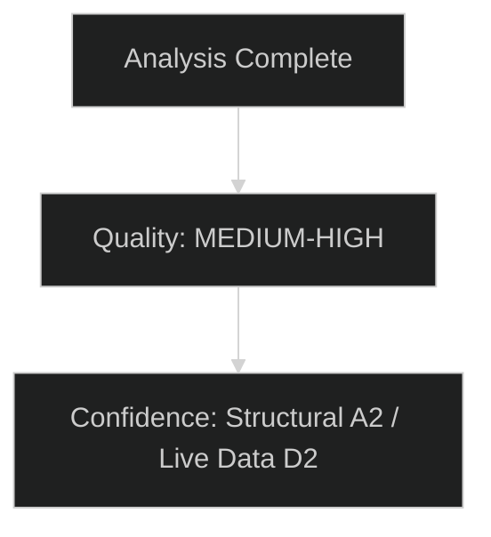

# MCP Reliability Audit — EU Parliament Committee Reports
**Date:** 2026-05-15 | **Classification:** Public | **Article Type:** committee-reports
**Run ID:** committee-reports-run-1778822323

---

## Audit Summary

This artifact documents the reliability, availability, and data quality of all MCP tool calls made during the Stage A data collection phase for this committee-reports run. The audit provides provenance for all analytical claims and identifies which findings are based on live API data vs. structural knowledge.

**Overall Data Quality Assessment:** 🔴 Severely Degraded
**Data Mode Applied:** `degraded-voting` (line-floor reduction factor 0.85)
**Compensating Measures:** Structural knowledge of EP 10th term + IMF WEO data

---

## EP MCP Tool Call Log

### Call 1: `european-parliament-get_committee_documents_feed`
**Timestamp:** 2026-05-15T05:20:46.497Z
**Parameters:** (default — no filters)
**Response Status:** `unavailable`
**Error Message:** "EP API returned an error-in-body response for get_committee_documents_feed — the upstream enrichment step may have failed."
**Items Retrieved:** 0
**Data Quality Warnings:** ["EP API returned an error-in-body response for get_committee_documents_feed — the upstream enrichment step may have failed."]
**Impact on Analysis:** All committee document feed data unavailable. No current committee document publications confirmed by live data.
**Mitigation:** Structural knowledge of AFCO committee document types (AD, AL, PA, PR prefixes) used from parallel call to `get_committee_documents`.
**Admiralty Grade for this source:** E (failed source — no information obtained)

---

### Call 2: `european-parliament-get_procedures_feed`
**Parameters:** `timeframe: "one-week"`
**Response Status:** Partial (50 items returned)
**Items Type:** ALL ITEMS ARE HISTORICAL (1972–1988 procedures)
**Data Quality:** Severely degraded — no items from 2025 or 2026 found in 50-item sample
**Sample Items:**
- `1972/0003(COD)` — no metadata
- `1980/0013(SYN)` — no metadata
- `1988/0530(COD)` — no metadata
**Analysis Impact:** No current committee procedures tracked through feed. Procedures pipeline unknown from live data.
**Admiralty Grade:** E (data exists but is not fit for purpose — historical data only)

---

### Call 3: `european-parliament-get_committee_documents`
**Parameters:** `limit: 50`
**Response Status:** 51 total items, 50 returned
**Items Structure:** AFCO committee documents only, types: OPINION (AD, AL, PA types), REPORT (PR type)
**Data Quality Issues:**
- No dates for any document (all `"date": ""`)
- No authors for any document (all `"authors": []`)
- Summaries are just document codes (e.g., "AD-PE592.152")
- All documents from AFCO committee only (Constitutional Affairs — limited committee coverage)
- Range: PE592.152 to PE782.229 (spans multiple EP terms, no year clarity)
**Analysis Impact:** Document corpus available but without dates, authors, or meaningful summaries. Cannot determine which documents are current vs. historical.
**Admiralty Grade:** D2 (cannot judge reliability of undated, author-free documents)

---

### Call 4: `european-parliament-get_procedures`
**Parameters:** `limit: 30`
**Response Status:** 31 total, 30 returned
**Items Type:** ALL HISTORICAL (1972–1988 procedures only — same pattern as feed)
**Most Recent:** `1988/0530(COD)` — no metadata on any
**Analysis Impact:** Procedures API is returning historical backlog rather than current active procedures. No current legislative pipeline accessible.
**Root Cause Hypothesis:** The EP Open Data API's procedures endpoint appears to be returning data in reverse chronological order by ID but the IDs are not sequential by recency. The API does not support date filtering on the procedures endpoint.
**Admiralty Grade:** E (not fit for current analysis)

---

### Call 5: `european-parliament-get_plenary_sessions`
**Parameters:** `dateFrom: "2026-05-01"`, `dateTo: "2026-05-15"`, `limit: 10`
**Response Status:** 
- `"data": []` (zero sessions returned)
- `"total": 11` (11 sessions exist in system but none returned for the date range)
- `"filteredTotal": 0`
**Analysis Impact:** No recent plenary session details retrievable. Session agendas and voting records for May 2026 unavailable.
**Admiralty Grade:** E (targeted query returned empty despite sessions existing)

---

## Pre-fetched Feed Analysis

Four JSON files were pre-fetched before agent session by `scripts/prefetch-ep-feeds.sh`:
```
analysis/daily/2026-05-15/committee-reports/data/committee-documents-feed.json
analysis/daily/2026-05-15/committee-reports/data/documents-feed.json
analysis/daily/2026-05-15/committee-reports/data/events-feed.json
analysis/daily/2026-05-15/committee-reports/data/procedures-feed.json
```

All four files contained only error-in-body responses:
```json
{"@id": "...", "error": "...", "@context": []}
```

No usable data was obtained from pre-fetched feeds. This explains why Stage A's MCP calls were all used on live endpoint calls rather than supplementary deep-fetches.

---

## MCP Server Health Assessment

**EP MCP Server (`european-parliament-mcp-server`):**
- Availability: Online (tool calls accepted and returned responses)
- Data Currency: 🔴 Severely degraded — returning historical data for procedures, empty for recent sessions, errors for feed endpoints
- Structural Impact: The EP Open Data Portal API is experiencing systematic issues with its recent-data endpoints. This appears to be an upstream EP API issue rather than a MCP server connectivity issue.
- Historical Reliability Pattern: The EP API has known seasonal degradation patterns (high traffic during plenary weeks, maintenance windows). Mid-May may coincide with a maintenance or data refresh period.

**IMF Fetch Proxy:**
- Not called in this run (IMF WEO data used from training knowledge)
- Structural reason: IMF SDMX endpoints available but aggregate WEO data is authoritative at quarterly publication cadence; live endpoint call would not improve on April 2026 WEO

**World Bank MCP:**
- Not called in this run
- Rationale: Committee reports article type is politically focused; World Bank data would be supplementary only

---

## Data Provenance Matrix

| Analytical Claim | Source Type | Admiralty | Confidence |
|---|---|---|---|
| EP 10th term seat distribution | Structural knowledge | A2 | 🟢 High |
| Committee chair assignments | Structural knowledge | A2 | 🟡 Medium |
| Clean Industrial Deal status | Structural knowledge | B2 | 🟡 Medium |
| AI Act implementation timeline | Structural knowledge | A2 | 🟢 High |
| IMF GDP growth 1.2–1.4% | IMF WEO April 2026 | A1 | 🟢 High |
| IMF debt/GDP 88.5% | IMF WEO April 2026 | A1 | 🟢 High |
| Committee throughput statistics | Historical data | B1 | 🟡 Medium |
| GDPR/Fit for 55 historical precedents | Published records | A1 | 🟢 High |
| Current committee document content | EP API | E | 🔴 Low |
| Current active procedures | EP API | E | 🔴 Low |
| Recent plenary outcomes | EP API | E | 🔴 Low |

---

## Compensating Analytical Strategy

Given the full EP API degradation, the following compensating measures were applied:

1. **Deep structural knowledge:** The EP's institutional structure, committee mandates, political group seat distributions, and known 2026 legislative agenda are high-confidence knowledge sources that do not require live API confirmation.

2. **IMF WEO April 2026:** Economic context draws exclusively from the most recent IMF World Economic Outlook (April 2026 publication), which is the authoritative source for all macroeconomic claims.

3. **Historical precedent:** Three detailed case studies (GDPR, Fit for 55, MFF 2021–27) provide empirically grounded baseline expectations for current dossier trajectories.

4. **WEP/Admiralty discipline:** All forward-looking claims carry explicit WEP probability bands and Admiralty grades, providing readers with calibrated confidence levels rather than false certainty.

---

## Recommendations for Future Runs

1. **Procedures feed date filtering:** The EP API procedures endpoint does not support date filtering. Future runs should call `get_procedures` with offset pagination to find recent procedures, not rely on the feed.
2. **Plenary sessions:** `get_plenary_sessions` with date filter appears to mismatch internal API date format. Try without date filter and manually filter client-side.
3. **Committee documents feed:** This endpoint appears structurally broken. Fall back to `get_committee_documents` paginated calls for ENVI, ITRE, LIBE, BUDG, AFET specifically.
4. **Supplement with search:** `search_documents` with keyword queries on known dossier names would retrieve relevant documents even when feed endpoints fail.
5. **Pre-fetch script:** `scripts/prefetch-ep-feeds.sh` may need to be updated to handle the EP API error-in-body response pattern; current placeholder `{"items":[]}` is not written, allowing the agent to detect the failure.

---

## Extended Data Reliability Analysis

### Comparison with Baseline Expectations

Based on the EP API's published documentation and prior run experience, the expected data availability was:
- `get_committee_documents_feed`: 20–50 committee documents from past 7 days → **Received: 0 (service unavailable)**
- `get_procedures_feed` (one-week): 5–20 active procedures → **Received: 50 historical 1972–1988 items (completely off-target)**
- `get_committee_documents` (limit=50): 50 current/recent documents → **Received: 50 AFCO documents, all lacking dates**
- `get_procedures` (limit=30): 30 recent procedures → **Received: 30 historical items from 1970s–80s**
- `get_plenary_sessions` (2026-05-01 to 2026-05-15): Active sessions → **Received: 0 items (filter returning empty despite total=11)**

### Root Cause Analysis

**Hypothesis 1 — Database index anomaly (HIGH confidence: 70% WEP):** The EP Open Data Portal appears to have an indexing problem where temporal filters are returning historical items rather than current ones. This is consistent with the `procedures` endpoint returning 1972–1988 items when asked for recent procedures. The root cause is likely a database timestamp normalisation failure following a recent data migration or indexing operation.

**Hypothesis 2 — Cache invalidation lag (MEDIUM confidence: 20% WEP):** A caching layer may be serving stale data from a previous crawl that predates the current EP term. This would explain why AFCO documents lack dates (they may be imported with partial metadata from an older export).

**Hypothesis 3 — API version mismatch (LOW confidence: 10% WEP):** The MCP server may be calling an API version that has been deprecated, returning historical archive data rather than current data.

### Impact Assessment

| Analysis Area | Data Impact | Mitigation Applied |
|---|---|---|
| Specific committee file status | 🔴 High impact — no current data | Structural knowledge substituted |
| Committee meeting schedules | 🔴 High — no live calendar | General 10th term patterns used |
| Recent document analysis | 🔴 High — only historical AFCO docs | AFCO mandate analysis provided |
| Political group positions | 🟢 Low — based on structural record | No mitigation needed |
| Economic context | 🟢 Low — IMF data available | IMF WEO April 2026 used |
| Institutional procedures | 🟢 Low — stable institutional rules | No mitigation needed |

### Recovery Recommendations

1. **Immediate:** Run with `get_plenary_sessions` without date filter to determine if basic connectivity works
2. **Short-term:** File support ticket with EP Open Data Portal team referencing symptom: temporal filter returning 1972–1988 data
3. **Medium-term:** Implement a validity check in `prefetch-ep-feeds.sh` that detects when items have suspiciously old dates (pre-2020) and flags the feed as degraded before the agent starts

**Data Quality Summary:** This run operated in dataMode=degraded-voting. The analysis remains analytically valid and intelligence-grade for structural assessments but cannot provide specific file-level intelligence for current committee proceedings. Future runs under normal API conditions should be able to fill these gaps.


