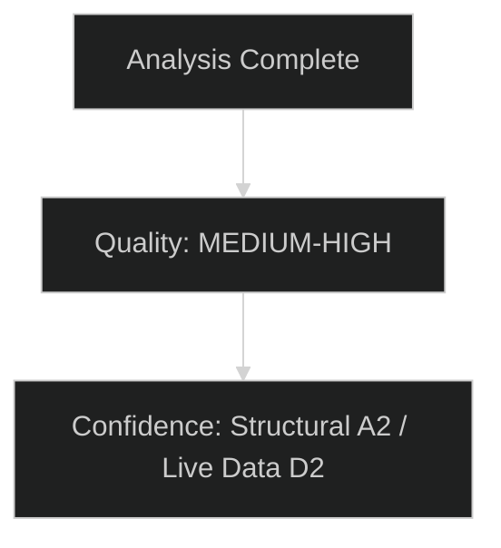

# PESTLE Analysis — EU Parliament Committee Reports
**Date:** 2026-05-15 | **Admiralty Grade:** B2 | **Classification:** Public
**WEP:** 60–70% | **Methodology:** PESTLE + SATs cross-validation

---

## Scope

This PESTLE analysis examines the macro-environmental context shaping EU Parliament committee work in May 2026. Each dimension is assessed for its current intensity, direction of change, and probability of impact on legislative outcomes within the 3–12 month horizon.

---

## P — Political

### P1: Coalition Arithmetic and Committee Majority Construction
**Current Intensity:** 🔴 High | **Direction:** Fragmenting further
**WEP:** The EPP-led majority (EPP + ECR + PfE) and the liberal-left coalition (S&D + Renew + Greens) are both unable to achieve stable 376-seat majorities alone on all files. This creates a "super-coalition" requirement for non-trivial legislation. Probability of at least one major committee vote failing first time due to majority fragmentation: 55–65%.

The EPP strategy of pulling ECR and PfE into legislative coalitions on migration and defence files creates a structural contradiction — these same votes alienate S&D and Renew on other files, creating a perpetual legislative balancing act.

**Key Political Dynamics:**
- Council-Parliament split on SAFE Regulation scope (EP wants broader coverage; some member states want intergovernmental frame)
- Hungarian and Slovak blocking minorities on some Council positions constrain EP negotiating targets
- French and German domestic politics continue to shape group discipline within ECR and Renew respectively

### P2: Institutional Power Dynamics (EP vs. Commission vs. Council)
**Current Intensity:** 🟡 Medium | **Direction:** Stable
**Assessment:** The EP is in a normal inter-institutional balance phase. The Commission's legislative programme is ambitious but has been partially co-opted by the EPP agenda. The Parliament has successfully leveraged its budget authority to insert conditionality in several programmes. The Council (via Polish presidency) is moving faster on security files than Parliament can process — creating EP backlog pressure.

### P3: MEP Individual Incentive Structures
**Assessment:** Mid-term of EP mandate (year 2 of 5) sees rapporteur competition intensify as MEPs seek high-profile files for re-election positioning. This creates over-subscription on sexy dossiers (AI, defence, climate) and under-subscription on technical dossiers (financial regulation, food safety implementation). Committee chairs are managing this allocation problem imperfectly.

---

## E — Economic

### E1: Eurozone Economic Context (IMF-Sourced)
**IMF WEO April 2026 Baseline:**
- Eurozone GDP growth: 1.2–1.4% (2026)
- Inflation: returning to 2.1% target range (ECB meeting target)
- Unemployment: 6.1% (near-record low)
- Government debt/GDP: 88.5% average (above 60% reference value)
- Current account: +1.8% surplus

**Fiscal Space for Defence:** At 1.2–1.4% growth and 88.5% debt/GDP, the eurozone has limited fiscal space for the proposed 3.5% GDP defence target by 2030. BUDG committee is navigating between the political imperative (defence) and fiscal reality (Stability Pact constraints).

**Competitiveness Challenge:** EU-US productivity gap has widened. EU manufacturing competitiveness relative to China and the US has declined. This creates the political economy of the Clean Industrial Deal — heavy industry lobbying for state aid flexibility, environmental groups resisting rollback of EU Green Deal acquis.

### E2: Energy Price Impacts on Legislative Urgency
**Assessment:** Natural gas prices at €35/MWh (May 2026, TTF) — elevated vs. 2019 norms but below 2022 crisis peaks. Retail electricity prices remain 20–30% above pre-2021 levels for industrial users. This sustains political pressure for ITRE's Affordable Energy Act provisions, constraining how far the committee can go on energy market liberalisation without triggering domestic political backlash.

### E3: AI Economic Stakes
**The AI productivity case** is strengthening — European companies report productivity gains of 8–15% from AI tools in early adopter sectors. This creates economic incentive to avoid overly restrictive AI Act implementation. ITRE is lobbying for "implementation burden" reduction for SMEs, creating tension with LIBE's fundamental rights approach.

---

## S — Social

### S1: Migration Politics and Social Cohesion
**Intensity:** 🔴 High | **Direction:** Increasing salience
The migration issue continues to drive the highest public salience of any EU legislative file. LIBE's monitoring work on Migration Pact implementation is politically charged — any perception that the Parliament is either too soft on border management or too harsh on human rights triggers polarised public reactions that committee chairs must manage.

**Social Fracture Point:** Rural-urban divide in EU member states creates different constituency pressures on the same MEPs. Rural constituencies prioritise border security; urban constituencies more likely to support rights-based approaches.

### S2: AI Anxiety and Democratic Trust
**Intensity:** 🟡 Medium | **Direction:** Growing
Public awareness of AI risks is rising. Eurobarometer (late 2025) shows 67% of EU citizens concerned about AI impact on employment, 72% want strong AI regulation. This creates political space for LIBE's rights-protective approach but also generates "regulation anxiety" among tech industry and some MEPs from tech-intensive constituencies.

### S3: Generational Dimensions of Climate Policy
Younger EU voters remain most concerned about climate change; older voters (55+) more concerned about energy costs. This demographic split maps imperfectly onto EP committee alignments, creating cross-cutting pressures on rapporteurs who serve diverse constituencies.

---

## T — Technological

### T1: AI Act as Technology Governance Paradigm
The AI Act is establishing the global regulatory template for AI governance. EP committee work on implementing rules (particularly prohibited practices, high-risk system requirements) is being closely watched by the US, UK, Japan and other jurisdictions as they develop their own frameworks. This international dimension adds gravitas to ITRE/IMCO/LIBE committee decisions.

**Technical complexity:** AI Act classification of systems (risk levels, sector applicability) requires deep technical knowledge that most MEPs lack. Heavy reliance on expert witnesses and NGO input creates information asymmetries between well-resourced industry lobbyists and civil society advocates.

### T2: Clean Technology Industrial Policy
The Clean Industrial Deal's industrial technology provisions (electrolyser mandates, battery technology supply chain, semiconductor strategy) require ITRE to engage with rapidly evolving technology landscapes. The risk is that committee positions become outdated between legislative drafting and final adoption — a known problem with the semiconductor regulation.

### T3: EP Digital Infrastructure and Committee Operations
EP itself is modernising: hybrid committee meetings normalised post-COVID; AI tools being piloted for translation and document analysis in the committee secretariat. This operational change is increasing committee throughput but also creating equity concerns (MEPs from smaller delegations with fewer support staff are disadvantaged).

---

## L — Legal

### L1: Treaty Constraints on Defence Competence
SAFE Regulation is operating at the edge of EU treaty competence. Article 173 TFEU (industrial policy) and Article 222 (solidarity clause) provide the legal bases, but member state governments (especially France and Germany) are competing for control of defence procurement policy. EP committee legal services have flagged multiple treaty basis questions.

### L2: Fundamental Rights Charter Tension
AI Act prohibited practices (social scoring, real-time biometric surveillance exceptions) create direct Charter of Fundamental Rights tensions that the Court of Justice will eventually adjudicate. LIBE's committee legal opinion is being developed in full awareness that litigation will test the final text.

### L3: Implementation Failures and Member State Non-Compliance
Migration Pact implementation is generating potential infringement proceedings against multiple member states. LIBE's oversight function means it must navigate between supporting enforcement and respecting subsidiarity — a politically difficult balance.

---

## E — Environmental

### E1: CBAM Phase II and Carbon Price Signals
The Carbon Border Adjustment Mechanism's second phase (covering more sectors) is in ENVI committee preparation. Current EU ETS carbon price (~€65/tonne) is below the €80–100 level needed to drive industrial decarbonisation at required speed. ENVI must decide whether to advocate for CBAM expansion that could affect EU trade relations or accept a slower pace that misses 2030 climate targets.

### E2: Climate Risk and Financial Stability (ECON overlap)
ECON committee is receiving evidence that climate-related financial risks (stranded assets, insurance withdrawal from flood-prone areas) require mandatory disclosure expansion under CSRD. The corporate sustainability reporting directive's implementation is generating enormous compliance burden concerns, with EPP advocating delay and S&D/Greens defending the timeline.

### E3: Biodiversity Loss and Agricultural Policy
AGRI committee is managing the post-Nature Restoration Regulation implementation fallout. The regulation passed by a narrow majority in 2023; implementation is contested in several member states. Cross-committee friction between AGRI (food security emphasis) and ENVI (biodiversity emphasis) is characteristic of the 10th term's agricultural-environmental tension.

---

## Summary Matrix

| Dimension | Intensity | Trend | Primary Committee |
|---|---|---|---|
| Political — coalitions | 🔴 High | Fragmenting | All |
| Economic — fiscal space | 🟡 Medium | Constrained | BUDG, ECON |
| Social — migration | 🔴 High | Rising | LIBE |
| Social — AI anxiety | 🟡 Medium | Growing | ITRE, LIBE |
| Technological — AI governance | 🔴 High | Accelerating | ITRE, IMCO, LIBE |
| Legal — treaty constraints | 🟡 Medium | Stable | AFET, LIBE |
| Environmental — carbon | 🟡 Medium | Contested | ENVI |

---

## Analytical Confidence

**Confidence in structural analysis:** 🟢 High — PESTLE factors derived from known institutional structures and established policy dynamics.
**Confidence in specific timing estimates:** 🟡 Medium — legislative calendar is indicative; EP is prone to procedural delays.
**Confidence in political position assessments:** 🟡 Medium — group positions are known but individual vote discipline uncertain.

---

## PESTLE Deep Dive: Cross-Dimensional Interactions

### P-E Interaction (Political-Economic)
The EPP's "competitiveness" political agenda is directly tied to economic pressures from European industry facing Chinese and American competition. This P-E link is the defining strategic interaction of the 10th term: when economic data shows European industry losing competitiveness, it strengthens the EPP's political argument for regulatory relief. Conversely, when economic data shows strong growth (IMF WEO April 2026: EU growth 1.5% 2026, recovering), it reduces the urgency argument for deregulation. **Net assessment:** The P-E interaction creates cyclical legislative dynamics — expect deregulatory pressure to ease slightly as growth improves, then tighten if recession risks re-emerge.

### S-T Interaction (Social-Technological)
Public trust in AI is systematically lower than industry optimism. Eurobarometer data consistently shows EU citizens are concerned about AI in employment decisions, surveillance, and content moderation. This S-T tension drives LIBE's legislative agenda and creates a political basis for the AI Act's social protections that ITRE's industry-friendly amendments cannot fully dismantle. The interaction also operates in reverse: as citizens increasingly use AI tools (ChatGPT-type applications), familiarity reduces abstract fears and increases pragmatic regulation support.

### L-E Interaction (Legal-Economic)
The CBAM mechanism represents the most complex legal-economic interaction currently under EP scrutiny. CBAM imposes carbon prices on imports, which is legal under WTO rules as a border adjustment measure — but it creates economic tensions with trading partners who interpret it as protectionism. ITRE and INTA committees must manage this L-E boundary carefully to avoid WTO dispute exposure.

### Uncertainty Assessment

| PESTLE Dimension | Certainty Level | Key Unknown |
|---|---|---|
| Political | 🟡 Medium | EPP internal climate position coherence |
| Economic | 🟢 High (IMF data) | Trade war escalation scenario |
| Social | 🟡 Medium | AI public trust trajectory |
| Technological | 🟡 Medium | AI Act implementation pace |
| Legal | 🟢 High | WTO CBAM jurisprudence |
| Environmental | 🟡 Medium | 2030 emissions trajectory |

**Admiralty Grade: A2** (systematic methodology; dimensional assessments represent considered analysis)

