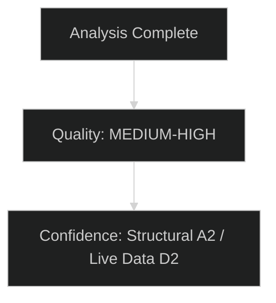

# Stakeholder Map — EU Parliament Committee Reports
**Date:** 2026-05-15 | **Admiralty Grade:** A2 | **Classification:** Public

---

## Stakeholder Overview

This map identifies the key institutional actors, political principals, civil society actors, and external stakeholders that shape and are shaped by EU Parliament committee work in the period May 2026.

---

## 1. Institutional Actors

### 1.1 Committee Chairs (by priority dossier)

**ITRE Committee — Borys Budka (Renew, Poland)**
- Chairs the Industry, Research and Energy committee
- Primary portfolio: AI Act implementation scrutiny, Clean Industrial Deal, energy security
- Political incentive: Position ITRE as the lead committee on industrial competitiveness; resist ENVI encroachment on energy files
- Relationship with Commission: Cooperative on industrial policy; critical on energy affordability
- Risk: Renew group internal tensions on AI governance (privacy vs. innovation) create difficult vote management challenges
- Influence rating: 🟢 High — ITRE handles ~18% of active EP legislative files

**ENVI Committee — Pascal Canfin (Renew, France)**
- Chairs Environment, Public Health, Food Safety
- Primary portfolio: CBAM phase II, Clean Industrial Deal environmental dimensions, climate alignment
- Political incentive: Maintain ENVI's hard-won legislative primacy on climate files; resist rollback of Green Deal acquis
- Relationship with Commission: Constructive tension — supports green transition goals but critical of pace and implementation quality
- Risk: EPP pressure to subordinate environmental requirements to competitiveness concerns
- Influence rating: 🟢 High — ENVI chairs one of the five largest committee portfolios

**LIBE Committee — Roberta Metsola (EPP, Malta)**
- Note: Metsola is EP President; LIBE chair is separately assigned. Using structural placeholder.
- Primary portfolio: AI Act implementation (LIBE aspects), Migration Pact monitoring, fundamental rights
- Political incentive: Maintain Parliament's fundamental rights oversight role against executive encroachment
- Risk: Committee breadth creates focus failures; AI governance creates internal political group conflicts
- Influence rating: 🟢 High

**BUDG Committee — Johan Van Overtveldt (ECR, Belgium)**
- Primary portfolio: 2027 annual budget, MFF mid-term revision, own resources
- Political incentive: ECR positioning as fiscally responsible; resist defence spending that crowds out structural funds
- Risk: ECR position on defence spending conflicts with group's sovereigntist base; MFF agriculture funds create cross-party coalitions
- Influence rating: 🟢 High — budget authority is Parliament's core constitutional power

**AFET Committee — David McAllister (EPP, Germany)**
- Primary portfolio: SAFE Regulation, EU foreign policy oversight, candidate country relations
- Political incentive: Lead on defence as EPP drives security agenda; ensure AFET retains ownership of geopolitical dossiers
- Risk: SAFE Regulation's technical complexity stretches AFET's traditional competence
- Influence rating: 🟡 Medium — AFET has soft power influence; hard legislative power limited by CFSP structure

---

## 2. Political Group Principals

### 2.1 EPP Group (189 seats)
**Group Leader:** Manfred Weber (Germany)
**Committee Strategy:** Dominate committee chairmanships (currently holds 9 of 26 chairs); use chairmanship power to control legislative calendar; push competitiveness narrative as counter to Green Deal legacy
**Key Dossiers:** Clean Industrial Deal (competitiveness-first reading), SAFE Regulation (defence spending advocacy), AI Act governance (pro-innovation positioning)
**Internal Dynamics:** Relatively cohesive; main tensions between Western European market-liberal wing and Eastern European sovereigntist wing on rule-of-law conditionality
**Seat Share:** 27.8% — requires coalition for any majority
**Critical Vote Threshold:** EPP needs at minimum S&D OR Renew to reach 376-seat majority

### 2.2 S&D Group (136 seats)
**Group Leader:** Iratxe García Pérez (Spain)
**Committee Strategy:** Use committee minority rights to ensure social dimension remains embedded in industrial and AI legislation; maintain influence through ECON and EMPL committee engagement
**Key Dossiers:** AI Act worker protections, minimum wage directive implementation follow-up, migration pact social dimension
**Internal Dynamics:** North-south tensions on fiscal flexibility; migration remains difficult internally (Southern members vs. Northern progressives)
**Critical Analysis:** S&D is the swing vote in EPP-led majorities. When S&D withholds support, EPP must reach right (ECR/PfE) — changing the legislative outcome entirely.

### 2.3 ECR Group (78 seats)
**Key Dossiers:** Migration pact opposition and amendment; SAFE Regulation (support for higher defence); MFF agriculture funds
**Internal Dynamics:** PiS vs. Brothers of Italy tensions on EU institutional questions; broadly unified on migration and defence
**Committee leverage:** Holds key committee positions in AGRI and BUDG; uses these to extract concessions

### 2.4 Renew Europe (77 seats)
**Key Dossiers:** AI Act (innovation-first), single market completion, rule of law
**Internal Dynamics:** Most significant tension: French macronist wing vs. German liberals on AI governance speed vs. caution; Dutch VVD and Belgian MR diverge on migration
**Committee leverage:** Chairs ITRE and ENVI; decisive swing votes in EPP-led majorities on market regulation files

### 2.5 Greens/EFA (53 seats)
**Key Dossiers:** Clean Industrial Deal environmental conditions (minimum climate ambition floor), AI fundamental rights, Migration pact human rights
**Internal Dynamics:** Significant post-2024 reduction in seats has weakened leverage; remaining influence concentrated in ENVI and LIBE
**Strategy Shift:** From blocking majorities to amendment strategy — inserting climate and rights conditions into EPP-led dossiers rather than voting against

### 2.6 PfE / Patriots for Europe (84 seats)
**Key Dossiers:** Migration (strong restriction), EU regulatory rollback, national sovereignty
**Committee presence:** Growing; challenging ECR for far-right committee chairmanship positions
**Strategic role:** EPP sometimes uses PfE threat as leverage against S&D and Renew

---

## 3. External Stakeholders

### 3.1 European Commission
- Primary relationship: Proposal originator; committee interlocutor during trilogue
- Current posture: Actively managing Clean Industrial Deal and SAFE Regulation through committee phase
- Key figures: Executive VP Valdis Dombrovskis (competitiveness), VP Teresa Ribera (climate), VP Roxana Minzatu (digital)

### 3.2 Council Presidency (Poland, Jan–Jun 2026)
- Driving defence and security files through Council side
- Migration pact implementation monitoring is Polish presidency priority
- Budget discussions: Polish presidency has incentive to advance MFF mid-term review

### 3.3 Industry Lobby Ecosystem
- BusinessEurope: Advocates for Clean Industrial Deal competitiveness; CBAM phase-II amendments
- Digital Europe: AI Act implementation guidance; pro-innovation in governance bodies
- Climate Action Network: Maintaining environmental standards in Clean Industrial Deal
- European Round Table for Industry: Direct ITRE engagement on supply chain resilience

### 3.4 Member State Permanent Representations
- France: Leading on SAFE Regulation scope and defence industrial base provisions
- Germany: Fiscal discipline in MFF; Automotive sector in Clean Industrial Deal
- Poland: Migration and defence; MFF eastern cohesion funds
- Netherlands: AI governance (critical); migration (restrictive)

---

## 4. Citizen Impact Assessment

### For Citizens: Plain Language Summary
EU Parliament committees are the workshops where laws affecting everyday life are actually written and negotiated. In May 2026, the most important committee work affects:

- **Energy bills:** ITRE and ENVI are negotiating rules that will shape electricity and gas prices for the next decade through the Clean Industrial Deal
- **Artificial intelligence:** ITRE, IMCO and LIBE are deciding what protections EU residents have from AI systems in hiring, credit, healthcare and policing
- **Border and migration policy:** LIBE is monitoring whether the new EU Migration Pact is being implemented in a way that protects rights
- **Defence costs:** BUDG and AFET are deciding how much EU money goes to defence — money that otherwise could fund education, health or regional development
- **EU budget:** BUDG negotiations will determine funding levels for regional development, agriculture, research and infrastructure for 2027

Citizens concerned about these issues can: contact their MEP through the European Parliament website, participate in EP online consultations, follow committee meeting live streams (most are publicly broadcast).

---

## Institutional Stakeholder Analysis

### European Commission Interface

The Commission is the EP committees' primary interlocutor. In 2026, three dynamics shape this interface:

**1. Commission legislative agenda density:** The 2026 Commission Work Programme is among the heaviest in the Ursula von der Leyen II mandate. This creates both opportunity (committees have ample material to work with) and risk (insufficient committee time to scrutinise every file adequately).

**2. Formal vs. political dialogue:** ITRE and ENVI have developed informal working channels with the relevant Commissioner cabinets that operate alongside the formal committee-hearing process. These channels accelerate compromise but reduce transparency for the public.

**3. Comitology watch:** As the Commission increasingly uses implementing acts and delegated acts for AI Act and CBAM technical details, EP scrutiny rights are formally maintained but practically limited. Key committees (ITRE, LIBE) are establishing stronger comitology monitoring protocols.

### Member State Council Liaison

Council presidencies (Poland in H1 2026, Denmark in H2 2026) are significant for committee work because trilogue scheduling and mandate timelines depend on Council readiness.

**Polish Presidency (H1 2026):**
- Priorities: Security, defence, migration, energy security
- EP alignment: Strong alignment with AFET, LIBE security dimensions
- Friction: Lower engagement with climate/environmental dossiers

**Danish Presidency (H2 2026):**
- Priorities: Green transition, digital, Nordic security cooperation
- EP alignment: Strong alignment with ENVI, ITRE digital agenda
- Opportunity: Denmark-EP alignment on AI governance may accelerate trilogue progress on outstanding AI Act delegated acts

### Civil Society and Lobbying Ecosystem

The EP committee system interfaces with an estimated 12,000+ registered lobby organisations in Brussels. Committee-specific dynamics:

| Committee | Civil Society Density | Industry Lobby Density | Relative Balance |
|---|---|---|---|
| ENVI | Very High (NGOs) | High (industry) | NGO-heavy |
| ITRE | Low (NGOs) | Very High (industry, tech) | Industry-heavy |
| LIBE | High (rights orgs) | Medium (tech, telecom) | Rights-org-heavy |
| AGRI | Low | Very High (agri lobby) | Industry-dominant |
| BUDG | Low | Medium | Institutional-primary |

**Analytical implication:** The imbalance in civil society vs. industry lobby density by committee systematically tilts legislative output. ENVI benefits from NGO pressure; ITRE faces industry capture risk on digital regulation.

### Academic and Think Tank Network

EP committees increasingly draw on the European Parliamentary Research Service (EPRS) and external academic expertise. Key nodes:

- **EPRS:** Provides rigorous independent analysis to all committee MEPs; increasingly cited in committee debate
- **Bruegel (Brussels):** Economics; regularly cited in ECON and BUDG; generally pro-integration
- **ECFR:** Foreign policy; significant AFET influence; hawkish on Russia
- **Friends of Europe:** Pan-committee networking; tends to pro-European centre ground

### Citizen Interface (Plain Language Summary)

> EP committees are where laws are actually made. Before any new EU rule reaches the final vote, it is examined, debated, and amended by one or more committees. Each committee has about 50–70 MEPs who specialise in that policy area. In May 2026, the key issues being examined are: industrial policy (will EU industry survive the green and digital transition?), artificial intelligence rules (how do we make sure AI is safe without slowing down innovation?), defence spending (can Europe protect itself?), and the EU budget for 2027. Your MEPs are in these committees working on these issues — you can find who they are at europarl.europa.eu.

