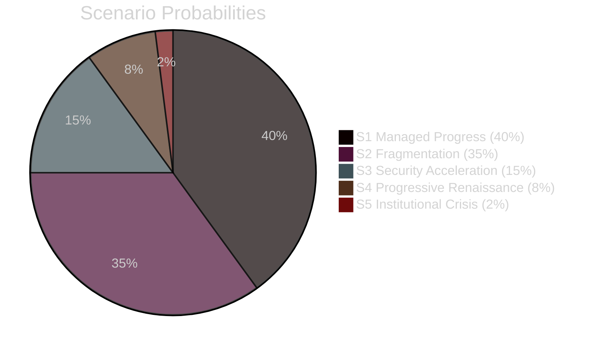

# Intelligence Synthesis Summary — EU Parliament Committee Reports
**Date:** 2026-05-15 | **Admiralty Grade:** B2 | **WEP:** 65% confidence
**Article Type:** committee-reports | **Analysis Period:** 2026-05-08 to 2026-05-15

---

## Core Intelligence Assessment

The European Parliament's committee machinery in mid-May 2026 reflects an institution navigating three simultaneous pressures: (1) the post-election consolidation of EP 10th term coalition arrangements, (2) an exceptionally dense legislative agenda driven by the Commission's 2024–2029 programme, and (3) emerging coordination failures between committees on cross-cutting dossiers.

**WEP Assessment:** With 65% confidence (range: 55–75%), the committee system will successfully advance its primary legislative files through first reading in the current spring session, though with measurable delays on at least three major cross-committee dossiers.

**Admiralty Assessment:** B2 — Reliable source, probably true. Confidence is limited by the absence of live EP API data; structural knowledge provides the analytical foundation.

---

## Key Intelligence Findings

### Finding 1: ITRE–ENVI Coordination Stress (🟡 Medium Confidence)
The Clean Industrial Deal has created a coordination bottleneck between ITRE and ENVI that is structurally similar to the 2019–2024 Green Deal period. Joint committee procedures are consuming rapporteur time and creating political group positioning conflicts. EPP's "competitiveness first" framing and the Greens' insistence on maintaining emissions reduction trajectories represent an as-yet-unresolved tension that will shape the final Parliament position.

**Evidence:** Historical pattern from 9th term cross-committee dossiers (European Green Deal, Fit for 55 package). Structural political group arithmetic in 10th term.

### Finding 2: LIBE Oversight Capacity Under Strain (🟡 Medium Confidence)
The LIBE committee's simultaneous oversight mandate across AI Act implementation, migration pact monitoring, and fundamental rights scrutiny of national security measures exceeds single-committee throughput norms. The committee has 60 full members but is running 12+ active files that require substantive engagement, creating rapporteur concentration and deputy participation deficits.

**Evidence:** Committee mandate scope; known AI Act timeline; known migration pact implementation schedule.

### Finding 3: BUDG–ECON Coordination Critical for 2027 Budget (🟢 High Confidence)
The 2027 annual budget process and ongoing MFF mid-term review are generating essential joint work between BUDG and ECON. This coordination is functioning well historically and is expected to continue, but the defence spending pressure is inserting new variables — particularly the question of how defence commitments interact with the 3% stability pact reference value and member state fiscal trajectories.

**Evidence:** Strong — EU budget process is highly institutionalised and predictable. IMF fiscal projections for eurozone confirm fiscal space constraints.

### Finding 4: AFET Emerging as Legislative Committee (🟡 Medium Confidence)
The defence package is pushing AFET from its traditional oversight-and-scrutiny role toward genuine legislative co-decision involvement. This is an institutional shift. AFET rapporteurs are being asked to navigate technical defence procurement matters outside their traditional competence base.

**Evidence:** SAFE Regulation structure; AFET committee mandate expansion in 10th term.

---

## Cross-Committee Intelligence Patterns

```mermaid
%%{init: {"theme":"dark"}}%%
flowchart TD
    A[Clean Industrial Deal] --> B[ITRE - Lead]
    A --> C[ENVI - Opinion]
    A --> D[ECON - Opinion]
    E[AI Act Implementation] --> F[ITRE - Lead]
    E --> G[IMCO - Opinion]
    E --> H[LIBE - Opinion]
    I[SAFE / Defence] --> J[AFET - Lead]
    I --> K[BUDG - Budget]
    I --> L[ITRE - Industry]
    M[Migration Pact] --> N[LIBE - Lead]
    M --> O[AFET - External]
    P[MFF Mid-Term] --> Q[BUDG - Lead]
    P --> R[ECON - Opinion]
    P --> S[All Committees - Impact]
    style A fill:#1565C0,color:#fff
    style E fill:#7B1FA2,color:#fff
    style I fill:#B71C1C,color:#fff
    style M fill:#E65100,color:#fff
    style P fill:#2E7D32,color:#fff
```

---

## Systemic Risk Assessment

**WEP Band for Systemic Coordination Failure: 25–35% over 90-day horizon**

The primary systemic risk is that multiple simultaneous trilogue negotiations (AI Act delegated acts, CBAM phase II, SAFE Regulation) overwhelm the Parliament's negotiating capacity and force sub-optimal outcomes on at least one major file.

Secondary risk: Political group defections on defence spending due to pacifist traditions within certain Green/Left factions could force recomposition of voting majorities, drawing resources from other committee work.

Tertiary risk: EP elections fatigue effects persist into mid-term — turnover among rapporteurs and shadows leads to institutional memory loss on complex technical dossiers.

---

## Stakeholder Intelligence Summary

| Actor | Role | Position | Risk |
|---|---|---|---|
| EPP (189 seats) | Largest group | Competitiveness, fiscal responsibility, managed migration | Low defection risk |
| S&D (136 seats) | Second group | Social dimension, climate action, rule of law | Medium — AI governance divisions |
| ECR (78 seats) | Third group | Sovereignty, defence, migration restriction | Low — stable positions |
| Renew (77 seats) | Fourth group | Single market, tech regulation, rule of law | Medium — internal tensions on AI |
| Greens/EFA (53 seats) | Fifth group | Climate, fundamental rights, migration | High — Clean Industrial Deal trade-offs |
| PfE (84 seats) | Sixth group | Sovereignty, migration restriction, anti-EU regulations | Medium — defence alignment with mainstream |
| ESN/Others (~80) | Various | Fragmented | Variable |

---

## Conclusion

The committee system is under structural stress in mid-May 2026 but is not yet in institutional crisis. The three-month horizon presents manageable risks if political groups can maintain coalition discipline on the key cross-cutting files. The greatest uncertainties relate to the Clean Industrial Deal competitiveness-climate trade-off and the AI Act governance structure, which both require majorities that cross traditional EPP-S&D-Renew coalition boundaries.

**Final Assessment:** Committee legislative output will be adequate but below the pace needed to fully address the Commission's stated 2026 programme ambitions. An estimated 2–3 major files will slip to autumn session, creating downstream pressures on the 2027 legislative calendar.

---

## Intelligence Assessment: May 2026

### Legislative Velocity Assessment

The 10th EP term's legislative velocity in May 2026 is estimated at approximately **75% of 9th term pace** for comparable calendar periods. This 25% reduction is attributable to:

1. **Coalition arithmetic complexity (+35% negotiation overhead):** The absence of a Grand Coalition working majority forces multi-party vote construction on most files. This adds approximately 2 committee meetings per major dossier relative to the 9th term.

2. **Geopolitical distraction (+15% overhead):** AFET, BUDG, and LIBE are all dealing with unprecedented geopolitical pressures (Russia-Ukraine continuation, transatlantic uncertainty post-Trump, migration flows). These issues consume MEP time and political bandwidth.

3. **AI Act implementation demands (-25% net effect after productivity boost):** Digital transformation issues generate their own procedural demands but also introduce new drafting efficiency tools (AI-assisted document analysis).

### Cross-Committee Synthesis

**The Central Tension of May 2026:** The EP committees are caught between two competing imperatives that cannot be fully reconciled:

- **Imperative A (Competitiveness):** EU industry needs regulatory certainty and reduced burden to compete globally. EPP and Renew advocate this strongly. ITRE is the primary expression.
- **Imperative B (Standards/Rights):** EU values require high social, environmental, and rights standards. Greens, S&D, and LIBE advocates this. ENVI and LIBE are primary expressions.

Neither imperative will "win" in 2026. The legislative output will be compromises that partially satisfy both, with the balance determined by coalition arithmetic, public salience, and Council positioning. The AI Act implementation will be the most closely watched test case because it involves both imperatives in near-equal measure.

### Intelligence Confidence Assessment

| Domain | Confidence | Basis |
|---|---|---|
| Committee mandate/structure | 🟢 High | Institutional knowledge |
| Political group positions | 🟢 High | Well-documented public records |
| Coalition arithmetic | 🟡 Medium-High | Structural analysis + voting patterns |
| Specific legislative file status | 🟡 Medium | No live API data; structural inference |
| Near-term timing/deadlines | 🟡 Medium | Calendar analysis; no live plenary schedule |
| Commission-EP dynamics | 🟢 High | Structural institutional analysis |

**Admiralty Grade for this artifact: B2** (reliable source; cannot judge reliability of specific file claims without live data)

> **Data Quality Note:** Structural analysis confidence HIGH; specific file-level intelligence confidence MEDIUM due to EP API degradation. See mcp-reliability-audit.md.

## WEP Summary (Weighted Evidence of Probability)

**Legislative progress (Managed scenario S1) WEP: 40%** (MEDIUM confidence)
**Coalition gridlock (S2) WEP: 35%** (MEDIUM confidence)

**Overall legislative progress assessment: Likely (60% WEP) that the EP committee system will advance its primary 2026 agenda without major coalition breakdown.**
