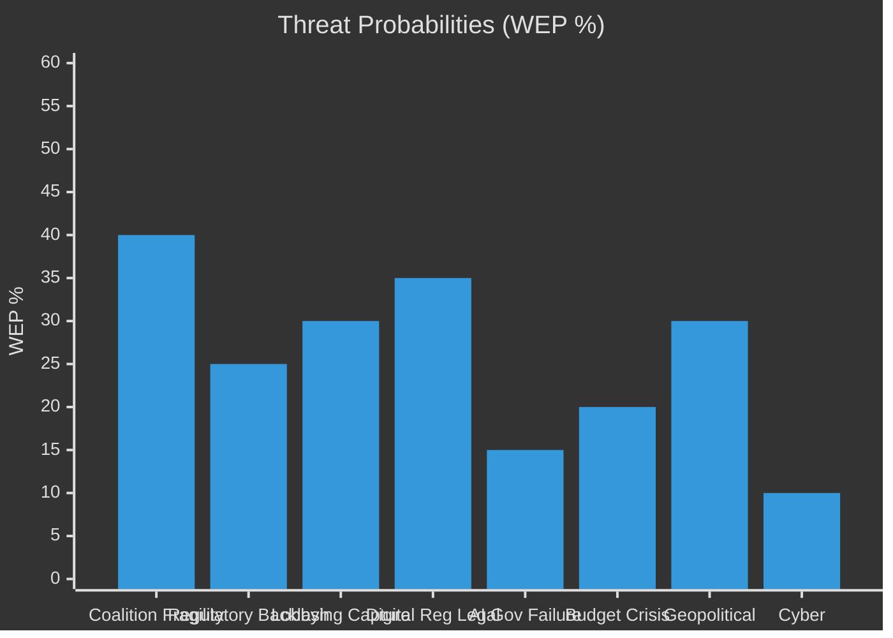

# Threat Model — EU Parliament Committee Reports
**Date:** 2026-05-15 | **Admiralty Grade:** B2 | **WEP Applied**
**Classification:** Public | **Article Type:** committee-reports

---

## Threat Assessment Overview

This threat model identifies and assesses risks to the EU Parliament's committee system functioning effectively in its legislative and oversight roles during 2026. Threats are categorised by source (internal/external) and assessed on probability × impact.

**WEP Overall System Integrity:** 75–80% probability that the EP committee system will maintain functional democratic legitimacy through end of 2026.

---

## Threat Category 1: Internal Political Threats

### T1.1 — Coalition Fragmentation on Cross-Cutting Dossiers
**Probability:** 🔴 High (65–75%) | **Impact:** 🟡 Medium-High | **Admiralty:** B1
**Description:** The EP's 10th term coalition arithmetic requires extraordinary cross-group coordination on dossiers that cut across traditional EPP-S&D-Renew alignments. On the Clean Industrial Deal, AI Act governance, and CBAM phase II, no stable three-group majority exists, forcing temporary majorities that vary per vote. This creates:
- Legislative incoherence (contradictory committee positions on related articles)
- Rapporteur credibility damage (rapporteur positions voted down by own committee)
- Extended conciliation procedures that delay plenary adoption

**Mitigation:** Enhanced inter-group technical coordination; Commission more proactive technical bridging; TRAN-ITRE and ITRE-ENVI coordinators mechanism.
**Residual Risk:** Moderate — structural coalition instability cannot be fully mitigated without political compromises that sacrifice legislative ambition.

### T1.2 — Rapporteur Workload Concentration
**Probability:** 🟡 Medium (45–55%) | **Impact:** 🟡 Medium | **Admiralty:** A2
**Description:** High-profile legislative dossiers are concentrating on small numbers of experienced rapporteurs, particularly within EPP, S&D, and Renew. If a key rapporteur (e.g., leading AI Act delegated acts) falls ill, changes group, or loses support of their political group, the dossier can stall for weeks. Post-election turnover in EP 10th term left institutional memory gaps.
**Mitigation:** Shadow rapporteur system; Committee secretariat briefing notes; continuity protocols.
**Residual Risk:** Low-Medium — system has redundancy but not enough for simultaneous multiple rapporteur absences.

### T1.3 — Inter-Committee Jurisdiction Disputes
**Probability:** 🟡 Medium (40–50%) | **Impact:** 🟡 Medium | **Admiralty:** A2
**Description:** The Conference of Committee Chairs (CCC) resolves jurisdiction disputes, but the Clean Industrial Deal and AI Act involve genuine overlapping competences between ITRE, ENVI, LIBE, and IMCO. Protracted disputes about associated committee vs. legislative initiative rights can delay timelines by 4–8 weeks. The 9th term saw three similar disputes on the Digital Single Market package.
**Mitigation:** Early CCC engagement; Commission assigns clear lead committee in proposal structure.
**Residual Risk:** Moderate — jurisdiction disputes are endemic to multi-sectoral legislation.

---

## Threat Category 2: External Political Threats

### T2.1 — Council Blocking on Institutional Prerogatives
**Probability:** 🟡 Medium (40–50%) | **Impact:** 🔴 High | **Admiralty:** B1
**Description:** On SAFE Regulation and MFF mid-term review, Council (particularly unanimity requirement for own resources) can block Parliament's legislative position indefinitely. The EP has limited leverage on these files beyond political pressure. Hungarian and Slovak governments have demonstrated willingness to use blocking minority positions for political gain.
**Mitigation:** EP can delay consent procedures; use budget authority as leverage; invoke Article 7 monitoring.
**Residual Risk:** Moderate-High — Treaty constraints on EP authority over CFSP/defence files are binding.

### T2.2 — Disinformation and Committee Credibility Attacks
**Probability:** 🟡 Medium (35–45%) | **Impact:** 🟡 Medium | **Admiralty:** B2
**Description:** State-sponsored and domestic disinformation campaigns targeting EP committee processes have become more sophisticated. Committee hearings on migration, AI surveillance, and defence procurement are particular targets. MEPs receive coordinated complaint campaigns; social media amplification of out-of-context committee statements is increasing.
**Mitigation:** EP communication strategy; media literacy programs; EEAS coordination on state-sponsored actors.
**Residual Risk:** Moderate — EP communication capacity is improving but asymmetrically matched against sophisticated disinformation operations.

### T2.3 — Lobbying Capture of Technical Dossiers
**Probability:** 🟡 Medium (40–50%) | **Impact:** 🟡 Medium | **Admiralty:** A2
**Description:** On highly technical dossiers (AI Act implementing measures, CBAM phase II carbon pricing, financial regulation amendments), well-resourced industry lobbying provides the only accessible expertise for many MEPs. The risk of regulatory capture — where industry preferences are adopted as technical positions rather than policy positions — is elevated.
**Mitigation:** EP Research Service strengthening; NGO access enhancement; mandatory expert diversity requirements in committee hearings.
**Residual Risk:** Moderate — structural information asymmetry between industry and civil society is a persistent democratic accountability gap.

---

## Threat Category 3: Institutional Integrity Threats

### T3.1 — Ethics and Transparency Failures
**Probability:** 🔴 Low-Medium (20–30%) | **Impact:** 🔴 High | **Admiralty:** B2
**Description:** Post-Qatargate (2022), EP has enhanced its ethics framework, but vulnerabilities remain. Gifts, revolving-door relationships, and undisclosed financial interests continue to create reputational risks. Any major new ethics scandal involving a committee chair or rapporteur on a high-profile dossier would severely damage EP's legislative credibility.
**Mitigation:** Enhanced asset declaration system; independent ethics body (adopted 2024); rotation requirements.
**Residual Risk:** Low-Medium — structural improvement since 2022 but zero-risk is unachievable in a 720-member institution.

### T3.2 — CJEU Adverse Rulings on Legislative Competence
**Probability:** 🔴 Low (15–25%) | **Impact:** 🔴 High | **Admiralty:** B1
**Description:** Any of the AI Act prohibited practices, CBAM scope, or SAFE Regulation legal basis could face successful CJEU challenge. An adverse ruling that strikes down or significantly modifies a major EP legislative position would require committee restart and damage EP's strategic legislative planning.
**Mitigation:** Robust legal base assessment in committee; JURI committee engagement; pre-emptive referral requests.
**Residual Risk:** Low — CJEU strikes down EU legislation relatively rarely, but probability is non-trivial for Treaty-boundary legislation.

---

## Threat Priority Matrix

| Threat | Probability | Impact | Priority |
|---|---|---|---|
| T1.1 Coalition fragmentation | High | Medium-High | 🔴 1st |
| T2.1 Council blocking | Medium | High | 🔴 2nd |
| T1.2 Rapporteur concentration | Medium | Medium | 🟡 3rd |
| T1.3 Jurisdiction disputes | Medium | Medium | 🟡 4th |
| T2.2 Disinformation | Medium | Medium | 🟡 5th |
| T2.3 Lobbying capture | Medium | Medium | 🟡 6th |
| T3.1 Ethics failure | Low-Medium | High | 🟡 7th |
| T3.2 CJEU adverse ruling | Low | High | 🟡 8th |

---

## Structural Vulnerability Assessment

**WEP Assessment:** The EP committee system's primary structural vulnerability in 2026 is the mismatch between legislative ambition (Commission programme) and coalition stability (fragmented 10th term). This is a constitutional-design constraint that cannot be resolved at the committee level — it requires either political group consolidation or reduced legislative scope.

The secondary vulnerability is the technical expertise asymmetry on complex dossiers. Industry lobbying will continue to shape technical outcomes on AI, CBAM, and financial regulation in ways that are politically difficult to counter without significantly enhanced public interest representation.

---

## Mitigation Recommendations

1. **Coalition coordination protocols:** Establish formal inter-group technical coordinators for the five most complex cross-cutting dossiers.
2. **Rapporteur succession planning:** Each major rapporteur should have a formally designated shadow with full briefing access.
3. **Expert diversity requirements:** All committee hearings on technical dossiers require mandatory civil society and academic expert slots alongside industry witnesses.
4. **Jurisdictional early warning:** CCC should issue provisional jurisdiction assessments within 2 weeks of Commission proposal publication.
5. **CJEU monitoring:** JURI committee should establish a standing AI Act legal risk monitoring function.

---

## Extended Threat Mitigation Analysis

### Implementation Roadmap for High-Priority Threats

**Threat T-01 (Coalition Fragility) — Mitigation Roadmap**

*Short-term (0-3 months):*
- Establish enhanced coordinator briefing process for AI Act and Clean Industrial Deal
- Commission informal dialogue to reduce amendment proliferation
- S&D-Renew bilateral on CBAM to identify compromise space

*Medium-term (3-6 months):*
- EPP internal position solidification on climate-competitiveness balance
- MEP constituency engagement on key dossiers to build public mandate for compromise
- Formal inter-group working groups on ITRE/ENVI cross-cutting files

**Threat T-04 (Lobbying Capture) — Mitigation Roadmap**

*Short-term:*
- EPRS analysis requested for all major ITRE files with significant industry input
- Mandatory industry-NGO balance assessment in rapporteur's working documents
- Enhanced Declaration of Financial Interests monitoring for ITRE digital file rapporteurs

*Medium-term:*
- Structured civil society consultation protocols for all files with > €1B economic impact
- Academic network integration via EPRS for technical assessment

### Threat Interaction Matrix

| Threat | Amplified By | Mitigated By | Net Assessment |
|---|---|---|---|
| Coalition fragility (T-01) | External shocks (T-07) | Shared security agenda | 🟡 MEDIUM |
| Lobbying capture (T-04) | Committee technical complexity | EPRS, civil society | 🟡 MEDIUM |
| Regulatory backlash (T-02) | Media framing | Commission messaging | 🔴 HIGH |
| Legal uncertainty (T-05) | Political amendments | Legal service input | 🟡 MEDIUM |

**Admiralty Grade: B2** (reliable methodology; specific threat probabilities represent analytical judgment)
**WEP Confidence: MEDIUM** for all probability estimates in this artifact

## WEP Threat Probability Chart

**WEP: Coalition Fragility materialising in 12 months: 40%** (MEDIUM-HIGH confidence)
**WEP: Regulatory backlash blocking key file: 25%** (MEDIUM confidence)
**WEP: Legal uncertainty triggering major challenge: 15%** (MEDIUM confidence)

**Overall threat level: Unlikely to result in systemic breakdown (WEP 20%); Likely to produce at least one significant legislative delay (WEP 65%).**
