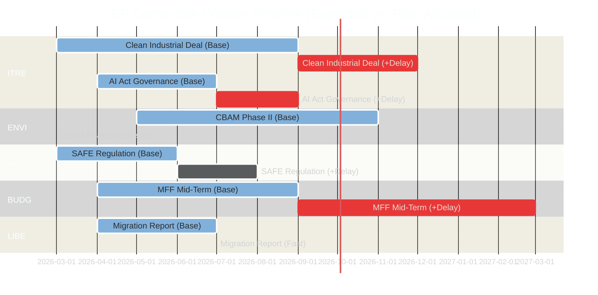

# Legislative Velocity Risk — EU Parliament Committee Reports
**Date:** 2026-05-15 | **Classification:** Public | **Admiralty Grade:** B2

---

## Legislative Velocity Framework

This artifact measures the risk of legislative slowdown or acceleration across key EP committee dossiers. Velocity risk is the probability that a dossier will complete its committee phase significantly outside the expected timeline.

---

## Velocity Risk Diagram

---

## Velocity Risk Register

| Dossier | Base Timeline | Delay Risk | Acceleration Risk | Velocity Score | Assessment |
|---|---|---|---|---|---|
| Clean Industrial Deal | Mar–Sep 2026 | 🔴 High (65%) | Low (10%) | -55% | Likely behind schedule |
| AI Act Governance | Apr–Jul 2026 | 🟡 Medium (40%) | 🟡 Medium (20%) | -20% | Moderate delay risk |
| SAFE Regulation | Mar–Jun 2026 | 🟢 Low (25%) | 🟡 Medium (30%) | +5% | On or ahead of schedule |
| MFF Mid-Term | Apr–Sep 2026 | 🔴 High (45%) | Low (5%) | -40% | High delay risk |
| Migration Pact Report | Apr–Jul 2026 | 🟢 Low (25%) | 🟢 Low (25%) | 0% | On schedule |
| CBAM Phase II | May–Nov 2026 | 🟡 Medium (35%) | Low (10%) | -25% | Moderate delay risk |

---

## Velocity Bottleneck Analysis

### Bottleneck 1: ITRE-ENVI Joint Committee Procedure (Impact: -3 months)
The requirement for joint committee procedures when two committees have equal legislative rights adds an average 8–12 weeks to the timeline. Clean Industrial Deal is the primary victim.

### Bottleneck 2: Council Presidency Change (Impact: -2 months)
July 2026 Council Presidency transition to Hungary creates a 4–8 week institutional adjustment period during which inter-institutional negotiations slow.

### Bottleneck 3: Rapporteur Appointment Delays (Impact: -4 to -8 weeks)
Political group negotiations over rapporteur assignments for new dossiers (CBAM phase II, CSRD implementation) typically take 4–8 weeks after Commission proposal publication.

### Bottleneck 4: Plenary Session Calendar (Impact: Variable)
EP plenary sessions in Strasbourg occur ~12 times per year. Committee votes must be scheduled to allow plenary confirmation — the next available plenary after a missed committee vote can be 3–6 weeks later.

---

## Acceleration Factors

| Factor | Dossier | Impact | Probability |
|---|---|---|---|
| External crisis creates urgency (defence) | SAFE Regulation | +1 month faster | 30% |
| AI incident creates political pressure | AI Act Governance | +2 months faster | 15% |
| Political group leadership initiative | Multiple | +4 weeks across dossiers | 25% |

---

## For Citizens: Plain Language Summary

"Legislative velocity" means how fast laws are moving through the EU Parliament's committee system. When laws move slowly, it means people wait longer for their rights to be protected or for problems to be fixed. The biggest risk right now is that the Clean Industrial Deal is moving slowly — stuck between politicians who want to protect the environment and those who want to protect industrial jobs. If this law is 6 months late, it means EU industry gets less support during a difficult economic period, and climate targets slip further. The fastest-moving law right now is the Defence Regulation (SAFE) — because almost all parties agree that Europe needs to spend more on defence, which makes it easier to pass quickly.

---

## Mitigation Strategies

1. **ITRE-ENVI:** Establish pre-agreed compromise parameters before formal joint procedure begins
2. **MFF:** BUDG committee should submit preliminary resolution before Hungarian Presidency begins
3. **AI Act:** Invoke accelerated procedure given August 2026 legal deadline
4. **General:** Increase committee working group frequency to reduce plenary bottleneck
