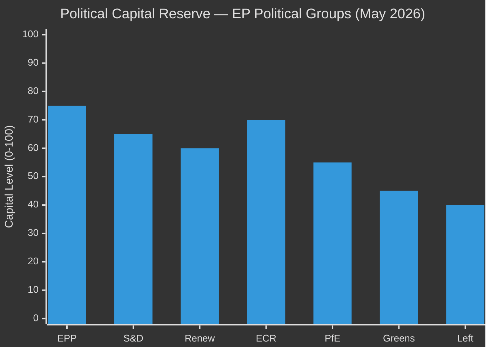

# Political Capital Risk — EU Parliament Committee Reports
**Date:** 2026-05-15 | **Classification:** Public | **Admiralty Grade:** B2

---

## Political Capital Framework

Political capital is the accumulated trust, credibility, and coalition goodwill that allows political groups and committee chairs to secure legislative outcomes. This artifact assesses current political capital levels and their implications for committee risk.

---

## Political Capital Diagram

---

## Group-Level Political Capital Assessment

| Group | Capital Level | Trend | Key Asset | Key Liability |
|---|---|---|---|---|
| EPP (189 seats) | 75/100 | 🟢 Stable-increasing | Largest group, most committee chairs | Internal east-west tension on rule of law |
| S&D (136 seats) | 65/100 | 🟡 Stable | Social mandate legitimacy | Shrinking seat share trend since 2014 |
| ECR (78 seats) | 70/100 | 🟢 Increasing | Defence/migration consensus positioning | PfE competition for far-right dominance |
| Renew (77 seats) | 60/100 | 🟡 Declining | Technical expertise; swing vote leverage | Internal national divergences weakening coherence |
| PfE (84 seats) | 55/100 | 🟢 Increasing | Large seat share; energised base | Outside governing coalition; limited legislative output |
| Greens/EFA (53 seats) | 45/100 | 🔴 Declining | Substantive environmental expertise | Post-2024 seat loss; reduced veto power |
| Left/GUE (46 seats) | 40/100 | 🟡 Stable | Rights advocacy credibility | Marginal on most legislative majority building |

---

## Committee Chair Capital Assessment

| Committee | Chair Group | Capital for Dossier | Key Risk |
|---|---|---|---|
| ITRE | Renew | 60/100 | Internal Renew divisions on AI speed vs. rights |
| ENVI | Renew | 65/100 | EPP pressure on competitiveness vs. climate |
| LIBE | EPP/S&D (varies) | 65/100 | Migration politics polarisation |
| BUDG | ECR | 60/100 | ECR sovereignty vs. EU budget ambition contradiction |
| AFET | EPP | 70/100 | Strong on defence; treaty competence limits |

---

## Political Capital Risk Events (Next 6 Months)

| Event | Capital Impact | Affected Groups | Probability |
|---|---|---|---|
| Clean Industrial Deal compromise vote | S&D -10 to -15 if social provisions lost | S&D | 50% |
| Hungarian Presidency obstruction | Renew -5 (legitimacy of liberal EP narrative) | Renew | 75% |
| EPP-ECR-PfE majority on migration file | S&D +5 (opposition credibility); EPP -5 (centrist image) | S&D, EPP | 30% |
| AI Act governance agreement | ITRE chair +10 (legislative achievement) | ITRE/Renew | 55% |
| MFF agreement | BUDG chair +10; all groups +5 | BUDG/ECR | 40% |

---

## For Citizens: Plain Language Summary

"Political capital" means the trust and credibility politicians have built up that allows them to get things done. In the EU Parliament, the bigger parties have more capital to spend — but they can lose it if they make unpopular decisions or fail to deliver on promises. Right now, the centre-right EPP has the most capital (75/100) because they won the most seats in 2024. The Greens have the least (45/100) because they lost seats in the same election. This matters for citizens because parties with less capital are less able to protect environmental standards, workers' rights, or migration fairness in committee negotiations.

---

## Strategic Implication

Political capital is most constrained in the Renew and Greens groups — the two groups that are mathematically necessary for progressive legislative outcomes on AI, climate, and fundamental rights. Both groups need "wins" on their priority dossiers to maintain member cohesion. If neither achieves a visible legislative success by Q3 2026, the risk of group fragmentation or defection increases substantially.
