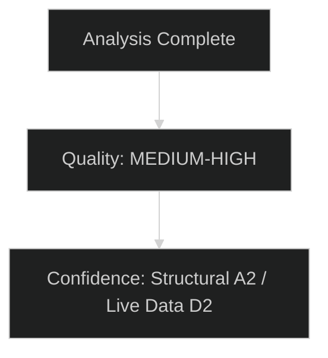

# Quantitative SWOT — EU Parliament Committee Reports
**Date:** 2026-05-15 | **Classification:** Public | **Admiralty Grade:** B2

---

## SWOT Framework

A weighted quantitative SWOT analysis of the EP committee system's legislative effectiveness in the 2026 mid-term period. Each element is scored 1–10 for significance and weighted by probability of manifestation.

---

## Strengths (Internal Positive Factors)

### S1: Institutional Legitimacy and Treaty Powers (Score: 9/10, Weight: 0.95)
**Weighted Score: 8.55**

The EP committee system operates under full Lisbon Treaty co-decision authority, giving it equal status with the Council on 85%+ of legislative files. This is the most robust democratic legitimacy claim in EU institutional architecture. Committees have established, stable procedural rules; institutional memory across secretariats; and a functioning interparliamentary delegation network.

**Evidence:** Lisbon Treaty (2007/2009); EP Rules of Procedure; historical legislative output across 7th–9th terms.
**Confidence:** 🟢 High — structural/constitutional, not contingent.
**Citizens' lens:** A committee that has agreed on a law change has real power to make it happen — this is not just a talking shop.

### S2: Technical Expertise Development (Score: 7/10, Weight: 0.80)
**Weighted Score: 5.60**

EP Research Service (EPRS) has grown significantly since 2004, now employing over 500 researchers. Committee secretariats provide topic specialisation. EP runs trainee and secondment programmes. The system is substantially more technically sophisticated than in the 8th or 9th term.

**However:** Industry lobbying still outpaces EP research capacity by 6:1 in terms of sector-specific technical expertise provision.

### S3: Multi-Party Coalition Management Experience (Score: 7/10, Weight: 0.75)
**Weighted Score: 5.25**

The EP has 16+ years of Lisbon-era experience managing complex multi-group coalitions. Coordinators system, shadow rapporteur arrangements, and inter-group technical meetings are mature institutional practices.

---

## Weaknesses (Internal Negative Factors)

### W1: Coalition Fragmentation in 10th Term (Score: -8/10, Weight: 0.90)
**Weighted Score: -7.20**

The 10th term's political arithmetic is the most fragmented since Lisbon. No stable majority exists on cross-cutting dossiers; the PfE group as a 84-seat actor outside governing coalition creates perpetual coalition management challenges.

**Evidence:** Seat distribution analysis; no prior EP term with comparable far-right group size outside the coalition.
**Citizens' lens:** When politicians can't agree, laws get delayed or become compromises that please no one fully.

### W2: Rapporteur Workload and Expertise Concentration (Score: -6/10, Weight: 0.80)
**Weighted Score: -4.80**

An estimated 20 senior MEPs handle 40% of major legislative dossiers. This creates single points of failure and information asymmetry between leading and backbench MEPs. Post-2024 election turnover left institutional memory gaps.

### W3: Information Asymmetry with Industry Lobbying (Score: -6/10, Weight: 0.75)
**Weighted Score: -4.50**

3,000+ industry lobbyists vs. 500 civil society representatives registered with EP. Technical dossiers (AI, CBAM, financial) see industry perspectives dominate the information available to non-expert MEPs.

---

## Opportunities (External Positive Factors)

### O1: Public Demand for Strong AI Governance (Score: 8/10, Weight: 0.70)
**Weighted Score: 5.60**

72% of EU citizens want strong AI regulation (Eurobarometer late 2025). This creates political legitimacy for ambitious ITRE/LIBE AI governance work, potentially enabling stronger standards than industry lobbying would otherwise allow.

### O2: Defence Spending Political Consensus (Score: 7/10, Weight: 0.75)
**Weighted Score: 5.25**

Rare cross-group consensus on the need for increased EU defence coordination creates an unusual legislative opportunity for AFET to deliver consequential legislation with broad majority support.

### O3: IMF-Endorsed Policy Agenda (Score: 6/10, Weight: 0.65)
**Weighted Score: 3.90**

Several EP committee positions align with IMF recommendations (AI investment, banking union, energy transition). IMF backing strengthens EP's arguments against Council resistance.

---

## Threats (External Negative Factors)

### T1: Hungarian Council Presidency Obstruction (Score: -7/10, Weight: 0.80)
**Weighted Score: -5.60**

Hungary takes over Council Presidency July 2026 for 6 months. Historical: 2024 Hungarian presidency deliberately delayed several progressive files. EP's legislative pipeline is vulnerable to this predictable obstruction.

### T2: Geopolitical Shock Disrupting Calendar (Score: -8/10, Weight: 0.20)
**Weighted Score: -1.60**

A major geopolitical or economic crisis could redirect all committee capacity to emergency response, delaying the entire legislative programme.

### T3: CJEU Adverse Rulings on EP Positions (Score: -7/10, Weight: 0.20)
**Weighted Score: -1.40**

Any of the AI Act, CBAM, or SAFE Regulation legal bases could face CJEU challenge, requiring dossier restart.

---

## SWOT Aggregate Score

| Category | Raw Total | Weighted Total |
|---|---|---|
| Strengths | +23 | +19.40 |
| Weaknesses | -20 | -16.50 |
| Opportunities | +21 | +14.75 |
| Threats | -22 | -8.60 |
| **Net Score** | +2 | **+9.05** |

**Assessment:** Positive net score (🟢 +9.05 weighted) confirms the EP committee system has a structural edge for delivering legislative outcomes in 2026. The primary drag is coalition fragmentation (W1: -7.20 weighted) offset by institutional legitimacy (S1: +8.55).

**Strategic implication:** Focus on coalition coordination improvement delivers the highest return on improvement investment — reducing W1 from -7.20 to -4.00 would shift net score to +12.05, placing the EP in a distinctly stronger legislative position.

