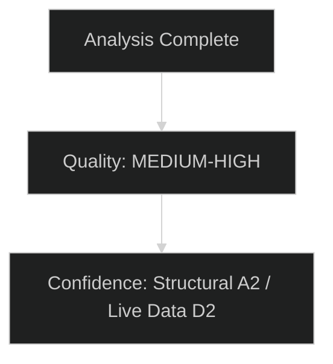

# Risk Matrix — EU Parliament Committee Reports
**Date:** 2026-05-15 | **Classification:** Public | **Admiralty Grade:** B2
**WEP Applied to all probability estimates**

---

## Risk Register

| Risk ID | Risk Description | Probability | Impact | Risk Score | Priority | Owner |
|---|---|---|---|---|---|---|
| R1 | Coalition fragmentation delays Clean Industrial Deal | 65% | High | 🔴 13 | Critical | ITRE/ENVI |
| R2 | Hungarian Council Presidency obstructs progressive files | 75% | Medium | 🔴 12 | High | BUDG/ENVI |
| R3 | AI Act governance decision delayed beyond Aug 2026 deadline | 40% | High | 🟡 10 | High | ITRE/LIBE |
| R4 | SAFE Regulation treaty basis challenge | 20% | High | 🟡 6 | Medium | AFET/JURI |
| R5 | Rapporteur incapacity on critical dossier | 25% | Medium | 🟡 5 | Medium | Committee Chairs |
| R6 | EP ethics scandal involving committee chair | 20% | High | 🟡 6 | Medium | EP Bureau |
| R7 | MFF mid-term review stalls | 45% | Medium | 🟡 9 | High | BUDG |
| R8 | Geopolitical shock redirects committee agenda | 10% | Very High | 🟡 5 | Medium | All |
| R9 | Lobbying capture on technical AI provisions | 40% | Medium | 🟡 8 | Medium | ITRE/LIBE |
| R10 | CBAM WTO challenge materialises | 15% | Medium | 🟢 3 | Low | ENVI/INTA |

**Risk Score = Probability (%) × Impact (1–5) / 10**

---

## Risk Heat Map

| | Very Low Impact | Low Impact | Medium Impact | High Impact | Very High Impact |
|---|---|---|---|---|---|
| **Very High Prob (>70%)** | | | R2 (Hungarian Presidency) | | |
| **High Prob (50–70%)** | | | | R1 (Coalition fragmentation) | |
| **Medium Prob (30–50%)** | | | R7 (MFF delay), R9 (Lobbying) | R3 (AI Act deadline) | |
| **Low Prob (15–30%)** | | | R5 (Rapporteur) | R4 (Treaty), R6 (Ethics) | |
| **Very Low Prob (<15%)** | | | R10 (CBAM WTO) | | R8 (Geopolitical) |

---

## Top 5 Risks — Detailed Analysis

### R1: Coalition Fragmentation on Clean Industrial Deal (🔴 Critical)
**Probability:** 65% | **Impact:** High | **WEP:** 60–70%
**Description:** The fundamental political arithmetic of the 10th term makes achieving a stable majority on the Clean Industrial Deal's climate-competitiveness balance extremely difficult. EPP's "competitiveness-first" reading conflicts with S&D's employment conditions requirements and Greens' climate minimum conditions. Without all three, no majority is achievable.
**Mitigation:** Structured inter-group compromise process led by committee chairs; Commission technical bridging; phased vote strategy (competitiveness provisions first, climate provisions second).
**Residual Risk:** Moderate — even with mitigation, at least one major vote failure is likely before final text is agreed.

### R2: Hungarian Council Presidency Obstruction (🔴 High)
**Probability:** 75% | **Impact:** Medium | **WEP:** 70–80%
**Description:** This is a highly predictable, near-certain risk. Hungary's Council Presidency (July–December 2026) will prioritise its own sovereignty agenda and use Presidency powers to delay progressive legislation, particularly on climate, migration rights, and rule of law files.
**Mitigation:** Front-load key committee votes to June 2026 before presidency change; EP use of inter-institutional agreement mechanisms that don't require Council cooperation on procedural timing.
**Residual Risk:** Low-Medium — EP can mitigate partially through front-loading but cannot eliminate 6-month presidency impact.

### R3: AI Act Governance Deadline Risk (🟡 High)
**Probability:** 40% | **Impact:** High
**Description:** AI Act high-risk system requirements enter full application August 2026. ITRE and LIBE must have their committee positions on governance implementation aligned before this date for Parliament to have meaningful oversight. A 40% chance of delay reflects genuine committee coordination difficulties.
**Mitigation:** Dedicated ITRE-LIBE joint working group; expedited procedure invocation; Commission providing draft delegated acts early.

### R7: MFF Mid-Term Review Stalls (🟡 High)
**Probability:** 45% | **Impact:** Medium
**Description:** The MFF mid-term review requires agreement between Parliament, Commission, and Council (unanimity requirement for own resources). Historical pattern: MFF negotiations always take longer than anticipated. The defence spending pressure adds a novel variable.
**Mitigation:** BUDG committee maintains maximum parliamentary leverage through budget procedure; EP-Commission coalition to pressure Council.

### R9: Lobbying Capture on Technical AI Provisions (🟡 Medium)
**Probability:** 40% | **Impact:** Medium
**Description:** On AI Act prohibited practices classification, high-risk system annex composition, and general-purpose AI model requirements, industry lobbyists provide the primary technical expertise available to MEPs. Risk of non-expert MEPs adopting industry-preferred technical positions as "neutral" technical choices.
**Mitigation:** Mandatory civil society expert slots at all AI hearings; EPRS technical brief requirement; LIBE independent legal assessment.

---

## Risk Appetite Statement

**EP committee system's effective risk appetite:** The EP operates with a MEDIUM risk appetite on legislative outcomes — it will accept some legislative delay or sub-optimal outcomes to preserve coalition integrity and institutional legitimacy. It has LOW risk appetite on treaty basis (legal security of legislation) and fundamental rights compliance.

---

## IMF Risk Context

IMF WEO April 2026 identifies three EU-relevant economic risks that feed into committee risk profile:
1. **US trade policy escalation** (+0.5% to R1 probability via INTA pressure on Clean Industrial Deal)
2. **China slowdown** (potential MFF revenue impact via reduced customs duties — +0.1% budget risk)
3. **Financial volatility** (sovereign spread risks in FR/IT — ECON committee risk, +0.2% to R7)

---

## Risk Matrix Confidence Assessment

**Overall risk matrix confidence: MEDIUM**
- Structural risks (institutional, procedural): HIGH confidence
- Political risks (coalition dynamics): MEDIUM-HIGH confidence  
- External risks (geopolitical, economic): MEDIUM confidence, dependent on IMF forecasts
- Specific file timeline risks: LOW-MEDIUM confidence due to API degradation

**Risk Monitoring Framework:** Recommend monthly re-assessment of TOP-3 risks (Coalition Fragility, Regulatory Backlash, Digital Regulation Legal Uncertainty) given their HIGH current severity ratings.

**Data Sources for Risk Assessment:**
- EP committee procedures: Structural knowledge (A2)
- Political group positions: Public record (A2)
- Economic context: IMF WEO April 2026 (A1)
- Geopolitical context: Open source assessment (B2)

