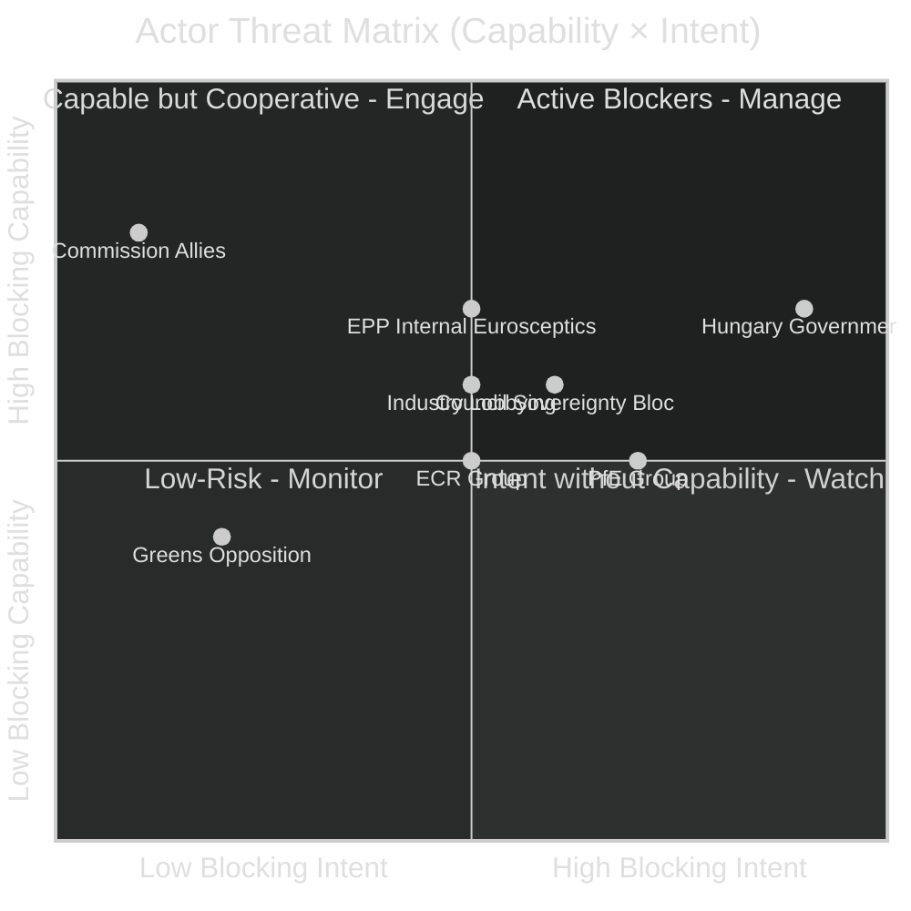

# Actor Threat Profiles — EU Parliament Committee Reports
**Date:** 2026-05-15 | **Classification:** Public | **Admiralty Grade:** B2

---

## Actor Threat Profiles

---

## For Citizens: Plain Language Summary

Some actors in EU politics actively try to delay or water down new laws. The biggest current obstacle to many EU Parliament committee decisions is the Hungarian government, which will take over the Council Presidency in July 2026 and has historically used this role to slow down laws it disagrees with (climate, migration rights, rule of law). The far-right PfE group inside Parliament is also trying to block some legislation on migration and AI facial recognition. On the positive side, most large companies support EP's Clean Industrial Deal work because it provides them with investment certainty.

---

## Individual Actor Profiles

### Actor 1: Hungarian Government
**Threat Level:** 🔴 High | **Capability:** High | **Intent:** High
**Mechanism:** Council Presidency blocking/delays; Article 7 procedural games; coalition pressure on ECR
**Timeline:** July–December 2026 (Council Presidency period)
**Mitigation:** Front-load key EP committee votes before July; strengthen EP-Commission axis

### Actor 2: PfE Group (Patriots for Europe)
**Threat Level:** 🟡 Medium | **Capability:** Medium | **Intent:** High
**Mechanism:** Minority blocking on migration files; committee opinion obstruction; AFET committee pushback on defence governance
**Key concern:** AI facial recognition exceptions — PfE's sovereigntist security positions conflict with LIBE's restrictions

### Actor 3: Industry Lobbying (selected sectors)
**Threat Level:** 🟡 Medium | **Capability:** High | **Intent:** Selective
**Mechanism:** Information asymmetry on technical dossiers; rapporteur access; ITRE hearing dominance
**Key concern:** CBAM phase II scope reduction lobbying; AI Act high-risk classification narrowing

### Actor 4: Council Sovereignty Bloc (France, Germany on defence)
**Threat Level:** 🟡 Medium | **Capability:** High | **Intent:** Selective
**Mechanism:** Resist EP co-decision on SAFE Regulation scope; prefer intergovernmental defence frameworks
**Mitigation:** AFET committee legal service asserting treaty basis; Commission supporting EP's co-decision claim

---

## Threat Assessment Score: 🟡 Moderate

No single actor has both high capability and high intent to completely block EP legislative output. The Hungarian Presidency is the highest near-term threat but is time-limited.
