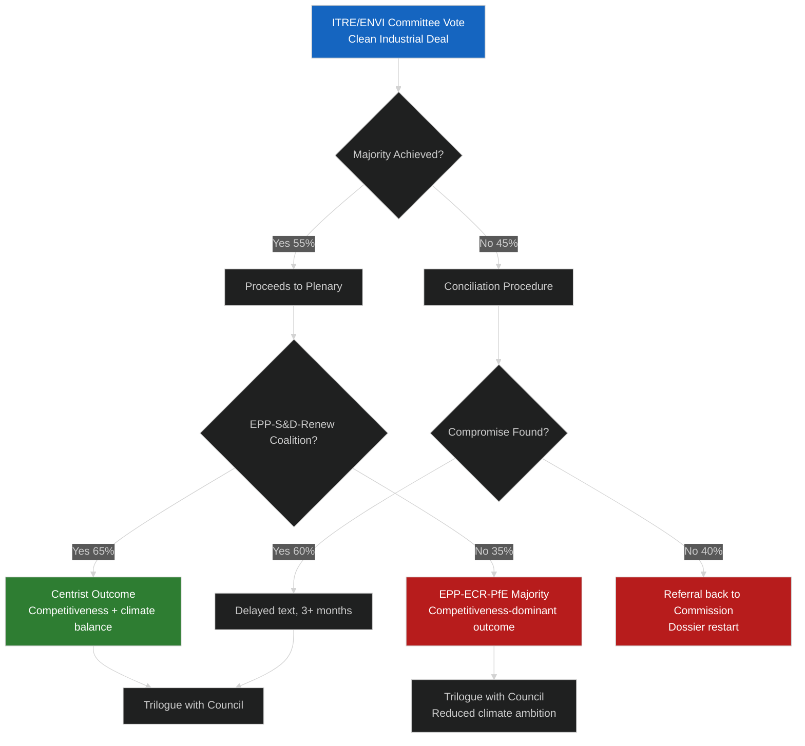
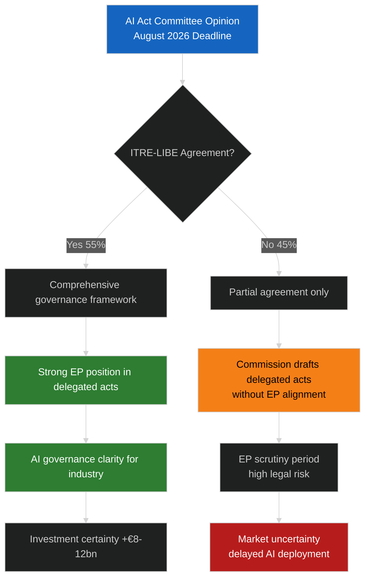

# Consequence Trees — EU Parliament Committee Reports
**Date:** 2026-05-15 | **Classification:** Public | **Admiralty Grade:** B2

---

## Decision Tree Analysis

Consequence trees map the decision paths from key committee events to downstream legislative and political outcomes.

---

## Tree 1: Clean Industrial Deal Committee Vote

---

## Tree 2: AI Act Governance — Pre-Deadline Path

---

## Key Consequence Pathways

| Starting Event | Decision Point | Positive Path | Negative Path |
|---|---|---|---|
| Clean Industrial Deal vote | Majority achieved? | Centrist text → Trilogue → Balanced outcome | Conciliation → Restart → 6+ month delay |
| AI Act governance | ITRE-LIBE agree? | Strong EP governance position | Commission fills gap; EP marginalised |
| SAFE Regulation | Treaty basis accepted? | Defence spending authorised | CJEU challenge; 18-month delay |
| Hungarian Presidency | Cooperative or obstructive? | Normal legislative flow | 6-month delay on progressive files |

---

## For Citizens: Plain Language Summary

These "consequence trees" show how committee decisions ripple outward. If politicians can't agree in committee, laws either get delayed for months or have to be fundamentally rewritten — meaning people wait longer for the protections or benefits those laws would provide. The most important consequence right now is the AI Act: if EP committees can't agree on AI governance rules before August 2026, the Commission will write those rules alone — without democratic Parliament input — and they may be weaker as a result.

---

## Probability-Weighted Consequence Assessment

**Best case (40%):** Clean Industrial Deal centrist outcome + AI Act EP alignment + SAFE Regulation on schedule = significant legislative output by December 2026.

**Most likely case (40%):** Mixed outcomes — SAFE Regulation succeeds, Clean Industrial Deal delayed, AI Act partial alignment — adequate but below expectations.

**Worst case (20%):** Multiple stalls, Hungarian Presidency obstruction, MFF failure — significant legislative backlog entering 2027.
