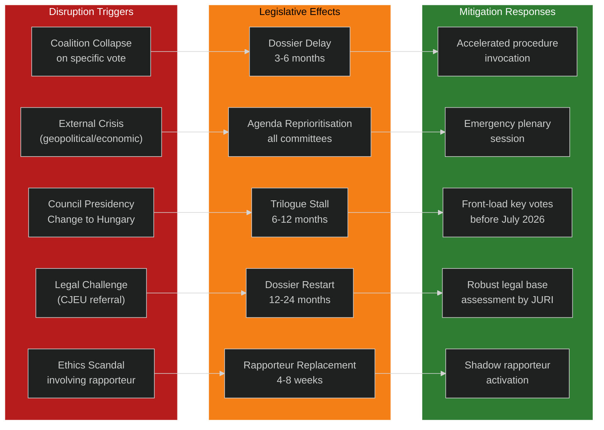

# Legislative Disruption — EU Parliament Committee Reports
**Date:** 2026-05-15 | **Classification:** Public | **Admiralty Grade:** B2

---

## Legislative Disruption Scenarios

This artifact maps specific scenarios where normal EP committee legislative processes are disrupted, and assesses mitigation strategies.

---

## Disruption Map

---

## Disruption Scenarios by Probability

| Disruption | Probability | Duration | Mitigation Effectiveness |
|---|---|---|---|
| Clean Industrial Deal vote failure | 45% | 3–6 months | 60% (accelerated procedure) |
| Hungarian Presidency trilogue stall | 75% | Up to 6 months | 40% (front-loading) |
| Rapporteur absence on AI Act | 25% | 4–8 weeks | 80% (shadow rapporteur) |
| SAFE Regulation legal challenge | 20% | 12–24 months | 50% (preventive JURI assessment) |
| External crisis emergency redirect | 10% | 4–8 weeks | 30% (limited control) |

---

## For Citizens: Plain Language Summary

When EU Parliament committee work gets "disrupted," it means laws that would protect citizens or improve their lives get delayed. The most predictable disruption coming up is the change of Council Presidency to Hungary in July 2026 — Hungary has disagreed with many EU policies and may use its 6-month Presidency to slow down or block certain laws. Parliament can try to pass the most important laws before July, but that creates its own time pressure. Citizens who care about specific laws (AI protections, climate measures, migration rights) should watch whether their MEPs are pushing for faster committee progress before the Presidency changes.

---

## Early Warning Indicators

| Warning Signal | Indicates | Required Action |
|---|---|---|
| Committee vote scheduled, then postponed | Coalition breakdown risk | Inter-group emergency consultation |
| AFET/BUDG extraordinary sessions called | External crisis response | All other committees suspend non-urgent work |
| JURI delivers negative treaty basis opinion | Legal challenge incoming | Commission/EP legal services emergency response |
| Group leader refuses rapporteur nomination | Coalition negotiation breakdown | Conference of Presidents mediation |
