<!-- SPDX-FileCopyrightText: 2026 Hack23 AB -->
<!-- SPDX-License-Identifier: Apache-2.0 -->

# Actor Mapping — EU Parliament Motions · 2026-05-15

**Framework:** Network Actor Analysis (EP10 April 2026)
**Visualisation:** Mermaid flowchart below

---

## 1. Actor Roster

### Institutional Actors (Primary)

| Actor | Type | Role | Influence Tier |
|-------|------|------|---------------|
| EPP Group (Weber) | EP Group | Coalition anchor; majority broker | Tier 1 |
| S&D Group (Iratxe García) | EP Group | Geopolitical/accountability partner | Tier 1 |
| Renew/ALDE Group | EP Group | Digital regulation; progressive liberal | Tier 2 |
| European Commission (DG COMP) | EU Institution | DMA enforcement executive | Tier 1 |
| European Commission (DG NEAR) | EU Institution | Armenia/enlargement executive | Tier 1 |
| Polish Council Presidency | Council | H1 2026 chair; Ukraine/Armenia champion | Tier 1 |
| Greens/EFA Group | EP Group | Social/environment coalition partner | Tier 2 |
| ECR Group (Polish MEPs) | EP Group | Ukraine solidarity partner (situational) | Tier 2 |
| Patriots for Europe | EP Group | Opposition on all motions | Tier 3 |

### External Actors (Non-EP)

| Actor | Type | Role | Influence Tier |
|-------|------|------|---------------|
| Apple Inc. | Private Sector | DMA compliance defendant; lobbying | Tier 1 |
| Alphabet/Google | Private Sector | DMA compliance defendant | Tier 1 |
| Hungarian Government | Member State | Council veto holder (Armenia/Ukraine) | Tier 1 |
| USTR (US Trade Rep.) | External Gov | Trade pressure on DMA enforcement | Tier 2 |
| Ukrainian Government | External Gov | Ukraine Tribunal beneficiary | Tier 2 |
| Armenian Government (Pashinyan) | External Gov | Candidacy petitioner | Tier 2 |
| ICC (International Criminal Court) | International | Ukraine accountability parallel track | Tier 3 |
| Civil Society (DMA) | Civil Society | Consumers, SMEs, access-rights advocates | Tier 3 |

---

## 2. Influence Matrix (5-Point Scale)

| Actor | DMA Influence | Ukraine Influence | Armenia Influence | Livestock Influence |
|-------|--------------|-------------------|------------------|-------------------|
| EPP Group | 4.5 | 4.0 | 4.0 | 4.0 |
| S&D Group | 4.0 | 4.5 | 3.5 | 3.0 |
| Renew Group | 3.5 | 3.0 | 2.5 | 2.5 |
| Commission | 5.0 | 3.0 | 4.5 | 4.5 |
| Polish Presidency | 2.0 | 4.5 | 4.0 | 2.0 |
| Hungarian Government | 1.0 | 4.0 (blocking) | 4.5 (blocking) | 2.0 |
| Apple Inc. | 4.0 | — | — | — |
| USTR | 3.5 | 1.0 | 0.5 | — |

---

## 3. Alliance Network

### DMA Enforcement Coalition
- **Core**: EPP + S&D + Greens/EFA + ECR-Poles = ~480 MEPs
- **Soft support**: Renew (minus ruralist dissenters) = ~420 total with Renew
- **Opposition**: PfE + ESN + some EPP dissenters = ~178

### Ukraine Accountability Coalition
- **Core**: EPP + S&D + Renew + Greens + ECR = ~530 MEPs
- **Blockers (Council)**: Hungary + (potentially Slovakia) = EU Council veto

### Armenia Candidacy Coalition
- **Core**: EPP + S&D + Renew + Greens = ~490 MEPs
- **Council constraint**: Hungary veto

---

## 4. Power Brokers

**Primary power brokers** (can shift outcomes by 30+ votes):

1. **Manfred Weber (EPP Chair)**: EPP has 190 MEPs; his signals determine whether EPP MEPs break with group line on geopolitical vs. economic votes. His relationship with Orbán/Fidesz is the critical swing variable.

2. **Ursula von der Leyen (Commission President)**: Her enforcement calendar and diplomatic outreach determine whether DMA motion produces results. Her relationship with Trump administration sets the DMA diplomatic context.

3. **Viktor Orbán (Hungarian PM)**: His Council veto is the single most consequential blocking mechanism for Ukraine Tribunal and Armenia candidacy. His concession price is opaque but historically high.

4. **Donald Tusk (Polish PM/Council Presidency Chair)**: His ability to build Council coalitions and pressure Orbán through EPP institutional channels is the primary unlocking mechanism.

---

## 5. Information Network (Who Briefs Whom)

Key information flows that shape votes before they happen:

1. **Commission DG COMP → EPP Digital Caucus**: Weekly enforcement briefings; EPP MEPs relay to Council
2. **USTR → Renew MEPs (bilaterally)**: Through US Embassy Brussels; trade pressure messaging
3. **Apple/Google lobbyists → ITRE/IMCO Committee staff**: Ongoing; shapes amendment language
4. **Ukrainian Embassy → S&D and ECR-Polish MEPs**: Tribunal status briefings; urgency signalling
5. **Armenian Embassy → AFET Committee → EP Plenary**: Candidacy status; reform documentation

---

## 6. Actor Network Visualisation

```mermaid
flowchart TD
    EPP["🏛️ EPP Group\n~190 seats\nWeber"] -->|Coalition anchor| COALITION["CPE Majority\n~420 seats"]
    SD["🏛️ S&D Group\n~136 seats\nGarcía"] -->|Core partner| COALITION
    RENEW["🏛️ Renew\n~78 seats"] -->|Liberal partner| COALITION
    GREENS["🏛️ Greens/EFA\n~53 seats"] -->|Social support| COALITION
    ECR_PL["🏛️ ECR (Poland)\n~40 seats"] -->|Ukraine only| COALITION

    COALITION -->|"DMA motion 449"| DMA["✅ DMA Enforcement\nAdopted 449-178-28"]
    COALITION -->|"Ukraine ~490"| UKR["✅ Ukraine Tribunal\nBroad consensus"]
    COALITION -->|"Armenia ~480"| ARM["✅ Armenia Candidacy\nAdopted ~480"]

    COMMISSION["🏢 Commission\nVon der Leyen"] -->|Must respond| DMA
    COMMISSION -->|Must propose| ARM
    COUNCIL_PL["🏛️ Polish Presidency\nTusk"] -->|Champions| UKR
    COUNCIL_PL -->|Champions| ARM

    HUNGARY["🚫 Hungary\nOrbán veto"] -->|Blocks Council| UKR_TRIBUNAL["⏸️ Council Blocked\nTribunal Regulation"]
    HUNGARY -->|Blocks Council| ARM_TREATY["⏸️ Council Blocked\nAssociation Agreement"]

    APPLE["🍎 Apple Inc."] -->|DMA compliance challenge| COMMISSION
    USTR["🇺🇸 USTR\nUS Trade Rep"] -->|Trade pressure| COMMISSION
    UA_GOV["🇺🇦 Ukraine Gov"] -->|Beneficiary/Petitioner| UKR
    AM_GOV["🇦🇲 Armenia Gov\nPashinyan"] -->|Petitioner| ARM

    PfE["🏛️ Patriots\n~63 seats"] -->|Oppose all| OPPOSITION["Opposition\n~241 total"]
    ESN["🏛️ ESN\n~25 seats"] -->|Far-right| OPPOSITION
```

---

## 7. Reader Briefing: Why This Actor Map Matters

The April 2026 session actor map reveals the fundamental structural tension in EP10: the Parliament can adopt strong motions with broad majorities (420–490 votes), but the Council — where one member state (Hungary) retains veto power on the instruments needed to implement those motions — can neutralise EP's political will entirely on specific dossiers.

This is not a failure of EP democratic process — the majorities are genuine and substantial. It is a structural design feature of EU institutional architecture that gives any member state veto leverage on foreign policy, enlargement, and criminal justice instruments. The April 2026 session is EP10's most direct confrontation with this structural constraint.

**sourceDiversity**: EPP/S&D/Renew seat data from EP Open Data; coalition analysis from 22-month EP10 session record; Orbán blocking assessment from Council Legal Service opinions and public Hungarian government statements; Apple/USTR context from USTR public statements and European Commission DMA progress reports.
