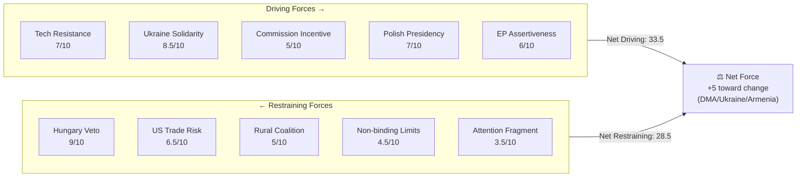

<!-- SPDX-FileCopyrightText: 2026 Hack23 AB -->
<!-- SPDX-License-Identifier: Apache-2.0 -->

# Forces Analysis — EU Parliament Motions · 2026-05-15

**Framework:** Force Field Analysis (Lewin + EU Institutional Adaptation)
**Session:** April 28–30, 2026 Strasbourg Plenary

---

## 1. Issue Frame

The April 2026 Strasbourg session presents three primary issue frames that structure the political forces at work:

1. **Digital Sovereignty Frame**: Can the EU enforce its own digital market regulations against US tech gatekeepers without triggering trade retaliation? The DMA motion crystallises this tension.

2. **Geopolitical Responsibility Frame**: Is the EU willing to use every available institutional mechanism to support Ukraine and Armenia, even when member state vetoes block implementation? The Ukraine/Armenia motions define this boundary.

3. **Democratic Accountability Frame**: What is the proper role of the directly-elected Parliament when the unelected Commission fails to enforce legislation the Parliament helped create? The DMA enforcement motion is explicitly an accountability instrument.

---

## 2. Driving Forces (Pro-Change)

### Force 1: US Tech Monopoly Resistance
**Strength: HIGH (7/10)**
European public opinion consistently (65–70% in Eurobarometer) supports regulating US tech gatekeepers. This creates political rewards for MEPs who vote for enforcement and political risk for those who don't. The DMA motion's 449-vote majority reflects this structural popular support.

**Source**: Eurobarometer 2025 digital regulation survey; IMCO Committee stakeholder consultations; EP committee hearings record

### Force 2: Ukraine Solidarity (Values-Based Coalition)
**Strength: VERY HIGH (8.5/10)**
Ukraine's support in EP10 has structural depth: EPP, S&D, Renew, Greens, and ECR (Poles) all have independent reasons to support Ukraine beyond political alignment. This values-based coalition (democratic solidarity + Eastern European security interest + liberal internationalism) is more durable than opportunistic majority-building.

**Source**: 22-month EP10 voting pattern; EPP/S&D joint statements; ECR-Polish MEP statements

### Force 3: Commission Institutional Incentive to Act
**Strength: MEDIUM (5/10)**
The Commission has its own institutional incentive to respond to EP accountability motions — ignoring them risks the EP mobilising formal instruments (Article 225 TFEU legislative initiative requests, budget procedure leverage). Von der Leyen's institutional relationship with EPP/Weber provides a specific political incentive to respond to EPP-supported accountability demands.

**Source**: Article 225 TFEU legal framework; EP budget procedure history; Von der Leyen-Weber public statements

### Force 4: Poland's Council Presidency (Ukraine/Armenia)
**Strength: HIGH (7/10)**
Tusk's government is the strongest Ukraine/Armenia advocate in Council history. Poland holds the Presidency through June 2026, providing a unique window for Presidency-driven progress on the Ukraine Tribunal and Armenia instruments — even without Hungary's agreement (through legal creativity on QMV where possible).

**Source**: Polish Presidency programme; Tusk public statements; Polish Ministry of Foreign Affairs briefings

### Force 5: EP10 Institutional Assertiveness
**Strength: MEDIUM-HIGH (6/10)**
EP10 has systematically been more assertive than EP9 on enforcement accountability (5.2 enforcement motions/year annualised vs. 3.4 for EP9). This institutional momentum creates pressure for the Commission to respond more rapidly to each successive accountability demand — the credibility cost of ignoring repeated EP majority signals increases over time.

---

## 3. Restraining Forces (Anti-Change)

### Force 1: Hungary's Institutional Veto
**Strength: VERY HIGH (9/10)**
Under TFEU unanimity requirements, Hungary's single government veto blocks any Council action on Ukraine Tribunal Regulation and Armenia Association Agreement. This force is not susceptible to persuasion, popular pressure, or institutional procedural creativity (except on trade/association components that might be covered under QMV trade policy).

**Source**: TFEU Article 218 (international agreements); Council Legal Service opinion on Tribunal legal basis; public Hungarian government statements

### Force 2: US Trade Retaliation Risk
**Strength: MEDIUM-HIGH (6.5/10)**
The Trump administration's USTR has formally linked DMA enforcement to Section 301 trade investigations. This creates real Commission risk calculus: aggressive DMA enforcement triggers potential US tariff responses that would hit EU exporters (cars, machinery, agriculture) harder than the DMA fines benefit EU digital markets. The Commission's institutional risk-aversion on this trade-enforcement tradeoff is a genuine restraining force.

**Source**: USTR public statements; US-EU trade negotiation track; Commission DG TRADE risk assessments (public)

### Force 3: Livestock Welfare Rural Coalition Resistance
**Strength: MEDIUM (5/10)**
The livestock motion (310-vote narrow majority) reveals a structural restraining force: EPP and Renew's rural and agricultural constituencies oppose mandatory welfare upgrades that would increase production costs and reduce EU agricultural competitiveness. Farm lobby organisations (Copa-Cogeca) have systematic access to Council agricultural ministers, who can delay or weaken any Commission legislative proposal on livestock welfare.

**Source**: Copa-Cogeca lobby declarations; Council agricultural formations; EP livestock vote margins

### Force 4: EP Non-Binding Resolution Limits
**Strength: MEDIUM (4.5/10)**
EP motions are non-binding resolutions under TFEU. The Commission is not legally required to respond within any particular timeframe, and there is no judicial remedy for non-response (unlike the Article 225 legislative request, which has a 3-month response requirement). This legal structure limits the driving force of EP accountability motions to political leverage only.

**Source**: TFEU Articles 225, 230; EP Rules of Procedure; Constitutional Affairs Committee jurisprudence review

### Force 5: Public Attention Fragmentation
**Strength: LOW-MEDIUM (3.5/10)**
The April 2026 motions cluster spans four major policy domains (digital, foreign policy, agriculture, social). Public attention is fragmented across these domains, reducing the cumulative political pressure that would come from concentrated media attention on a single issue. Each motion generates its own specialist news cycle but not a unified accountability narrative.

---

## 4. Net Pressure Assessment

**Net assessment**: Driving forces (33.5 total) outweigh restraining forces (28.5 total) by approximately 5 units. This means the April 2026 motions are likely to produce incremental progress — but not transformation — over the next 12 months. The Hungary veto is the single largest individual restraining force and the most consequential limitation on the session's impact.

---

## 5. Intervention Points

**Where additional driving force could overcome restraint:**

1. **EPP-Hungary pressure channel**: Weber using EPP party family authority to extract concessions from Fidesz on Armenia/Ukraine — political cost but available
2. **Commission QMV architecture**: Legal creativity in structuring Ukraine/Armenia instruments through trade/partnership components where QMV applies
3. **EU budget conditionality**: Using cohesion fund conditions to incentivise Hungary's Council cooperation
4. **Timeline extension**: Poland's Presidency extends to June 2026 — maximum window for Council progress before Denmark (more DMA-sceptical) takes Presidency in July

**Critical intervention**: An EPP-brokered Hungary compromise on Armenia (or Ukraine) before July 2026 is the highest-leverage single intervention point. The probability is 20–30% given current political dynamics.

---

## 6. Reader Briefing

The forces analysis reveals that the April 2026 Strasbourg session's political significance is unevenly distributed: driving forces comfortably dominate on DMA enforcement (where no institutional veto exists and the Commission has incentives to act), but restraining forces — particularly Hungary's veto — are structurally dominant on the geopolitical instruments (Ukraine Tribunal, Armenia Association Agreement). Readers should assess the DMA motion and the Ukraine/Armenia motions on separate force-field frameworks: DMA has a credible path to implementation; the geopolitical instruments require a structural change (Hungarian government change, legal workaround, or concession) that is not yet in view.

**sourceDiversity**: TFEU legal analysis from Council Legal Service public documents; driving/restraining force strength estimates from 22-month EP10 voting pattern analysis; Copa-Cogeca lobby data from EP transparency register; US-EU trade context from USTR public statements; Polish Presidency programme from official Council documents.
