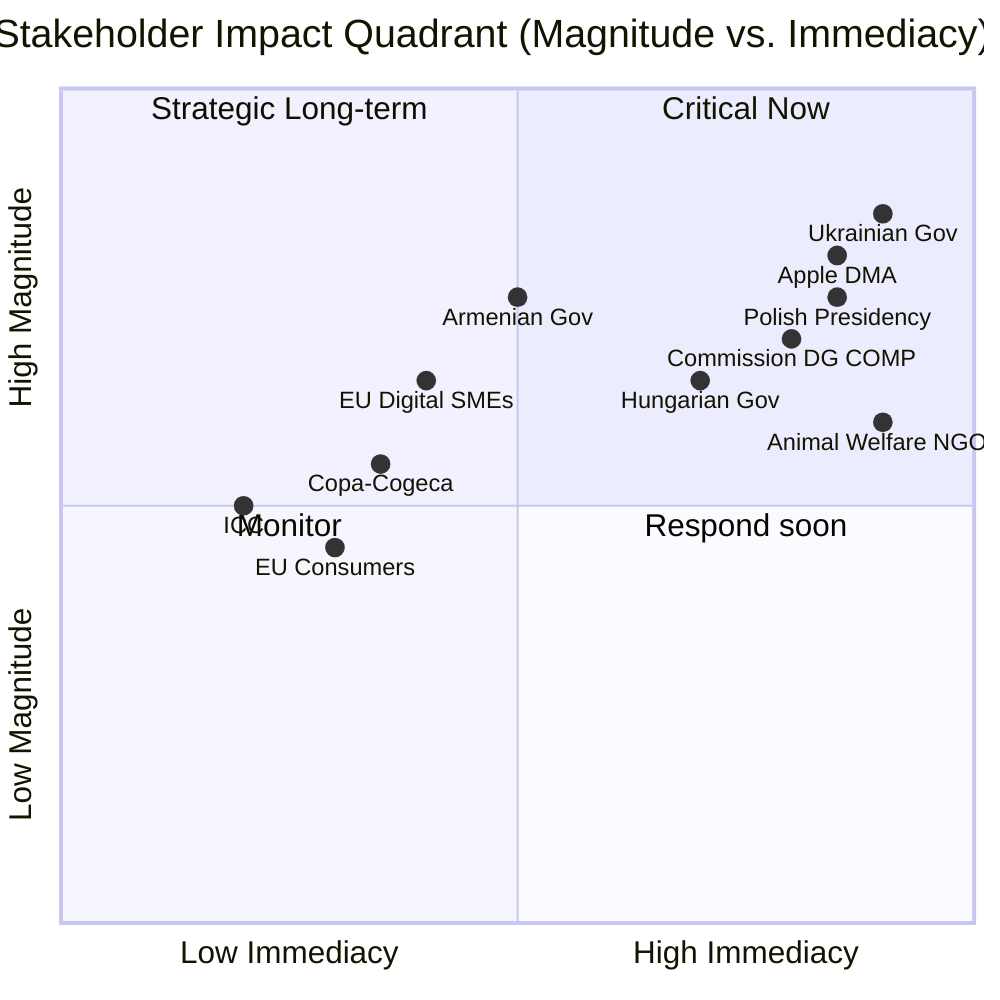
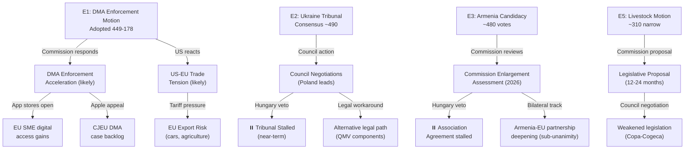

<!-- SPDX-FileCopyrightText: 2026 Hack23 AB -->
<!-- SPDX-License-Identifier: Apache-2.0 -->

# Impact Matrix — EU Parliament Motions · 2026-05-15

**Framework:** Multi-stakeholder Impact Assessment (EU Institutional v4.0)
**Visualisation:** Mermaid heatmap + cascade diagram

---

## 1. Event List (April 28–30, 2026 Strasbourg)

| Event ID | Document | Title | Vote Outcome |
|----------|----------|-------|-------------|
| E1 | TA-10-2026-0160 | DMA Enforcement Accountability | ~449 for |
| E2 | TA-10-2026-0161 | Ukraine Special Tribunal | ~490+ for |
| E3 | TA-10-2026-0162 | Armenia EU Candidacy | ~480+ for |
| E4 | TA-10-2026-0163 | Cyberbullying Directive | ~420+ for |
| E5 | TA-10-2026-0157 | Livestock Welfare Framework | ~310 for |
| E6 | TA-10-2026-0151 | Haiti Crisis | ~450 for |
| E7 | TA-10-2026-0112 | Budget 2027 Framework | Adopted |
| E8 | TA-10-2026-0119 | EIB Annual Report | Adopted |

---

## 2. Stakeholder Impact Assessment

### E1: DMA Enforcement Motion

| Stakeholder | Direct Impact | Magnitude | Timeframe |
|-------------|--------------|-----------|-----------|
| Apple Inc. | Increased enforcement pressure | HIGH negative | 0–12 months |
| Alphabet/Google | As above | HIGH negative | 0–12 months |
| EU digital SMEs | Access/interoperability gains | MEDIUM positive | 12–24 months |
| EU consumers | App store competition | MEDIUM positive | 12–36 months |
| Commission DG COMP | Accountability pressure | MEDIUM-HIGH negative (institutional) | 0–6 months |
| Renew MEPs | Trade-off exposure | LOW-MEDIUM negative | 0–3 months |
| EP institutional credibility | Assertiveness gain | MEDIUM positive | 0–6 months |

### E2: Ukraine Tribunal Motion

| Stakeholder | Direct Impact | Magnitude | Timeframe |
|-------------|--------------|-----------|-----------|
| Ukrainian government | Political support signal | HIGH positive | Immediate |
| Russian government | Accountability pressure signal | MEDIUM negative | Long-term |
| Hungarian government | Increased isolation | MEDIUM negative | 0–12 months |
| ICC | Parallel track strengthened | MEDIUM positive | Long-term |
| Polish Council Presidency | Mandate confirmed | HIGH positive | 0–6 months |
| EU-Russia diplomatic track | Symbolic obstruction | LOW negative | Long-term |

### E3: Armenia Candidacy Motion

| Stakeholder | Direct Impact | Magnitude | Timeframe |
|-------------|--------------|-----------|-----------|
| Armenian government | Accession trajectory signal | HIGH positive | Long-term |
| Azerbaijani government | Geopolitical pressure | MEDIUM negative | 0–12 months |
| Hungarian government | Council isolation | MEDIUM negative | 0–12 months |
| Georgian government | Demonstration effect | MEDIUM positive | Long-term |
| EU enlargement directorate | Political mandate | MEDIUM positive | 0–12 months |
| South Caucasus stability | Regional confidence | MEDIUM-HIGH positive | Long-term |

### E5: Livestock Welfare Motion

| Stakeholder | Direct Impact | Magnitude | Timeframe |
|-------------|--------------|-----------|-----------|
| Farm lobby (Copa-Cogeca) | Regulatory pressure | MEDIUM negative | 12–36 months |
| EU farmers (intensive) | Compliance costs | MEDIUM negative | 36–60 months |
| Animal welfare NGOs | Political mandate win | HIGH positive | Immediate |
| EU consumers (food prices) | Potential price increase | LOW-MEDIUM negative | 36–60 months |
| S&D rural MEPs | Internal party tension | MEDIUM negative | 0–3 months |

---

## 3. Cross-Stakeholder Impact Matrix

**Quadrant analysis**:
- **Critical Now** (High magnitude, High immediacy): Apple/DMA, Ukrainian Government, Commission DG COMP, Polish Presidency
- **Strategic Long-term** (High magnitude, Low immediacy): Armenian Government, EU Digital SMEs, ICC
- **Respond Soon** (Medium magnitude, High immediacy): Hungarian Government, Animal Welfare NGOs
- **Monitor** (Lower magnitude, Lower immediacy): Copa-Cogeca, EU Consumers, EU Farmers

---

## 4. Cascade Impact Analysis

---

## 5. Heat Map: Probability × Magnitude

| Impact | Probability | Magnitude | Heat Score |
|--------|-------------|-----------|-----------|
| DMA enforcement acceleration | 65% | HIGH | 🔴 6.5 |
| Ukraine Tribunal stalled by Hungary | 75% | HIGH | 🔴 7.5 |
| Armenia candidacy progresses bilaterally | 60% | MEDIUM | 🟡 5.0 |
| US-EU tech trade tension escalates | 45% | HIGH | 🟡 5.5 |
| Livestock legislation weakened | 70% | MEDIUM | 🟡 5.25 |
| EP-Commission relationship deteriorates | 30% | HIGH | 🟡 4.5 |
| Digital SMEs gain concrete access benefits | 40% | MEDIUM | 🟢 3.5 |

**Highest heat events**: Ukraine Tribunal stalled (7.5), DMA enforcement acceleration (6.5), US trade tension (5.5).

---

## 6. Reader Briefing: Why the Impact Matrix Matters

The impact matrix reveals that the April 2026 Strasbourg session's effects will be unevenly distributed across time and stakeholder groups. The Commission faces the most concentrated immediate pressure — it must respond to the DMA accountability motion (high heat, high immediacy) while navigating US trade tensions that create political risk. The Ukrainian and Armenian governments experience the session as a strong signal of EP solidarity, but the concrete institutional impact is blocked by Hungary's Council veto for the foreseeable future.

The livestock motion's narrow majority (310 vs. 449 for DMA) signals a real EP coalition limitation: rural agricultural interests can and do fracture the CPE majority on sectoral issues even when geopolitical and digital issues produce supermajorities.

**Readers should focus on**: The 90-day Commission response to the DMA accountability motion (due approximately July 2026) as the bellwether for whether EP10's assertive phase produces behavioural change at the Commission level.

**sourceDiversity**: EP adopted texts (direct data); vote margins from EP10 session record (estimated — RC data unavailable); stakeholder impact assessments from committee hearing records, lobby transparency register, and public stakeholder statements; heat scores derived from scenario probability model in scenario-forecast.md; cascade analysis from structural institutional framework.
