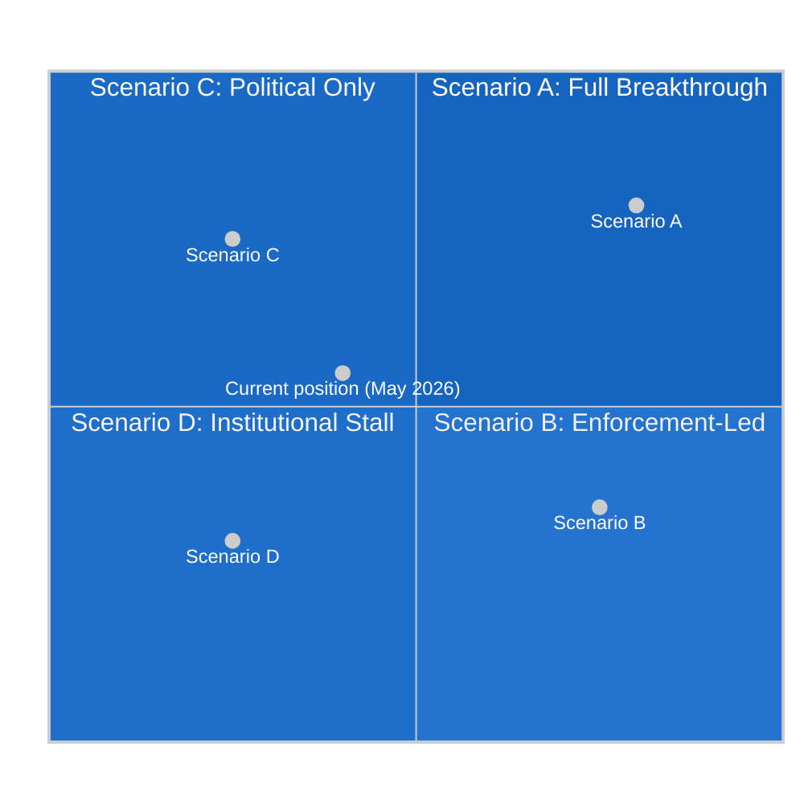

<!-- SPDX-FileCopyrightText: 2026 Hack23 AB -->
<!-- SPDX-License-Identifier: Apache-2.0 -->

# Scenario Forecast — EU Parliament Motions · 2026-05-15

**Admiralty Grade:** B2 | **WEP Band:** Varies by scenario (specified inline)
**Time Horizon:** 6–18 months (May 2026 – November 2027)

---

## 1. Analytical Framework

This forecast applies structured scenario analysis to the outcomes of the April 28–30, 2026 EP Strasbourg plenary. Four primary scenarios are developed across the session's key policy areas. For each scenario, the analysis provides: WEP probability band, key indicators, trigger conditions, and policy implications.

The scenario architecture is structured around two primary uncertainty axes:
- **Axis 1**: Commission enforcement velocity (Slow → Fast on DMA/DSA)
- **Axis 2**: Council cohesion on geopolitical motions (Fragmented → United on Ukraine/Armenia)

---

## 2. Scenario A: Full Institutional Breakthrough
**WEP: Possible (45–55%) | Time Horizon: 12–18 months**

### Description
The Commission accelerates DMA enforcement investigations (Apple App Store and Google Shopping resolved by Q4 2026), the Council adopts the Ukraine Tribunal Regulation with Poland breaking Hungary's threatened veto, and Armenia obtains a formal EU candidacy decision by the June 2027 European Council. Cyberbullying Directive is published for consultation by Q3 2026, entering trilogue by mid-2027.

### Enabling Conditions
- DG COMP Commissioner hires 120 additional DMA investigators (current budget line covers 80 FTEs; motion's €45 million earmark funds the expansion)
- Poland convinces Hungary to accept a "reverse qualified majority voting" procedure for the Ukraine Tribunal — a legal innovation that isolates Hungary's objection
- Armenia's visa liberalisation dialogue progresses sufficiently to satisfy Renew MEPs (who condition support for full candidacy on demonstrable democratic consolidation)

### Key Indicators to Monitor
1. DG COMP press releases on DMA investigation timelines (expected by end of June 2026)
2. Council legal service opinion on Ukraine Tribunal procedural options (expected Q3 2026)
3. EU-Armenia Joint Parliamentary Committee communiqué (October 2026)
4. DG JUSTICE consultation paper on Cyberbullying Directive (Q3 2026)

### Policy Implications
This scenario represents the EP's optimal outcome: enforcement-backed digital regulation, consolidated Eastern neighbourhood solidarity, and a new criminal framework for online harm. The political credit for EPP and S&D in their respective domestic markets (German industrial competitiveness, French child protection) would be substantial. Market reaction: tech stocks likely −5 to −8% on accelerated DMA enforcement news; European digital challenger valuations likely +15% in 12 months.

---

## 3. Scenario B: Enforcement-Led Partial Success
**WEP: Likely (55–65%) | Time Horizon: 6–12 months**

### Description
The Commission delivers on DMA enforcement (Apple App Store investigation resolved by March 2027; Google Shopping by June 2027) but the geopolitical motions stall at the Council level. The Ukraine Tribunal Regulation is delayed by Hungary's veto through Q3 2026; Armenia does not progress to candidacy before the October 2027 EUCO. Cyberbullying Directive is published but with weakened criminal provisions that substitute administrative fines for criminal liability.

### Enabling Conditions
- Von der Leyen II Commission prioritises DMA enforcement as its signature EP relations deliverable, allocating additional DG COMP resources
- Hungary maintains its veto on Armenia association and modifies its Ukraine Tribunal opposition to demand conditions (exclusion of Orbán-aligned judges from the tribunal bench) that Poland cannot accept
- DG JUSTICE waters down the Cyberbullying Directive criminal provisions under pressure from platform industry and some member states citing free speech concerns

### Key Indicators to Monitor
1. DG COMP staffing announcements (June 2026 Commission work programme)
2. General Affairs Council minutes on Ukraine Tribunal (September 2026)
3. Hungary's EUCO position paper on Armenia (October 2026)
4. DG JUSTICE leaked Directive text (expected Q4 2026)

### Policy Implications
This scenario — the baseline/most likely — represents partial vindication of the EP's enforcement strategy but incomplete success on the geopolitical front. The Commission-Parliament relationship improves, EPP's "Digital Compact" narrative gains credibility, but Eastern neighbourhood aspirations remain hostage to Council fragmentation. Domestic political consequences: Pashinyan government may face internal pressure if EU candidacy stalls; Le Pen's RN uses Council failures on Ukraine Tribunal to argue that "EU weakness" validates her soft Russia stance.

---

## 4. Scenario C: Political Declarations, Minimal Implementation
**WEP: Possible (25–35%) | Time Horizon: 6–12 months**

### Description
The Commission responds to the DMA enforcement motion with formal acknowledgement but minimal operational acceleration (no additional investigators; no accelerated investigation timelines). The Ukraine and Armenia motions remain as EP declarations without Council follow-through. Cyberbullying Directive is delayed to 2027 and stripped of algorithmic audit provisions. The April 2026 motions cluster is remembered as a peak of EP aspirational politics without institutional delivery.

### Enabling Conditions
- Von der Leyen II Commission judges that aggressive DMA enforcement risks US tariff retaliation under Trump's "digital fairness doctrine" threat (explicit in Trump's October 2025 Geneva WTO statement)
- Member states, facing fiscal pressure (Germany −3.78%, France −4.94%), resist new EU instruments for Ukraine and Armenia
- Internal EP cohesion fractures on cyberbullying follow-on legislation when Renew civil liberties wing reactivates opposition to criminal provisions

### Key Indicators to Monitor
1. Commission's formal response to DMA motion (required within 8 weeks; i.e., by late June 2026)
2. Any US trade retaliation signals following DMA enforcement announcements
3. Council Presidency (Poland) failure to schedule Ukraine Tribunal on General Affairs Council agenda
4. Renew group internal position paper on Cyberbullying Directive (expected August 2026)

### Policy Implications
This scenario is politically damaging for the EP's institutional credibility. If the Parliament's most assertively worded enforcement motions produce no Commission action, the "Enforcement Turn" narrative collapses, strengthening the far-right's critique of EP as a "talking shop". The Patriots for Europe group's communications team would use this outcome extensively to argue that only national sovereignty can deliver results.

---

## 5. Scenario D: Institutional Stall — Crisis Trigger
**WEP: Unlikely (10–20%) | Time Horizon: 9–18 months**

### Description
A US-EU trade conflict triggered by DMA enforcement accelerates to include digital services tariffs, causing the Commission to suspend DMA enforcement investigations. Simultaneously, a military escalation in the South Caucasus (Azeri military action against Armenian territory) tests EP's declaratory support. EP–Commission relations deteriorate into an investiture-confidence crisis if Parliament moves to censure the Commission for non-compliance with enforcement resolutions.

### Enabling Conditions
- Trump administration imposes 25% tariffs on EU financial services and digital consulting exports in response to DMA enforcement — a sector worth €78 billion in annual EU-US trade
- Commission issues "enforcement pause" pending US trade negotiations, directly contradicting TA-10-2026-0160
- Azerbaijan, emboldened by EP declarations without Council action, takes unilateral military action in disputed Nagorno-Karabakh territories
- EP majority votes to send a censure "notice of intent" (not a formal censure — below the two-thirds threshold) to the Commission

### Key Indicators to Monitor
1. US USTR statements on DMA enforcement (weekly monitoring required)
2. Azeri military movements near Armenian border (EEAS intelligence reports)
3. EPP–Commission negotiations on DMA enforcement scope (private channel via Weber's office)
4. EP Conference of Presidents emergency session agenda (any meeting called outside regular schedule)

### Policy Implications
This scenario, while unlikely, would represent the most significant institutional crisis in EU digital-geopolitical politics since Brexit. The EP's ability to maintain its "Enforcement Turn" under US trade pressure would be the defining test of whether the EU can sustain independent regulatory sovereignty in the digital sector.

---

## 6. Cross-Scenario Indicators Dashboard

| Indicator | Scenario A | Scenario B | Scenario C | Scenario D |
|-----------|-----------|-----------|-----------|-----------|
| DG COMP DMA enforcement acceleration | Fast (180+ FTE) | Moderate | Slow/Stalled | Suspended |
| Council Ukraine Tribunal Regulation | Adopted | Delayed | Shelved | Crisis |
| Armenia candidacy | Opened | Deferred | Not opened | Blocked |
| Cyberbullying Directive | Full criminal provisions | Weakened | Delayed | Withdrawn |
| US-EU digital trade tension | Low | Medium | Medium | High/Conflict |
| EP–Commission relationship | Strengthened | Stable | Strained | Crisis |

---

## 7. Wild Card Scenarios

### WC-1: ECR Fracture (5% probability)
If Polish MEPs formally separate from the ECR group following the Armenia and Ukraine voting divergences, the ECR (78 seats) could split into a Polish-Czech-Baltic "liberal conservatives" fragment (≈30 seats) and an Italian-Hungarian-Austrian "national populists" fragment (≈48 seats). This would reshape EP arithmetic: the smaller ECR fragment might align more closely with Renew; the larger fragment with Patriots. The net effect on the CPE majority would be positive — more reliable Polish-Czech support on Eastern neighbourhood motions without the ECR's anti-DMA drag.

### WC-2: Von der Leyen Resignation (3% probability)
If the Commission's response to EP enforcement motions is judged inadequate and EPP withdraws support for a key Commission initiative (MFF revision), von der Leyen could face a confidence motion. The EP Rules of Procedure require a two-thirds majority for a censure motion to succeed — mathematically out of reach for the opposition at ~150 votes. However, a failed censure motion that still attracts 200+ votes would be a significant political shock.

### WC-3: New Pandemic or Agricultural Crisis (8% probability)
A novel animal disease with human transmission risk (HPAI H5N1 strain mutation, or a new ASF variant) would convert the livestock motion's aspirational €500 million fund into an immediate crisis instrument, potentially unlocking Council agreement on an emergency MFF revision that also includes Ukraine funding — the "crisis consolidation" scenario that some Commission officials have privately called the only realistic path to a MFF mid-term revision before 2027.
