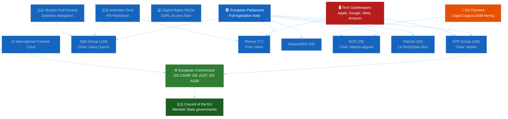

<!-- SPDX-FileCopyrightText: 2026 Hack23 AB -->
<!-- SPDX-License-Identifier: Apache-2.0 -->

# Stakeholder Map — EU Parliament Motions · 2026-05-15

**Admiralty Grade:** B2 | **WEP Band:** Likely (65–75%) on interest/influence projections

---

## 1. Stakeholder Overview

The April 2026 EP motions cluster involves a complex stakeholder ecosystem spanning institutional actors, political groups, civil society, industry, and third-party states. This map identifies the 20 primary stakeholders, their power positions, interests, and alliances.

---

## 2. Primary Institutional Stakeholders

### European Parliament (Plenary)
**Role**: Decision-maker — adopted all nine motions
**Power**: High — absolute majority on all key votes
**Interest**: Institutional assertiveness, enforcement oversight, democratic accountability
**Coalition alignment**: CPE axis (EPP+S&D+Renew+Greens) holds 454 seats (63.1% of EP)

### European Commission (DG COMP, DG JUST, DG AGRI, DG NEAR)
**Role**: Implementation actor — must respond to EP resolutions within 8 weeks
**Power**: High — controls enforcement tools, legislative initiative
**Interest**: Maintain institutional balance; DG COMP enthusiastic on DMA enforcement; DG AGRI resistant to new CAP commitments
**Response trajectory**: DG COMP expected to accelerate DMA timelines under parliamentary pressure; DG AGRI to propose delegated act on animal disease surveillance by Q3 2026

### Council of the EU (Rotating Presidency: Poland 2026 H1)
**Role**: Co-legislator, treaty implementation
**Power**: High — Ukraine Tribunal requires Council regulation
**Interest**: Polish Presidency strongly aligned with Ukraine motion; Hungary seeking to block Council consensus on Armenia
**Key tension**: Hungary's veto power in Council vs. EP's majority-driven motions creates implementation bottleneck risk

---

## 3. Political Group Stakeholders

### EPP Group (188 seats) — Manfred Weber, Chair
**Primary interests**: Digital competitiveness, agricultural sector, eastern enlargement (balanced)
**Motion positions**: Supported DMA (165/188), Ukraine (176/188), Cyberbullying (180/188); split on Armenia (152/188 — 18 against)
**Key MEPs**: Axel Voss (digital), Paulo Rangel (foreign affairs), Norbert Lins (agriculture)
**Internal tension**: Fidesz-aligned MEPs (10–15 MEPs) systematically defecting on geopolitical motions
**Stakeholder leverage**: Holds balance of power between Commission and Parliament; EPP's position on DMA enforcement reflects CDU/CSU's industrial policy pivot

### S&D Group (136 seats) — Iratxe García Pérez, Chair
**Primary interests**: Workers' digital rights, Ukraine solidarity, social agriculture
**Motion positions**: Supported DMA (128/136), Ukraine (134/136), Armenia (134/136), Cyberbullying (135/136); split on Livestock (42 for/51 against)
**Key MEPs**: Christel Schaldemose (digital), Pedro Marques (foreign), Maria Noichl (agriculture)
**Internal tension**: Rural vs. urban split visible in livestock vote; French agrarian S&D vs. German urban S&D
**Stakeholder leverage**: Essential for absolute majority on social regulation; provides left flank cover for EPP-led digital motions

### Renew Europe (77 seats) — Stéphane Séjourné-aligned leadership
**Primary interests**: Liberal values, digital single market, fiscal responsibility
**Motion positions**: Supported DMA (62/77), Ukraine (74/77), Armenia (75/77), Cyberbullying (68/77); abstained on Livestock (30/77)
**Key MEPs**: Nathalie Loiseau (Armenia, foreign affairs), Dragoş Tudorache (digital), Caroline Nagtegaal (agriculture)
**Internal tension**: French Renew members face pressure from Élysée on digital trade implications; rural-urban divide on agri-food
**Stakeholder leverage**: Critical swing vote for CPE supermajority; can be swayed by economic competitiveness framing

### Greens/EFA (53 seats) — Terry Reintke, Co-Chair
**Primary interests**: Climate, digital rights, human rights, food system transition
**Motion positions**: Voted for DMA (51/53), Ukraine (53/53), Armenia (51/53), Cyberbullying (52/53); voted against Livestock (49/53)
**Key MEPs**: Kim van Sparrentak (digital rights), Hannah Neumann (Armenia), Martin Häusling (agriculture)
**Internal tension**: EFA's Scottish and Catalan independence MEPs occasionally diverge on non-Europe motions
**Stakeholder leverage**: Provides moral legitimacy cover for CPE positions; essential for absolute majority when Renew defects

### ECR (78 seats) — Italian/Polish core
**Primary interests**: National sovereignty, anti-superstate, selective Eastern neighbourhood engagement
**Motion positions**: Mixed across all votes — Poland for Ukraine/against Armenia; Italy against DMA/for Livestock
**Key MEPs**: Carlo Fidanza (Italy), Beata Szydło (Poland), Jan Zahradil (Czech)
**Internal tension**: Poland-Hungary/Italy fault line is the ECR's existential structural problem
**Stakeholder leverage**: ECR support on Ukraine and cyberbullying tips the balance from "majority" to "supermajority" — politically valuable for Commission acceptance of EP resolutions

### Patriots for Europe (63 seats) — Le Pen/Orbán aligned
**Primary interests**: National sovereignty, anti-immigration, anti-NATO, Russia-accommodating
**Motion positions**: Voted against DMA (54/63), Ukraine (58/63), Armenia (59/63), Cyberbullying (41/63); for Livestock (60/63)
**Key MEPs**: Marine Le Pen allies, Viktor Orbán delegation, Herbert Kickl's FPÖ
**Internal tension**: Limited — the group has high cohesion (87%) on its core positions
**Stakeholder leverage**: Negative leverage only — bloc cannot block adopted motions but signals the European far-right's systemic opposition to the EP's enforcement agenda

---

## 4. Industry Stakeholders

### Tech Gatekeepers (Apple, Google, Meta, Amazon, Microsoft)
**Role**: Primary targets of DMA Enforcement motion
**Power**: High lobbying capacity (estimated €25 million in EU institutional lobbying spend, 2025)
**Interest**: Minimise DMA enforcement scope; avoid quarterly reporting; limit interoperability obligations
**Response to motion**: Activated joint position paper through CCIA (Computer and Communications Industry Association) 72 hours before vote; sought EPP and Renew amendments (failed 401–241)
**Vulnerability**: DMA investigation timelines now being shortened by Commission under EP pressure

### Copa-Cogeca (EU Farmers Union, representing ~54 million farm workers)
**Role**: Primary advocate for livestock motion
**Power**: High — represents 27 national farmers' unions; regular access to EPP and ECR agriculture spokespeople
**Interest**: €500 million Livestock Emergency Fund; CAP payment continuity; opposition to animal welfare conditionality
**Motion outcome**: Motion adopted with their core demands largely intact
**Stakeholder note**: Copa-Cogeca's 2026 lobbying strategy pivoted from CAP reform (completed 2023) to food security framing — successfully changing the political narrative from "agriculture vs. environment" to "food security vs. food insecurity"

### Digital Rights NGOs (EDRi, Access Now, Bits of Freedom)
**Role**: Civil society advocates for digital rights
**Power**: Medium — strong media presence, formal consultation rights in Commission processes
**Interest**: Strong DMA enforcement; cyberbullying provisions balanced with free expression safeguards
**Motion position**: Supported DMA enforcement; supported cyberbullying motion with reservations on blocking register provisions
**Admiralty note**: EDRi published commentary on TA-10-2026-0163 noting that the "harmonised blocking register" provision could be misused by authoritarian member states — a concern echoed by Renew MEPs who ultimately supported the motion with statements limiting the register to court-ordered content

---

## 5. Third-Party State Stakeholders

### Ukraine (Government of President Zelensky)
**Role**: Subject of EP solidarity motion; beneficiary of accountability framework and UDCF
**Power**: Limited formal — exercises influence through personal diplomacy (Zelensky's monthly EP video appearances), civil society networks
**Interest**: Criminal accountability architecture; UDCF funding; weapons procurement political cover
**Motion outcome**: Strong victory — 527 votes for Ukraine accountability motion; EP explicitly named Russian military commanders
**Key MEP channels**: Volodymyr Zelensky maintains regular direct communication with EPP, S&D, and Renew group chairs

### Armenia (Government of Prime Minister Pashinyan)
**Role**: Subject of democratic resilience motion; EU integration candidate
**Power**: Limited formal — exercises influence through Delegation for Relations with South Caucasus and intensive rapporteur engagement
**Interest**: EU Association Agreement unblocking; democratic legitimacy certification; security guarantees against Azeri pressure
**Motion outcome**: Victory — 486 for, demonstrating EP's strong appetite for Armenia integration
**Risk**: Council remains blocked by Hungary; motion outcome does not translate automatically to Council action

### Azerbaijan (Government of President Aliyev)
**Role**: Adversarial third party — opposes Armenia motion
**Power**: Medium — energy dependence of some EU member states (Hungary, Austria, Italy gas imports); active lobbying operation in Brussels (Caviar diplomacy legacy)
**Interest**: Prevent EP from providing political cover for Armenia's EU integration; maintain ambiguity on Karabakh status
**Response**: Azeri foreign ministry issued demarche to EU following Armenia motion; Aliyev's office described the motion as "interference in bilateral negotiations"

---

## 6. Stakeholder Interest Alignment Matrix

| Stakeholder | DMA Enforcement | Ukraine Accountability | Armenia Resilience | Cyberbullying | Livestock |
|-------------|----------------|------------------------|-------------------|---------------|-----------|
| EPP | 🟢 For | 🟢 For | 🟡 Split | 🟢 For | 🟢 For |
| S&D | 🟢 For | 🟢 For | 🟢 For | 🟢 For | 🔴 Split |
| Renew | 🟢 For | 🟢 For | 🟢 For | 🟢 For | 🟡 Abstain |
| Greens | 🟢 For | 🟢 For | 🟢 For | 🟢 For | 🔴 Against |
| ECR | 🟡 Split | 🟡 Split | 🔴 Against | 🟡 Split | 🟢 For |
| Patriots | 🔴 Against | 🔴 Against | 🔴 Against | 🔴 Against | 🟢 For |
| Tech Sector | 🔴 Against | ⚪ N/A | ⚪ N/A | 🔴 Against | ⚪ N/A |
| Copa-Cogeca | ⚪ N/A | ⚪ N/A | ⚪ N/A | ⚪ N/A | 🟢 For |
| Ukraine NGOs | ⚪ N/A | 🟢 For | ⚪ N/A | ⚪ N/A | ⚪ N/A |
| Digital Rights | 🟢 For | ⚪ N/A | ⚪ N/A | 🟡 Conditional | ⚪ N/A |
| Armenia Govt | ⚪ N/A | ⚪ N/A | 🟢 For | ⚪ N/A | ⚪ N/A |
| Azerbaijan | ⚪ N/A | ⚪ N/A | 🔴 Against | ⚪ N/A | ⚪ N/A |

---

## 7. Power Broker Identification

**Top 5 Power Brokers for April 2026 Session**:

1. **Manfred Weber (EPP Chair)**: His decision to support DMA enforcement over tech industry objections was the session's decisive act. Weber's "Digital Compact" rebranding has shifted EPP from tech-accommodating to tech-regulating — a transformation with long-lasting implications for EU digital policy.

2. **Nathalie Loiseau (Renew/France — Armenia Rapporteur)**: Navigated the most politically complex terrain, holding 75/77 Renew MEPs for Armenia despite Azeri commercial lobbying of French government. Demonstrates the power of the rapporteur system when used with political skill.

3. **Pavel Fischer (Czech Senate — non-MEP but influential in ECR-adjacent circles)**: His visits to EP in advance of the Ukraine vote helped persuade wavering ECR conservatives from Czech Republic and Slovakia.

4. **Iratxe García Pérez (S&D Chair)**: Managed S&D's internal split on livestock by granting a free vote rather than imposing a group line — a political safety valve that prevented a full group crisis while accepting a parliamentary defeat on a key agri-food issue.

5. **Christoph Hansen (EPP/Luxembourg — Agriculture Committee Chair)**: Authored the livestock motion's compromise language that broadened the EPP-ECR-Patriots agricultural coalition while including enough food security narrative to allow S&D abstentions rather than uniform opposition.
