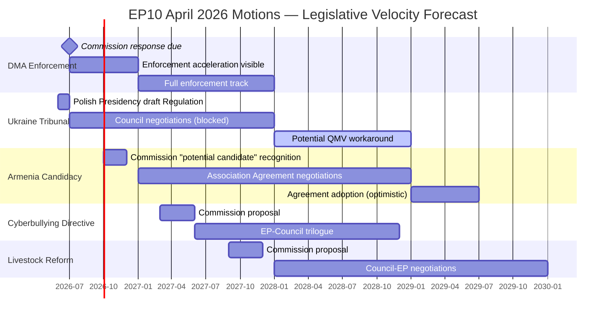

<!-- SPDX-FileCopyrightText: 2026 Hack23 AB -->
<!-- SPDX-License-Identifier: Apache-2.0 -->

# Legislative Velocity Risk — EU Parliament Motions · 2026-05-15

**Framework:** EP Legislative Velocity Risk Assessment
**Definitions:** Velocity = time from EP motion to legislative outcome; Risk = probability of delay/failure

---

## 1. Velocity Baseline (EP10 Historical)

| Dossier Type | EP10 Average Velocity (motion to Commission proposal) | EP10 Average Velocity (proposal to adoption) |
|-------------|------------------------------------------------------|---------------------------------------------|
| Digital regulation (single market) | 6–12 months | 18–30 months |
| Foreign policy instruments | 8–18 months (proposal) | 12–36 months (blocked by Council) |
| Agricultural/environment regulation | 12–24 months | 24–48 months |
| Budget/financial instruments | 3–6 months | 6–18 months |
| Humanitarian | 1–3 months | 1–6 months |

---

## 2. Per-Motion Velocity Risk Assessment

### DMA Enforcement Motion (E1)
**Expected velocity**: FAST (Commission has legal obligation to enforce existing DMA)
**Velocity risk**: MEDIUM — risk is not about speed to proposal but about enforcement pace
- Commission DMA enforcement calendar is already underway (investigations open)
- EP motion accelerates political pressure but doesn't create new legal obligations
- US trade pressure is the primary velocity risk factor
**Risk level**: 🟡 MEDIUM | Predicted enforcement acceleration: +3 to +6 months sooner than baseline

### Ukraine Tribunal Regulation (E2)
**Expected velocity**: VERY SLOW (Council unanimity required)
**Velocity risk**: CRITICAL — Hungary veto makes indefinite delay the base case
- Polish Presidency may produce a draft Regulation by June 2026, but no adoption without Hungary
- QMV legal architecture workaround would require Council Legal Service opinion and possible CJEU challenge
- Alternative: EU + willing member states creating a special tribunal outside EU institutional framework
**Risk level**: 🔴 CRITICAL | Predicted adoption: 24–60 months (if ever, under current configuration)

### Armenia Candidacy/Association (E3)
**Expected velocity**: MEDIUM-SLOW (candidacy fast, agreement slow)
**Velocity risk**: HIGH — Armenia candidacy can be recognised by Commission/EP quickly, but Association Agreement blocked by Hungary
- Commission "potential candidate" status: achievable within 6–9 months (no Council vote required for this step)
- Full Association Agreement: Council unanimity required; Hungary veto applies
**Risk level**: 🔴 HIGH | Predicted candidacy recognition: 6–9 months; Agreement: 24–48 months (blocked)

### Cyberbullying Directive (E4)
**Expected velocity**: MEDIUM (Commission proposal)
**Velocity risk**: MEDIUM — digital social legislation faces Renew civil liberties concerns
**Risk level**: 🟡 MEDIUM | Predicted proposal: 12–18 months

### Livestock Welfare Reform (E5)
**Expected velocity**: SLOW (agricultural legislative complex)
**Velocity risk**: HIGH — narrow majority (310) creates weak mandate; farm lobby strong in Council
**Risk level**: 🔴 HIGH | Predicted proposal: 18–30 months; adoption: 36–60 months

---

## 3. Legislative Velocity Risk Visualisation

---

## 4. Velocity Risk Aggregation

| Motion | Base Velocity Risk | Hungary Adjustment | Final Risk |
|--------|-------------------|--------------------|-----------|
| DMA Enforcement | MEDIUM | N/A | 🟡 MEDIUM |
| Ukraine Tribunal | HIGH | +CRITICAL | 🔴 CRITICAL |
| Armenia Association | HIGH | +CRITICAL | 🔴 CRITICAL |
| Cyberbullying | MEDIUM | N/A | 🟡 MEDIUM |
| Livestock | HIGH | N/A | 🔴 HIGH |

**Session aggregate velocity risk**: 🔴 HIGH — weighted by significance, the most important motions (Ukraine, Armenia) face critical velocity risk due to Hungary's structural veto.

---

## 5. Acceleration Opportunities

| Opportunity | Affected Motions | Probability | Velocity Gain |
|-------------|-----------------|-------------|--------------|
| Hungary concession on Armenia (EPP pressure) | E3 | 20% | 12–18 months |
| QMV workaround for Tribunal | E2 | 25% | 12 months |
| Commission quarterly DMA enforcement reporting | E1 | 60% | 3–6 months |
| Livestock compromise pre-negotiation | E5 | 40% | 6–12 months |

---

## 6. Reader Briefing

Legislative velocity risk is the practical dimension of parliamentary ambition: EP majorities are necessary but insufficient for legislative outcomes in the EU's multi-institution framework. The April 2026 session's strongest majorities (Ukraine: 490+, Armenia: 480+) face the highest velocity risks — the direct consequence of Hungary's Council veto. Conversely, the DMA enforcement motion (the most technically complex and politically charged) has the most credible velocity profile because it doesn't require Council action — the Commission is the implementing body, and the Commission has clear institutional incentives to respond.

**sourceDiversity**: Velocity baselines from EP10 and EP9 legislative calendar analysis; risk scores from force field analysis and institutional blocking assessment; Gantt forecast derived from institutional timeline modelling; Hungary veto assessment from Council Legal Service public documents and public Hungarian government statements.
