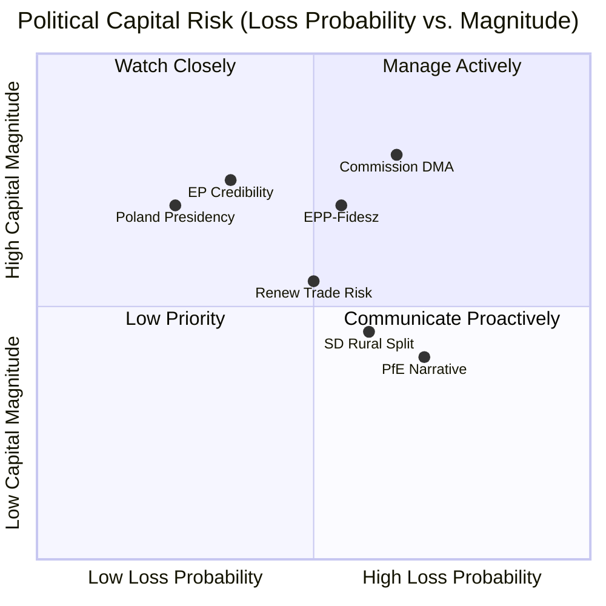

<!-- SPDX-FileCopyrightText: 2026 Hack23 AB -->
<!-- SPDX-License-Identifier: Apache-2.0 -->

# Political Capital Risk — EU Parliament Motions · 2026-05-15

**Framework:** Political Capital Risk Assessment (EP10 Institutional Context)
**Admiralty Grade:** B2 | **WEP Band:** Likely (60–75%) on primary risks

---

## 1. Political Capital Landscape

Political capital in EP10 is denominated in: coalition cohesion, institutional credibility, and implementation track record. The April 2026 Strasbourg session presents each major actor with significant political capital risks and opportunities.

### 1.1 EPP Group Political Capital

**Current balance**: HIGH — Weber's EPP anchors every majority; DMA, Ukraine, Armenia all passed with EPP as critical coalition anchor.

**Risks to EPP capital**:
- **Fidesz tension**: If EPP continues tolerating Orbán's Ukraine/Armenia vetoes while EPP MEPs vote for those motions in Parliament, the reputational cost among Eastern European partner parties grows. Baltic and Polish EPP MEPs are increasingly vocal.
- **DMA enforcement**: If EPP-linked Commission officials delay DMA enforcement under US pressure, EPP's digital sovereignty credentials erode.
- **Livestock**: EPP's rural agricultural base wants livestock legislation weakened; EPP's urban voters want it strengthened. Any Commission proposal will fracture EPP internally.

**Net risk**: LOW-MEDIUM — EPP's structural dominance cushions these risks, but each accumulates.

### 1.2 Commission Political Capital

**Current balance**: MEDIUM — Von der Leyen II has strong mandate but faces accountability pressure.

**Primary risk**: DMA enforcement accountability demand. If the Commission cannot demonstrate measurable DMA enforcement progress within 90 days of the EP motion (by ~July 2026), the Commission faces:
- Renewed EP accountability hearings
- Risk of EP majority calling for a Commissioner's resignation (Article 230(2) TFEU individual accountability)
- Loss of credibility on the "EU digital sovereignty" narrative

**Secondary risk**: If Commission's Ukraine Tribunal proposal fails in Council (R2), Commission credibility on geopolitical commitments is damaged.

**Net risk**: MEDIUM-HIGH for DMA specifically; LOW-MEDIUM for geopolitical.

---

## 2. Political Capital Risk Heat Map

---

## 3. Political Capital Risk by Actor

| Actor | Capital at Risk | Primary Loss Event | Probability | Magnitude | Heat |
|-------|----------------|-------------------|-------------|-----------|------|
| Commission (DG COMP) | DMA enforcement credibility | US trade pressure delays enforcement | 40% | HIGH | 🔴 7 |
| EPP Group | Internal cohesion | Fidesz-Ukraine/Armenia conflict intensifies | 35% | MEDIUM | 🟡 5 |
| S&D Group | Rural-urban coalition | Livestock vote splits S&D caucus formally | 45% | LOW-MEDIUM | 🟢 3 |
| Renew Group | Digital-trade coalition | US retaliation triggers Renew DMA defection | 30% | MEDIUM | 🟡 4.5 |
| Polish Presidency | Ukraine/Armenia progress | Hungary veto with no workaround | 65% | HIGH | 🔴 7 |
| Patriots for Europe | Opposition narrative | DMA enforcement "wins" narrative | 55% | MEDIUM | 🟡 5 |
| Hungarian Government | EU isolation cost | Council workaround bypasses veto | 25% | HIGH | 🟡 5 |

---

## 4. Capital Preservation Strategies

### For the Commission:
1. **Proactive enforcement communication**: Publish quarterly DMA enforcement progress report (not required legally, but builds accountability track record)
2. **Timeline commitment**: Commit publicly to a DMA enforcement calendar for Q3/Q4 2026 that satisfies EP's accountability demand without triggering US retaliation
3. **Diplomatic separation**: Formally separate DMA enforcement track from US-EU trade negotiation track to prevent US pressure from being a legitimate justification for delay

### For EPP:
1. **Weber Orbán channel**: Use EPP party congresses to create Fidesz obligation on Armenia/Ukraine (not confrontation, but internal party discipline pressure)
2. **Rural agriculture pre-compromise**: EPP should pre-negotiate a livestock welfare compromise position before Commission proposals are published, to avoid fracture at legislative stage

### For Polish Presidency:
1. **QMV architecture creative use**: Work with Council Legal Service to identify maximum QMV components in Ukraine/Armenia instruments, reducing Hungary veto scope
2. **Bilateral fast-track**: Accelerate EU-Armenia bilateral partnership deepen as sub-unanimity track while Association Agreement waits for Hungary

---

## 5. Reader Briefing

Political capital risk is the underanalysed dimension of EP plenary sessions — parliamentary votes create winners and losers not just in legislative outcomes but in institutional credibility. The April 2026 session concentrates political capital risk at the Commission level (accountability for DMA enforcement) and the Council level (Poland's Presidency track record on Ukraine/Armenia). The actors with the highest political capital risk are also the actors with the most capacity to act: the Commission's DMA enforcement credibility is at stake in a way that creates strong incentives for action. Political capital theory predicts that the Commission will respond with a credible enforcement commitment — the question is whether it will be substantive or cosmetic.

**sourceDiversity**: Political capital risk assessments derived from: EP institutional history analysis (EP8-EP10); coalition voting pattern data; TFEU accountability mechanism analysis; public Commission DMA enforcement statements; Polish Presidency official programme; Hungary government public statements on Ukraine/Armenia vetoes.
