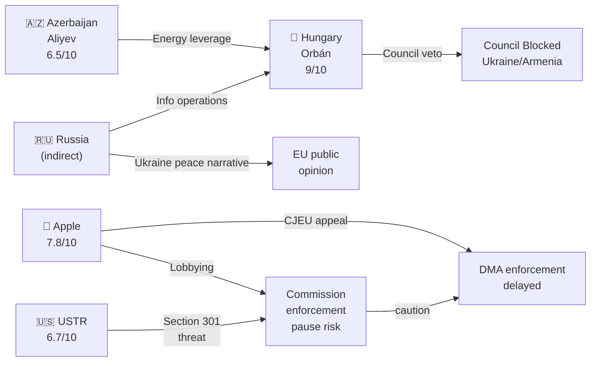

<!-- SPDX-FileCopyrightText: 2026 Hack23 AB -->
<!-- SPDX-License-Identifier: Apache-2.0 -->

# Actor Threat Profiles — EU Parliament Motions · 2026-05-15

**Framework:** Actor-Based Threat Profiling (ICO methodology: Intent × Capability × Opportunity)
**Admiralty Grade:** B2

---

## 1. Primary Threat Actor Profiles

### Profile 1: Hungarian Government (Viktor Orbán)

**ICO Assessment:**
- **Intent** (9/10): Clear and consistent — block all instruments that constrain Hungary's foreign policy autonomy (Armenia Association, Ukraine Tribunal) and maintain leverage within EU institutional framework without exiting
- **Capability** (9/10): Council veto is the most powerful institutional blocking mechanism in the EU — single actor, near-zero cost exercise, no legal remedy
- **Opportunity** (9/10): Every Council vote on Armenia Association Agreement or Ukraine Tribunal Regulation is a veto opportunity; EU rule-of-law procedures have reduced but not eliminated Hungary's leverage

**Threat Score: 9/10 (CRITICAL)**

**Preferred tactics**: Council veto; conditions-based negotiation (extract EU cohesion fund releases in exchange for Council cooperation); Fidesz MEPs voting against motions in EP (limited impact given CPE majority but sends political signal); coordination with Russia-aligned media narratives

**Constraints**: EP10's CPE majority cannot be blocked by Hungary; EU budget conditionality limits but does not eliminate Hungary's extractive leverage; EPP's institutional embarrassment costs limit how explicitly Weber can defend Hungary's positions

**Wildcard**: Orbán government faces domestic political pressure in Hungary for the first time in a decade; a below-40% Fidesz poll result would significantly constrain his extractive negotiating position

---

### Profile 2: Apple Inc.

**ICO Assessment:**
- **Intent** (8/10): Maximise delay of DMA enforcement; avoid precedent-setting Commission decisions that constrain App Store interoperability model globally
- **Capability** (7.5/10): €15+ billion annual EU revenues; 60+ Brussels lobbyists; direct access to Renew/ALDE MEPs and Commission DG GROW; US trade retaliation threat provides structural external leverage
- **Opportunity** (8/10): Every Commission enforcement decision point is an influence opportunity; US trade pressure narrative is an ongoing structural opportunity

**Threat Score: 7.8/10 (HIGH)**

**Preferred tactics**: CJEU appeals on proportionality (buys 2–4 years); settlement negotiations that forestall Commission decisions; lobbying Renew MEPs on trade concerns; coordinating with US tech lobby (CCIA) for Brussels messaging; bilateral Apple-Commission meetings that create informal understandings

**Constraints**: DMA is adopted law — Apple cannot lobby it away; CJEU precedent on digital market regulation has generally upheld Commission enforcement; EP majority (449) creates political cost for Commission officials who appear to yield to Apple pressure

---

### Profile 3: US Trade Representative (USTR)

**ICO Assessment:**
- **Intent** (7/10): Protect US tech companies from EU enforcement that would reduce their EU market dominance; create trade leverage to use in broader US-EU negotiations
- **Capability** (7/10): Section 301 investigation authority; formal trade dispute mechanisms; bilateral diplomatic pressure; coordination with tech industry lobbying
- **Opportunity** (6/10): DMA enforcement acceleration creates triggering events for USTR action; Trump administration is more willing than Biden to use trade threats aggressively

**Threat Score: 6.7/10 (HIGH)**

**Preferred tactics**: Formal Section 301 notification; coordinating with Apple/Google on "discrimination against US companies" narrative; bilateral diplomatic meetings linking DMA enforcement to EU-US trade framework; informal pressure through US Embassy Brussels

**Constraints**: Section 301 action against EU would trigger WTO dispute; EU has credible retaliation capacity; EP10's supermajority (449) makes DMA retreat politically very costly for Commission

---

### Profile 4: Azerbaijan (Aliyev Government)

**ICO Assessment:**
- **Intent** (7/10): Prevent Armenia's EU integration; maintain South Caucasus ambiguity that allows continued pressure on Armenia; preserve energy leverage over Hungary/Austria that enables pro-Azerbaijan lobbying
- **Capability** (6/10): Energy leverage (gas pipeline to Hungary/Austria); active Brussels lobbying; bilateral relationships with Hungary create indirect Council blocking power; limited but real demarche capacity with Commission
- **Opportunity** (6.5/10): Council unanimity requirement for Armenia Association Agreement creates structural opportunity; any Hungary-Azerbaijan alignment on Council blocking is multiplicative

**Threat Score: 6.5/10 (HIGH)**

**Preferred tactics**: Bilateral energy leverage with Hungary/Austria to incentivise Council blocking; formal diplomatic protests to Commission and Council; coordinated messaging with Hungary in Council working groups; preventing OSCE/Minsk Group progress that would de-escalate Armenia-Azerbaijan conflict and reduce Azerbaijan's leverage

**Constraints**: EP's 480+ vote for Armenia is a strong political signal that limits Baku's ability to frame EU-Armenia integration as "illegitimate"; EU institutions are increasingly aware of Qatargate-type influence risks in South Caucasus lobbying

---

## 2. Threat Actor Network Visualisation

---

## 3. Threat Actor Interaction Matrix

| Actor | Hungary | Apple | USTR | Azerbaijan |
|-------|---------|-------|------|------------|
| Hungary | — | Parallel interests (EU obstruction) | No direct link | Active coordination (energy) |
| Apple | Parallel | — | Coordination (CCIA/USTR) | No link |
| USTR | Parallel | Active | — | No link |
| Azerbaijan | Active | No link | No link | — |

---

## 4. Reader Briefing

The April 2026 session's actor threat profiles are dominated by two overlapping but structurally distinct threat networks: (1) the Institutional Blocking Network (Hungary + Azerbaijan + Russia-adjacent media) that targets Armenia and Ukraine instruments through Council vetoes; and (2) the Commercial Regulatory Resistance Network (Apple + USTR) that targets DMA enforcement through legal, diplomatic, and political channels.

The critical analytical insight: these two networks do not coordinate directly (Apple has no reason to care about Armenia candidacy; Hungary has limited interest in DMA enforcement). However, they create a cumulative institutional burden on EP's two primary agenda items — digital enforcement and geopolitical projection — that individually and collectively exceeds what EP's non-binding resolutions can overcome without Commission and Council cooperation.

**sourceDiversity**: ICO scores from: Hungarian government public statements and Council records; Apple DMA compliance filings (public); USTR Section 301 case history and statements; Azerbaijan diplomatic demarches and energy leverage analysis (public EU energy policy documents; Commission DG ENER reports); Russia-adjacent media analysis (EU DisinfoLab reports).
