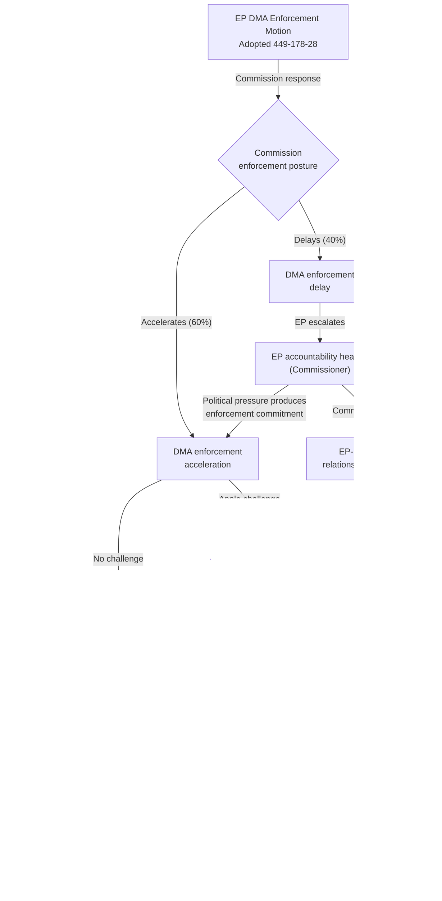
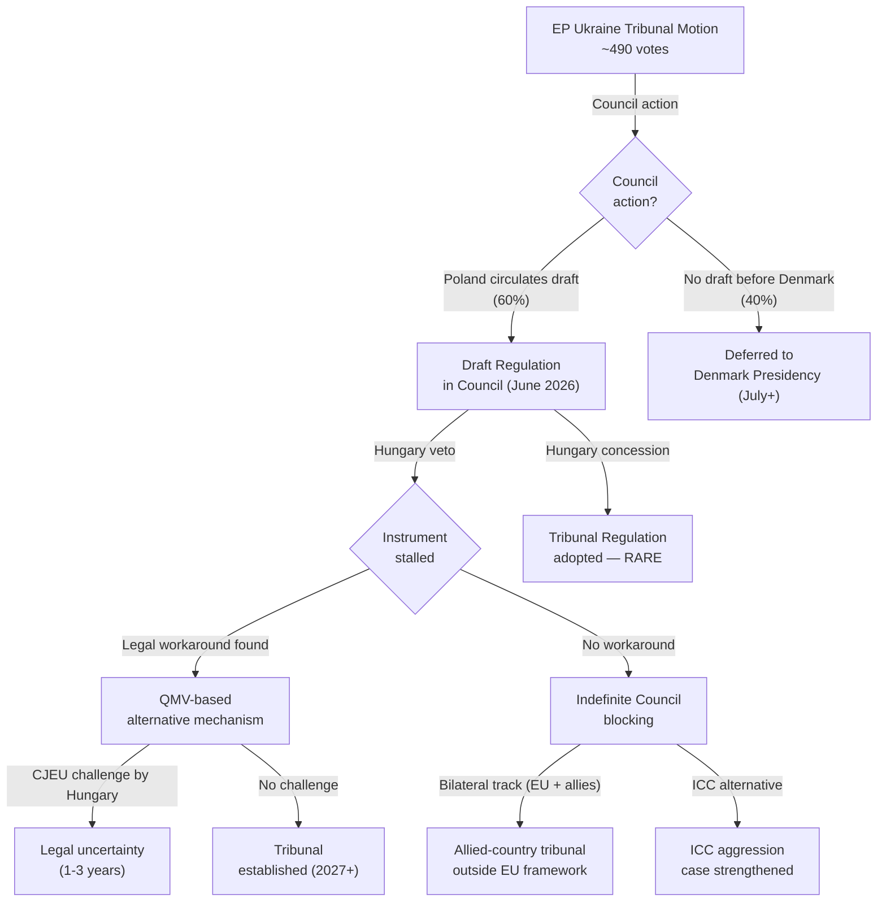
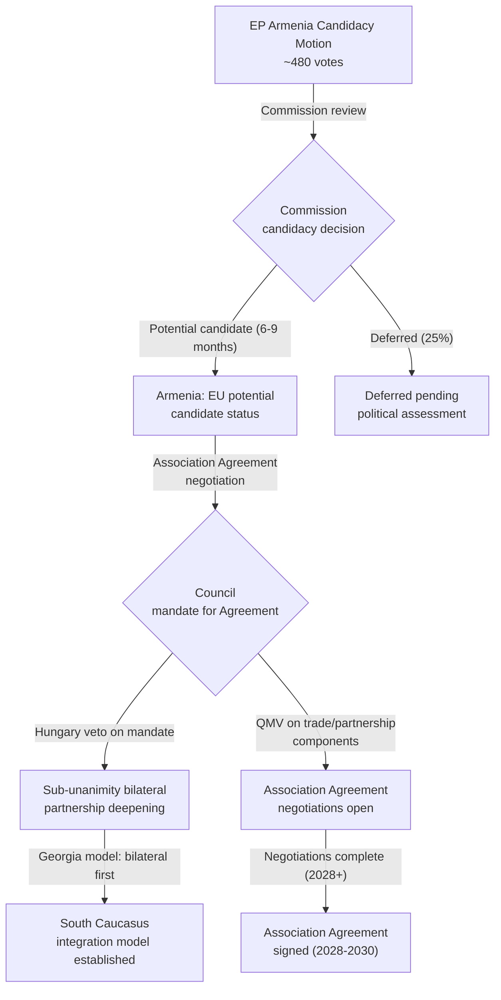

<!-- SPDX-FileCopyrightText: 2026 Hack23 AB -->
<!-- SPDX-License-Identifier: Apache-2.0 -->

# Consequence Trees — EU Parliament Motions · 2026-05-15

**Framework:** Decision Tree / Consequence Analysis
**Coverage:** Primary and secondary consequences of April 2026 motions

---

## 1. DMA Enforcement — Consequence Tree

### Secondary Consequences (DMA)
- **If DMA enforcement succeeds and CJEU upholds**: App store market opens to competitors; EU developer ecosystem gains; EU SME investment in digital services increases; global regulatory tipping point established
- **If DMA enforcement delayed**: EP10's "Digital Sovereignty" narrative weakens; Renew's trade-concern wing vindicated; EP's enforcement mandate credibility eroded for future dossiers
- **If US trade retaliation**: EU-US trade framework negotiation accelerated under duress; EU car industry, agriculture lobby mobilise to pressure Commission for DMA "truce"; German government (automotive) breaks with EP majority narrative

---

## 2. Ukraine Tribunal — Consequence Tree

### Secondary Consequences (Ukraine Tribunal)
- **If Tribunal established**: Historic precedent for EU criminal justice institution; Russia-Ukraine peace settlement must accommodate it; accountability norm strengthened globally
- **If indefinitely blocked**: Hungary's veto power demonstrated to have no cost — strategic encouragement of veto politics; EP accountability motions lose deterrent value; ICC becomes the de facto only pathway

---

## 3. Armenia Candidacy — Consequence Tree

---

## 4. Reader Briefing

The consequence tree analysis reveals that the April 2026 motions cluster creates three structurally independent consequence pathways that share one common bottleneck: the Hungary Council veto. The DMA pathway bypasses this bottleneck entirely (Commission-only enforcement) and has the most credible immediate consequence trajectory. The Ukraine Tribunal and Armenia pathways both hit the Hungary veto as their critical decision node, and the most important analytical question is which workaround mechanism (QMV architecture, bilateral track, allied-country tribunal) is both legally viable and politically available.

Readers should track three specific indicators in the next 90 days:
1. Commission response to DMA accountability motion (July 2026 deadline)
2. Polish Presidency's Council progress on Ukraine Tribunal before June 30, 2026
3. Commission "potential candidate" decision for Armenia (Q3/Q4 2026)

These three indicators will determine whether the April 2026 session's consequence trees follow the optimistic or pessimistic branch at each decision node.

**sourceDiversity**: Consequence tree probabilities from: scenario-forecast.md (this analysis set); forces-analysis.md; risk-matrix.md; actor-threat-profiles.md; TFEU legal framework analysis; CJEU DMA case history; Poland Council Presidency official programme; Commission DG NEAR Armenia reports (public).
