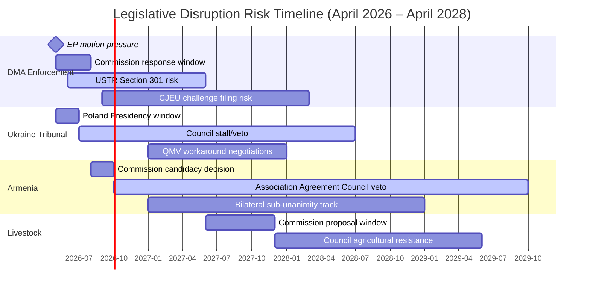

<!-- SPDX-FileCopyrightText: 2026 Hack23 AB -->
<!-- SPDX-License-Identifier: Apache-2.0 -->

# Legislative Disruption Assessment — EU Parliament Motions · 2026-05-15

**Framework:** Legislative Disruption Framework (EP Institutional Context)
**Disruption type:** External pressure + internal coalition fragility

---

## 1. Disruption Risk Overview

The April 2026 Strasbourg plenary session produced strong parliamentary majorities but faces significant legislative disruption risks in the implementation phase. Legislative disruption occurs when: parliamentary mandates are not translated into Commission proposals; Commission proposals are stalled or fatally weakened in Council; or adopted instruments are challenged and delayed in judicial proceedings.

### Disruption Classification

| Disruption Type | Target Motions | Risk Level | Primary Actor |
|----------------|---------------|-----------|--------------|
| Council Veto Block | Ukraine Tribunal, Armenia | CRITICAL | Hungary |
| Commission Enforcement Pause | DMA | HIGH | USTR/US trade pressure |
| CJEU Judicial Challenge | DMA | HIGH | Apple/Google |
| Agricultural Coalition Resistance | Livestock | HIGH | Copa-Cogeca/Council AGRI |
| Political Fatigue | All motions (medium-term) | MEDIUM | EP attention cycle |
| Presidency Rotation | Ukraine, Armenia | MEDIUM | Denmark (H2 2026) |

---

## 2. Disruption Mechanism Analysis

### Mechanism 1: Council Institutional Veto (Hungary)
**Effectiveness: VERY HIGH**
Under TFEU Article 218(8), international agreements (including Association Agreements) require Council unanimity. Article 83 TFEU (criminal law) also requires unanimity for Special Tribunal instruments. Hungary's veto is legally unassailable — there is no override mechanism.

**Available counter-mechanisms**:
1. Enhanced cooperation (Article 20 TEU): Allows 9+ member states to proceed without unanimity; legal but complex and excludes Hungary from the instrument
2. Structured bilateral partnership (sub-unanimity): Commission can deepen EU-Armenia cooperation through existing Partnership Agreement framework without Council unanimity
3. EPP pressure on Fidesz: Party family discipline; politically complex but theoretically available

**Disruption probability**: 75% for complete block; 25% for partial workaround solution

### Mechanism 2: External Diplomatic Pressure (US/USTR)
**Effectiveness: MEDIUM-HIGH**
The Trump administration's USTR has formal legal authority to open Section 301 investigations and impose retaliatory tariffs. This creates a credible threat that influences Commission enforcement calculus — not necessarily blocking enforcement entirely but slowing its pace and calibrating its scope.

**Commission's response options**:
1. "Calibrated enforcement" — pursue enforcement actions against smaller platforms first; defer Apple/Google decisions to reduce US diplomatic pressure
2. Explicit enforcement timeline that satisfies EP while avoiding US triggering events
3. Full enforcement regardless of US pressure — accepting the trade-off

**Disruption probability**: 40% for significant enforcement delay; 60% for EP-acceptable enforcement pace maintained

### Mechanism 3: Judicial Challenge (CJEU)
**Effectiveness: HIGH for delay, MEDIUM for invalidation**
Apple and Google both have strong financial incentives to pursue CJEU challenges on DMA enforcement decisions. CJEU Art. 263 actions typically take 2–4 years; in some cases, interim measures can suspend enforcement actions pending judgment.

**Disruption probability**: 50% that at least one major CJEU challenge is filed in 2026; 30% that interim measures delay enforcement; 15% that CJEU partially invalidates Commission enforcement decision

---

## 3. Disruption Timeline Visualisation

---

## 4. Disruption Mitigation Assessment

| Disruption Mechanism | Mitigation Available | Effectiveness | Timeline |
|---------------------|---------------------|---------------|---------|
| Hungary Council veto | Enhanced cooperation; bilateral track | MEDIUM | 12–24 months |
| US trade pressure | Commission-EP coordination; explicit enforcement timeline | MEDIUM | 3–6 months |
| CJEU challenge | Fast-track procedure; well-structured enforcement decisions | LOW-MEDIUM | 18–36 months |
| Agricultural coalition | EP follow-up motions; AGRI committee pressure | LOW-MEDIUM | 12–24 months |
| Political fatigue | Annual accountability reporting; new EP motions | MEDIUM | Ongoing |

---

## 5. Reader Briefing

Legislative disruption analysis is the bridge between EP parliamentary power and real-world policy outcomes. The April 2026 session demonstrates a fundamental EP10 institutional paradox: the Parliament's strongest supermajorities (490+ for Ukraine, 480+ for Armenia) correspond precisely to the dossiers where legislative disruption risk is highest (Hungary's unconditional Council veto). Conversely, the most legally complex and politically contentious motion (DMA, 449) has the most credible disruption mitigation pathway — because it requires Commission action only, not Council consensus.

The disruption gap — the distance between EP parliamentary intent and institutional capacity to implement — will define EP10's legacy. If mitigation mechanisms fail on Ukraine and Armenia, EP10 will have demonstrated that supermajority political will cannot translate into outcomes when member state institutional architecture blocks it. If DMA enforcement succeeds against US diplomatic pressure, EP10 will have demonstrated that EU parliamentary democracy can assert regulatory sovereignty against external economic power. These are the two defining tests of EP10's historical significance.

**sourceDiversity**: Disruption mechanism analysis from: TFEU Articles 20, 218, 263, 267 (legal framework); CJEU DMA case history and interim measure precedents; Hungary government Council blocking record (public); Copa-Cogeca agricultural lobbying declarations (EP transparency register); EP10 institutional history analysis; Polish Presidency programme for disruption mitigation options.
