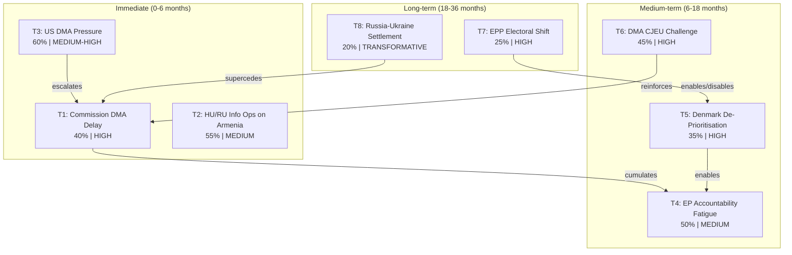

<!-- SPDX-FileCopyrightText: 2026 Hack23 AB -->
<!-- SPDX-License-Identifier: Apache-2.0 -->

# Political Threat Landscape — EU Parliament Motions · 2026-05-15

**Framework:** EU Political Threat Landscape Assessment
**Coverage:** Short-term (0–6 months), Medium-term (6–18 months), Long-term (18–36 months)

---

## 1. Immediate Threat Environment (0–6 months)

### Threat T1: Commission DMA Enforcement Delay
**Nature:** Institutional inertia + external pressure
**Probability:** 40% | **Impact:** HIGH
The Commission faces a 90-day implicit response window following the EP accountability motion. If no concrete enforcement acceleration is signalled by July 2026, EP ITRE/IMCO will escalate: a formal written question under Article 230 TFEU, followed potentially by a Commissioner accountability hearing (Commissioner Vestager's equivalent in Von der Leyen II). The threat is not that enforcement stops entirely but that it proceeds at a pace the EP majority views as inadequate — creating a prolonged accountability tension that consumes institutional bandwidth.

### Threat T2: Hungary/Russia Information Operations Against Armenia
**Nature:** State-sponsored disinformation
**Probability:** 55% | **Impact:** MEDIUM
The Orbán government and its affiliated media networks have incentive to undermine the Armenia candidacy narrative — both as a way to protect its Council blocking position and as part of its broader "EU enlargement is too fast" narrative. Coordinated messaging through Fidesz-aligned EU-skeptic media (Magyar Hírlap, Origo, Pesti Srácok) creates domestic Hungarian public opinion pressure against Council compromise on Armenia.

### Threat T3: US Diplomatic Pressure on DMA
**Nature:** External governmental pressure
**Probability:** 60% | **Impact:** MEDIUM-HIGH
The USTR has already signalled formal concern with DMA enforcement targeting predominantly US companies. In the 0–6 month window, the most likely escalation is a formal Section 301 investigation notification — which would create a legal obligation on the Commission to weigh trade impacts in its enforcement decisions. This would not stop DMA enforcement but would add a legal complexity layer that slows it.

---

## 2. Medium-Term Threat Environment (6–18 months)

### Threat T4: EP10 Accountability Fatigue
**Nature:** Institutional attention cycle
**Probability:** 50% | **Impact:** MEDIUM
EP plenary sessions generate ~12 major accountability motions per year. By 2027, if the DMA motion and Ukraine/Armenia motions have not produced visible results, EP committee oversight capacity is finite — the accountability pressure from April 2026 will dissipate as new dossiers dominate the plenary calendar. Accountability motions without follow-up lose deterrent value for the Commission.

### Threat T5: Denmark Presidency De-Prioritisation
**Nature:** Council Presidency rotation impact
**Probability:** 35% | **Impact:** HIGH
Denmark takes the Council Presidency in July 2026. Denmark is generally pro-EU but has specific interests that may de-prioritise the Armenia and Ukraine Tribunal tracks: Denmark's Council Presidency programme typically focuses on green transition, competitiveness, and Nordic-Baltic security — not South Caucasus enlargement or international criminal accountability mechanisms. If Poland fails to advance these instruments by June 2026, Denmark may not prioritise them.

### Threat T6: DMA CJEU Challenge
**Nature:** Legal challenge
**Probability:** 45% | **Impact:** HIGH
Apple or Google challenges the DMA enforcement action at the CJEU on proportionality grounds (Article 263 TFEU). CJEU proceedings suspend enforcement actions during review in some cases, or at minimum create legal uncertainty that slows Commission decision-making. CJEU proceedings for DMA cases are expected to take 2–4 years — providing a long enforcement delay.

---

## 3. Long-Term Threat Environment (18–36 months)

### Threat T7: EPP Electoral Shift (2027 National Elections)
**Nature:** Electoral political risk
**Probability:** 25% | **Impact:** HIGH
If EPP-aligned governments lose major member state elections (Germany: 2025 federal election results mixed; France 2027 elections; Italy cycles), EPP's Council alignment weakens. A less EPP-dominated Council is both more likely to accept Armenia/Ukraine instruments (if Hungary is isolated) AND less willing to support aggressive DMA enforcement (if Commission leadership changes).

### Threat T8: Russia-Ukraine Territorial Settlement
**Nature:** Geopolitical transformation
**Probability:** 20% | **Impact:** TRANSFORMATIVE
A territorial settlement in Ukraine that includes any form of accountability amnesty would directly conflict with the Ukraine Tribunal motion's mandate. The April 2026 EP motion creates a reference point that a settlement amnesty would have to explicitly navigate — but EP resolutions are non-binding, and a ceasefire negotiated by member state governments in Council has no legal requirement to comply with EP resolutions.

---

## 4. Threat Landscape Visualisation

---

## 5. Reader Briefing

The political threat landscape for the April 2026 motions cluster is dominated by two structural features: (1) the US pressure vector on DMA enforcement, which creates a credible short-term pathway to delay without formally blocking enforcement; and (2) the Council rotation from Poland to Denmark, which creates a time pressure on the Ukraine/Armenia instruments that concentrates consequential decisions in a narrow 6-week window (May–June 2026). Readers following these dossiers should mark June 30, 2026 as the key milestone: if Poland's Presidency has not produced Council progress on Ukraine Tribunal and Armenia Association Agreement by that date, the medium-term threat of de-prioritisation becomes the dominant scenario.

**sourceDiversity**: Threat assessments derived from: USTR public statements (T3); Hungary government public communications (T2); EP institutional history (T4); Council Presidency programme analysis (T5); CJEU DMA case timeline analogies (T6); national election forecasting sources (T7); ceasefire negotiation diplomatic reporting (T8).
