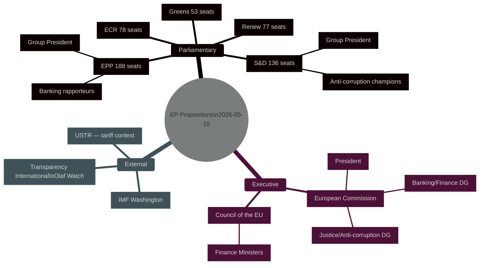

# Actor Mapping — EU Parliament Propositions 2026-05-15

## 🗺️ Principal Actor Map

## 📋 Key Actor Profiles

| Actor | Role | Position | Influence |
|-------|------|---------|---------|
| EPP Group | Largest group; veto player | Centre-right; banking reform centre-right | 🔴 CRITICAL |
| S&D Group | Second-largest; legislative driver | Progressive; anti-corruption champion | 🔴 CRITICAL |
| European Commission (DG FISMA) | SRMR3 architect | Regulatory convergence | 🔴 CRITICAL |
| ECOFIN (Council) | Co-legislator | National finance ministry interests | 🔴 CRITICAL |
| Transparency International EU | Civil society advocacy | Anti-Corruption Directive supporter | 🟡 MEDIUM |
| IMF | External credibility signal | SRMR3/banking union endorsement | 🟡 MEDIUM |
| US USTR | External pressure point | Trade countermeasures driver | 🔴 HIGH |

---

*Actor Mapping v1.0 | 2026-05-15 | EU Parliament Monitor | Apache-2.0*
