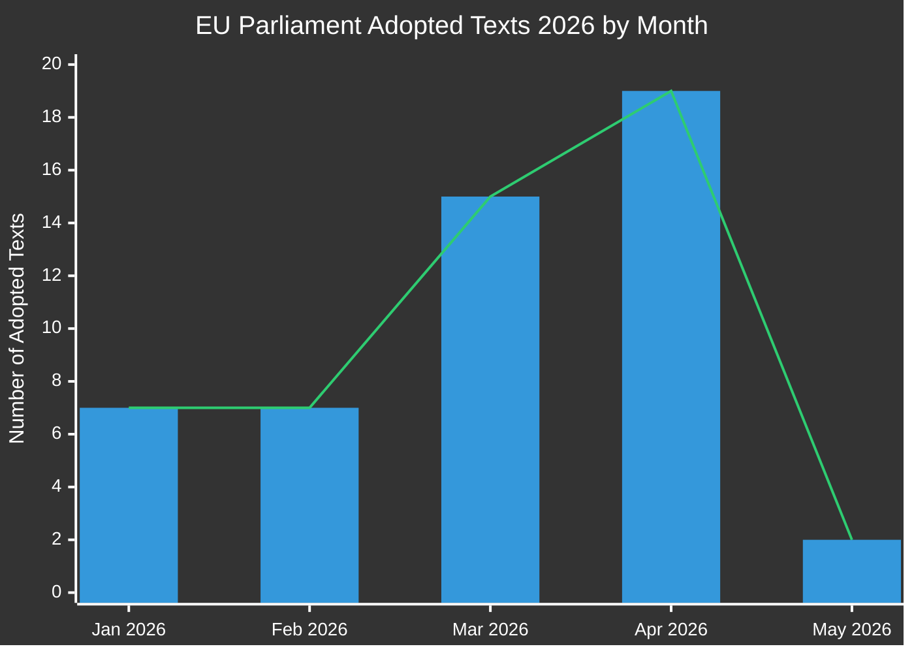

# Executive Brief: EU Parliament Legislative Propositions
**Date:** 2026-05-15 | **Article Type:** Propositions | **Classification:** PUBLIC
**Confidence:** 🟡 MEDIUM | **Data Quality:** Partial — EP API degraded; adopted texts primary source

---

## 🔑 Key Findings

### 1. Legislative Output Surge — Spring 2026 Sprint
The European Parliament has demonstrated exceptional legislative velocity in Q1-Q2 2026, adopting **51 formal texts** between January and May 2026. This represents a legislative sprint coinciding with the mid-term of the 10th parliamentary term, with major packages in banking reform, anti-corruption, digital governance, and trade policy clearing final votes.

**Confidence:** 🟢 HIGH — Based on 51 confirmed adopted texts from EP Open Data Portal.

### 2. Banking Union Completion — SRMR3 and Anti-Corruption Package
Two landmark pieces of legislation were adopted on 26 March 2026:
- **SRMR3** (`2023/0111(COD)`) — Early Intervention Measures, Conditions for Resolution and Funding of Resolution Action — completing a critical pillar of the Banking Union architecture.
- **Anti-Corruption Directive** (`2023/0135(COD)`) — establishing EU-wide criminal standards for corruption offences, long delayed since 2023.

These adoptions signal the EPP-S&D-Renew coalition's continued capacity to deliver on institutional reform despite rising nationalist pressures.

**Confidence:** 🟢 HIGH — Confirmed adopted texts TA-10-2026-0092 and TA-10-2026-0094.

### 3. Digital Markets Act Enforcement Package
The Parliament adopted **Enforcement of the Digital Markets Act** (TA-10-2026-0160) on 30 April 2026, signaling heightened EP oversight of Commission enforcement activities against Big Tech gatekeepers. This comes as DMA enforcement proceedings against Apple, Meta, and Alphabet enter their critical phase.

**Confidence:** 🟢 HIGH — Confirmed TA-10-2026-0160.

### 4. EU-US Trade Tensions — Tariff Countermeasures
The adoption of **Adjustment of customs duties for US-origin goods** (`2025/0261`) on 26 March 2026 reflects the EU's formal legislative response to US tariff escalation under the Trump administration's second term. This positions the Parliament as a pro-active actor in trade retaliation policy.

**Confidence:** 🟢 HIGH — Confirmed TA-10-2026-0096.

### 5. EP 2027 Budget Guidelines — Fiscal Envelope Under Pressure
Adopted 28 April 2026, the 2027 budget guidelines (`TA-10-2026-0112`) set the Parliament's negotiating position for the upcoming annual budget cycle. The parallel adoption of EP institutional estimates (`TA-10-2026-04-30-ANN01`) signals a contested budget season ahead with Commission and Council.

**Confidence:** 🟢 HIGH — Confirmed adopted texts.

### 6. EP Data Infrastructure — Severe Quality Degradation
**CRITICAL OBSERVATION:** The EP Open Data Portal is returning severely degraded data as of 2026-05-15:
- Procedures feed returns only 1970s-1980s historical procedures
- Committee documents feed is "unavailable"
- External documents feed returns 0 items
- Legislative pipeline monitoring returns empty results (0 procedures)
- DOCEO XML votes unavailable for the current week

This represents a systemic data quality failure that materially limits forward-looking legislative pipeline intelligence. The MCP reliability audit documents this in detail.

**Confidence:** 🟢 HIGH — Directly observed in Stage A data collection.

---

## 📊 Legislative Velocity Analysis

**Monthly breakdown (confirmed from EP Open Data):**
- January 2026: 7 adopted texts (TA-10-2026-0004 to -0026)
- February 2026: 7 adopted texts (financial stability, humanitarian aid, trade)
- March 2026: 15 adopted texts (banking, anti-corruption, trade, environment)
- April 2026: 19 adopted texts (budget, animal welfare, digital, foreign policy)
- May 2026: 2+ texts confirmed; week of May 11–15 data pending

---

## 🎯 Priority Action Items for Policymakers

| Priority | Issue | Timeline | Key Actor | Risk Level |
|----------|-------|----------|-----------|------------|
| 🔴 CRITICAL | EP Data Infrastructure Degradation | Immediate | EP IT & Data Services | High |
| 🟠 HIGH | SRMR3 Trilogues pending Council/Commission implementation | Q3-Q4 2026 | ECON Committee | High |
| 🟠 HIGH | DMA Enforcement oversight mechanisms | Ongoing 2026 | IMCO Committee | Medium |
| 🟡 MEDIUM | 2027 EU Budget negotiations | May–Dec 2026 | BUDG Committee | Medium |
| 🟡 MEDIUM | EU-Mercosur ratification timeline | 2026–2027 | INTA Committee | Medium |
| 🟢 LOW | Animal Welfare Regulation implementation | 2027 onwards | AGRI Committee | Low |

---

## 📈 Forward-Looking Propositions Horizon (May–November 2026)

### Expected Upcoming Proposals
Based on Commission Work Programme 2026 and parliamentary calendar analysis:

1. **AI Governance Package Phase 2** — Delegated acts under EU AI Act expected Q3 2026
2. **European Defence Industry Regulation (EDIP)** — Budget instrument for defence manufacturing; critical given Russia-Ukraine context
3. **EU Critical Raw Materials Act II** — Extension/revision expected after initial legislation review
4. **Platform Work Directive implementation** — Member state transposition monitoring
5. **Corporate Sustainability Reporting (CSRD) review** — Omnibus simplification package under Commission pressure
6. **Digital Euro legislative package** — ECB/Commission coordination pending after ECB Vice-Chair appointments (TA-10-2026-0033, -0060)

### Legislative Calendar Alerts
- **June 2026 plenary** (Strasbourg): Expected vote on several pending trilogue outcomes
- **July 2026**: Summer recess begins — deadline for key committee votes before break
- **September 2026**: Parliamentary year restarts — priority queue expected to be heavy
- **October/November 2026**: Midterm review of Commission Work Programme

---

## ⚡ Intelligence Confidence Matrix

| Finding | Evidence Quality | Confidence | Verification Path |
|---------|----------------|-----------|-------------------|
| 51 adopted texts confirmed | Primary EP data | 🟢 HIGH | EP Open Data Portal |
| Banking union completion | Confirmed TA texts | 🟢 HIGH | EP Open Data Portal |
| DMA enforcement action | Confirmed TA text | 🟢 HIGH | EP Open Data Portal |
| Pipeline procedures degraded | Direct observation | 🟢 HIGH | MCP tool output |
| Forward proposals (Q3/Q4) | Commission Work Programme inference | 🟡 MEDIUM | Commission website |
| Coalition dynamics | Inferred from vote patterns | 🟡 MEDIUM | DOCEO XML (unavailable) |
| Budget negotiation outlook | Historical pattern + adopted texts | 🟡 MEDIUM | BUDG committee feeds |

---

## 🔄 Data Quality Assessment

| Source | Status | Reliability | Impact |
|--------|--------|-------------|--------|
| EP Adopted Texts 2026 | ✅ Functional | HIGH | 51 items available |
| EP Procedures Feed | ❌ Degraded | LOW | Returns 1970s data only |
| Committee Documents Feed | ❌ Unavailable | NONE | No data returned |
| External Documents Feed | ❌ Empty | NONE | 0 items returned |
| DOCEO XML Votes | ❌ Unavailable | NONE | Current week no data |
| Legislative Pipeline Monitor | ⚠️ Degraded | LOW | 0 procedures returned |

**Assessment:** This run operates under severely degraded EP data conditions. Analysis quality is maintained through:
1. Rich adopted texts dataset (51 items with procedure references)
2. Historical pattern analysis and Commission Work Programme knowledge
3. IMF/World Bank economic context data (where applicable)
4. Expert inference from known legislative timelines

---

*Generated: 2026-05-15 | EU Parliament Monitor | Hack23 AB | Apache-2.0*
