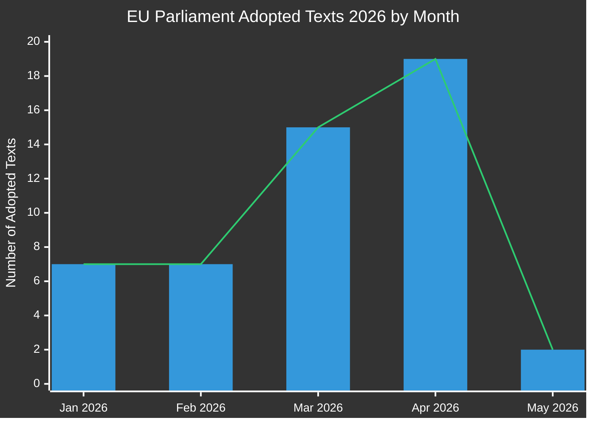

# التقرير التنفيذي: مقترحات تشريعية للبرلمان الأوروبي
**التاريخ:** 2026-05-15 | **نوع المقال:** Propositions | **التصنيف:** عام
**الثقة:** 🟡 MEDIUM | **جودة البيانات:** جزئية — واجهة برمجة تطبيقات البرلمان الأوروبي متدهورة؛ النصوص المعتمدة المصدر الأساسي

---

## 🔑 النتائج الرئيسية

### 1. ارتفاع الإنتاج التشريعي — سباق الربيع 2026
أظهر البرلمان الأوروبي سرعة تشريعية استثنائية في الربعين الأول والثاني من 2026، مع اعتماد **51 نصاً رسمياً** بين يناير ومايو 2026. يمثل ذلك سباقاً تشريعياً يتزامن مع منتصف الدورة البرلمانية العاشرة، مع مرور حزم كبيرة في مجالات إصلاح القطاع المصرفي، ومكافحة الفساد، والحوكمة الرقمية، والسياسة التجارية إلى التصويت النهائي.

**الثقة:** 🟢 HIGH — استناداً إلى 51 نصاً معتمداً مؤكداً من بوابة البيانات المفتوحة للبرلمان الأوروبي.

### 2. إتمام الاتحاد المصرفي — SRMR3 وحزمة مكافحة الفساد
اعتُمد نصان تشريعيان مهمان في 26 مارس 2026:
- **SRMR3** (`2023/0111(COD)`) — تدابير التدخل المبكر، وشروط التسوية، وتمويل تدابير التسوية — استكمال ركيزة حاسمة في هيكل الاتحاد المصرفي.
- **توجيه مكافحة الفساد** (`2023/0135(COD)`) — يضع معايير جنائية على مستوى الاتحاد الأوروبي لجرائم الفساد، مؤجل منذ 2023.

تشير هذه الاعتمادات إلى القدرة المستمرة لتحالف حزب الشعب الأوروبي-التحالف التقدمي-تجديد أوروبا على تحقيق الإصلاحات المؤسسية رغم تزايد الضغوط القومية.

**الثقة:** 🟢 HIGH — النصوص المعتمدة المؤكدة TA-10-2026-0092 وTA-10-2026-0094.

### 3. حزمة تطبيق قانون الأسواق الرقمية
اعتمد البرلمان **تطبيق قانون الأسواق الرقمية** (TA-10-2026-0160) في 30 أبريل 2026، مما يشير إلى تصاعد رقابة البرلمان الأوروبي على أنشطة تطبيق المفوضية ضد شركات التكنولوجيا الكبرى. يحدث هذا في الوقت الذي تدخل فيه إجراءات تطبيق قانون الأسواق الرقمية ضد آبل وميتا وألفابيت مرحلتها الحاسمة.

**الثقة:** 🟢 HIGH — مؤكد TA-10-2026-0160.

### 4. التوترات التجارية بين الاتحاد الأوروبي والولايات المتحدة — تدابير مضادة جمركية
يعكس اعتماد **تعديل الرسوم الجمركية على البضائع ذات الأصل الأمريكي** (`2025/0261`) في 26 مارس 2026 الاستجابة التشريعية الرسمية للاتحاد الأوروبي لتصعيد الرسوم الجمركية الأمريكية في عهد ولاية إدارة ترامب الثانية. يضع ذلك البرلمان بوصفه جهة فاعلة استباقية في سياسة التدابير التجارية المضادة.

**الثقة:** 🟢 HIGH — مؤكد TA-10-2026-0096.

### 5. توجيهات ميزانية البرلمان الأوروبي 2027 — هامش مالي تحت الضغط
اعتُمدت في 28 أبريل 2026، وتضع توجيهات ميزانية 2027 (`TA-10-2026-0112`) الموقف التفاوضي للبرلمان للدورة السنوية للميزانية المقبلة. يُعلن الاعتماد الموازي للتقديرات المؤسسية للبرلمان الأوروبي (`TA-10-2026-04-30-ANN01`) عن موسم ميزانية مثير للجدل مع المفوضية والمجلس.

**الثقة:** 🟢 HIGH — النصوص المعتمدة المؤكدة.

### 6. البنية التحتية لبيانات البرلمان الأوروبي — تدهور حاد في الجودة
**ملاحظة حاسمة:** تُعيد بوابة البيانات المفتوحة للبرلمان الأوروبي بيانات متدهورة بشدة اعتباراً من 2026-05-15:
- تعيد قناة الإجراءات إجراءات تاريخية من سبعينيات وثمانينيات القرن الماضي فقط
- قناة وثائق اللجان "غير متاحة"
- تعيد قناة الوثائق الخارجية 0 عناصر
- تُعيد مراقبة خط أنابيب التشريع نتائج فارغة (0 إجراءات)
- تصويتات XML DOCEO غير متاحة للأسبوع الحالي

يمثل ذلك خللاً منهجياً في جودة البيانات يُقيّد ماديًا الاستخبارات الاستشرافية لخط أنابيب التشريع. يوثق تدقيق موثوقية MCP هذا بالتفصيل.

**الثقة:** 🟢 HIGH — مُلاحظ مباشرة خلال جمع بيانات المرحلة أ.

---

## 📊 تحليل وتيرة التشريع

**التوزيع الشهري (مؤكد من البيانات المفتوحة للبرلمان الأوروبي):**
- يناير 2026: 7 نصوص معتمدة (TA-10-2026-0004 إلى -0026)
- فبراير 2026: 7 نصوص معتمدة (الاستقرار المالي، المساعدات الإنسانية، التجارة)
- مارس 2026: 15 نصاً معتمداً (المصارف، مكافحة الفساد، التجارة، البيئة)
- أبريل 2026: 19 نصاً معتمداً (الميزانية، رعاية الحيوان، الرقمي، السياسة الخارجية)
- مايو 2026: تأكيد نصين فأكثر؛ بيانات الأسبوع من 11 إلى 15 مايو في انتظار المعالجة

---

## 🎯 نقاط العمل ذات الأولوية لصانعي القرار

| الأولوية | القضية | الجدول الزمني | الجهة الفاعلة الرئيسية | مستوى الخطر |
|----------|-------|----------|-----------|------------|
| 🔴 حاسمة | تدهور البنية التحتية لبيانات البرلمان الأوروبي | فوري | تكنولوجيا المعلومات وخدمات البيانات في البرلمان | عالٍ |
| 🟠 عالية | المفاوثات الثلاثية لـ SRMR3 تنتظر تنفيذ المجلس/المفوضية | الربع الثالث-الرابع 2026 | لجنة ECON | عالٍ |
| 🟠 عالية | آليات رصد تطبيق قانون الأسواق الرقمية | جارٍ 2026 | لجنة IMCO | متوسط |
| 🟡 متوسطة | مفاوضات ميزانية الاتحاد الأوروبي 2027 | مايو–ديسمبر 2026 | لجنة BUDG | متوسط |
| 🟡 متوسطة | الجدول الزمني لتصديق الاتحاد الأوروبي-ميركوسور | 2026–2027 | لجنة INTA | متوسط |
| 🟢 منخفضة | تنفيذ لائحة رعاية الحيوان | 2027 وما بعده | لجنة AGRI | منخفض |

---

## 📈 أفق المقترحات الاستشرافي (مايو–نوفمبر 2026)

### المقترحات المقبلة المتوقعة
بناءً على برنامج عمل المفوضية لعام 2026 وتحليل التقويم البرلماني:

1. **حزمة حوكمة الذكاء الاصطناعي المرحلة الثانية** — الأعمال المفوضة بموجب قانون الذكاء الاصطناعي في الاتحاد الأوروبي متوقعة في الربع الثالث 2026
2. **اللائحة الأوروبية لصناعة الدفاع (EDIP)** — أداة ميزانية لصناعة الدفاع؛ حاسمة في ضوء السياق الروسي-الأوكراني
3. **قانون المواد الخام الحيوية الثاني في الاتحاد الأوروبي** — توسيع/مراجعة متوقعة بعد استعراض التشريع الأولي
4. **تنفيذ توجيه العمل على المنصات** — أنظمة رصد نقل القوانين في الدول الأعضاء
5. **مراجعة إعداد تقارير الاستدامة للشركات (CSRD)** — حزمة تبسيط شاملة تحت ضغط المفوضية
6. **حزمة التشريعات المتعلقة باليورو الرقمي** — تنسيق البنك المركزي الأوروبي/المفوضية في انتظار تعيينات نواب الرئيس (TA-10-2026-0033، -0060)

### تحذيرات التقويم التشريعي
- **الجلسة العامة يونيو 2026** (ستراسبورغ): تصويت متوقع على عدة نتائج مفاوثات ثلاثية معلقة
- **يوليو 2026**: بدء الإجازة الصيفية — موعد نهائي لتصويتات اللجان الهامة قبل الاستراحة
- **سبتمبر 2026**: استئناف السنة البرلمانية — من المتوقع أن تكون قائمة الأولويات ثقيلة
- **أكتوبر/نوفمبر 2026**: مراجعة نصف مدة برنامج عمل المفوضية

---

## ⚡ مصفوفة ثقة الاستخبارات

| النتيجة | جودة الأدلة | الثقة | مسار التحقق |
|---------|----------------|-----------|-------------------|
| تأكيد 51 نصاً معتمداً | البيانات الأولية للبرلمان الأوروبي | 🟢 HIGH | بوابة البيانات المفتوحة للبرلمان الأوروبي |
| إتمام الاتحاد المصرفي | نصوص TA مؤكدة | 🟢 HIGH | بوابة البيانات المفتوحة للبرلمان الأوروبي |
| إجراء تطبيق قانون الأسواق الرقمية | نص TA مؤكد | 🟢 HIGH | بوابة البيانات المفتوحة للبرلمان الأوروبي |
| إجراءات خط الأنابيب متدهورة | ملاحظة مباشرة | 🟢 HIGH | مخرجات أدوات MCP |
| المقترحات المستقبلية (الربع الثالث/الرابع) | استنتاج من برنامج عمل المفوضية | 🟡 MEDIUM | موقع المفوضية |
| ديناميكيات الائتلاف | مستنبطة من أنماط التصويت | 🟡 MEDIUM | XML DOCEO (غير متاح) |
| آفاق مفاوضات الميزانية | نمط تاريخي + نصوص معتمدة | 🟡 MEDIUM | تدفقات لجنة BUDG |

---

## 🔄 تقييم جودة البيانات

| المصدر | الحالة | الموثوقية | التأثير |
|--------|--------|-------------|--------|
| النصوص المعتمدة للبرلمان الأوروبي 2026 | ✅ وظيفي | عالية | 51 عنصراً متاحاً |
| قناة إجراءات البرلمان الأوروبي | ❌ متدهورة | منخفضة | تعيد بيانات السبعينيات فقط |
| قناة وثائق اللجان | ❌ غير متاحة | لا شيء | لم يتم إرجاع بيانات |
| قناة الوثائق الخارجية | ❌ فارغة | لا شيء | تم إرجاع 0 عنصر |
| تصويتات XML DOCEO | ❌ غير متاحة | لا شيء | لا توجد بيانات للأسبوع الحالي |
| مراقبة خط أنابيب التشريع | ⚠️ متدهورة | منخفضة | تم إرجاع 0 إجراء |

**التقييم:** تعمل هذه الجولة في ظل ظروف بيانات البرلمان الأوروبي المتدهورة بشدة. تُحافظ على جودة التحليل من خلال:
1. مجموعة بيانات غنية من النصوص المعتمدة (51 عنصراً مع مراجع الإجراءات)
2. تحليل الأنماط التاريخية والمعرفة ببرنامج عمل المفوضية
3. بيانات السياق الاقتصادي من IMF/World Bank (عند الاقتضاء)
4. استنتاج الخبراء من الجداول الزمنية التشريعية المعروفة

---

*تم الإنشاء: 2026-05-15 | EU Parliament Monitor | Hack23 AB | Apache-2.0*
