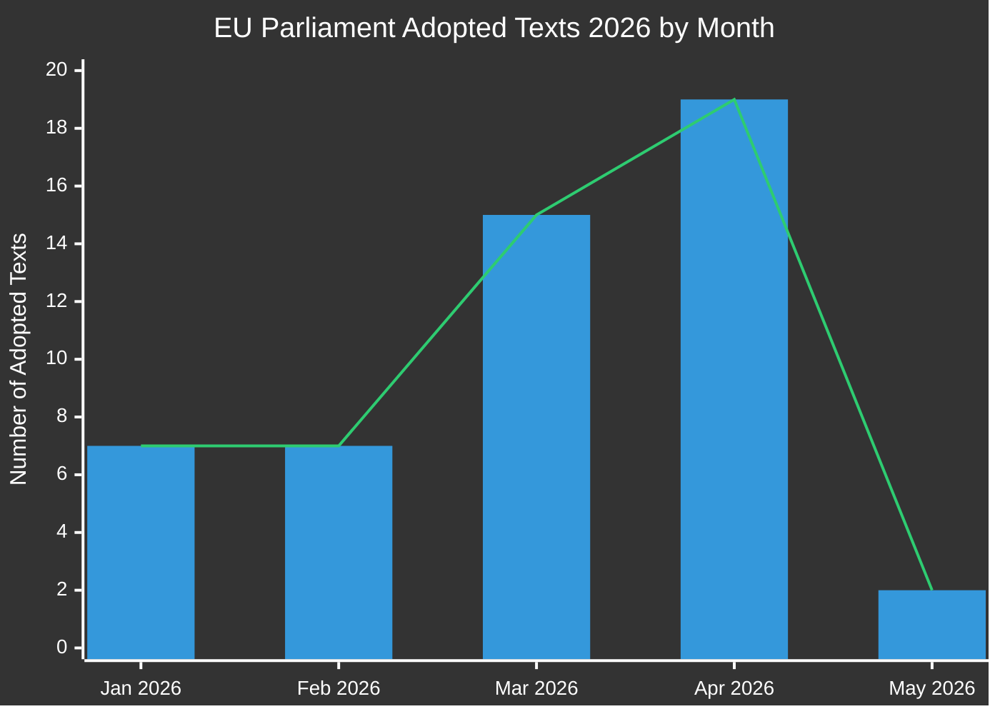

# Eksekutiv rapport: EU-Parlamentets lovgivningsmæssige propositioner
**Dato:** 2026-05-15 | **Artikeltype:** Propositioner | **Klassifikation:** OFFENTLIG
**Tillid:** 🟡 MEDIUM | **Datakvalitet:** Delvis — EP API degraderet; vedtagne tekster primær kilde

---

## 🔑 Vigtige resultater

### 1. Stigende lovgivningsproduktion — Forårsrush 2026
Europa-Parlamentet har demonstreret exceptionel lovgivningshastighed i Q1-Q2 2026 ved at vedtage **51 formelle tekster** mellem januar og maj 2026. Dette repræsenterer et lovgivningsrush, der falder sammen med midtvejspunktet for den 10. parlamentariske valgperiode, med store pakker inden for bankreform, antikorruption, digital styring og handelspolitik, der er kommet igennem til endelig afstemning.

**Tillid:** 🟢 HIGH — Baseret på 51 bekræftede vedtagne tekster fra EP Open Data Portal.

### 2. Bankforbundsafslutning — SRMR3 og antikorruptionspakke
To centrale lovgivningsmæssige tekster blev vedtaget den 26. marts 2026:
- **SRMR3** (`2023/0111(COD)`) — Tidlige interventionsforanstaltninger, betingelser for afvikling og finansiering af afviklingsforanstaltninger — fuldførelse af en kritisk søjle i bankforbundets arkitektur.
- **Antikorruptionsdirektivet** (`2023/0135(COD)`) — fastsætter EU-dækkende strafferetlige standarder for korruptionsforbrydelser, længe forsinket siden 2023.

Disse vedtagelser signalerer EPP-S&D-Renew-koalitionens fortsatte kapacitet til at levere på institutionel reform trods stigende nationalistiske pres.

**Tillid:** 🟢 HIGH — Bekræftede vedtagne tekster TA-10-2026-0092 og TA-10-2026-0094.

### 3. Digital Markets Act håndhævelsespakke
Parlamentet vedtog **Håndhævelse af Digital Markets Act** (TA-10-2026-0160) den 30. april 2026, signalerende øget EP-tilsyn med Kommissionens håndhævelsesaktiviteter mod Big Tech-portvogtere. Dette sker, mens DMA-håndhævelsessager mod Apple, Meta og Alphabet er ved at gå ind i deres kritiske fase.

**Tillid:** 🟢 HIGH — Bekræftet TA-10-2026-0160.

### 4. EU-USA handelsspændinger — Toldmodforanstaltninger
Vedtagelsen af **Tilpasning af told på varer af USA-oprindelse** (`2025/0261`) den 26. marts 2026 afspejler EU's formelle lovgivningsmæssige respons på USA's toldoptrapning under Trump-administrationens anden periode. Dette positionerer Parlamentet som en proaktiv aktør i handelsmotforanstaltningspolitik.

**Tillid:** 🟢 HIGH — Bekræftet TA-10-2026-0096.

### 5. EP 2027 budgetretningslinjer — Finansielt råderum under pres
Vedtaget den 28. april 2026 fastsætter 2027-budgetretningslinjerne (`TA-10-2026-0112`) Parlamentets forhandlingsposition for den kommende årlige budgetcyklus. Den parallelle vedtagelse af EP's institutionelle overslag (`TA-10-2026-04-30-ANN01`) signalerer en omstridt budgetsæson med Kommissionen og Rådet.

**Tillid:** 🟢 HIGH — Bekræftede vedtagne tekster.

### 6. EP's datainfrastruktur — Alvorlig kvalitetsforringelse
**KRITISK OBSERVATION:** EP Open Data Portal returnerer alvorligt forringet data pr. 2026-05-15:
- Procedurefeedet returnerer kun historiske procedurer fra 1970'erne-1980'erne
- Komitédokumentfeedet er "utilgængeligt"
- Eksternt dokumentfeed returnerer 0 elementer
- Lovgivningspipeline-overvågning returnerer tomme resultater (0 procedurer)
- DOCEO XML-afstemninger utilgængelige for den aktuelle uge

Dette repræsenterer en systemisk datakvalitetsfejl, der materielt begrænser den fremadskuende lovgivningspipelineefterretning. MCP-pålideligheds-auditen dokumenterer dette i detaljer.

**Tillid:** 🟢 HIGH — Direkte observeret ved indsamling af Stage A-data.

---

## 📊 Analyse af lovgivningshastighed

**Månedlig opdeling (bekræftet fra EP Open Data):**
- Januar 2026: 7 vedtagne tekster (TA-10-2026-0004 til -0026)
- Februar 2026: 7 vedtagne tekster (finansiel stabilitet, humanitær bistand, handel)
- Marts 2026: 15 vedtagne tekster (bank, antikorruption, handel, miljø)
- April 2026: 19 vedtagne tekster (budget, dyrevelfærd, digitalt, udenrigspolitik)
- Maj 2026: 2+ tekster bekræftet; ugen 11.–15. maj data afventer

---

## 🎯 Prioriterede handlingspunkter for politikere

| Prioritet | Spørgsmål | Tidslinje | Nøgleaktør | Risikoniveau |
|----------|-------|----------|-----------|------------|
| 🔴 KRITISK | EP-datainfrastrukturforringelse | Øjeblikkeligt | EP IT & Datatjenester | Høj |
| 🟠 HØJ | SRMR3-trialoguer afventer Råds-/Kommissionsimplementering | Q3-Q4 2026 | ECON-udvalg | Høj |
| 🟠 HØJ | DMA-håndhævelsesovervågningsmekanismer | Løbende 2026 | IMCO-udvalg | Medium |
| 🟡 MEDIUM | 2027 EU-budgetforhandlinger | Maj–December 2026 | BUDG-udvalg | Medium |
| 🟡 MEDIUM | EU-Mercosur-ratificeringstidslinje | 2026–2027 | INTA-udvalg | Medium |
| 🟢 LAV | Implementering af dyrevelfærdsforordning | 2027 og frem | AGRI-udvalg | Lav |

---

## 📈 Fremadskuende propositionshorisont (maj–november 2026)

### Forventede kommende forslag
Baseret på Kommissionens arbejdsprogram 2026 og analyse af parlamentarisk kalender:

1. **AI-styrningspakke fase 2** — Delegerede retsakter under EU's AI-lov forventes Q3 2026
2. **Europæisk forsvarsindustriforordning (EDIP)** — Budgetinstrument til forsvarsindustri; kritisk i lyset af Rusland-Ukraine-konteksten
3. **EU's lov om kritiske råmaterialer II** — Udvidelse/revision forventes efter gennemgang af indledende lovgivning
4. **Platformsarbejdsdirektivets implementering** — Overvågning af transponering i medlemsstat
5. **Gennemgang af virksomheders bæredygtighedsrapportering (CSRD)** — Omnibus-forenklingspakke under Kommissionspres
6. **Digital euro-lovgivningspakke** — ECB/Kommissionskoordinering afventer efter ECB's vicepræsidentudnævnelser (TA-10-2026-0033, -0060)

### Lovgivningskalenderadvarsler
- **Juni 2026-plenarmøde** (Strasbourg): Forventet afstemning om flere afventende trialogeresultater
- **Juli 2026**: Sommerferie begynder — frist for vigtige udvalgsstemmer inden pause
- **September 2026**: Parlamentsåret genoptages — prioritetskøen forventes at være tung
- **Oktober/november 2026**: Midtvejsgennemgang af Kommissionens arbejdsprogram

---

## ⚡ Efterretningskonfidensmatrix

| Resultat | Evidenskvalitet | Tillid | Verifikationssti |
|---------|----------------|-----------|-------------------|
| 51 vedtagne tekster bekræftet | Primære EP-data | 🟢 HIGH | EP Open Data Portal |
| Bankforbundsfuldførelse | Bekræftede TA-tekster | 🟢 HIGH | EP Open Data Portal |
| DMA-håndhævelsesforanstaltning | Bekræftet TA-tekst | 🟢 HIGH | EP Open Data Portal |
| Pipelineprocedurer forringet | Direkte observation | 🟢 HIGH | MCP-værktøjsoutput |
| Fremtidige forslag (Q3/Q4) | Kommissionens Arbejdsprogram-inferens | 🟡 MEDIUM | Kommissionswebsite |
| Koalitionsdynamik | Udledt fra afstemningsmodeller | 🟡 MEDIUM | DOCEO XML (utilgængeligt) |
| Budgetforhandlingsudsigter | Historisk mønster + vedtagne tekster | 🟡 MEDIUM | BUDG-udvalgsfeeds |

---

## 🔄 Datakvalitetsvurdering

| Kilde | Status | Pålidelighed | Indvirkning |
|--------|--------|-------------|--------|
| EP Vedtagne tekster 2026 | ✅ Funktionelle | HØJ | 51 elementer tilgængelige |
| EP Procedurefeed | ❌ Forringet | LAV | Returnerer kun 1970'er-data |
| Komitédokumentfeed | ❌ Utilgængeligt | INGEN | Ingen data returneret |
| Eksternt dokumentfeed | ❌ Tomt | INGEN | 0 elementer returneret |
| DOCEO XML-afstemninger | ❌ Utilgængelige | INGEN | Ingen data for nuværende uge |
| Lovgivningspipeline-overvågning | ⚠️ Forringet | LAV | 0 procedurer returneret |

**Vurdering:** Denne kørsel opererer under alvorligt forringede EP-datavilkår. Analysekvaliteten opretholdes gennem:
1. Rigt datasæt for vedtagne tekster (51 elementer med procedurereferences)
2. Historisk mønsteranalyse og viden om Kommissionens arbejdsprogram
3. IMF/World Bank økonomisk kontekstdata (hvor relevant)
4. Ekspertinferens fra kendte lovgivningstidslinjer

---

*Genereret: 2026-05-15 | EU Parliament Monitor | Hack23 AB | Apache-2.0*
