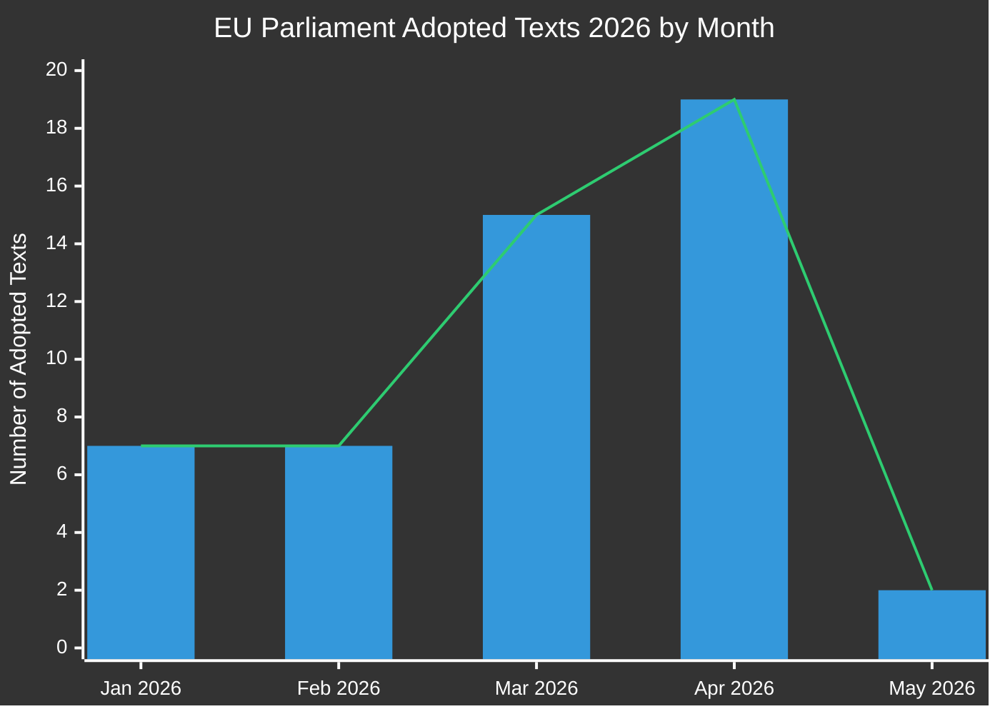

# Exekutivbericht: Gesetzgebungsvorschläge des Europäischen Parlaments
**Datum:** 2026-05-15 | **Artikeltyp:** Propositions | **Klassifizierung:** ÖFFENTLICH
**Vertrauen:** 🟡 MEDIUM | **Datenqualität:** Teilweise — EP-API degradiert; angenommene Texte primäre Quelle

---

## 🔑 Wichtigste Erkenntnisse

### 1. Anstieg der Gesetzgebungsproduktion — Frühjahrs-Sprint 2026
Das Europäische Parlament hat im Q1-Q2 2026 eine außergewöhnliche Gesetzgebungsgeschwindigkeit demonstriert und **51 formale Texte** zwischen Januar und Mai 2026 angenommen. Dies stellt einen Gesetzgebungs-Sprint dar, der mit dem Halbzeitpunkt der 10. Legislaturperiode zusammenfällt, mit großen Paketen in Bankreform, Antikorruption, digitaler Governance und Handelspolitik, die durch die abschließenden Abstimmungen gegangen sind.

**Vertrauen:** 🟢 HIGH — Basierend auf 51 bestätigten angenommenen Texten aus dem EP Open Data Portal.

### 2. Bankenunions-Vollendung — SRMR3 und Antikorruptionspaket
Zwei wichtige Gesetzgebungstexte wurden am 26. März 2026 angenommen:
- **SRMR3** (`2023/0111(COD)`) — Frühinterventionsmaßnahmen, Abwicklungsbedingungen und Finanzierung von Abwicklungsmaßnahmen — Vervollständigung eines kritischen Pfeilers der Bankenunionsarchitektur.
- **Antikorruptionsrichtlinie** (`2023/0135(COD)`) — legt EU-weite strafrechtliche Standards für Korruptionsdelikte fest, seit 2023 lange verzögert.

Diese Annahmen signalisieren die anhaltende Kapazität der EPP-S&D-Renew-Koalition für institutionelle Reformen trotz zunehmendem nationalistischen Druck.

**Vertrauen:** 🟢 HIGH — Bestätigte angenommene Texte TA-10-2026-0092 und TA-10-2026-0094.

### 3. Digital Markets Act-Durchsetzungspaket
Das Parlament nahm **Durchsetzung des Digital Markets Act** (TA-10-2026-0160) am 30. April 2026 an, was eine verstärkte EP-Aufsicht über die Durchsetzungsaktivitäten der Kommission gegen Big-Tech-Gatekeeper signalisiert. Dies geschieht, während die DMA-Durchsetzungsverfahren gegen Apple, Meta und Alphabet in ihre kritische Phase eintreten.

**Vertrauen:** 🟢 HIGH — Bestätigt TA-10-2026-0160.

### 4. EU-USA-Handelskonflikt — Zoll-Gegenmaßnahmen
Die Annahme der **Anpassung von Zöllen für Waren US-amerikanischen Ursprungs** (`2025/0261`) am 26. März 2026 spiegelt die formelle Gesetzgebungsreaktion der EU auf die US-Zollerhöhungen während der zweiten Amtszeit der Trump-Administration wider. Dies positioniert das Parlament als proaktiven Akteur in der Handelsgegensatzpolitik.

**Vertrauen:** 🟢 HIGH — Bestätigt TA-10-2026-0096.

### 5. EP-Haushaltslinien 2027 — Finanzieller Spielraum unter Druck
Die am 28. April 2026 angenommenen Haushaltslinien 2027 (`TA-10-2026-0112`) legen die Verhandlungsposition des Parlaments für den kommenden jährlichen Haushaltszyklus fest. Die parallele Annahme der institutionellen Voranschläge des EP (`TA-10-2026-04-30-ANN01`) kündigt eine kontroverse Haushaltssaison mit der Kommission und dem Rat an.

**Vertrauen:** 🟢 HIGH — Bestätigte angenommene Texte.

### 6. EP-Dateninfrastruktur — Schwerwiegende Qualitätsverschlechterung
**KRITISCHE BEOBACHTUNG:** Das EP Open Data Portal gibt ab 2026-05-15 schwer degradierte Daten zurück:
- Der Verfahrens-Feed gibt nur historische Verfahren aus den 1970er-1980er Jahren zurück
- Der Ausschussdokumenten-Feed ist "nicht verfügbar"
- Externer Dokumenten-Feed gibt 0 Einträge zurück
- Gesetzgebungs-Pipeline-Überwachung gibt leere Ergebnisse zurück (0 Verfahren)
- DOCEO-XML-Abstimmungen für die aktuelle Woche nicht verfügbar

Dies stellt einen systemischen Datenqualitätsfehler dar, der die vorausschauende Gesetzgebungs-Pipeline-Intelligenz materiell einschränkt. Die MCP-Zuverlässigkeitsrevision dokumentiert dies ausführlich.

**Vertrauen:** 🟢 HIGH — Direkt bei der Stage-A-Datenerhebung beobachtet.

---

## 📊 Analyse der Gesetzgebungsgeschwindigkeit

**Monatliche Aufschlüsselung (bestätigt aus EP Open Data):**
- Januar 2026: 7 angenommene Texte (TA-10-2026-0004 bis -0026)
- Februar 2026: 7 angenommene Texte (Finanzstabilität, humanitäre Hilfe, Handel)
- März 2026: 15 angenommene Texte (Bank, Antikorruption, Handel, Umwelt)
- April 2026: 19 angenommene Texte (Haushalt, Tierschutz, Digital, Außenpolitik)
- Mai 2026: 2+ Texte bestätigt; Woche 11.–15. Mai Daten ausstehend

---

## 🎯 Priorisierte Aktionspunkte für Entscheidungsträger

| Priorität | Frage | Zeitplan | Schlüsselakteur | Risikoniveau |
|----------|-------|----------|-----------|------------|
| 🔴 KRITISCH | EP-Dateninfrastrukturverschlechterung | Sofort | EP IT & Datendienste | Hoch |
| 🟠 HOCH | SRMR3-Trilog wartet auf Rats-/Kommissionsimplementierung | Q3-Q4 2026 | ECON-Ausschuss | Hoch |
| 🟠 HOCH | DMA-Durchsetzungsüberwachungsmechanismen | Laufend 2026 | IMCO-Ausschuss | Mittel |
| 🟡 MITTEL | Verhandlungen zum EU-Haushalt 2027 | Mai–Dezember 2026 | BUDG-Ausschuss | Mittel |
| 🟡 MITTEL | EU-Mercosur-Ratifizierungszeitplan | 2026–2027 | INTA-Ausschuss | Mittel |
| 🟢 NIEDRIG | Implementierung der Tierschutzverordnung | 2027 und danach | AGRI-Ausschuss | Niedrig |

---

## 📈 Vorausschauender Propositions-Horizont (Mai–November 2026)

### Erwartete kommende Vorschläge
Basierend auf dem Arbeitsprogramm der Kommission 2026 und der parlamentarischen Kalenderanalyse:

1. **KI-Governance-Paket Phase 2** — Delegierte Rechtsakte unter dem EU-KI-Gesetz erwartet für Q3 2026
2. **Europäische Verteidigungsindustrieverordnung (EDIP)** — Haushaltsinstrument für die Verteidigungsindustrie; kritisch angesichts des Russland-Ukraine-Kontexts
3. **EU-Gesetz über kritische Rohstoffe II** — Erweiterung/Revision nach Überprüfung der Erstgesetzgebung erwartet
4. **Implementierung der Plattformarbeits-Richtlinie** — Überwachungssystem für die Mitgliedstaatentransposition
5. **Überprüfung der Unternehmens-Nachhaltigkeitsberichterstattung (CSRD)** — Omnibus-Vereinfachungspaket unter Kommissionsdruck
6. **Digitaler Euro-Gesetzgebungspaket** — EZB/Kommissionskoordinierung ausstehend nach EZB-Vizepräsidenternennungen (TA-10-2026-0033, -0060)

### Gesetzgebungskalender-Warnungen
- **Juni 2026 Plenum** (Straßburg): Erwartete Abstimmung über mehrere ausstehende Trilogergebnisse
- **Juli 2026**: Sommerpause beginnt — Frist für wichtige Ausschussabstimmungen vor der Pause
- **September 2026**: Parlamentsjahr nimmt wieder auf — Prioritätswarteschlange wird voraussichtlich schwer sein
- **Oktober/November 2026**: Halbzeitüberprüfung des Arbeitsprogramms der Kommission

---

## ⚡ Geheimdienstvertrauen-Matrix

| Befund | Beweisqualität | Vertrauen | Verifizierungspfad |
|---------|----------------|-----------|-------------------|
| 51 angenommene Texte bestätigt | Primäre EP-Daten | 🟢 HIGH | EP Open Data Portal |
| Bankenunions-Vollendung | Bestätigte TA-Texte | 🟢 HIGH | EP Open Data Portal |
| DMA-Durchsetzungsmaßnahme | Bestätigter TA-Text | 🟢 HIGH | EP Open Data Portal |
| Pipeline-Verfahren degradiert | Direkte Beobachtung | 🟢 HIGH | MCP-Tool-Ausgabe |
| Zukünftige Vorschläge (Q3/Q4) | Kommissions-Arbeitsprogramm-Inferenz | 🟡 MEDIUM | Kommissionswebsite |
| Koalitionsdynamik | Abgeleitet aus Abstimmungsmustern | 🟡 MEDIUM | DOCEO XML (nicht verfügbar) |
| Haushaltverhandlungsaussichten | Historisches Muster + angenommene Texte | 🟡 MEDIUM | BUDG-Ausschuss-Feeds |

---

## 🔄 Datenqualitätsbewertung

| Quelle | Status | Zuverlässigkeit | Auswirkung |
|--------|--------|-------------|--------|
| EP Angenommene Texte 2026 | ✅ Funktionsfähig | HOCH | 51 Einträge verfügbar |
| EP Verfahrens-Feed | ❌ Degradiert | NIEDRIG | Gibt nur 1970er-Daten zurück |
| Ausschussdokumenten-Feed | ❌ Nicht verfügbar | KEINE | Keine Daten zurückgegeben |
| Externer Dokumenten-Feed | ❌ Leer | KEINE | 0 Einträge zurückgegeben |
| DOCEO XML-Abstimmungen | ❌ Nicht verfügbar | KEINE | Keine Daten für aktuelle Woche |
| Gesetzgebungs-Pipeline-Überwachung | ⚠️ Degradiert | NIEDRIG | 0 Verfahren zurückgegeben |

**Bewertung:** Dieser Lauf operiert unter schwer degradierten EP-Datenbedingungen. Die Analysequalität wird aufrechterhalten durch:
1. Reichhaltiger Datensatz für angenommene Texte (51 Einträge mit Verfahrensreferenzen)
2. Historische Musteranalyse und Kenntnisse des Kommissions-Arbeitsprogramms
3. IMF/World Bank wirtschaftliche Kontextdaten (wo anwendbar)
4. Experteninferenz aus bekannten Gesetzgebungszeitplänen

---

*Generiert: 2026-05-15 | EU Parliament Monitor | Hack23 AB | Apache-2.0*
