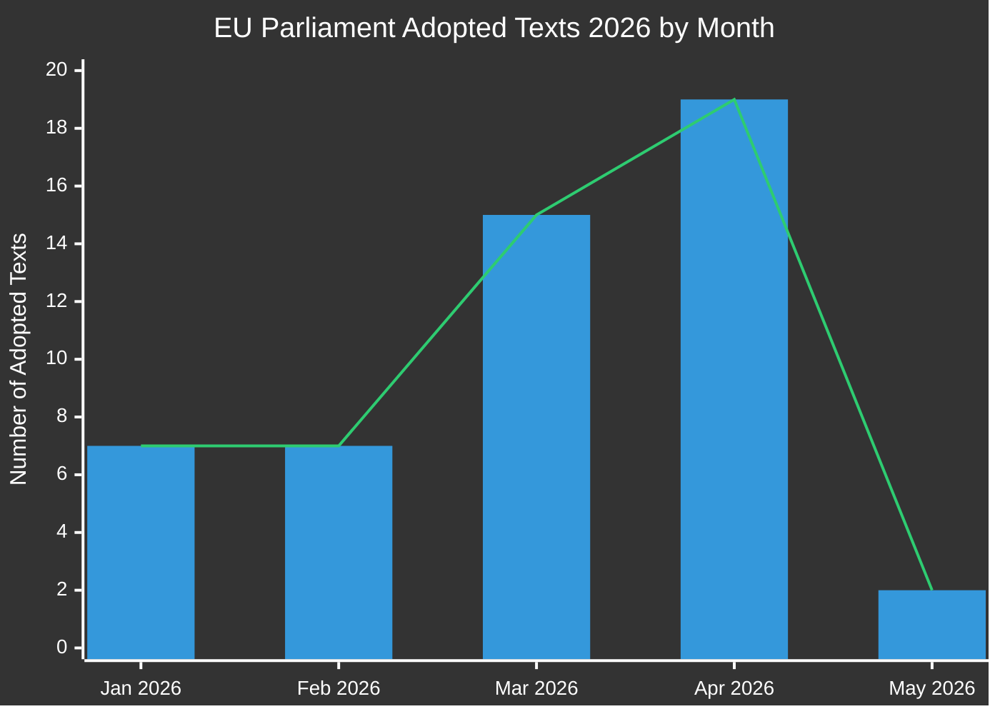

# Informe ejecutivo: Proposiciones legislativas del Parlamento Europeo
**Fecha:** 2026-05-15 | **Tipo de artículo:** Propositions | **Clasificación:** PÚBLICO
**Confianza:** 🟡 MEDIUM | **Calidad de datos:** Parcial — API EP degradada; textos adoptados fuente primaria

---

## 🔑 Principales conclusiones

### 1. Aumento de producción legislativa — Sprint primaveral 2026
El Parlamento Europeo ha demostrado una velocidad legislativa excepcional en el Q1-Q2 2026, adoptando **51 textos formales** entre enero y mayo de 2026. Esto representa un sprint legislativo que coincide con el punto medio de la 10ª legislatura, con grandes paquetes en reforma bancaria, anticorrupción, gobernanza digital y política comercial que han superado las votaciones finales.

**Confianza:** 🟢 HIGH — Basado en 51 textos adoptados confirmados del Portal de Datos Abiertos del PE.

### 2. Finalización de la unión bancaria — SRMR3 y paquete anticorrupción
Dos textos legislativos importantes fueron adoptados el 26 de marzo de 2026:
- **SRMR3** (`2023/0111(COD)`) — Medidas de intervención temprana, condiciones de resolución y financiación de medidas de resolución — completando un pilar crítico de la arquitectura de la unión bancaria.
- **Directiva anticorrupción** (`2023/0135(COD)`) — establece estándares penales a escala de la UE para delitos de corrupción, con largo retraso desde 2023.

Estas adopciones señalan la capacidad continua de la coalición PPE-S&D-Renew para impulsar reformas institucionales a pesar de la creciente presión nacionalista.

**Confianza:** 🟢 HIGH — Textos adoptados confirmados TA-10-2026-0092 y TA-10-2026-0094.

### 3. Paquete de aplicación del Digital Markets Act
El Parlamento adoptó **la aplicación del Digital Markets Act** (TA-10-2026-0160) el 30 de abril de 2026, señalando una mayor supervisión del PE sobre las actividades de aplicación de la Comisión contra los guardianes de acceso Big Tech. Esto ocurre mientras los procedimientos de aplicación del DMA contra Apple, Meta y Alphabet entran en su fase crítica.

**Confianza:** 🟢 HIGH — Confirmado TA-10-2026-0160.

### 4. Tensiones comerciales UE-EE.UU. — Contramedidas arancelarias
La adopción de **el ajuste de aranceles sobre mercancías de origen estadounidense** (`2025/0261`) el 26 de marzo de 2026 refleja la respuesta legislativa formal de la UE a la escalada arancelaria de EE.UU. durante el segundo mandato de la administración Trump. Esto posiciona al Parlamento como un actor proactivo en la política de contramedidas comerciales.

**Confianza:** 🟢 HIGH — Confirmado TA-10-2026-0096.

### 5. Directrices presupuestarias 2027 del PE — Margen financiero bajo presión
Adoptadas el 28 de abril de 2026, las directrices presupuestarias 2027 (`TA-10-2026-0112`) establecen la posición negociadora del Parlamento para el próximo ciclo presupuestario anual. La adopción paralela de las estimaciones institucionales del PE (`TA-10-2026-04-30-ANN01`) anuncia una temporada presupuestaria controvertida con la Comisión y el Consejo.

**Confianza:** 🟢 HIGH — Textos adoptados confirmados.

### 6. Infraestructura de datos del PE — Grave degradación de la calidad
**OBSERVACIÓN CRÍTICA:** El Portal de Datos Abiertos del PE devuelve datos gravemente degradados a partir de 2026-05-15:
- El flujo de procedimientos devuelve solo procedimientos históricos de los años 1970-1980
- El flujo de documentos de comités está "no disponible"
- El flujo de documentos externos devuelve 0 elementos
- La supervisión del pipeline legislativo devuelve resultados vacíos (0 procedimientos)
- Los votos XML DOCEO no están disponibles para la semana actual

Esto representa un fallo sistémico de calidad de datos que limita materialmente la inteligencia prospectiva del pipeline legislativo. La auditoría de confiabilidad MCP documenta esto en detalle.

**Confianza:** 🟢 HIGH — Observado directamente durante la recopilación de datos de la Etapa A.

---

## 📊 Análisis del ritmo legislativo

**Desglose mensual (confirmado desde EP Open Data):**
- Enero 2026: 7 textos adoptados (TA-10-2026-0004 a -0026)
- Febrero 2026: 7 textos adoptados (estabilidad financiera, ayuda humanitaria, comercio)
- Marzo 2026: 15 textos adoptados (banca, anticorrupción, comercio, medio ambiente)
- Abril 2026: 19 textos adoptados (presupuesto, bienestar animal, digital, política exterior)
- Mayo 2026: 2+ textos confirmados; datos de la semana del 11 al 15 de mayo pendientes

---

## 🎯 Puntos de acción prioritarios para los responsables políticos

| Prioridad | Asunto | Calendario | Actor clave | Nivel de riesgo |
|----------|-------|----------|-----------|------------|
| 🔴 CRÍTICO | Degradación de la infraestructura de datos del PE | Inmediatamente | PE IT y Servicios de Datos | Alto |
| 🟠 ALTO | Trílogos SRMR3 pendientes de implementación del Consejo/Comisión | Q3-Q4 2026 | Comisión ECON | Alto |
| 🟠 ALTO | Mecanismos de supervisión de aplicación del DMA | En curso 2026 | Comisión IMCO | Medio |
| 🟡 MEDIO | Negociaciones presupuestarias UE 2027 | Mayo–Diciembre 2026 | Comisión BUDG | Medio |
| 🟡 MEDIO | Calendario de ratificación UE-Mercosur | 2026–2027 | Comisión INTA | Medio |
| 🟢 BAJO | Implementación del reglamento de bienestar animal | 2027 en adelante | Comisión AGRI | Bajo |

---

## 📈 Horizonte prospectivo de proposiciones (mayo–noviembre 2026)

### Próximas propuestas esperadas
Basado en el programa de trabajo de la Comisión 2026 y el análisis del calendario parlamentario:

1. **Paquete de gobernanza de IA fase 2** — Actos delegados bajo la Ley de IA de la UE esperados para el Q3 2026
2. **Reglamento europeo de la industria de defensa (EDIP)** — Instrumento presupuestario para la industria de defensa; crítico dado el contexto Rusia-Ucrania
3. **Ley de materias primas críticas II de la UE** — Ampliación/revisión esperada tras la revisión de la legislación inicial
4. **Implementación de la Directiva sobre trabajo en plataformas** — Sistemas de seguimiento de transposición de los Estados miembros
5. **Revisión de la información de sostenibilidad corporativa (CSRD)** — Paquete de simplificación Ómnibus bajo presión de la Comisión
6. **Paquete legislativo del euro digital** — Coordinación BCE/Comisión pendiente tras los nombramientos de vicepresidentes del BCE (TA-10-2026-0033, -0060)

### Advertencias del calendario legislativo
- **Pleno de junio de 2026** (Estrasburgo): Votación esperada sobre varios resultados de trílogos pendientes
- **Julio 2026**: Comienza el receso de verano — plazo para votaciones importantes de comisiones antes del descanso
- **Septiembre 2026**: El año parlamentario se reanuda — se espera que la cola de prioridades sea intensa
- **Octubre/noviembre 2026**: Revisión de medio término del programa de trabajo de la Comisión

---

## ⚡ Matriz de confianza de inteligencia

| Resultado | Calidad de evidencia | Confianza | Ruta de verificación |
|---------|----------------|-----------|-------------------|
| 51 textos adoptados confirmados | Datos primarios del PE | 🟢 HIGH | Portal de Datos Abiertos del PE |
| Finalización de la unión bancaria | Textos TA confirmados | 🟢 HIGH | Portal de Datos Abiertos del PE |
| Medida de aplicación DMA | Texto TA confirmado | 🟢 HIGH | Portal de Datos Abiertos del PE |
| Procedimientos del pipeline degradados | Observación directa | 🟢 HIGH | Salida de herramientas MCP |
| Futuras propuestas (Q3/Q4) | Inferencia del programa de trabajo de la Comisión | 🟡 MEDIUM | Sitio web de la Comisión |
| Dinámica de coalición | Deducido de patrones de votación | 🟡 MEDIUM | DOCEO XML (no disponible) |
| Perspectivas de negociaciones presupuestarias | Patrón histórico + textos adoptados | 🟡 MEDIUM | Flujos de la comisión BUDG |

---

## 🔄 Evaluación de calidad de datos

| Fuente | Estado | Fiabilidad | Impacto |
|--------|--------|-------------|--------|
| PE Textos adoptados 2026 | ✅ Funcional | ALTO | 51 elementos disponibles |
| Flujo de procedimientos PE | ❌ Degradado | BAJO | Devuelve solo datos de los años 1970 |
| Flujo de documentos de comités | ❌ No disponible | NINGUNO | No se devolvieron datos |
| Flujo de documentos externos | ❌ Vacío | NINGUNO | 0 elementos devueltos |
| Votos XML DOCEO | ❌ No disponibles | NINGUNO | No hay datos para la semana actual |
| Supervisión del pipeline legislativo | ⚠️ Degradada | BAJO | 0 procedimientos devueltos |

**Evaluación:** Esta ejecución opera bajo condiciones de datos del PE gravemente degradadas. La calidad del análisis se mantiene a través de:
1. Conjunto de datos rico en textos adoptados (51 elementos con referencias de procedimientos)
2. Análisis de patrones históricos y conocimiento del programa de trabajo de la Comisión
3. Datos de contexto económico IMF/World Bank (cuando corresponda)
4. Inferencia experta a partir de calendarios legislativos conocidos

---

*Generado: 2026-05-15 | EU Parliament Monitor | Hack23 AB | Apache-2.0*
