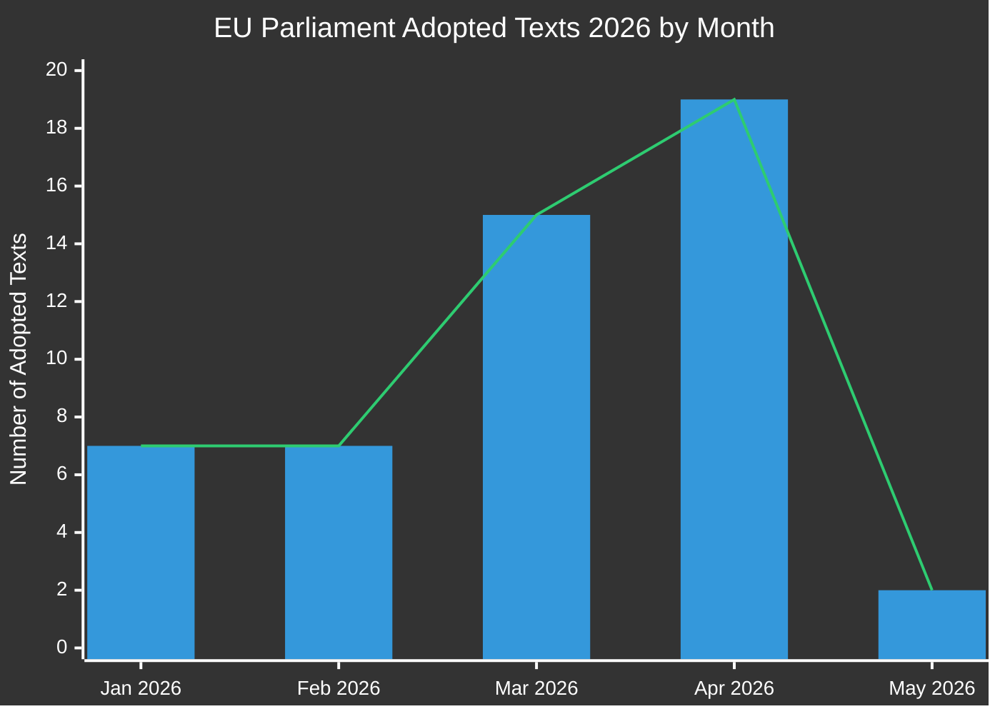

# Toimeenpaneva raportti: EU-parlamentin lainsäädäntöesitykset
**Päivämäärä:** 2026-05-15 | **Artikkelityyppi:** Propositions | **Luokitus:** JULKINEN
**Luotettavuus:** 🟡 MEDIUM | **Tietolaatu:** Osittainen — EP API heikentynyt; hyväksytyt tekstit ensisijainen lähde

---

## 🔑 Tärkeimmät havainnot

### 1. Lainsäädäntötuotannon kasvu — Kevään sprintti 2026
Euroopan parlamentti on osoittanut poikkeuksellista lainsäädäntövauhtia Q1-Q2 2026, hyväksymällä **51 virallista tekstiä** tammikuun ja toukokuun 2026 välillä. Tämä edustaa lainsäädäntösprinttiä, joka osuu yksiin 10. parlamentaarisen vaalikauden puolivälin kanssa, suurten pankki-, korruptionvastaisen, digitaalisen hallinnon ja kauppapolitiikkapakettien läpäistyä lopullisessa äänestyksessä.

**Luotettavuus:** 🟢 HIGH — Perustuu 51 vahvistettuun hyväksyttyyn tekstiin EP:n Open Data Portalista.

### 2. Pankkiunionin viimeistely — SRMR3 ja korruptionvastainen paketti
Kaksi tärkeää lainsäädäntötekstiä hyväksyttiin 26. maaliskuuta 2026:
- **SRMR3** (`2023/0111(COD)`) — Varhaistoimenpiteet, kriisinhallintaedellytykset ja kriisinhallintarahoitus — pankkiunionin arkkitehtuurin kriittisen pilarin viimeistely.
- **Korruptionvastainen direktiivi** (`2023/0135(COD)`) — vahvistaa EU:n laajuiset rikosoikeudelliset standardit korruptiorikoksille, pitkään viivästynyt vuodesta 2023.

Nämä hyväksynnät viestivät EPP-S&D-Renew-koalition jatkuvasta kapasiteetista institutionaalisiin uudistuksiin lisääntyneestä nationalistisesta paineesta huolimatta.

**Luotettavuus:** 🟢 HIGH — Vahvistetut hyväksytyt tekstit TA-10-2026-0092 ja TA-10-2026-0094.

### 3. Digitaalisia markkinoita koskevan lain (DMA) toimeenpanopaketti
Parlamentti hyväksyi **Digitaalisia markkinoita koskevan lain toimeenpanon** (TA-10-2026-0160) 30. huhtikuuta 2026, viestien lisääntyvästä EP:n valvonnasta komission toimeenpanosta suurten teknologiaportinvartijoita vastaan. Tämä tapahtuu, kun DMA-toimeenpanoprosessit Applea, Metaa ja Alphabetia vastaan siirtyvät kriittiseen vaiheeseen.

**Luotettavuus:** 🟢 HIGH — Vahvistettu TA-10-2026-0160.

### 4. EU-USA kauppakiista — Tullivastapaketti
**Yhdysvalloista peräisin oleviin tavaroihin kohdistuvien tullien mukauttamisen** (`2025/0261`) hyväksyminen 26. maaliskuuta 2026 heijastaa EU:n muodollista lainsäädäntövastetta Yhdysvaltojen tullien nostamiseen Trumpin hallinnon toisen kauden aikana. Tämä asemoi parlamentin proaktiiviseksi toimijaksi kaupan vastapakettipolitiikassa.

**Luotettavuus:** 🟢 HIGH — Vahvistettu TA-10-2026-0096.

### 5. EP:n 2027 budjettisuuntaviivat — Finansiaalinen peliala paineessa
Hyväksytty 28. huhtikuuta 2026, 2027 budjettisuuntaviivat (`TA-10-2026-0112`) asettavat parlamentin neuvotteluaseman tulevalle vuosibudjettisyklille. Euroopan parlamentin institutionaalisten arvioiden (`TA-10-2026-04-30-ANN01`) samanaikainen hyväksyminen ennakoi kiistanalaista budsjettikautta komission ja neuvoston kanssa.

**Luotettavuus:** 🟢 HIGH — Vahvistetut hyväksytyt tekstit.

### 6. EP:n datainfrastruktuuri — Vakava laadun heikkeneminen
**KRIITTINEN HAVAINTO:** EP:n Open Data Portal palauttaa vakavasti heikentynyttä dataa 2026-05-15 alkaen:
- Menettelysyöte palauttaa vain historiallisia menettelyjä 1970-1980-luvuilta
- Komiteadokumenttisyöte on "ei saatavilla"
- Ulkoinen dokumenttisyöte palauttaa 0 kohdetta
- Lainsäädäntöpipeline-valvonta palauttaa tyhjiä tuloksia (0 menettelyä)
- DOCEO XML-äänestykset ovat saavuttamattomissa nykyisellä viikolla

Tämä edustaa järjestelmällistä tietolaatuongelmaa, joka oleellisesti rajoittaa ennakoivaa lainsäädäntöpipelinetiedustelua. MCP-luotettavuustarkastus dokumentoi tämän yksityiskohtaisesti.

**Luotettavuus:** 🟢 HIGH — Suoraan havaittu Stage A -tiedonkeruussa.

---

## 📊 Lainsäädäntövauhdin analyysi

**Kuukausittainen erittely (vahvistettu EP Open Datasta):**
- Tammikuu 2026: 7 hyväksyttyä tekstiä (TA-10-2026-0004 – -0026)
- Helmikuu 2026: 7 hyväksyttyä tekstiä (rahoitusvakaus, humanitaarinen apu, kauppa)
- Maaliskuu 2026: 15 hyväksyttyä tekstiä (pankki, korruptionvastainen, kauppa, ympäristö)
- Huhtikuu 2026: 19 hyväksyttyä tekstiä (budjetti, eläinsuojelu, digitaaliset, ulkopolitiikka)
- Toukokuu 2026: 2+ tekstiä vahvistettu; viikko 11.–15. toukokuuta data odottaa

---

## 🎯 Prioritoidut toimintapisteet päätöksentekijöille

| Prioriteetti | Asia | Aikajana | Avaintoimija | Riskitaso |
|----------|-------|----------|-----------|------------|
| 🔴 KRIITTINEN | EP:n datainfrastruktuurin heikkeneminen | Välittömästi | EP IT & Datapalvelut | Korkea |
| 🟠 KORKEA | SRMR3-trilogit odottavat neuvoston/komission toimeenpanoa | Q3-Q4 2026 | ECON-valiokunta | Korkea |
| 🟠 KORKEA | DMA-toimeenpanon valvontamekanismit | Jatkuva 2026 | IMCO-valiokunta | Keskisuuri |
| 🟡 KESKISUURI | 2027 EU-budjettineuvottelut | Toukokuu–Joulukuu 2026 | BUDG-valiokunta | Keskisuuri |
| 🟡 KESKISUURI | EU-Mercosur-ratifiointiaikataulu | 2026–2027 | INTA-valiokunta | Keskisuuri |
| 🟢 MATALA | Eläinten hyvinvointiasetuksen toimeenpano | 2027 ja eteenpäin | AGRI-valiokunta | Matala |

---

## 📈 Tulevaisuuden propositiohorisontti (toukokuu–marraskuu 2026)

### Odotettavat tulevat ehdotukset
Perustuen komission 2026 työohjelmaan ja parlamentariseen kalenterianalyysiin:

1. **Tekoälyhallintopaketti vaihe 2** — Delegoidut säädökset EU:n tekoälylain nojalla odotettu Q3 2026
2. **Eurooppalainen puolustusalan teollisuusasetus (EDIP)** — Budjettinstrumentti puolustustoimialalle; kriittinen Venäjä-Ukraina-kontekstissa
3. **EU:n kriittisiä raaka-aineita koskeva laki II** — Laajennusta/tarkistusta odotetaan alkuperäisen lainsäädännön arvioinnin jälkeen
4. **Alustatyödirektiivin toimeenpano** — Jäsenvaltioiden transposition seurantajärjestelmät
5. **Yritysvastuullisuusraportoinnin tarkistus (CSRD)** — Omnibus-yksinkertaistamispaketti komission paineessa
6. **Digitaalinen euro -lainsäädäntöpaketti** — EKP:n/komission koordinointi odottaa EKP:n varapuheenjohtajanimityksiä (TA-10-2026-0033, -0060)

### Lainsäädäntökalenterivaroitukset
- **Kesäkuu 2026 täysistunto** (Strasbourg): Odotettu äänestys useista odottavista trilogin tuloksista
- **Heinäkuu 2026**: Kesäloma alkaa — tärkeiden valiokuntaäänestyksiä deadline ennen taukoa
- **Syyskuu 2026**: Parlamenttivuosi jatkuu — prioriteettijonon odotetaan olevan raskas
- **Lokakuu/marraskuu 2026**: Komission työohjelman puolivälitarkistus

---

## ⚡ Tiedusteluluottamusmatriisi

| Havainto | Todisteiden laatu | Luotettavuus | Vahvistuspolku |
|---------|----------------|-----------|-------------------|
| 51 hyväksyttyä tekstiä vahvistettu | Ensisijaiset EP-tiedot | 🟢 HIGH | EP Open Data Portal |
| Pankkiunionin viimeistely | Vahvistetut TA-tekstit | 🟢 HIGH | EP Open Data Portal |
| DMA-toimeenpanotoimenpide | Vahvistettu TA-teksti | 🟢 HIGH | EP Open Data Portal |
| Pipelinemenettelyt heikentyneet | Suora havainto | 🟢 HIGH | MCP-työkalutuloste |
| Tulevat ehdotukset (Q3/Q4) | Komission Työohjelma-päätelmä | 🟡 MEDIUM | Komission verkkosivusto |
| Koalitiodynamiikka | Päätelty äänestysmalleista | 🟡 MEDIUM | DOCEO XML (ei saatavilla) |
| Budjettineuvottelunäkymät | Historiallinen malli + hyväksytyt tekstit | 🟡 MEDIUM | BUDG-valiokunnan syötteet |

---

## 🔄 Tietolaadun arviointi

| Lähde | Tila | Luotettavuus | Vaikutus |
|--------|--------|-------------|--------|
| EP Hyväksytyt tekstit 2026 | ✅ Toimivat | KORKEA | 51 kohdetta saatavilla |
| EP Menettelysyöte | ❌ Heikentynyt | MATALA | Palauttaa vain 1970-luvun dataa |
| Komiteadokumenttisyöte | ❌ Ei saatavilla | EI MITÄÄN | Ei dataa palautettu |
| Ulkoinen dokumenttisyöte | ❌ Tyhjä | EI MITÄÄN | 0 kohdetta palautettu |
| DOCEO XML-äänestykset | ❌ Ei saatavilla | EI MITÄÄN | Ei dataa nykyiselle viikolle |
| Lainsäädäntöpipeline-valvonta | ⚠️ Heikentynyt | MATALA | 0 menettelyä palautettu |

**Arvio:** Tämä ajosuoritus toimii vakavasti heikentyneissä EP-dataolosuhteissa. Analyysikvaliteetti ylläpidetään seuraavasti:
1. Rikas hyväksyttyjen tekstien tietoaineisto (51 kohdetta, joissa menettelyviittaukset)
2. Historiallinen mallianalyysi ja tietämys komission työohjelmasta
3. IMF/World Bank taloudellinen kontekstidata (tarvittaessa)
4. Asiantuntijapäätelmät tunnetuista lainsäädäntöaikatauluista

---

*Luotu: 2026-05-15 | EU Parliament Monitor | Hack23 AB | Apache-2.0*
