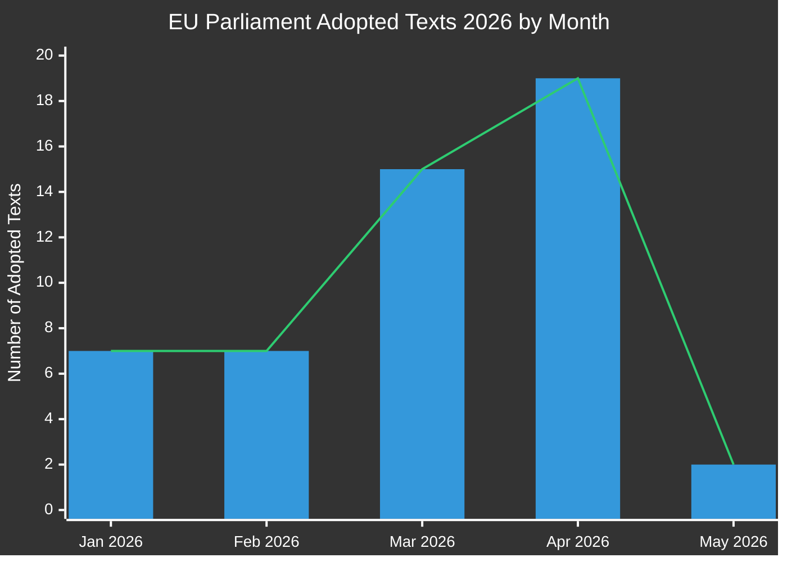

# Rapport exécutif : Propositions législatives du Parlement européen
**Date :** 2026-05-15 | **Type d'article :** Propositions | **Classification :** PUBLIC
**Confiance :** 🟡 MEDIUM | **Qualité des données :** Partielle — API PE dégradée ; textes adoptés source primaire

---

## 🔑 Principales conclusions

### 1. Surge de production législative — Sprint printanier 2026
Le Parlement européen a démontré une cadence législative exceptionnelle au Q1-Q2 2026, avec l'adoption de **51 textes formels** entre janvier et mai 2026. Cela représente un sprint législatif coïncidant avec le mi-parcours de la 10e législature, avec de grands paquets dans la réforme bancaire, l'antiblanchiment, la gouvernance numérique et la politique commerciale ayant passé les votes finals.

**Confiance :** 🟢 HIGH — Basé sur 51 textes adoptés confirmés du portail Open Data du PE.

### 2. Achèvement de l'union bancaire — SRMR3 et paquet anticorruption
Deux textes législatifs majeurs ont été adoptés le 26 mars 2026 :
- **SRMR3** (`2023/0111(COD)`) — Mesures d'intervention précoce, conditions de résolution et financement des mesures de résolution — achèvement d'un pilier critique de l'architecture de l'union bancaire.
- **Directive anticorruption** (`2023/0135(COD)`) — établit des normes pénales à l'échelle de l'UE pour les infractions de corruption, longtemps retardée depuis 2023.

Ces adoptions signalent la capacité continue de la coalition PPE-S&D-Renew à livrer des réformes institutionnelles malgré une pression nationaliste croissante.

**Confiance :** 🟢 HIGH — Textes adoptés confirmés TA-10-2026-0092 et TA-10-2026-0094.

### 3. Paquet d'application du Digital Markets Act
Le Parlement a adopté **l'application du Digital Markets Act** (TA-10-2026-0160) le 30 avril 2026, signalant une supervision accrue du PE sur les activités d'application de la Commission contre les gardiens Big Tech. Cela intervient alors que les procédures d'application DMA contre Apple, Meta et Alphabet entrent dans leur phase critique.

**Confiance :** 🟢 HIGH — Confirmé TA-10-2026-0160.

### 4. Tensions commerciales UE-USA — Contre-mesures tarifaires
L'adoption de **l'ajustement des droits de douane sur les marchandises d'origine américaine** (`2025/0261`) le 26 mars 2026 reflète la réponse législative formelle de l'UE à l'escalade tarifaire américaine sous le second mandat de l'administration Trump. Cela positionne le Parlement comme un acteur proactif dans la politique de contre-mesures commerciales.

**Confiance :** 🟢 HIGH — Confirmé TA-10-2026-0096.

### 5. Lignes directrices budgétaires 2027 du PE — Marge financière sous pression
Adoptées le 28 avril 2026, les lignes directrices budgétaires 2027 (`TA-10-2026-0112`) établissent la position de négociation du Parlement pour le prochain cycle budgétaire annuel. L'adoption parallèle des prévisions institutionnelles du PE (`TA-10-2026-04-30-ANN01`) annonce une saison budgétaire controversée avec la Commission et le Conseil.

**Confiance :** 🟢 HIGH — Textes adoptés confirmés.

### 6. Infrastructure de données du PE — Dégradation grave de la qualité
**OBSERVATION CRITIQUE :** Le portail Open Data du PE retourne des données gravement dégradées au 2026-05-15 :
- Le flux de procédures retourne uniquement des procédures historiques des années 1970-1980
- Le flux de documents des comités est « indisponible »
- Le flux de documents externes retourne 0 éléments
- La surveillance du pipeline législatif retourne des résultats vides (0 procédures)
- Les votes XML DOCEO indisponibles pour la semaine en cours

Cela représente un défaut systémique de qualité des données qui limite matériellement le renseignement prospectif sur le pipeline législatif. L'audit de fiabilité MCP documente cela en détail.

**Confiance :** 🟢 HIGH — Observé directement lors de la collecte de données de l'étape A.

---

## 📊 Analyse du rythme législatif

**Répartition mensuelle (confirmée depuis EP Open Data) :**
- Janvier 2026 : 7 textes adoptés (TA-10-2026-0004 à -0026)
- Février 2026 : 7 textes adoptés (stabilité financière, aide humanitaire, commerce)
- Mars 2026 : 15 textes adoptés (banque, anticorruption, commerce, environnement)
- Avril 2026 : 19 textes adoptés (budget, bien-être animal, numérique, politique étrangère)
- Mai 2026 : 2+ textes confirmés ; données de la semaine du 11 au 15 mai en attente

---

## 🎯 Points d'action prioritaires pour les décideurs

| Priorité | Question | Calendrier | Acteur clé | Niveau de risque |
|----------|-------|----------|-----------|------------|
| 🔴 CRITIQUE | Dégradation de l'infrastructure de données du PE | Immédiatement | PE IT & Services de données | Élevé |
| 🟠 ÉLEVÉ | Trilogues SRMR3 en attente de mise en œuvre Conseil/Commission | Q3-Q4 2026 | Commission ECON | Élevé |
| 🟠 ÉLEVÉ | Mécanismes de surveillance de l'application DMA | En cours 2026 | Commission IMCO | Moyen |
| 🟡 MOYEN | Négociations budgétaires UE 2027 | Mai–Décembre 2026 | Commission BUDG | Moyen |
| 🟡 MOYEN | Calendrier de ratification UE-Mercosur | 2026–2027 | Commission INTA | Moyen |
| 🟢 FAIBLE | Mise en œuvre du règlement sur le bien-être animal | 2027 et au-delà | Commission AGRI | Faible |

---

## 📈 Horizon prospectif des propositions (mai–novembre 2026)

### Prochaines propositions attendues
Basé sur le programme de travail de la Commission 2026 et l'analyse du calendrier parlementaire :

1. **Paquet de gouvernance de l'IA phase 2** — Actes délégués au titre de la loi sur l'IA de l'UE attendus au Q3 2026
2. **Règlement européen sur l'industrie de défense (EDIP)** — Instrument budgétaire pour l'industrie de défense ; critique dans le contexte Russie-Ukraine
3. **Loi UE sur les matières premières critiques II** — Extension/révision attendue après examen de la législation initiale
4. **Mise en œuvre de la directive sur le travail sur plateforme** — Systèmes de surveillance de transposition des États membres
5. **Révision du reporting de durabilité des entreprises (CSRD)** — Paquet de simplification Omnibus sous pression de la Commission
6. **Paquet législatif sur l'euro numérique** — Coordination BCE/Commission en attente après les nominations des vice-présidents de la BCE (TA-10-2026-0033, -0060)

### Alertes du calendrier législatif
- **Séance plénière de juin 2026** (Strasbourg) : Vote attendu sur plusieurs résultats de trilogues en attente
- **Juillet 2026** : Les vacances d'été commencent — délai pour les votes importants des commissions avant la pause
- **Septembre 2026** : L'année parlementaire reprend — la file d'attente des priorités devrait être chargée
- **Octobre/novembre 2026** : Revue à mi-parcours du programme de travail de la Commission

---

## ⚡ Matrice de confiance du renseignement

| Résultat | Qualité des preuves | Confiance | Chemin de vérification |
|---------|----------------|-----------|-------------------|
| 51 textes adoptés confirmés | Données primaires du PE | 🟢 HIGH | Portail Open Data du PE |
| Achèvement de l'union bancaire | Textes TA confirmés | 🟢 HIGH | Portail Open Data du PE |
| Mesure d'application DMA | Texte TA confirmé | 🟢 HIGH | Portail Open Data du PE |
| Procédures du pipeline dégradées | Observation directe | 🟢 HIGH | Sortie des outils MCP |
| Propositions futures (Q3/Q4) | Inférence du programme de travail Commission | 🟡 MEDIUM | Site web de la Commission |
| Dynamiques de coalition | Déduit des schémas de vote | 🟡 MEDIUM | DOCEO XML (indisponible) |
| Perspectives de négociations budgétaires | Schéma historique + textes adoptés | 🟡 MEDIUM | Flux de la commission BUDG |

---

## 🔄 Évaluation de la qualité des données

| Source | Statut | Fiabilité | Impact |
|--------|--------|-------------|--------|
| PE Textes adoptés 2026 | ✅ Fonctionnel | ÉLEVÉ | 51 éléments disponibles |
| Flux de procédures PE | ❌ Dégradé | FAIBLE | Retourne uniquement les données des années 1970 |
| Flux de documents des comités | ❌ Indisponible | AUCUNE | Aucune donnée retournée |
| Flux de documents externes | ❌ Vide | AUCUNE | 0 éléments retournés |
| Votes XML DOCEO | ❌ Indisponibles | AUCUNE | Aucune donnée pour la semaine en cours |
| Surveillance du pipeline législatif | ⚠️ Dégradée | FAIBLE | 0 procédures retournées |

**Évaluation :** Cette exécution opère dans des conditions de données PE gravement dégradées. La qualité de l'analyse est maintenue grâce à :
1. Riche ensemble de données de textes adoptés (51 éléments avec références de procédures)
2. Analyse des schémas historiques et connaissance du programme de travail de la Commission
3. Données de contexte économique IMF/World Bank (le cas échéant)
4. Inférence d'experts à partir des calendriers législatifs connus

---

*Généré : 2026-05-15 | EU Parliament Monitor | Hack23 AB | Apache-2.0*
