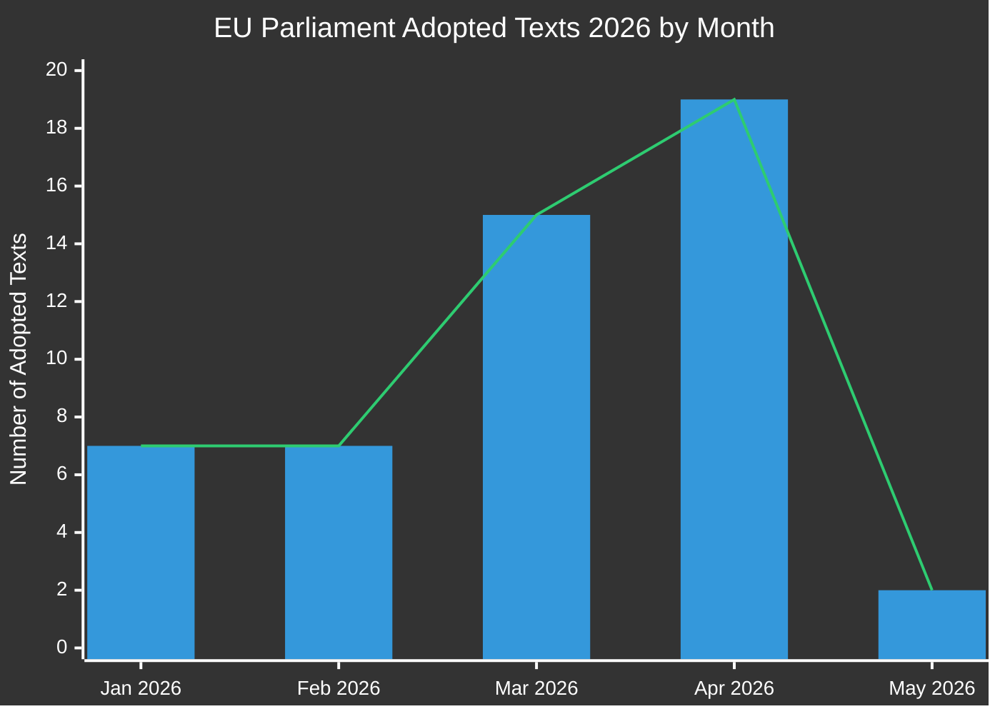

# דוח מנהלי: הצעות חקיקה של הפרלמנט האירופי
**תאריך:** 2026-05-15 | **סוג מאמר:** Propositions | **סיווג:** ציבורי
**ביטחון:** 🟡 MEDIUM | **איכות נתונים:** חלקית — ה-API של הפרלמנט הורד ב-Performance; טקסטים שאומצו הם המקור הראשוני

---

## 🔑 ממצאים עיקריים

### 1. עלייה בייצור חקיקתי — ספרינט אביב 2026
הפרלמנט האירופי הפגין קצב חקיקה יוצא דופן ברבעונים הראשון והשני של 2026, עם אימוץ **51 טקסטים רשמיים** בין ינואר למאי 2026. זה מייצג ספרינט חקיקה החופף לנקודת האמצע של המחזור הפרלמנטרי ה-10, עם חבילות גדולות ברפורמת בנקאות, מאבק בשחיתות, ממשל דיגיטלי ומדיניות סחר שעברו לאמצות סופית.

**ביטחון:** 🟢 HIGH — בהתבסס על 51 טקסטים שאומצו ואומתו מפורטל הנתונים הפתוחים של הפרלמנט האירופי.

### 2. השלמת איחוד הבנקים — SRMR3 וחבילת מאבק בשחיתות
שני טקסטים חקיקתיים חשובים אומצו ב-26 במרץ 2026:
- **SRMR3** (`2023/0111(COD)`) — אמצעי התערבות מוקדמת, תנאי פירוק ומימון אמצעי פירוק — השלמת עמוד תווך קריטי בארכיטקטורת איחוד הבנקים.
- **הנחיית מאבק בשחיתות** (`2023/0135(COD)`) — קובעת תקני פלילי ברמה האירופאית לעבירות שחיתות, שהתעכב מאז 2023.

אימוצים אלו מסמנים את יכולתו המתמשכת של קואליציית EPP-S&D-Renew לספק רפורמות מוסדיות חרף לחץ לאומני הולך וגובר.

**ביטחון:** 🟢 HIGH — טקסטים שאומצו ואומתו TA-10-2026-0092 ו-TA-10-2026-0094.

### 3. חבילת אכיפת חוק השווקים הדיגיטליים
הפרלמנט אימץ את **אכיפת חוק השווקים הדיגיטליים** (TA-10-2026-0160) ב-30 באפריל 2026, המסמנת פיקוח מוגבר של הפרלמנט על פעילויות האכיפה של הוועדה נגד שומרי הסף של Big Tech. זה מתרחש בשעה שהליכי האכיפה של ה-DMA נגד Apple, Meta ו-Alphabet נכנסים לשלב הקריטי שלהם.

**ביטחון:** 🟢 HIGH — מאושר TA-10-2026-0160.

### 4. מתחים סחר EU-ארה"ב — אמצעי נגד תעריפיים
אימוץ **התאמת מכסי מכסה על סחורות ממוצא אמריקאי** (`2025/0261`) ב-26 במרץ 2026 משקף את התגובה החקיקתית הרשמית של האיחוד האירופי להסלמת התעריפים האמריקאית תחת תקופת הכהונה השנייה של ממשל טראמפ. זה ממצב את הפרלמנט כשחקן פרואקטיבי במדיניות אמצעי הנגד הסחריים.

**ביטחון:** 🟢 HIGH — מאושר TA-10-2026-0096.

### 5. קווים מנחים לתקציב 2027 של הפרלמנט האירופי — מרחב פיסקלי תחת לחץ
אומץ ב-28 באפריל 2026, קווי המנחים לתקציב 2027 (`TA-10-2026-0112`) קובעים את עמדת המשא ומתן של הפרלמנט למחזור התקציב השנתי הקרוב. האימוץ המקביל של הערכות המוסדיות של הפרלמנט האירופי (`TA-10-2026-04-30-ANN01`) מבשר עונת תקציב שנויה במחלוקת עם הוועדה והמועצה.

**ביטחון:** 🟢 HIGH — טקסטים שאומצו ואומתו.

### 6. תשתית נתונים של הפרלמנט האירופי — ירידה חמורה באיכות
**תצפית קריטית:** פורטל הנתונים הפתוחים של הפרלמנט האירופי מחזיר נתונים שנפגעו קשות נכון ל-2026-05-15:
- פיד ההליכים מחזיר רק הליכים היסטוריים מהשנות ה-70-80
- פיד מסמכי הוועדה "לא זמין"
- פיד המסמכים החיצוניים מחזיר 0 פריטים
- ניטור צינור החקיקה מחזיר תוצאות ריקות (0 הליכים)
- הצבעות XML DOCEO אינן זמינות לשבוע הנוכחי

זה מייצג כשל שיטתי באיכות הנתונים המגביל באופן מהותי את המודיעין הצופה קדימה בצינור החקיקה. ביקורת אמינות ה-MCP מתעדת זאת בפירוט.

**ביטחון:** 🟢 HIGH — נצפה ישירות במהלך איסוף נתוני שלב א'.

---

## 📊 ניתוח קצב החקיקה

**פירוט חודשי (מאושר מ-EP Open Data):**
- ינואר 2026: 7 טקסטים שאומצו (TA-10-2026-0004 עד -0026)
- פברואר 2026: 7 טקסטים שאומצו (יציבות פיננסית, סיוע הומניטרי, סחר)
- מרץ 2026: 15 טקסטים שאומצו (בנקאות, מאבק בשחיתות, סחר, סביבה)
- אפריל 2026: 19 טקסטים שאומצו (תקציב, רווחת בעלי חיים, דיגיטלי, מדיניות חוץ)
- מאי 2026: 2+ טקסטים מאושרים; נתוני השבוע 11-15 מאי ממתינים

---

## 🎯 נקודות פעולה בעדיפות לקובעי מדיניות

| עדיפות | נושא | לוח זמנים | שחקן מפתח | רמת סיכון |
|----------|-------|----------|-----------|------------|
| 🔴 קריטי | ירידה בתשתית נתוני הפרלמנט האירופי | מיידי | IT ושירותי נתונים של הפרלמנט | גבוהה |
| 🟠 גבוהה | משא ומתן משולש SRMR3 ממתין ליישום המועצה/הוועדה | Q3-Q4 2026 | ועדת ECON | גבוהה |
| 🟠 גבוהה | מנגנוני ניטור אכיפת DMA | שוטף 2026 | ועדת IMCO | בינוני |
| 🟡 בינוני | משא ומתן על תקציב EU 2027 | מאי–דצמבר 2026 | ועדת BUDG | בינוני |
| 🟡 בינוני | לוח זמנים לאישרור EU-Mercosur | 2026–2027 | ועדת INTA | בינוני |
| 🟢 נמוך | יישום תקנת רווחת בעלי חיים | 2027 ואילך | ועדת AGRI | נמוכה |

---

## 📈 אופק הצעות צופה קדימה (מאי–נובמבר 2026)

### הצעות עתידיות צפויות
בהתבסס על תוכנית העבודה של הוועדה לשנת 2026 וניתוח לוח השנה הפרלמנטרי:

1. **חבילת ממשל AI שלב 2** — פעולות מואצלות לפי חוק ה-AI של האיחוד האירופי צפויות ברבעון השלישי 2026
2. **תקנת תעשיית הביטחון האירופית (EDIP)** — מכשיר תקציבי לתעשיית הביטחון; קריטי לאור ההקשר הרוסי-אוקראיני
3. **חוק חומרי הגלם הקריטיים II של האיחוד האירופי** — הרחבה/עדכון צפויים לאחר בחינת החקיקה הראשונית
4. **יישום הנחיית עבודת הפלטפורמות** — מערכות ניטור השתלה בחוק למדינות חברות
5. **עדכון דיווח הקיימות של חברות (CSRD)** — חבילת פישוט Omnibus תחת לחץ הוועדה
6. **חבילת החקיקה של היורו הדיגיטלי** — תיאום ECB/ועדה ממתין לאחר מינוי סגן-הנשיאים של ה-ECB (TA-10-2026-0033, -0060)

### אזהרות לוח שנה חקיקתי
- **מליאה יוני 2026** (שטרסבורג): הצבעה צפויה על מספר תוצאות משולשות ממתינות
- **יולי 2026**: חופשת הקיץ מתחילה — מועד אחרון להצבעות ועדה חשובות לפני ההפסקה
- **ספטמבר 2026**: שנת הפרלמנט מתחדשת — תור העדיפויות צפוי להיות כבד
- **אוקטובר/נובמבר 2026**: סקירת אמצע תקופת תוכנית העבודה של הוועדה

---

## ⚡ מטריצת ביטחון מודיעין

| ממצא | איכות ראיות | ביטחון | נתיב אימות |
|---------|----------------|-----------|-------------------|
| 51 טקסטים שאומצו מאושרים | נתונים ראשוניים של הפרלמנט | 🟢 HIGH | פורטל נתונים פתוחים של הפרלמנט |
| השלמת איחוד הבנקים | טקסטי TA מאושרים | 🟢 HIGH | פורטל נתונים פתוחים של הפרלמנט |
| אמצעי אכיפת DMA | טקסט TA מאושר | 🟢 HIGH | פורטל נתונים פתוחים של הפרלמנט |
| הליכי צינור נפגעו | תצפית ישירה | 🟢 HIGH | פלט כלי MCP |
| הצעות עתידיות (Q3/Q4) | היסק מתוכנית עבודת הוועדה | 🟡 MEDIUM | אתר הוועדה |
| דינמיקת קואליציה | נלמד מדפוסי הצבעה | 🟡 MEDIUM | DOCEO XML (לא זמין) |
| סיכויי משא ומתן תקציבי | דפוס היסטורי + טקסטים שאומצו | 🟡 MEDIUM | פידים של ועדת BUDG |

---

## 🔄 הערכת איכות נתונים

| מקור | סטטוס | אמינות | השפעה |
|--------|--------|-------------|--------|
| טקסטים שאומצו 2026 של הפרלמנט | ✅ פעיל | גבוהה | 51 פריטים זמינים |
| פיד הליכים של הפרלמנט | ❌ נפגע | נמוכה | מחזיר רק נתונים משנות ה-70 |
| פיד מסמכי ועדות | ❌ לא זמין | אין | לא הוחזרו נתונים |
| פיד מסמכים חיצוניים | ❌ ריק | אין | הוחזרו 0 פריטים |
| הצבעות DOCEO XML | ❌ לא זמין | אין | אין נתונים לשבוע הנוכחי |
| ניטור צינור חקיקה | ⚠️ נפגע | נמוכה | הוחזרו 0 הליכים |

**הערכה:** הפעלה זו פועלת בתנאי נתוני פרלמנט אירופי שנפגעו קשות. איכות הניתוח נשמרת באמצעות:
1. מערך נתונים עשיר של טקסטים שאומצו (51 פריטים עם הפניות להליכים)
2. ניתוח דפוסים היסטוריים וידע על תוכנית עבודת הוועדה
3. נתוני הקשר כלכלי מ-IMF/World Bank (במקרה הצורך)
4. היסק מומחים מלוחות זמנים חקיקתיים ידועים

---

*נוצר: 2026-05-15 | EU Parliament Monitor | Hack23 AB | Apache-2.0*
