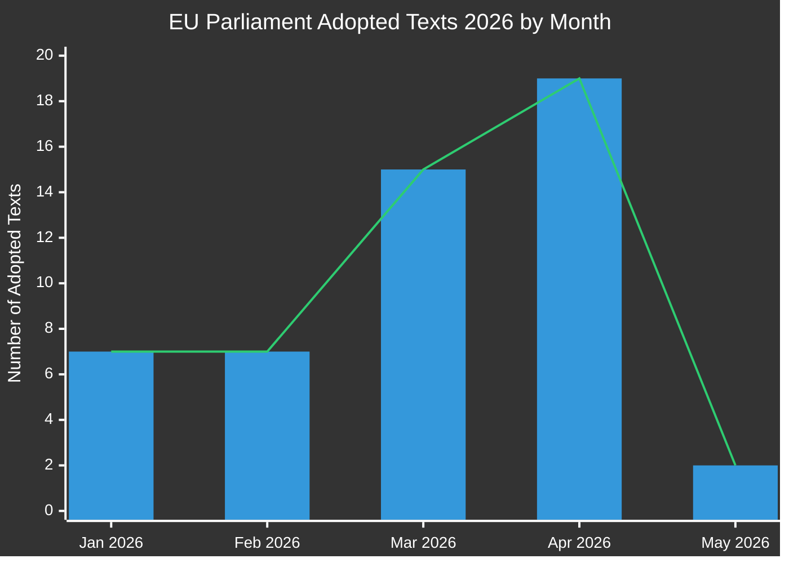

# エグゼクティブ・ブリーフ：欧州議会の立法提案
**日付：** 2026-05-15 | **記事タイプ：** Propositions | **分類：** 公開
**信頼度：** 🟡 MEDIUM | **データ品質：** 部分的 — EP API 劣化；採択テキストが主要情報源

---

## 🔑 主要な所見

### 1. 立法生産量の急増 — 2026年春のスプリント
欧州議会は2026年第1四半期から第2四半期にかけて例外的な立法ペースを示し、2026年1月から5月の間に**51件の正式テキスト**を採択した。これは第10立法期の中間点と重なる立法スプリントを表しており、銀行改革、汚職対策、デジタルガバナンス、貿易政策の大型パッケージが最終採決を通過した。

**信頼度：** 🟢 HIGH — EP Open Data Portalからの51件の確認済み採択テキストに基づく。

### 2. 銀行同盟の完成 — SRMR3と汚職対策パッケージ
2026年3月26日に2件の重要な立法テキストが採択された：
- **SRMR3** (`2023/0111(COD)`) — 早期介入措置、破綻処理の条件および措置の資金調達 — 銀行同盟の構造における重要な柱の完成。
- **汚職対策指令** (`2023/0135(COD)`) — 汚職犯罪に関するEU全域の刑事基準を定める、2023年から長らく遅延。

これらの採択は、高まるナショナリスト圧力にもかかわらず、EPP-S&D-Renew連立が制度改革を実施し続ける能力があることを示している。

**信頼度：** 🟢 HIGH — 確認済み採択テキスト TA-10-2026-0092 および TA-10-2026-0094。

### 3. デジタル市場法執行パッケージ
議会は2026年4月30日に**デジタル市場法の執行**（TA-10-2026-0160）を採択し、Big Techゲートキーパーに対する欧州委員会の執行活動への欧州議会の監視強化を示した。Apple、Meta、Alphabetに対するDMA執行手続きが重要局面に入る中、このタイミングで採択された。

**信頼度：** 🟢 HIGH — 確認済み TA-10-2026-0160。

### 4. EU-米国貿易紛争 — 関税対抗措置
2026年3月26日に**米国原産品に対する関税の調整**（`2025/0261`）が採択されたことは、トランプ政権第2期における米国の関税引き上げへのEUの正式な立法的対応を反映している。これにより議会は貿易対抗措置政策における積極的なアクターとして位置づけられる。

**信頼度：** 🟢 HIGH — 確認済み TA-10-2026-0096。

### 5. 欧州議会2027年予算指針 — 財政空間への圧力
2026年4月28日に採択された2027年予算指針（`TA-10-2026-0112`）は、来年の年次予算サイクルに向けた議会の交渉立場を確定する。EP制度的見積もりの並行採択（`TA-10-2026-04-30-ANN01`）は、委員会・理事会との論争的な予算シーズンを予告している。

**信頼度：** 🟢 HIGH — 確認済み採択テキスト。

### 6. EPデータインフラ — 深刻な品質劣化
**重大な観察：** EP Open Data Portalは2026-05-15時点で深刻に劣化したデータを返している：
- 手続きフィードは1970年代〜1980年代の歴史的手続きのみを返す
- 委員会文書フィードは「利用不可」
- 外部文書フィードは0件を返す
- 立法パイプライン監視は空の結果（0手続き）を返す
- DOCEO XML投票は現在の週について利用不可

これは前向き立法パイプライン情報を実質的に制限する体系的なデータ品質上の欠陥を表している。MCP信頼性監査がこれを詳細に記録している。

**信頼度：** 🟢 HIGH — Stage Aデータ収集中に直接観察。

---

## 📊 立法ペース分析

**月別内訳（EP Open Dataから確認）：**
- 2026年1月：7件採択テキスト（TA-10-2026-0004〜-0026）
- 2026年2月：7件採択テキスト（金融安定、人道支援、貿易）
- 2026年3月：15件採択テキスト（銀行、汚職対策、貿易、環境）
- 2026年4月：19件採択テキスト（予算、動物福祉、デジタル、外交政策）
- 2026年5月：2件以上確認済み；5月11〜15日週のデータ待ち

---

## 🎯 政策立案者への優先行動ポイント

| 優先度 | 課題 | タイムライン | 主要アクター | リスクレベル |
|----------|-------|----------|-----------|------------|
| 🔴 重大 | EPデータインフラ劣化 | 即時 | EP IT & データサービス | 高 |
| 🟠 高 | SRMR3三者協議 — 理事会/委員会実施待ち | Q3-Q4 2026 | ECON委員会 | 高 |
| 🟠 高 | DMA執行監視メカニズム | 継続的 2026 | IMCO委員会 | 中 |
| 🟡 中 | EU 2027年予算交渉 | 5月〜12月 2026 | BUDG委員会 | 中 |
| 🟡 中 | EU-メルコスール批准スケジュール | 2026〜2027 | INTA委員会 | 中 |
| 🟢 低 | 動物福祉規則の実施 | 2027年以降 | AGRI委員会 | 低 |

---

## 📈 提案の将来展望（2026年5月〜11月）

### 今後予想される提案
委員会の2026年作業計画および議会日程分析に基づく：

1. **AIガバナンスパッケージ第2フェーズ** — EU AI法に基づく委任行為が2026年第3四半期に予定
2. **欧州防衛産業規制（EDIP）** — 防衛産業向け予算手段；ロシア-ウクライナ情勢を踏まえ重要
3. **EU重要原材料法II** — 初期立法の見直し後に拡張/改訂が予定
4. **プラットフォーム労働指令の実施** — 加盟国転置監視システム
5. **企業持続可能性報告（CSRD）の見直し** — 委員会の圧力下でのオムニバス簡素化パッケージ
6. **デジタルユーロ立法パッケージ** — ECB副総裁人事（TA-10-2026-0033、-0060）後のECB/委員会調整を待つ

### 立法カレンダーの注意点
- **2026年6月本会議**（ストラスブール）：複数の保留中の三者協議結果の採決予定
- **2026年7月**：夏季休会開始 — 休会前の重要な委員会投票の締め切り
- **2026年9月**：議会年の再開 — 優先事項キューは重くなる見込み
- **2026年10/11月**：委員会作業計画の中間見直し

---

## ⚡ 情報信頼度マトリクス

| 所見 | 証拠の質 | 信頼度 | 検証パス |
|---------|----------------|-----------|-------------------|
| 51件採択テキスト確認 | EP一次データ | 🟢 HIGH | EP Open Data Portal |
| 銀行同盟の完成 | 確認済みTAテキスト | 🟢 HIGH | EP Open Data Portal |
| DMA執行措置 | 確認済みTAテキスト | 🟢 HIGH | EP Open Data Portal |
| パイプライン手続き劣化 | 直接観察 | 🟢 HIGH | MCPツール出力 |
| 将来の提案（Q3/Q4） | 委員会作業計画からの推論 | 🟡 MEDIUM | 欧州委員会ウェブサイト |
| 連立ダイナミクス | 投票パターンから推論 | 🟡 MEDIUM | DOCEO XML（利用不可） |
| 予算交渉見通し | 歴史的パターン＋採択テキスト | 🟡 MEDIUM | BUDG委員会フィード |

---

## 🔄 データ品質評価

| ソース | ステータス | 信頼性 | 影響 |
|--------|--------|-------------|--------|
| EP採択テキスト2026 | ✅ 機能中 | 高 | 51件利用可能 |
| EP手続きフィード | ❌ 劣化 | 低 | 1970年代データのみ返す |
| 委員会文書フィード | ❌ 利用不可 | なし | データ返却なし |
| 外部文書フィード | ❌ 空 | なし | 0件返却 |
| DOCEO XML投票 | ❌ 利用不可 | なし | 現在週のデータなし |
| 立法パイプライン監視 | ⚠️ 劣化 | 低 | 0手続き返却 |

**評価：** この実行は深刻に劣化したEPデータ状況下で動作している。分析品質は以下により維持される：
1. 採択テキストの豊富なデータセット（手続き参照付き51件）
2. 歴史的パターン分析と欧州委員会作業計画に関する知識
3. IMF/World Bankの経済コンテキストデータ（適用可能な場合）
4. 既知の立法スケジュールからの専門家推論

---

*作成：2026-05-15 | EU Parliament Monitor | Hack23 AB | Apache-2.0*
