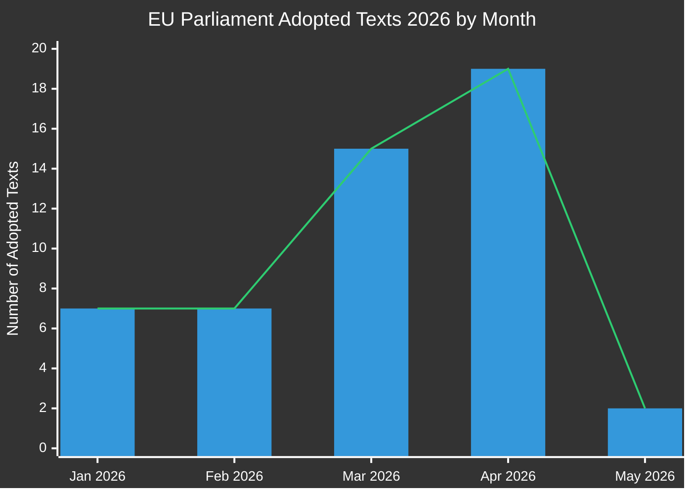

# 집행 보고서: 유럽 의회 입법 제안
**날짜:** 2026-05-15 | **기사 유형:** Propositions | **분류:** 공개
**신뢰도:** 🟡 MEDIUM | **데이터 품질:** 부분적 — EP API 저하; 채택 텍스트가 주요 출처

---

## 🔑 주요 발견사항

### 1. 입법 생산 급증 — 2026년 봄 스프린트
유럽 의회는 2026년 1분기~2분기에 걸쳐 2026년 1월부터 5월까지 **51건의 공식 텍스트**를 채택하며 예외적인 입법 속도를 보였다. 이는 제10차 입법기 중간 지점과 맞물리는 입법 스프린트를 나타내며, 은행 개혁, 반부패, 디지털 거버넌스, 통상 정책 분야의 대형 패키지들이 최종 표결을 통과했다.

**신뢰도:** 🟢 HIGH — EP 공개 데이터 포털의 51건 확인된 채택 텍스트 기반.

### 2. 은행연합 완성 — SRMR3 및 반부패 패키지
2026년 3월 26일 두 가지 중요한 입법 텍스트가 채택되었다:
- **SRMR3** (`2023/0111(COD)`) — 조기 개입 조치, 정리 조건 및 정리 조치 자금 조달 — 은행연합 구조의 핵심 기둥 완성.
- **반부패 지침** (`2023/0135(COD)`) — 부패 범죄에 관한 EU 전역 형사 기준 수립, 2023년부터 오랫동안 지연됨.

이러한 채택은 고조되는 민족주의 압력에도 불구하고 EPP-S&D-Renew 연합이 제도 개혁을 지속적으로 추진하는 능력을 보여준다.

**신뢰도:** 🟢 HIGH — 확인된 채택 텍스트 TA-10-2026-0092 및 TA-10-2026-0094.

### 3. 디지털 시장법 집행 패키지
의회는 2026년 4월 30일 **디지털 시장법 집행**(TA-10-2026-0160)을 채택하여 Big Tech 게이트키퍼에 대한 위원회의 집행 활동에 대한 EP 감독 강화를 알렸다. 이는 Apple, Meta, Alphabet에 대한 DMA 집행 절차가 핵심 단계에 진입하는 시기에 이루어졌다.

**신뢰도:** 🟢 HIGH — 확인된 TA-10-2026-0160.

### 4. EU-미국 무역 갈등 — 관세 대응 조치
2026년 3월 26일 **미국산 상품에 대한 관세 조정**(`2025/0261`) 채택은 트럼프 행정부 2기의 미국 관세 인상에 대한 EU의 공식 입법적 대응을 반영한다. 이로써 의회는 무역 대응 조치 정책의 적극적인 행위자로 자리매김한다.

**신뢰도:** 🟢 HIGH — 확인된 TA-10-2026-0096.

### 5. EP 2027년 예산 지침 — 재정 여력 압박
2026년 4월 28일 채택된 2027년 예산 지침(`TA-10-2026-0112`)은 다가오는 연간 예산 주기에 대한 의회의 협상 입장을 확립한다. EP 제도적 추정치(`TA-10-2026-04-30-ANN01`)의 병행 채택은 위원회 및 이사회와의 논쟁적인 예산 시즌을 예고한다.

**신뢰도:** 🟢 HIGH — 확인된 채택 텍스트.

### 6. EP 데이터 인프라 — 심각한 품질 저하
**중요 관찰:** EP 공개 데이터 포털은 2026-05-15 기준으로 심각하게 저하된 데이터를 반환하고 있다:
- 절차 피드가 1970~1980년대 역사적 절차만 반환
- 위원회 문서 피드가 "이용 불가"
- 외부 문서 피드가 0건 반환
- 입법 파이프라인 모니터링이 빈 결과 반환 (0개 절차)
- 현재 주의 DOCEO XML 투표 이용 불가

이는 전향적 입법 파이프라인 정보를 실질적으로 제한하는 체계적인 데이터 품질 결함을 나타낸다. MCP 신뢰성 감사가 이를 상세히 기록하고 있다.

**신뢰도:** 🟢 HIGH — Stage A 데이터 수집 중 직접 관찰.

---

## 📊 입법 속도 분석

**월별 분석 (EP 공개 데이터에서 확인):**
- 2026년 1월: 7건 채택 텍스트 (TA-10-2026-0004 ~ -0026)
- 2026년 2월: 7건 채택 텍스트 (금융 안정, 인도적 지원, 무역)
- 2026년 3월: 15건 채택 텍스트 (은행, 반부패, 무역, 환경)
- 2026년 4월: 19건 채택 텍스트 (예산, 동물 복지, 디지털, 외교 정책)
- 2026년 5월: 2건 이상 확인; 5월 11~15일 주 데이터 대기 중

---

## 🎯 정책 입안자를 위한 우선 행동 포인트

| 우선순위 | 사안 | 타임라인 | 핵심 행위자 | 위험 수준 |
|----------|-------|----------|-----------|------------|
| 🔴 긴급 | EP 데이터 인프라 저하 | 즉시 | EP IT & 데이터 서비스 | 높음 |
| 🟠 높음 | SRMR3 삼자 협의 — 이사회/위원회 이행 대기 | Q3-Q4 2026 | ECON 위원회 | 높음 |
| 🟠 높음 | DMA 집행 모니터링 메커니즘 | 2026년 지속 | IMCO 위원회 | 중간 |
| 🟡 중간 | EU 2027년 예산 협상 | 5월~12월 2026 | BUDG 위원회 | 중간 |
| 🟡 중간 | EU-메르코수르 비준 일정 | 2026~2027 | INTA 위원회 | 중간 |
| 🟢 낮음 | 동물 복지 규정 이행 | 2027년 이후 | AGRI 위원회 | 낮음 |

---

## 📈 전향적 제안 지평선 (2026년 5월~11월)

### 예상되는 향후 제안
위원회 2026년 작업 계획 및 의회 일정 분석에 기반:

1. **AI 거버넌스 패키지 2단계** — EU AI법에 따른 위임 행위 2026년 3분기 예정
2. **유럽 방위 산업 규정 (EDIP)** — 방위 산업을 위한 예산 수단; 러시아-우크라이나 맥락에서 중요
3. **EU 핵심 원자재법 II** — 초기 입법 검토 후 확장/개정 예정
4. **플랫폼 노동 지침 이행** — 회원국 전치 모니터링 시스템
5. **기업 지속가능성 보고(CSRD) 검토** — 위원회 압박 하의 옴니버스 간소화 패키지
6. **디지털 유로 입법 패키지** — ECB 부총재 임명(TA-10-2026-0033, -0060) 후 ECB/위원회 조율 대기

### 입법 일정 경고
- **2026년 6월 본회의** (스트라스부르): 여러 계류 중인 삼자 협의 결과 표결 예정
- **2026년 7월**: 하계 휴회 시작 — 휴회 전 주요 위원회 표결 마감일
- **2026년 9월**: 의회 연도 재개 — 우선순위 대기열 무거울 전망
- **2026년 10/11월**: 위원회 작업 계획 중간 검토

---

## ⚡ 정보 신뢰도 매트릭스

| 발견사항 | 증거 품질 | 신뢰도 | 검증 경로 |
|---------|----------------|-----------|-------------------|
| 51건 채택 텍스트 확인 | EP 1차 데이터 | 🟢 HIGH | EP 공개 데이터 포털 |
| 은행연합 완성 | 확인된 TA 텍스트 | 🟢 HIGH | EP 공개 데이터 포털 |
| DMA 집행 조치 | 확인된 TA 텍스트 | 🟢 HIGH | EP 공개 데이터 포털 |
| 파이프라인 절차 저하 | 직접 관찰 | 🟢 HIGH | MCP 도구 출력 |
| 향후 제안 (Q3/Q4) | 위원회 작업 계획 추론 | 🟡 MEDIUM | 유럽 위원회 웹사이트 |
| 연합 역학 | 투표 패턴에서 추론 | 🟡 MEDIUM | DOCEO XML (이용 불가) |
| 예산 협상 전망 | 역사적 패턴 + 채택 텍스트 | 🟡 MEDIUM | BUDG 위원회 피드 |

---

## 🔄 데이터 품질 평가

| 출처 | 상태 | 신뢰성 | 영향 |
|--------|--------|-------------|--------|
| EP 채택 텍스트 2026 | ✅ 정상 | 높음 | 51건 이용 가능 |
| EP 절차 피드 | ❌ 저하 | 낮음 | 1970년대 데이터만 반환 |
| 위원회 문서 피드 | ❌ 이용 불가 | 없음 | 데이터 반환 없음 |
| 외부 문서 피드 | ❌ 빈 결과 | 없음 | 0건 반환 |
| DOCEO XML 투표 | ❌ 이용 불가 | 없음 | 현재 주 데이터 없음 |
| 입법 파이프라인 모니터링 | ⚠️ 저하 | 낮음 | 0개 절차 반환 |

**평가:** 이번 실행은 심각하게 저하된 EP 데이터 상황에서 운영된다. 분석 품질은 다음을 통해 유지된다:
1. 채택 텍스트의 풍부한 데이터셋 (절차 참조 포함 51건)
2. 역사적 패턴 분석 및 위원회 작업 계획 지식
3. IMF/World Bank 경제 맥락 데이터 (해당 시)
4. 알려진 입법 일정에서의 전문가 추론

---

*생성일: 2026-05-15 | EU Parliament Monitor | Hack23 AB | Apache-2.0*
