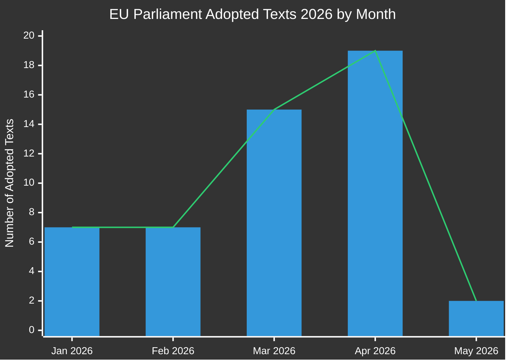

# Uitvoerend rapport: Wetgevingsvoorstellen van het Europees Parlement
**Datum:** 2026-05-15 | **Artikeltype:** Propositions | **Classificatie:** OPENBAAR
**Vertrouwen:** 🟡 MEDIUM | **Gegevenskwaliteit:** Gedeeltelijk — EP API gedegradeerd; aangenomen teksten primaire bron

---

## 🔑 Belangrijkste bevindingen

### 1. Toename van wetgevingsproductie — Lentesprint 2026
Het Europees Parlement heeft in Q1-Q2 2026 een uitzonderlijke wetgevingssnelheid gedemonstreerd, met de aanneming van **51 formele teksten** tussen januari en mei 2026. Dit vertegenwoordigt een wetgevingssprint die samenvalt met het middelpunt van de 10e zittingsperiode, met grote pakketten op het gebied van bankhervormingen, anticorruptie, digitaal bestuur en handelsbeleid die door de definitieve stemmingen zijn gegaan.

**Vertrouwen:** 🟢 HIGH — Gebaseerd op 51 bevestigde aangenomen teksten van het EP Open Data Portal.

### 2. Voltooiing van de bankenunie — SRMR3 en anticorruptiepakket
Twee belangrijke wetgevingsteksten werden aangenomen op 26 maart 2026:
- **SRMR3** (`2023/0111(COD)`) — Vroege interventiemaatregelen, afwikkelingsvoorwaarden en financiering van afwikkelingsmaatregelen — voltooiing van een kritieke pijler van de bankenunie-architectuur.
- **Anticorruptierichtlijn** (`2023/0135(COD)`) — stelt EU-brede strafrechtelijke normen vast voor corruptieomissies, lang vertraagd sinds 2023.

Deze aannamen signaleren het voortdurende vermogen van de EVP-S&D-Renew-coalitie om institutionele hervormingen te leveren ondanks toenemende nationalistische druk.

**Vertrouwen:** 🟢 HIGH — Bevestigde aangenomen teksten TA-10-2026-0092 en TA-10-2026-0094.

### 3. Handhavingspakket Digital Markets Act
Het Parlement nam de **Handhaving van de Digital Markets Act** aan (TA-10-2026-0160) op 30 april 2026, wat verhoogd EP-toezicht op de handhavingsactiviteiten van de Commissie tegen Big Tech-poortwachters signaleert. Dit vindt plaats terwijl DMA-handhavingsprocedures tegen Apple, Meta en Alphabet hun kritieke fase ingaan.

**Vertrouwen:** 🟢 HIGH — Bevestigd TA-10-2026-0160.

### 4. EU-VS-handelsconflict — Tegenmaatregelen op tarieven
De aanneming van **de aanpassing van douanerechten op goederen van Amerikaanse oorsprong** (`2025/0261`) op 26 maart 2026 weerspiegelt de formele wetgevingsreactie van de EU op de tariefescalatie van de VS tijdens de tweede termijn van de Trump-administratie. Dit positioneert het Parlement als een proactieve actor in het beleid voor handelstegenmaatregelen.

**Vertrouwen:** 🟢 HIGH — Bevestigd TA-10-2026-0096.

### 5. EP-begrotingsrichtsnoeren 2027 — Financiële speelruimte onder druk
Aangenomen op 28 april 2026 stellen de begrotingsrichtsnoeren 2027 (`TA-10-2026-0112`) de onderhandelingspositie van het Parlement vast voor de komende jaarlijkse begrotingscyclus. De parallelle aanneming van de institutionele ramingen van het EP (`TA-10-2026-04-30-ANN01`) kondigt een omstreden begrotingsseizoen met de Commissie en de Raad aan.

**Vertrouwen:** 🟢 HIGH — Bevestigde aangenomen teksten.

### 6. EP-data-infrastructuur — Ernstige kwaliteitsverslechtering
**KRITIEKE OBSERVATIE:** Het EP Open Data Portal geeft per 2026-05-15 ernstig gedegradeerde gegevens terug:
- De proceduresitstroom geeft alleen historische procedures uit de jaren 1970-1980 terug
- De documentenstroom van commissies is "niet beschikbaar"
- Externe documentenstroom geeft 0 items terug
- Wetgevingspipeline-monitoring geeft lege resultaten terug (0 procedures)
- DOCEO XML-stemmen niet beschikbaar voor de huidige week

Dit vertegenwoordigt een systemische datakwaliteitsdefect dat de vooruitblikkende wetgevingspipeline-inlichtingen materieel beperkt. De MCP-betrouwbaarheidsaudit documenteert dit in detail.

**Vertrouwen:** 🟢 HIGH — Direct waargenomen tijdens de Stage A-gegevensverzameling.

---

## 📊 Analyse van wetgevingssnelheid

**Maandelijkse uitsplitsing (bevestigd vanuit EP Open Data):**
- Januari 2026: 7 aangenomen teksten (TA-10-2026-0004 tot -0026)
- Februari 2026: 7 aangenomen teksten (financiële stabiliteit, humanitaire hulp, handel)
- Maart 2026: 15 aangenomen teksten (bank, anticorruptie, handel, milieu)
- April 2026: 19 aangenomen teksten (begroting, dierenwelzijn, digitaal, buitenlands beleid)
- Mei 2026: 2+ teksten bevestigd; gegevens van de week 11-15 mei in afwachting

---

## 🎯 Geprioriteerde actiepunten voor beleidsmakers

| Prioriteit | Kwestie | Tijdlijn | Sleutelactor | Risiconiveau |
|----------|-------|----------|-----------|------------|
| 🔴 KRITIEK | Verslechtering van EP-data-infrastructuur | Onmiddellijk | EP IT & Dataservices | Hoog |
| 🟠 HOOG | SRMR3-triloguen in afwachting van Raads-/Commissieimplementering | Q3-Q4 2026 | ECON-commissie | Hoog |
| 🟠 HOOG | DMA-handhavingstoezichtmechanismen | Doorlopend 2026 | IMCO-commissie | Gemiddeld |
| 🟡 GEMIDDELD | EU-begrotingsonderhandelingen 2027 | Mei–December 2026 | BUDG-commissie | Gemiddeld |
| 🟡 GEMIDDELD | EU-Mercosur-ratificatietijdlijn | 2026–2027 | INTA-commissie | Gemiddeld |
| 🟢 LAAG | Implementering van dierenwelzijnsverordening | 2027 en verder | AGRI-commissie | Laag |

---

## 📈 Vooruitblikkend propositionshorizon (mei–november 2026)

### Verwachte komende voorstellen
Gebaseerd op het Werkprogramma van de Commissie 2026 en analyse van de parlementaire kalender:

1. **AI-bestuurspakket fase 2** — Gedelegeerde handelingen onder de EU-AI-wet verwacht in Q3 2026
2. **Europese verordening defensie-industrie (EDIP)** — Budgetinstrument voor de defensie-industrie; kritiek gezien de Rusland-Oekraïne-context
3. **EU-wet kritieke grondstoffen II** — Uitbreiding/herziening verwacht na evaluatie van de initiële wetgeving
4. **Implementering van de platformarbeidrichtlijn** — Monitoringsystemen voor omzetting in lidstaten
5. **Herziening van bedrijfsrapportage over duurzaamheid (CSRD)** — Omnibus-vereenvoudigingspakket onder druk van de Commissie
6. **Wetgevingspakket digitale euro** — ECB/Commissie-coördinatie in afwachting na benoemingen van vicevoorzitters van de ECB (TA-10-2026-0033, -0060)

### Wetgevingskalenderwaarschuwingen
- **Plenaire vergadering juni 2026** (Straatsburg): Verwachte stemming over meerdere lopende trilogieresultaten
- **Juli 2026**: Zomervakantie begint — deadline voor belangrijke commissiestemmingen vóór de onderbreking
- **September 2026**: Het parlementaire jaar hervat — de prioriteitenwachtrij wordt naar verwachting zwaar
- **Oktober/november 2026**: Halftijdse herziening van het werkprogramma van de Commissie

---

## ⚡ Inlichtingen-vertrouwensmatrix

| Bevinding | Bewijskwaliteit | Vertrouwen | Verificatiepad |
|---------|----------------|-----------|-------------------|
| 51 aangenomen teksten bevestigd | Primaire EP-gegevens | 🟢 HIGH | EP Open Data Portal |
| Voltooiing bankenunie | Bevestigde TA-teksten | 🟢 HIGH | EP Open Data Portal |
| DMA-handhavingsmaatregel | Bevestigde TA-tekst | 🟢 HIGH | EP Open Data Portal |
| Pipeline-procedures gedegradeerd | Directe observatie | 🟢 HIGH | MCP-tooluitvoer |
| Toekomstige voorstellen (Q3/Q4) | Gevolgtrekking werkprogramma Commissie | 🟡 MEDIUM | Website Commissie |
| Coalitiedynamiek | Afgeleid van stempatronen | 🟡 MEDIUM | DOCEO XML (niet beschikbaar) |
| Begrotingsonderhandelingsperspectieven | Historisch patroon + aangenomen teksten | 🟡 MEDIUM | BUDG-commissiestreamers |

---

## 🔄 Gegevenskwaliteitsbeoordeling

| Bron | Status | Betrouwbaarheid | Impact |
|--------|--------|-------------|--------|
| EP Aangenomen teksten 2026 | ✅ Functioneel | HOOG | 51 items beschikbaar |
| EP Procedurestream | ❌ Gedegradeerd | LAAG | Geeft alleen data uit de jaren 1970 terug |
| Commissiedocumentenstream | ❌ Niet beschikbaar | GEEN | Geen gegevens teruggegeven |
| Externe documentenstream | ❌ Leeg | GEEN | 0 items teruggegeven |
| DOCEO XML-stemmen | ❌ Niet beschikbaar | GEEN | Geen gegevens voor de huidige week |
| Wetgevingspipeline-monitoring | ⚠️ Gedegradeerd | LAAG | 0 procedures teruggegeven |

**Beoordeling:** Deze uitvoering opereert onder ernstig gedegradeerde EP-dataomstandigheden. De analysekwaliteit wordt gehandhaafd via:
1. Rijke dataset aangenomen teksten (51 items met procedureverwijzingen)
2. Historische patroonanalyse en kennis van het werkprogramma van de Commissie
3. IMF/World Bank economische contextgegevens (indien van toepassing)
4. Expertinferentie uit bekende wetgevingstijdlijnen

---

*Gegenereerd: 2026-05-15 | EU Parliament Monitor | Hack23 AB | Apache-2.0*
