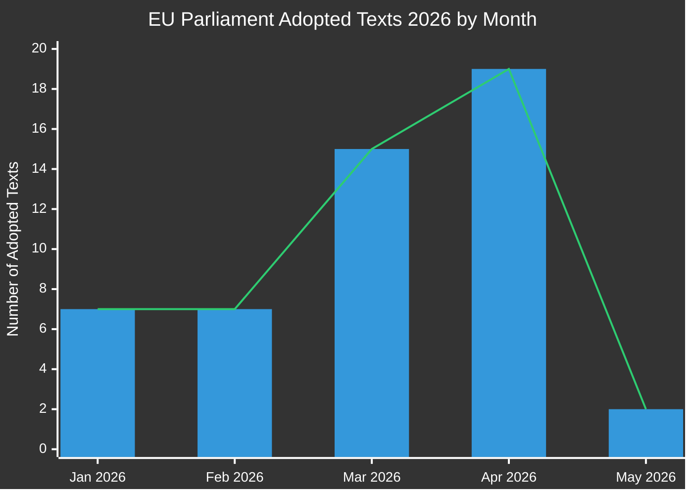

# Eksekutivrapport: EU-parlamentets lovproposisjoner
**Dato:** 2026-05-15 | **Artikkeltype:** Proposisjoner | **Klassifikasjon:** OFFENTLIG
**Tillit:** 🟡 MEDIUM | **Datakvalitet:** Delvis — EP API degradert; vedtatte tekster primærkilde

---

## 🔑 Viktige funn

### 1. Økning i lovgivningsproduksjon — Vårsprint 2026
Europaparlamentet har demonstrert eksepsjonell lovgivningshastighet i Q1-Q2 2026, med vedtakelse av **51 formelle tekster** mellom januar og mai 2026. Dette representerer et lovgivningssprint som sammenfaller med midtpunktet av den 10. parlamentariske valgperiode, med store pakker innen bankreform, antikorrupsjon, digital styring og handelspolitikk som har kommet gjennom til endelig avstemning.

**Tillit:** 🟢 HIGH — Basert på 51 bekreftede vedtatte tekster fra EP Open Data Portal.

### 2. Bankunionsavslutning — SRMR3 og antikorrupsjonspakke
To viktige lovgivningstekster ble vedtatt 26. mars 2026:
- **SRMR3** (`2023/0111(COD)`) — Tidlige intervensjonsstiltak, vilkår for avvikling og finansiering av avviklingstiltak — fullføring av en kritisk pilar i bankstrukturens arkitektur.
- **Antikorrupsjonsdirektivet** (`2023/0135(COD)`) — fastsetter EU-dekkende strafferettslige standarder for korrupsjonsforbrytelser, lenge forsinket siden 2023.

Disse vedtakelsene signalerer EPP-S&D-Renew-koalisjonens fortsatte kapasitet til å levere på institusjonell reform til tross for økt nasjonalistisk press.

**Tillit:** 🟢 HIGH — Bekreftede vedtatte tekster TA-10-2026-0092 og TA-10-2026-0094.

### 3. Digital Markets Act-håndhevelsespakke
Parlamentet vedtok **Håndhevelse av Digital Markets Act** (TA-10-2026-0160) 30. april 2026, noe som signalerer økt EP-tilsyn med Kommisjonens håndhevelsesaktiviteter mot Big Tech-portvakter. Dette skjer mens DMA-håndhevelsessaker mot Apple, Meta og Alphabet er på vei inn i sin kritiske fase.

**Tillit:** 🟢 HIGH — Bekreftet TA-10-2026-0160.

### 4. EU-USA handelskonflikt — Toll-mottiltak
Vedtakelsen av **Justering av toll på varer av USA-opprinnelse** (`2025/0261`) 26. mars 2026 gjenspeiler EUs formelle lovgivningsmessige svar på USAs tollopptrapping under Trump-administrasjonens andre periode. Dette posisjonerer Parlamentet som en proaktiv aktør i handelsmottiltakspolitikk.

**Tillit:** 🟢 HIGH — Bekreftet TA-10-2026-0096.

### 5. EP 2027-budsjettretningslinjer — Finansielt handlingsrom under press
Vedtatt 28. april 2026 fastsetter 2027-budsjettretningslinjene (`TA-10-2026-0112`) Parlamentets forhandlingsposisjon for den kommende årlige budsjettsyklusen. Den parallelle vedtakelsen av EPs institusjonelle estimater (`TA-10-2026-04-30-ANN01`) signalerer en kontroversiell budsjettsesong med Kommisjonen og Rådet.

**Tillit:** 🟢 HIGH — Bekreftede vedtatte tekster.

### 6. EPs datainfrastruktur — Alvorlig kvalitetsforringelse
**KRITISK OBSERVASJON:** EP Open Data Portal returnerer alvorlig forringet data per 2026-05-15:
- Prosedyrfeeden returnerer bare historiske prosedyrer fra 1970-1980-tallet
- Komitédokumentfeeden er "utilgjengelig"
- Eksternt dokumentfeed returnerer 0 elementer
- Lovgivningspipeline-overvåking returnerer tomme resultater (0 prosedyrer)
- DOCEO XML-stemmer utilgjengelige for inneværende uke

Dette representerer en systemisk datakvalitetsfeil som materielt begrenser den fremoverskuende lovgivningspipelineetterretningen. MCP-pålitelighetsrevisjonen dokumenterer dette i detalj.

**Tillit:** 🟢 HIGH — Direkte observert ved innsamling av Stage A-data.

---

## 📊 Analyse av lovgivningshastighet

**Månedlig fordeling (bekreftet fra EP Open Data):**
- Januar 2026: 7 vedtatte tekster (TA-10-2026-0004 til -0026)
- Februar 2026: 7 vedtatte tekster (finansiell stabilitet, humanitær bistand, handel)
- Mars 2026: 15 vedtatte tekster (bank, antikorrupsjon, handel, miljø)
- April 2026: 19 vedtatte tekster (budsjett, dyrevelferd, digitalt, utenrikspolitikk)
- Mai 2026: 2+ tekster bekreftet; uken 11.–15. mai data avventer

---

## 🎯 Prioriterte handlingspunkter for beslutningstakere

| Prioritet | Spørsmål | Tidslinje | Nøkkelaktør | Risikonivå |
|----------|-------|----------|-----------|------------|
| 🔴 KRITISK | EP-datainfrastrukturforringelse | Umiddelbart | EP IT & Datatjenester | Høy |
| 🟠 HØY | SRMR3-trialoguer avventer Råds-/Kommisjonens implementering | Q3-Q4 2026 | ECON-komité | Høy |
| 🟠 HØY | DMA-håndhevelsesovervåkingsmekanismer | Løpende 2026 | IMCO-komité | Medium |
| 🟡 MEDIUM | 2027 EU-budsjettforhandlinger | Mai–Desember 2026 | BUDG-komité | Medium |
| 🟡 MEDIUM | EU-Mercosur-ratifiseringstidslinje | 2026–2027 | INTA-komité | Medium |
| 🟢 LAV | Implementering av dyrevelferdregulering | 2027 og fremover | AGRI-komité | Lav |

---

## 📈 Fremoverskuende proposisjonshorisont (mai–november 2026)

### Forventede kommende forslag
Basert på Kommisjonens arbeidsprogram 2026 og analyse av parlamentarisk kalender:

1. **AI-styrningspakke fase 2** — Delegerte rettsakter under EUs AI-lov forventes Q3 2026
2. **Europeisk forsvarsindustriforordning (EDIP)** — Budsjettinstrument for forsvarsindustri; kritisk i lys av Russland-Ukraina-konteksten
3. **EUs lov om kritiske råmaterialer II** — Utvidelse/revisjon forventes etter gjennomgang av initial lovgivning
4. **Implementering av plattformarbeidsdirektivet** — Overvåking av transponering i medlemsstat
5. **Gjennomgang av rapportering om bærekraft for foretak (CSRD)** — Omnibus-forenklingspaket under Kommisjonens press
6. **Lovgivningspakke for digital euro** — ECB/Kommisjonens koordinering avventer etter ECBs visepresidentutnevnelser (TA-10-2026-0033, -0060)

### Advarsler for lovgivningskalenderen
- **Juni 2026-plenum** (Strasbourg): Forventet avstemning om flere ventende trialogeresultater
- **Juli 2026**: Sommerferien begynner — frist for viktige komitéavstemninger før pause
- **September 2026**: Parlamentsåret gjenopptas — prioritetskøen forventes å være tung
- **Oktober/november 2026**: Halvtidsvurdering av Kommisjonens arbeidsprogram

---

## ⚡ Etterretningskonfidens-matrise

| Funn | Evidenskvalitet | Tillit | Verifiseringssti |
|---------|----------------|-----------|-------------------|
| 51 vedtatte tekster bekreftet | Primære EP-data | 🟢 HIGH | EP Open Data Portal |
| Bankuionsavslutning | Bekreftede TA-tekster | 🟢 HIGH | EP Open Data Portal |
| DMA-håndhevelsestiltak | Bekreftet TA-tekst | 🟢 HIGH | EP Open Data Portal |
| Pipelinesrosedyrer forringet | Direkte observasjon | 🟢 HIGH | MCP-verktøyutdata |
| Fremtidige forslag (Q3/Q4) | Kommisjonens Arbeidsprogram-inferens | 🟡 MEDIUM | Kommisjonens nettside |
| Koalisjonsdynamikk | Sluttet fra stemme-mønstre | 🟡 MEDIUM | DOCEO XML (utilgjengelig) |
| Budsjettforhandlingsutsikter | Historisk mønster + vedtatte tekster | 🟡 MEDIUM | BUDG-komitéfeeds |

---

## 🔄 Datakvalitetsvurdering

| Kilde | Status | Pålitelighet | Innvirkning |
|--------|--------|-------------|--------|
| EP Vedtatte tekster 2026 | ✅ Funksjonelle | HØY | 51 elementer tilgjengelige |
| EP Prosedyrefeed | ❌ Forringet | LAV | Returnerer bare 1970-tallsdata |
| Komitédokumentfeed | ❌ Utilgjengelig | INGEN | Ingen data returnert |
| Eksternt dokumentfeed | ❌ Tom | INGEN | 0 elementer returnert |
| DOCEO XML-stemmer | ❌ Utilgjengelige | INGEN | Ingen data for inneværende uke |
| Lovgivningspipeline-overvåking | ⚠️ Forringet | LAV | 0 prosedyrer returnert |

**Vurdering:** Denne kjøringen opererer under alvorlig forringede EP-dataforhold. Analysekvaliteten opprettholdes gjennom:
1. Rikt datasett for vedtatte tekster (51 elementer med prosedyrereferanser)
2. Historisk mønsteranalyse og kunnskap om Kommisjonens arbeidsprogram
3. IMF/World Bank økonomisk kontekstdata (der relevant)
4. Ekspertinferens fra kjente lovgivningstidslinjer

---

*Generert: 2026-05-15 | EU Parliament Monitor | Hack23 AB | Apache-2.0*
