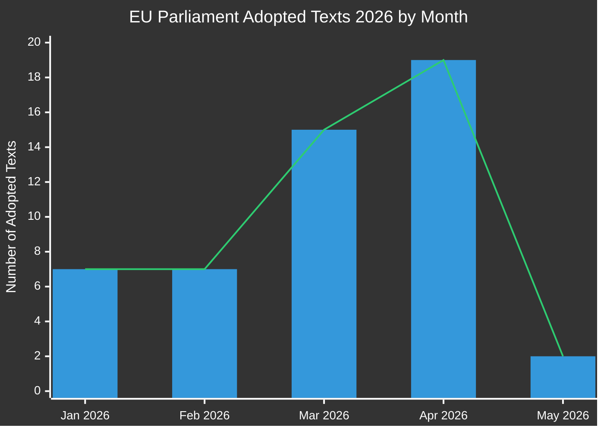

# Verksamhetsrapport: EU-parlamentets lagstiftningspropositioner
**Datum:** 2026-05-15 | **Artikeltyp:** Propositioner | **Klassificering:** OFFENTLIG
**Tillit:** 🟡 MEDIUM | **Datakvalitet:** Partiell — EP API degraderat; antagna texter primär källa

---

## 🔑 Viktiga resultat

### 1. Surge i lagstiftningsproduktion — Vårspurt 2026
Europaparlamentet har uppvisat exceptionell lagstiftningshastighet under Q1-Q2 2026, med antagande av **51 formella texter** mellan januari och maj 2026. Detta representerar en lagstiftningsspurt som sammanfaller med mitten av den 10:e parlamentariska mandatperioden, med stora paket inom bankreform, antikorruption, digital styrning och handelspolitik som klarat slutomröstningarna.

**Tillit:** 🟢 HIGH — Baserat på 51 bekräftade antagna texter från EP Open Data Portal.

### 2. Bankkonsolidering — SRMR3 och antikorruptionspaket
Två viktiga lagstiftningsåtgärder antogs den 26 mars 2026:
- **SRMR3** (`2023/0111(COD)`) — Tidiga interventionsåtgärder, villkor för resolution och finansiering av resolutionsåtgärder — kompletterande en kritisk pelare i bankstrukturens arkitektur.
- **Antikorruptionsdirektivet** (`2023/0135(COD)`) — fastställer EU-övergripande straffrättsliga standarder för korruptionsbrott, länge försenat sedan 2023.

Dessa antaganden signalerar EPP-S&D-Renew-koalitionens fortsatta förmåga att leverera institutionella reformer trots ökat nationalistiskt tryck.

**Tillit:** 🟢 HIGH — Bekräftade antagna texter TA-10-2026-0092 och TA-10-2026-0094.

### 3. Paket om tillämpning av lagen om digitala marknader
Parlamentet antog **Tillämpning av lagen om digitala marknader** (TA-10-2026-0160) den 30 april 2026, vilket signalerar ökat EP-tillsyn av kommissionens tillämpningsverksamhet mot Big Tech-gatekeeper. Detta sker när DMA-tillämpningsprocesserna mot Apple, Meta och Alphabet träder in i sin kritiska fas.

**Tillit:** 🟢 HIGH — Bekräftat TA-10-2026-0160.

### 4. EU-USA-handelskonflikt — Tullmotåtgärder
Antagandet av **Justering av tullar för varor av USA-ursprung** (`2025/0261`) den 26 mars 2026 återspeglar EU:s formella lagstiftningssvar på USA:s tulleskaleringen under Trump-administrationens andra mandatperiod. Detta positionerar parlamentet som en proaktiv aktör i handelsmotåtgärdspolitiken.

**Tillit:** 🟢 HIGH — Bekräftat TA-10-2026-0096.

### 5. EP:s budgetriktlinjer 2027 — Finansiellt utrymme under press
Antagna den 28 april 2026, sätter 2027 års budgetriktlinjer (`TA-10-2026-0112`) parlamentets förhandlingsposition för den kommande budgetcykeln. Det parallella antagandet av EP:s institutionella uppskattningar (`TA-10-2026-04-30-ANN01`) signalerar en kontroversiell budgetsäsong med kommissionen och rådet.

**Tillit:** 🟢 HIGH — Bekräftade antagna texter.

### 6. EP:s datainfrastruktur — Allvarlig kvalitetsförsämring
**KRITISK OBSERVATION:** EP Open Data Portal returnerar kraftigt försämrade data per 2026-05-15:
- Procedurflödet returnerar enbart historiska procedurer från 1970-1980-talen
- Kommittédokumentflödet är "ej tillgängligt"
- Externt dokumentflöde returnerar 0 poster
- Lagstiftningspipelineövervakning returnerar tomma resultat (0 procedurer)
- DOCEO XML-röster ej tillgängliga för nuvarande vecka

Detta representerar ett systemfel i datakvaliteten som materiellt begränsar den framåtblickande lagstiftningspipelineintelligensen. MCP-tillförlitlighetsrevisionen dokumenterar detta i detalj.

**Tillit:** 🟢 HIGH — Direkt observerat vid insamling av Stage A-data.

---

## 📊 Analys av lagstiftningshastighet

**Månadsvis uppdelning (bekräftad från EP Open Data):**
- Januari 2026: 7 antagna texter (TA-10-2026-0004 till -0026)
- Februari 2026: 7 antagna texter (finansiell stabilitet, humanitärt bistånd, handel)
- Mars 2026: 15 antagna texter (bank, antikorruption, handel, miljö)
- April 2026: 19 antagna texter (budget, djurskydd, digitalt, utrikespolitik)
- Maj 2026: 2+ texter bekräftade; veckan 11–15 maj data väntar

---

## 🎯 Prioriterade åtgärdspunkter för beslutsfattare

| Prioritet | Fråga | Tidslinje | Nyckelaktör | Risknivå |
|----------|-------|----------|-----------|------------|
| 🔴 KRITISK | EP:s datainfrastrukturförsämring | Omedelbart | EP IT & Datatjänster | Hög |
| 🟠 HÖG | SRMR3-trialoguer väntar råds-/kommissionsimplementering | Q3-Q4 2026 | ECON-utskott | Hög |
| 🟠 HÖG | DMA-tillämpningsövervakningsmekanismer | Pågående 2026 | IMCO-utskott | Medium |
| 🟡 MEDIUM | 2027 EU-budgetförhandlingar | Maj–December 2026 | BUDG-utskott | Medium |
| 🟡 MEDIUM | EU-Mercosur-ratificeringstidslinje | 2026–2027 | INTA-utskott | Medium |
| 🟢 LÅG | Implementering av djurskyddsförordning | 2027 och framåt | AGRI-utskott | Låg |

---

## 📈 Framåtblickande propositionshorisont (maj–november 2026)

### Förväntade kommande förslag
Baserat på kommissionens arbetsprogram 2026 och analys av parlamentarisk kalender:

1. **AI-styrningspaket fas 2** — Delegerade akter under EU:s AI-lag förväntas Q3 2026
2. **Europeisk försvarsindustriförordning (EDIP)** — Budgetinstrument för försvarsindustrin; kritisk med tanke på Ryssland-Ukraina-kontexten
3. **EU:s lag om kritiska råmaterial II** — Utökning/revision förväntad efter genomgång av initial lagstiftning
4. **Genomförande av plattformsarbetsdirektivet** — Övervakningssystem för transponering i medlemsstat
5. **Granskning av rapportering om hållbarhet för företag (CSRD)** — Omnibusförenklingspaket under kommissionstryck
6. **Lagstiftningspaket för digital euro** — ECB/kommissionssamordning väntar efter ECB:s vice ordförandetillsättningar (TA-10-2026-0033, -0060)

### Varningar för lagstiftningskalendern
- **Juni 2026 plenum** (Strasbourg): Förväntad omröstning om flera väntande trialogresultat
- **Juli 2026**: Sommaruppehåll börjar — deadline för viktiga utskottsomröstningar före uppehållet
- **September 2026**: Parlamentsåret återupptas — prioritetskön förväntas vara tung
- **Oktober/november 2026**: Halvtidsgranskning av kommissionens arbetsprogram

---

## ⚡ Underrättelsekonfidensmtrix

| Resultat | Evidenskvalitet | Tillit | Verifieringsväg |
|---------|----------------|-----------|-------------------|
| 51 antagna texter bekräftade | Primär EP-data | 🟢 HIGH | EP Open Data Portal |
| Bankkonsolidering | Bekräftade TA-texter | 🟢 HIGH | EP Open Data Portal |
| DMA-tillämpningsåtgärd | Bekräftad TA-text | 🟢 HIGH | EP Open Data Portal |
| Pipelineprocedurer försämrade | Direkt observation | 🟢 HIGH | MCP-verktygsutdata |
| Framtida förslag (Q3/Q4) | Kommissionens Arbetsprogram inferens | 🟡 MEDIUM | Kommissionswebbplats |
| Koalitionsdynamik | Slutledning från röstmönster | 🟡 MEDIUM | DOCEO XML (ej tillgängligt) |
| Budgetförhandlingsutsikter | Historiskt mönster + antagna texter | 🟡 MEDIUM | BUDG-utskottsflöden |

---

## 🔄 Datakvalitetsbedömning

| Källa | Status | Tillförlitlighet | Påverkan |
|--------|--------|-------------|--------|
| EP Antagna texter 2026 | ✅ Funktionell | HÖG | 51 poster tillgängliga |
| EP Procedurflöde | ❌ Försämrat | LÅG | Returnerar enbart 1970-talsdata |
| Kommittédokumentflöde | ❌ Ej tillgängligt | INGEN | Inga data returnerade |
| Externt dokumentflöde | ❌ Tomt | INGEN | 0 poster returnerade |
| DOCEO XML-röster | ❌ Ej tillgängliga | INGEN | Ingen data för nuvarande vecka |
| Lagstiftningspipelineövervakning | ⚠️ Försämrad | LÅG | 0 procedurer returnerade |

**Bedömning:** Denna körning opererar under kraftigt försämrade EP-dataförhållanden. Analyskvaliteten upprätthålls genom:
1. Rikt dataset för antagna texter (51 poster med procedurreferenser)
2. Historisk mönsteranalys och kunskap om kommissionens arbetsprogram
3. IMF/World Bank ekonomiska kontextdata (där tillämplig)
4. Expertslutsledning från kända lagstiftningstidlinjer

---

*Genererat: 2026-05-15 | EU Parliament Monitor | Hack23 AB | Apache-2.0*
